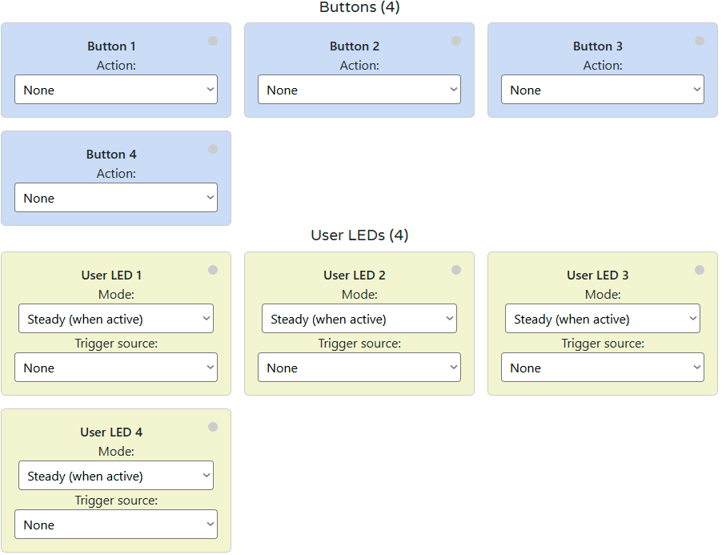

**Firmware Version:** 2025-10 snapshot


# ALM-173-R1 Module for Alarm Systems

**HOMEMASTER – Modular control. Custom logic.**


### Module Description

The **ALM-173-R1** is a configurable **alarm I/O module** with **17 opto-isolated inputs**, **3 SPDT relays**, plus **4 buttons** and **4 LEDs** for on-panel control. It connects to a **MicroPLC/MiniPLC** via **RS-485 (Modbus RTU)** and is set up through a USB-C **WebConfig** UI (Web Serial) to define Modbus params, invert/enable inputs, group them into **three alarm groups** (latched or momentary), map groups to relays, assign button roles (acknowledge, manual relay override), and choose LED modes—with live status and quick **device reset**. The design features a **galvanically isolated field side**, and an **RP2350 MCU** with **MAX485** and **PCF8574** expanders running from **24 V**. Modbus registers expose inputs, group/alarm bits, and relay states, making integration with **Home Assistant** straightforward.

---

## Table of Contents

* [1. Introduction](#1-introduction)
* [2. Use Cases](#2-use-cases)
* [3. Safety Information](#3-safety-information)
* [4. Installation & Quick Start](#4-installation-quick-start)
  * [4.4 Installation & Wiring](#installation-wiring)
  * [4.5 WebConfig (Software)](#software-ui-configuration)
  * [4.6 Getting Started](#4-6-getting-started)
* [5. ALM-173-R1 — Technical Specification](#5-technical-specification)
* [6. Modbus RTU Communication](#6-modbus-rtu-communication)
* [7. ESPHome Integration Guide (MicroPLC/MiniPLC + ALM-173-R1)](#7-esphome-integration-guide)
* [8. Programming & Customization](#8-programming-customization)
* [9. Maintenance & Troubleshooting](#9-maintenance-troubleshooting)
* [10. Open Source & Licensing](#10-open-source-licensing)
* [11. Downloads](#11-downloads)
* [12. Support](#12-support)

<br clear="left"/>

---

<a id="1-introduction"></a>

# 1. Introduction

## 1.1 Overview of the ALM-173-R1 Module 🚨

The **ALM-173-R1** is a modular alarm I/O device for **intrusion detection**, **fault annunciation**, and **local supervision**. It features:

- **17 opto-isolated digital inputs**
- **3 SPDT relays**
- **4 configurable buttons**
- **4 user LEDs**
- **RS-485 (Modbus RTU)** interface
- **WebConfig UI** over USB-C using **Web Serial** (Chromium browser)

It integrates with **MiniPLC/MicroPLC** controllers or any Modbus master. Configuration requires no special software—just a browser.

> **Quick use case:**  
> Wire inputs → assign to alarm groups → choose latched/non-latched logic → map to relays/LEDs → connect to PLC/SCADA → monitor and acknowledge alarms locally or via Modbus.

---

## 1.2 Features & Architecture

### 🔧 Core Capabilities

| Subsystem         | Qty            | Description |
|------------------|----------------|-------------|
| **Digital Inputs** | 17 opto-isolated | Dry contact sensors (PIR, door, fault). Per-input enable, invert, debounce, group assignment (1/2/3) |
| **Relays**         | 3 SPDT          | Controlled via alarm group logic or Modbus master; logic invert and enable per channel |
| **Alarm Groups**   | 3 + Any summary | Group logic modes: *Active while* (momentary), *Latched until acknowledged* |
| **User Buttons**   | 4               | Actions: acknowledge (All or per group) or manual relay override |
| **User LEDs**      | 4               | Blink/steady, driven by group/alarm/override state |
| **Config UI**      | Web Serial      | WebConfig: in-browser setup via USB-C (Modbus addr/baud, group logic, live status, reset) |
| **Modbus RTU**     | RS-485          | Multi-drop slave. Address 1–255, baud 9600–115200 |
| **MCU**            | RP2350 + QSPI   | Dual-core MCU; external flash; resilient field I/O control |
| **Power**          | 24 VDC in       | Internal 24→5→3.3V regulators + isolated sensor rails (12V, 5V) |
| **Protection**     | TVS, PTC        | Surge/ESD protection and resettable fuses on all field connections |

---

## 1.3 System Role & Communication 🔌

The **ALM-173-R1** is a standalone, intelligent Modbus slave. It runs group logic locally and mirrors all status to a PLC or SCADA system.

| Role                  | Description |
|-----------------------|-------------|
| **System Position**    | Expansion module on RS-485 trunk |
| **Master Controller**  | MiniPLC / MicroPLC or third-party Modbus RTU master |
| **Address / Baud**     | Configurable via WebConfig (1–255, 9600–115200 baud) |
| **Bus Type**           | RS-485 multi-drop (A/B/COM terminals) |
| **USB-C Port**         | For setup/diagnostics via Chromium browser |
| **Default Modbus ID**  | `3` (changeable per install) |
| **Daisy-Chaining**     | Multiple modules can share the bus with unique IDs |

> > ⚠️ If multiple ALMs are on the same RS-485 line, assign unique Modbus addresses to each in WebConfig.


---

<a id="2-use-cases"></a>

# 2. Use Cases 🛠️

These are practical examples of deploying the **ALM-173-R1** with the HomeMaster Mini/Micro PLC or any Modbus RTU master.

Each case uses built-in firmware features via the Web Serial UI:
- **Input settings:** Enable, Invert, Group
- **Relay logic:** Enable, Invert, Group or Manual
- **Alarm behavior:** Latched or Momentary
- **Buttons & LEDs:** Ack / Override / Status
- **Modbus:** PLC reads status and controls relays

---

### 1) [Intrusion] Zone Alarm with Siren (Latched)

**Trigger a siren when a sensor activates. Alarm stays ON until acknowledged.**

**Steps:**
1. Map **IN1 → Group 1**; enable + invert if NC.
2. Set **Group 1 → Latched until acknowledged**.
3. Map **Relay 1 → Group 1** (enable; invert if required).
4. Set **Button 1 → Acknowledge Group 1**.
5. Set **LED 1 → Group 1, Blink mode**.
6. PLC reads Group 1 + “Any Alarm” status.

---

### 2) [Access Control] Dual-Door Alarm with Shared Strobe

**Two zones, each with own buzzer. Common strobe flashes on any alarm.**

**Steps:**
1. Map **IN1 → Group 1**, **IN2 → Group 2**.
2. Set **Groups 1 & 2 → Latched**.
3. Map **Relay 1 → Group 1**, **Relay 2 → Group 2**.
4. PLC toggles **Relay 3** when “Any Alarm” is active.
5. Set **Button 1 → Ack G1**, **Button 2 → Ack G2**.
6. Set **LEDs 1–3 → G1, G2, Any Alarm**.

---

### 3) [Supervision] Equipment Room Summary Alarm

**Aggregate faults (smoke, thermal, flood, etc.) into one visual + Modbus alarm.**

**Steps:**
1. Map **IN1–IN8 → Group 1**, invert per sensor.
2. Set **Group 1 → Active while condition is active**.
3. Map **Relay 1 → Group 1** (to stack light).
4. Set **LED 1 → Any Alarm, Blink**.
5. PLC reads **Any** and **Group 1** status.

---

### 4) [Access Control] Door Strike with Timeout Alarm

**PLC unlocks door, monitors contact, alarms if left open too long.**

**Steps:**
1. Map **IN1 → Group 3** (Invert if NC).
2. Leave **Relay 1 = Group None**; PLC controls strike directly.
3. In PLC logic: if **IN1** open too long → set **Group 3** or energize **Relay 2**.
4. Set **Button 4 → Ack Group 3**, **LED 3 → Group 3**.

---

### 5) [Annunciator Panel] Any Alarm Indication

**Use the front panel to show system-wide or per-group alarm state.**

**Steps:**
1. Map inputs **IN1…INn → Group 1–3**.
2. Set groups to either **Latched** or **Active while** depending on use.
3. Set **LED 1 → Any Alarm, Blink**
4. Set **LED 2 → Group 1**, **LED 3 → Group 2**, **LED 4 → Group 3**
5. PLC mirrors lamp states to HMI/HA dashboard.

---

> > 💡 **Tip:** “Any Alarm” is always available via Modbus and can be mapped to a summary relay or LED.


# 3. Safety Information

These safety guidelines apply to the **ALM-173-R1** alarm I/O module. Ignoring them may result in **equipment damage**, **system failure**, or **personal injury**.

> > ⚠️ **Low-Voltage (SELV) only** — This module is intended **only** for Safety Extra-Low Voltage (SELV) systems. Never connect mains or high-voltage circuits.

---

## 3.1 General Requirements

| Requirement               | Detail |
|---------------------------|--------|
| **Qualified Personnel**   | Installation and servicing must be done by trained technicians familiar with panel wiring and control systems. |
| **Power Isolation**       | Always disconnect **24 VDC** power and any relay loads before wiring or moving the module. Use lockout/tagout where applicable. |
| **Environmental Limits**  | Mount inside a **dry, clean, ventilated** enclosure. Keep away from condensation, conductive dust, or vibration. |
| **Grounding**             | Bond the control panel to protective earth. Keep **SELV returns** and shields properly managed. |
| **Voltage Compliance**    | Ensure all connected circuits stay within the module’s voltage/current ratings. Fuse the supply appropriately. |

---

## 3.2 Installation Practices

| Task                  | Guidance |
|-----------------------|----------|
| **ESD Protection**    | Handle only by the case. Use antistatic wrist strap and surface when the board is exposed. |
| **DIN Rail Mounting** | Mount securely on **35 mm DIN rail** inside an enclosure. Apply strain relief to all cabling. |
| **Wiring**            | Use appropriate wire gauge and tighten terminal screws firmly. Separate signal, power, and relay wiring paths. |
| **Isolation Domains** | Inputs and sensor power are isolated. Do not bridge **GND_ISO** to logic ground unless intentionally designed. |
| **Commissioning**     | Before applying power, double-check polarity, RS-485 A/B wiring, and relay contact routing (COM/NO/NC). Run tests without loads first. |

---

## 3.3 I/O & Interface Warnings

### 🔌 Power

| Area              | Warning |
|------------------|---------|
| **24 VDC Input**  | Use a **clean SELV** 24 VDC source. Reverse polarity can damage the module. Fuse the supply upstream. |
| **Sensor Rails (12 V / 5 V)** | For **low-power sensors only**. Never backfeed or parallel with external rails. Short circuits may trip **PTC fuses** (auto-reset). |

### ⚠️ Inputs & Relays

| Area            | Warning |
|----------------|---------|
| **Digital Inputs (IN1–IN17)** | Accept **dry contacts** or isolated low-voltage signals only. Never apply high voltage. Respect debounce/invert settings in UI. |
| **Relay Outputs (RLY1–3)**    | **Dry contacts** only. Do not exceed rated current/voltage. **Snub** inductive loads externally (RC/TVS). Do not route high-current return through logic ground. |

### 🧠 Communication & USB

| Area            | Warning |
|----------------|---------|
| **RS-485 Bus**  | Use **twisted pair (shielded)**. Terminate and bias once per trunk. Protect against surges. Not designed for lightning arrest. |
| **USB-C (Front)** | For **setup only**. Never use to power field devices. During storms or if trunk is long/exposed, disconnect USB from PC. |

### 👆 Front Panel

| Area           | Warning |
|----------------|---------|
| **Buttons & LEDs** | Can acknowledge alarms or override relays. Disable in firmware or use protective enclosures in safety-critical environments. |

### 📶 Shielding & EMC

| Area         | Recommendation |
|--------------|----------------|
| **Cable Shields** | Terminate at one point only (typically the controller). Keep signal wiring away from VFDs or high-energy switching circuits. |

---

## ✅ Pre-Power Checklist

Ensure the following before applying power:

- [ ] **All terminals** are torqued and strain-relieved  
- [ ] No accidental bridges between **logic ground** and **GND_ISO**  
- [ ] Relays are correctly wired (**COM/NO/NC**) with snubbers installed  
- [ ] RS-485 **A/B polarity and termination** are correct  
- [ ] Sensor current on **PS/1 (12 V)** and **PS/2 (5 V)** is within limits  


---

<a id="4-installation-quick-start"></a>

# 4. Installation & Quick Start

The **ALM-173-R1** joins your system over **RS-485 (Modbus RTU)**. Setup has two parts:
1) **Physical wiring**, 2) **Digital configuration** (WebConfig → optional ESPHome/PLC).

---

## 4.1 What You Need

| Category | Item | Details |
|---|---|---|
| **Hardware** | **ALM-173-R1** | DIN-rail module with **17 opto DI**, **3 SPDT relays**, **4 buttons**, **4 LEDs**, **RS-485**, **USB‑C**. |
|  | **Controller (master)** | HomeMaster MiniPLC/MicroPLC or any Modbus RTU master. |
|  | **24 VDC PSU (SELV)** | Regulated **24 VDC** to **V+ / 0V**; size for ALM + sensor rails. |
|  | **RS‑485 cable** | Twisted pair for **A/B** + **COM/GND** reference; **120 Ω** end‑termination and proper bias. |
|  | **USB‑C cable** | For WebConfig via Chromium browser (service only). |
|  | **Enclosure & DIN rail** | Clean/dry enclosure; strain relief and shield management. |
| **Software** | **WebConfig (browser)** | Set **Address/Baud**, map **Inputs/Relays/Buttons/LEDs**, pick **Alarm Modes**, live status, device reset. |
|  | **ESPHome (optional)** | On the controller; exposes ALM entities to Home Assistant. |
| **Field I/O** | **Dry contacts** | IN1…IN17 with matching **GND I.x** returns (SELV). |
|  | **Loads on relays** | RLY1…RLY3 (COM/NO/NC); observe ratings; add RC/TVS snubbers on inductive loads. |
|  | **Isolated sensor power** | **PS/1 = +12 V iso**, **PS/2 = +5 V iso** for **low-power sensors only** (no backfeed/parallel). |
| **Tools** | **Screwdrivers/ferrules, multimeter** | Torque terminals; verify polarity and A/B. Optional: **120 Ω** resistors, surge/EMC aids. |

> **LEDs:** **PWR** steady ON in normal operation. **TX/RX** blink with RS‑485 activity.

> > **Quick path:** mount → wire **24 VDC** & **RS-485 (A/B/COM)** → connect **USB‑C** → WebConfig: set **Address/Baud** & map **inputs → groups → relays/LEDs** → disconnect USB → hand over to controller.

---

## 4.2 Power

The module uses **24 VDC** primary. Onboard regulation supplies logic and **isolated 12 V / 5 V** rails for *sensors only*.

- **No power over RS‑485**: the bus carries data only.  
- **Relays are dry contacts**: do **not** power loads from internal rails.

### 4.2.1 Supply Types
- **24 VDC DIN-rail PSU** → **V+ / 0V**.
- **Sensor power** → **+12 V ISO / +5 V ISO** (low-power, fuse/ptc limited).

### 4.2.2 Sizing
Account for:
- Base electronics
- Relay **coil** current (per energized relay)
- **Sensor rails** draw (+12/+5 ISO)

**Rule of thumb:** base load + worst-case relays + sensors, then add **≥30% headroom**.

### 4.2.3 Power Safety
- Correct **polarity**; keep **logic** and **GND_ISO** separate unless intentionally bonded.
- Keep upstream **fusing/breaker** in place.
- Respect **relay contact ratings**; snub inductive loads.
- Use **isolated rails only for sensors**.
- **De-energize** before wiring; check for shorts.

---

## 4.3 Networking & Communication

Runtime control is via **RS‑485 (Modbus RTU)**; **USB‑C** is for local setup/diagnostics (Web Serial).

### 4.3.1 RS‑485 (Modbus RTU)
**Physical**
- Terminals: **A**, **B**, **COM (GND)**.
- Cable: twisted pair (preferably shielded) for **A/B** + common reference.
- Termination: **120 Ω** at both physical ends; keep stubs short.

**Protocol**
- Role: **RTU slave**; controller is **master**.
- Address: **1–255**; Baud: **9600–115200** (typ. **19200**, 8N1).
- Provide **local 24 VDC** power (bus is data-only).

**ESPHome (controller)**
- Configure `uart:` pins and `modbus_controller:` for ALM.
- `alm_address` in YAML must match WebConfig.
- Polls discrete/holding; exposes relays, inputs, alarms to HA.

**RS‑485 wiring checklist**
- **A→A**, **B→B**, **COM→COM**
- Two end terminations; avoid star topologies
- Consistent **A/B** polarity end-to-end

### 4.3.2 USB‑C (WebConfig)
**Purpose:** Chromium (Chrome/Edge) **Web Serial** setup/diagnostics.

**Steps**
1. Connect **USB‑C** to the module.
2. Open **https://www.home-master.eu/configtool-alm-173-r1** and click **Connect**.
3. Set **Modbus Address** & **Baud** (header shows **Active Modbus Configuration**).
4. Configure **Inputs / Relays / LEDs / Buttons**; changes apply live.
5. Use **Serial Log**; **Reset Device** if needed (auto-reconnect).

**If Connect is disabled:** ensure Chromium + serial permission; on macOS/Linux verify user serial permissions and that no other app is holding the port.

---

<a id="installation-wiring"></a>

## 4.4 Installation & Wiring

> ⚠️ **Qualified personnel only.** De-energize the panel; verify with a meter. The ALM-173-R1 is **SELV**—never connect mains to logic/input terminals.

### 4.4.1 RS‑485 Field Bus


**How**
1. Shielded twisted pair (24–22 AWG recommended).
2. **A→A**, **B→B**, **COM/GND→COM**; keep polarity consistent.
3. **120 Ω** at both physical ends of the trunk.
4. Single-point shield bond (usually at the controller).
5. Daisy-chain topology preferred (avoid stars).

### 4.4.2 Primary Power (24 VDC)


**How**
- Clean SELV **24 VDC** to **V+ / 0V**.
- Observe polarity.
- Upstream fuse/breaker; proper panel bonding.

### 4.4.3 Digital Inputs (IN1…IN17)


**How**
- Wire each **INx** to its matching **GND I.x** return (dry contact / isolated low-voltage).
- Do **not** inject external voltage.
- Use shielded cable for long runs; avoid high‑dv/dt routes.
- Set **Enable / Invert / Group** in WebConfig; confirm via live dot.

### 4.4.4 Relays (RLY1…RLY3, COM/NO/NC)


**How**
1. External supply **L** → **COM**.
2. **NO** (or **NC** if fail-active required) → load; return to **N/0 V**.
3. Relays **switch only** (no internal power).
4. Respect contact ratings/codes.
5. Fit **RC/TVS** across inductive loads.

### 4.4.5 Final Checks
- Terminals torqued; strain relief applied.
- Isolation boundaries respected (**GND_ISO** vs logic).
- RS‑485 polarity/termination/biasing correct.
- Relays wired to proper **COM/NO/NC**; snubbers fitted.
- Power on: **PWR** steady; **TX/RX** blink under comms.

---

<a id="software-ui-configuration"></a>

## 4.5 Software & UI Configuration

### 4.5.1 Connect


1) Plug **USB‑C** → 2) open the config page → 3) **Connect** → 4) verify **Active Modbus Configuration** in header → 5) use **Serial Log** / optional **Reset Device**.

### 4.5.2 Modbus Settings
- **Address (1…255)** → pick a **unique** RTU address.
- **Baud** → **9600**, **19200** (default), **38400**, **57600**, **115200**.
- Ensure the controller YAML (`uart`, `modbus_controller`, `alm_address`) matches.

> Changes persist in flash; you can revisit anytime.

### 4.5.3 Alarm Modes
- **None** (disabled)
- **Active while condition is active** (momentary)
- **Latched until acknowledged**

Top-row indicators show live **Any / G1 / G2 / G3** status.  


### 4.5.4 Digital Inputs


For each **IN1…IN17**:
- **Enabled**, **Inverted** (for NC), **Alarm Group** (*None/1/2/3*).
- Live state dot = quick wiring check.

### 4.5.5 Relays


For **RLY1…RLY3**:
- **Enabled**, **Inverted**, **Alarm Group**:
  - **None (0)** → relay ignores groups (PLC/manual only)
  - **Group 1/2/3 (1–3)** → follows group state (incl. latching)
  - **Modbus/Master (4)** → controller-controlled

> Tip: assign a **Button** to “Relay x override (manual)” for quick field tests.

### 4.5.6 LEDs & Buttons


**LEDs (1–4)**  
- **Mode:** Steady / Blink  
- **Source:** Any / Group 1/2/3 / Relay 1–3 overridden / None  
- Live state dot shows activity.

**Buttons (1–4)**  
- **Action:** Ack All / Ack G1–G3 / Relay 1–3 override / None  
- Live press dot indicates input.

---

<a id="4-6-getting-started"></a>

## 4.6 Getting Started (3 Phases)

**Phase 1 — Wire**
- **24 VDC** to **V+ / 0V**
- **RS‑485** **A/B/COM** (terminated ends, consistent polarity)
- **Inputs** to **IN1…IN17** with **GND I.x** returns
- **Relays** to **COM/NO/NC** (snub inductive loads)
- (Optional) **PS/1 +12 V ISO / PS/2 +5 V ISO** for sensors

*See: **[Installation & Wiring](#installation-wiring)***

**Phase 2 — Configure (WebConfig)**
- Set **Address/Baud**
- Pick **Alarm modes** (G1–G3)
- Map **Inputs / Relays / LEDs / Buttons**
- (Optional) **Reset Device**

*See: **[WebConfig](#software-ui-configuration)***

**Phase 3 — Integrate (Controller)**
- Controller polls ALM via **RS‑485**
- Match **Address** and **Baud**
- Commission: read inputs & alarms; toggle relays; expose Ack/Override actions

*See: **[Modbus RTU Communication](#6-modbus-rtu-communication)** and **[ESPHome Integration Guide](#7-esphome-integration-guide)***

---

## Verify

- **LEDs:** **PWR** ON; **TX/RX** blink on comms  
- **Inputs:** toggle a few contacts; confirm live dots and **Any/Gx** indicators  
- **Relays:** actuate from UI/controller; confirm field wiring (meter/indicator)  
- **Buttons/LEDs:** test **Ack/Override**; confirm LED sources/modes

# 5. ALM-173-R1 — Technical Specification

## 5.1 Diagrams & Pinouts

<div align="center">
  <table>
    <tr>
      <td align="center">
        <strong>ALM System Diagram</strong><br>
        
      </td>
      <td align="center">
        <strong>RP2350 MCU Pinout</strong><br>
        
      </td>
    </tr>
    <tr>
      <td align="center">
        <strong>Field Board Layout</strong><br>
        
      </td>
      <td align="center">
        <strong>MCU Board Layout</strong><br>
        
      </td>
    </tr>
  </table>
</div>

## 5.2 Overview

- **Function:** Alarm/annunciator I/O module with **17 opto‑isolated DIs** and **3 SPDT relays**  
- **Role:** RS‑485 **Modbus RTU** slave for MicroPLC/MiniPLC/SCADA  
- **Form factor:** DIN‑rail; **USB‑C** service port for Web‑Serial setup

---

## 5.3 I/O Summary

| Interface | Qty | Electrical / Notes |
|---|---:|---|
| **Digital Inputs (IN1…IN17)** | 17 | Opto‑isolated to **GND_ISO**; dry contacts / isolated LV signals; per‑channel conditioning + surge protection. |
| **Relays (RLY1…RLY3)** | 3 | **SPDT dry contacts (COM/NO/NC)** with transistor + opto drivers; contact suppression onboard—add external RC/TVS for inductive loads; observe datasheet ratings (HF115F). |
| **Isolated Sensor Rails** | 2 | **+12 V (PS/1)** and **+5 V (PS/2)**, isolated & fuse‑limited; for **sensors only** (no actuators). |
| **User Buttons** | 4 | SW1…SW4 for acknowledge/override (configurable). |
| **User LEDs** | 4 (+ status) | User LEDs for groups/any/override; **PWR** steady; **TX/RX** blink on bus activity. |
| **Field Bus** | 1 | **RS‑485 (A/B/COM)** with TVS & PTC protection; termination/bias per trunk design. |
| **Service** | 1 | **USB‑C** for Web‑Serial configuration and diagnostics (ESD‑protected). |

---

## 5.4 Terminals & Pinout (Field Side)


### Connector Map (front label reference)
> Use the front silkscreen to match terminals during wiring.

- **POWER — 24 Vdc (V+, 0 V):** Primary SELV supply. Verify polarity; isolate before service.  
- **DIGITAL INPUTS — IN1…IN17 (with GND_ISO groups):** Dry-contact / isolated LV inputs. Keep **GND_ISO** separate from logic ground unless intentionally bonded.  
- **RELAY1…RELAY3 — COM/NO/NC:** SPDT dry outputs. Observe ratings; snub inductive loads; avoid mains unless permitted by code and relay datasheet.  
- **OUTPUT 12 Vdc (PS/1) / OUTPUT 5 Vdc (PS/2):** Isolated sensor supplies; fuse‑limited; **no backfeeding/paralleling**.  
- **RS‑485 — COM, B, A:** Modbus RTU field bus. Twisted pair; correct A/B polarity; one‑point shield bond; termination per trunk design.  
- **USB (Service):** Web‑Serial configuration; not a field power source.  
- **PWR/TX/RX LEDs:** **PWR** steady ON; **TX/RX** blink on traffic. If not blinking, check polarity, termination, address.

<br clear="left"/>

---

## 5.5 Electrical

### 5.5.1 Power & Regulation
- **Input:** **24 VDC** nominal; input fuse, reverse‑polarity & surge protection  
- **Rails:**  
  - **Buck 24 V → 5 V** (logic)  
  - **LDO 5 V → 3.3 V** (MCU & logic)  
  - **Isolated rails:** **+12 V ISO / +5 V ISO** via isolated DC‑DCs with LC filtering & PTC fusing

### 5.5.2 Digital Inputs
- Per‑channel **opto‑isolators** + resistor networks for noise immunity  
- **Surge/ESD** protection on lines; referenced to **GND_ISO** groups  
- Firmware options per input: **Enable**, **Invert**, **Group (1/2/3/None)**, debounce in logic

### 5.5.3 Relay Outputs
- **HF115F** SPDT relays; transistor drivers with opto isolation  
- Contact suppression network onboard; fit **external RC/TVS** for coils/locks/sirens  
- Wire loads to **COM/NO/NC**; keep load currents off logic returns

### 5.5.4 RS‑485 (Modbus RTU)
- **MAX485‑class** transceiver, DE/RE control  
- Protection: **TVS diodes**, series elements, bias network, **PTC** resettable fuses  
- Indicators: **TX/RX LEDs** reflect line activity

### 5.5.5 USB‑C (Service/Config)
- **ESD/EMI** protection on D±/VBUS; CC pulldowns; reverse‑current protection to 5 V rail  
- Intended for configuration/diagnostics; **not** for powering field loads

---

## 5.6 MCU & Storage
- **MCU:** **Raspberry Pi RP2350A**, dual‑core  
- **Flash:** **W25Q32** (32‑Mbit QSPI NOR) for firmware & config  
- **Clock/Debug:** 12 MHz crystal; **SWD** header for service  
- **I/O Expansion:** **PCF8574** I²C expanders for inputs/relays/LEDs/buttons

---

## 5.7 Reliability & Protections
- **Galvanic isolation:** Dedicated **GND_ISO** domain; isolated +12 V/+5 V sensor rails  
- **Surge/ESD:** TVS arrays on RS‑485 & USB; RC/series networks on data lines; **PTC** fuses on field rails and bus  
- **Contact life:** Onboard suppression + guidance to add external snubbers for inductive loads

---

## 5.8 Firmware / Functional Overview
- **Alarm engine:** Inputs → **Group 1/2/3** with modes **Active‑while** or **Latched‑until‑ack**; **Any Alarm** summary  
- **Actuation:** Per‑relay **Enable/Invert/Group**; **Buttons** for acknowledge / manual override; **User LEDs** for groups/any/override (Steady/Blink)  
- **Setup & Telemetry:** Web‑Serial UI (USB‑C) for **Modbus addr/baud**, live input/relay/group status, safe reset; runs stand‑alone under PLC/HMI supervision over Modbus

<a id="6-modbus-rtu-communication"></a>

# 6. Modbus RTU Communication

**Slave role:** Modbus RTU over RS-485 (8N1, selectable **9600…115200** baud; typical **19200**).
**Address:** **1…255** (set via WebConfig).
**Data model:** **Discrete Inputs**, **Coils**, **Holding/Input Registers** (live telemetry + configuration snapshots).

> The tables below describe the **factory default** map used by the ALM-173-R1 firmware.

---

## 6.1 Input Registers (Read-Only)

Live, read-only snapshots convenient for dashboards and fast polling.

| Group                     | Address range | Type  | Units (raw) | Scaling | Notes                                                                              |
| ------------------------- | ------------- | ----- | ----------- | ------- | ---------------------------------------------------------------------------------- |
| **Firmware / Device**     | 1100…1101     | U16×2 | enum        | 1       | 1100 = firmware version, 1101 = build/variant                                      |
| **Active Modbus config**  | 1110…1111     | U16×2 | enum        | 1       | 1110 = address (1–255), 1111 = baud code (1=9600,2=19200,3=38400,4=57600,5=115200) |
| **Digital Inputs bitmap** | 1120…1121     | U16×2 | bitfield    | 1       | IN1…IN16 in 1120, IN17 in 1121 bit0                                                |
| **Alarm summary**         | 1130          | U16   | bitfield    | 1       | bit0=Any, bit1=G1, bit2=G2, bit3=G3                                                |
| **Relay state mirrors**   | 1140          | U16   | bitfield    | 1       | bits0..2 = RLY1..RLY3 (1=ON)                                                       |
| **LED state mirrors**     | 1150          | U16   | bitfield    | 1       | bits0..3 = LED1..LED4 (1=active)                                                   |
| **Buttons pressed**       | 1160          | U16   | bitfield    | 1       | bits0..3 = BTN1..BTN4 (1=pressed)                                                  |

> All 32-bit values (if any added in future) occupy **two** consecutive registers (lo, hi).

---

## 6.2 Holding Registers (Read/Write)

Configuration + low-rate control values (persisted by firmware where applicable).

| Group                     | Address range |   Type | Description                                                                                                                                                                                         |
| ------------------------- | ------------: | -----: | --------------------------------------------------------------------------------------------------------------------------------------------------------------------------------------------------- |
| **Alarm modes**           | **1200…1202** |  U16×3 | Mode per group: **0=None**, **1=Active-while**, **2=Latched-until-ack** (G1,G2,G3).                                                                                                                 |
| **Inputs (per IN1…IN17)** | **1300…1350** | U16×51 | Repeating triplet **[enable, invert, group]** per input. Group: **0=None**, **1=G1**, **2=G2**, **3=G3**. Layout: IN1 at 1300..1302, IN2 at 1303..1305, … IN17 at 1348..1350.                       |
| **Relays (RLY1…RLY3)**    | **1400…1422** |  U16×9 | Repeating triplet **[enable, invert, group]** per relay. Group: **0=None**, **1=G1**, **2=G2**, **3=G3**, **4=Master (controller controls)**. R1 at 1400..1402, R2 at 1410..1412, R3 at 1420..1422. |
| **Buttons (BTN1…BTN4)**   | **1500…1503** |  U16×4 | **Action** per button: **0=None**, **1=Ack All**, **2=Ack G1**, **3=Ack G2**, **4=Ack G3**, **5=Relay1 override**, **6=Relay2 override**, **7=Relay3 override**.                                    |
| **User LEDs (LED1…LED4)** | **1600…1607** |  U16×8 | Per LED: **mode** (0=Steady, 1=Blink) and **source** (0=None, 1=Any, 2=G1, 3=G2, 4=G3, 10=R1 overridden, 11=R2 overridden, 12=R3 overridden).                                                       |

> Most daily setup is done in WebConfig; exposing these fields enables headless provisioning/backups from PLC/HA.

---

## 6.3 Discrete Inputs & Coils

### Discrete Inputs (read-only flags)

| Range           | Bits | Meaning                                              |
| --------------- | ---: | ---------------------------------------------------- |
| **00001…00017** |   17 | **DI1…DI17** debounced state                         |
| **00050…00053** |    4 | **Any Alarm**, **Group 1**, **Group 2**, **Group 3** |
| **00060…00062** |    3 | **Relay 1…3** state mirrors                          |
| **00090…00093** |    4 | **LED 1…4** state mirrors                            |
| **00100…00103** |    4 | **BTN 1…4** pressed                                  |

### Coils (write – single/multiple)

| Range           | Count | Action                                 |
| --------------- | ----: | -------------------------------------- |
| **00200…00202** |     3 | **Relay ON** (RLY1…RLY3)               |
| **00210…00212** |     3 | **Relay OFF** (RLY1…RLY3)              |
| **00220…00222** |     3 | **Override ON** (force RLY1…RLY3)      |
| **00230…00232** |     3 | **Override OFF / Release** (RLY1…RLY3) |
| **00240**       |     1 | **Acknowledge All** (pulse)            |
| **00241…00243** |     3 | **Acknowledge Group 1/2/3** (pulse)    |
| **00300…00316** |    17 | **Enable DI i** (pulse per input)      |
| **00320…00336** |    17 | **Disable DI i** (pulse per input)     |

> Coils obey **priority**: an **Override** holds a relay irrespective of group/master writes until you release it.

---

## 6.4 Scaling Summary

No engineering scaling is required for ALM core points. All values are **boolean/bitfield** or **enum codes** as defined above.

---

## 6.5 Basics & Function Codes

* **Physical:** RS-485 half-duplex; 120 Ω termination at both ends; consistent **A/B** polarity; shared COM/GND recommended if separate PSUs.
* **Function codes:** `0x01` Read Coils, `0x02` Read Discrete Inputs, `0x03` Read Holding, `0x04` Read Input (if utilized), `0x05/0x0F` Write Coils, `0x06/0x10` Write Holding.
* **Polling:** Discrete/group bits at **5–10 Hz**; mirrors at **2–5 Hz**; holding snapshots **on change** or **1–5 s**.

---

## 6.6 Register Map (Summary)

```
Discrete Inputs
00001..00017 DI1..DI17 state
00050..00053 Any, G1, G2, G3
00060..00062 Relay1..Relay3 mirrors
00090..00093 LED1..LED4 mirrors
00100..00103 BTN1..BTN4 pressed

Coils
00200..00202 Relay ON (RLY1..RLY3)
00210..00212 Relay OFF (RLY1..RLY3)
00220..00222 Override ON (RLY1..RLY3)
00230..00232 Override OFF (RLY1..RLY3)
00240 Ack All (pulse)
00241..00243 Ack G1..G3 (pulse)
00300..00316 Enable DIi (pulse)
00320..00336 Disable DIi (pulse)

Input Registers (Read-Only)
01100 FW version (U16)
01101 FW build/variant (U16)
01110 Active address (U16)
01111 Active baud code (U16)
01120..01121 DI bitmap (U16 lo/hi)
01130 Alarm summary bitmap (Any,G1,G2,G3)
01140 Relay bitmap
01150 LED bitmap
01160 Button bitmap

Holding Registers (R/W)
01200..01202 Group modes G1..G3 (0=None,1=Active-while,2=Latched)
01300..01350 IN1..IN17 [enable,invert,group] triplets
01400..01402 RLY1 [enable,invert,group]
01410..01412 RLY2 [enable,invert,group]
01420..01422 RLY3 [enable,invert,group]
01500..01503 BTN1..BTN4 action
01600..01607 LED1..LED4 [mode,source] pairs
```

---

## 6.7 Override Priority

<a id="7-esphome-integration-guide"></a>
# 7. ESPHome Integration Guide (MicroPLC/MiniPLC + ALM-173-R1)

The **HomeMaster controller (MiniPLC/MicroPLC)** running **ESPHome** acts as the **Modbus RTU master** on RS‑485. It polls the **ALM-173-R1** and publishes entities to **Home Assistant (HA)**. No HA add‑ons are required—everything runs on the controller.

---

## 7.1 Architecture & Data Flow

- **Topology:** Home Assistant ↔ ESPHome (controller) ↔ RS‑485 ↔ **ALM-173-R1**
- **Roles:**
  - **ALM-173-R1:** local alarm logic (inputs → groups → relays/LEDs; buttons for ack/override)
  - **ESPHome:** Modbus I/O; exposes entities/actions to HA
  - **Home Assistant:** dashboards, notifications, automations

> Configure LED sources/modes and I/O mapping on the ALM via **WebConfig**; HA mainly **consumes** the resulting states.

---

## 7.2 Prerequisites (Power, Bus, I/O)

1) **Power**  
- **ALM:** 24 VDC → **V+ / 0 V**  
- **Controller:** per spec  
- If supplies differ, share **COM/GND** between devices

2) **RS‑485**  
- **A↔A**, **B↔B** (twisted pair), **COM** shared  
- Terminate two physical ends (~**120 Ω**), bias at master  
- Default serial: **19200 8N1**; set **address** in WebConfig (examples use `5`)

3) **Field I/O (typical)**  
- **IN1…IN17:** dry contacts → map to **Group 1/2/3**  
- **RLY1…RLY3:** siren/lock/indicator (dry contacts)  
- **Buttons/LEDs:** local ack/override & status

---

## 7.3 ESPHome Minimal Config (Enable Modbus + Import ALM Package)

Use these exact variable names: `alm_prefix`, `alm_id`, `alm_address`.

```yaml
uart:
  id: uart_modbus
  tx_pin: 17
  rx_pin: 16
  baud_rate: 19200
  parity: NONE
  stop_bits: 1

modbus:
  id: modbus_bus
  uart_id: uart_modbus

packages:
  alm1:
    url: https://github.com/isystemsautomation/HOMEMASTER
    ref: main
    files:
      - path: ALM-173-R1/Firmware/default_alm_173_r1_plc/default_alm_173_r1_plc.yaml
        vars:
          alm_prefix: "ALM#1"   # shown in HA entity names
          alm_id: alm_1         # unique internal ID
          alm_address: 5        # ALM Modbus ID from WebConfig
    refresh: 1d
```

> For multiple ALMs, duplicate the `alm1:` block (`alm2:`, `alm3:`…) with unique `alm_id` / `alm_prefix` / `alm_address`.

---

## 7.4 Entities Exposed by the Package

- **Binary sensors**
  - **IN1…IN17** (debounced)
  - **Any Alarm**, **Group 1**, **Group 2**, **Group 3**
  - **Buttons pressed** (BTN1…BTN4, optional diagnostics)
  - **Relay/LED mirrors** (dashboard readback)

- **Switches**
  - **RLY1…RLY3** (manual/HA actuation)
  - **Acknowledge** (All / G1 / G2 / G3)
  - **Override** (force R1/R2/R3 ON/OFF, then release)

- **Numbers/Selects (optional)**
  - Readbacks for address/baud, group modes, and per‑channel enable/invert/group (for diagnostics/provisioning)

---

## 7.5 Command Helpers (Writes)

Package includes **pulse‑safe** helpers (auto‑release):

- **Relays:** R1/R2/R3 **ON** / **OFF**
- **Overrides:** **Override ON/OFF** for R1/R2/R3 (forces relay regardless of group until released)
- **Acknowledges:** **Ack All**, **Ack G1**, **Ack G2**, **Ack G3**
- **(Optional) Inputs:** **Enable/Disable INx** commissioning pulses

These appear as ESPHome switches/scripts usable in HA automations.

---

## 7.6 Using Your MiniPLC YAML with ALM

1. Keep your existing `uart:` and `modbus:` blocks.  
2. Add the `packages:` block (above) and set `alm_address` to the device address in WebConfig.  
3. Flash the controller. ESPHome discovers entities under `alm_prefix` (e.g., `ALM#1 IN1`, `ALM#1 Relay 1`).  
4. Build dashboards and add buttons for **Ack** / **Override** actions as needed.

---

## 7.7 Home Assistant Setup & Automations

1) **Add device:** `Settings → Devices & Services → ESPHome` → add by hostname/IP.  

2) **Dashboards**
- **Annunciator:** tiles for **Any/G1/G2/G3**, plus **Ack All** button
- **Zones:** IN1…IN17 grouped by area; toggles for **RLY1/2/3**
- **Service/Night Mode:** helper booleans that gate siren/override logic

3) **Automations (examples)**
- **Any Alarm → ON:** push notification + optional light flash; if `service_mode = off` then energize **Relay 1** (siren)
- **Group X (latched) → ON:** prompt **Ack Group X**
- **Modbus unavailable:** critical alert + persistent HA notification

---

## 7.8 Troubleshooting

- **No data/timeouts:** check **A/B polarity**, **COM/GND** reference (if separate PSUs), termination/bias.  
- **Wrong package vars:** must use `alm_prefix`, `alm_id`, `alm_address` (exact names).  
- **Relays not responding:** ensure **Enabled** in WebConfig and **not overridden**.  
- **Latched alarms won’t clear:** input must be normal **and** an appropriate **Ack** must be sent.  
- **Multiple ALMs:** each needs a unique Modbus **address** and **alm_prefix**.

---

## 7.9 Version & Compatibility

- Tested with **ESPHome 2025.8.0**  
- Controller YAML typically uses **ESP‑IDF**; Arduino works if preferred (adjust platform)

---

<a id="8-programming-customization"></a>

# 8. Programming & Customization

## 8.1 Supported Languages

* **MicroPython** (pre‑installed)
* **C/C++**
* **Arduino IDE**

## 8.2 Flashing via USB-C

1. Connect USB‑C.
2. Enter boot/flash mode if required.
3. Upload the provided firmware/source.

> **Boot/Reset combinations:**
>
> * **Buttons 1 + 2** → forces the module into **BOOT mode**.
> * **Buttons 3 + 4** → triggers a **hardware RESET**.
>   These behaviors are handled **in hardware**.
>   Use these combinations during firmware flashing or to restart the device manually.

📷 **Button numbering reference:**

<p align="center">
  
</p>


## 8.4 Firmware Updates

To update the firmware, use the Arduino IDE or PlatformIO via USB-C:

1. Connect the USB‑C cable to the module.
2. Press **Buttons 1 + 2** together to enter **BOOT mode**.
3. Upload the updated binary located in `Firmware/default_alm_173_r1/`.

⚠️ Configuration stored in EEPROM is preserved during firmware updates unless manually cleared.


## 8.3 Arduino

* Select the appropriate board profile (Generic RP2350).
* In the Tools select Flash size 2MB (Sketch: 1MB, FS: 1MB )
* Add

  * #include <Arduino.h>
  * #include <ModbusSerial.h>
  * #include <SimpleWebSerial.h>
  * #include <Arduino_JSON.h>
  * #include <LittleFS.h>
  * #include <Wire.h>
  * #include <PCF8574.h>
  * #include <utility>
  * #include "hardware/watchdog.h"

<a id="9-maintenance-troubleshooting"></a>

# 9. Maintenance & Troubleshooting

(Section placeholder for future additions.)

<a id="10-open-source-licensing"></a>

# 10. Open Source & Licensing

* **Hardware:** **CERN‑OHL‑W 2.0**
* **Firmware & code samples:** **GPLv3** (unless otherwise noted)

<a id="11-downloads"></a>

# 11. Downloads

The following key project resources are included in this repository:

* **🧠 Firmware (Arduino/PlatformIO):** [`Firmware/default_alm_173_r1/`](Firmware/default_alm_173_r1/)
  Main sketch implementing relays, button overrides, alarms, Modbus RTU, and WebSerial support.

* **🛠 Web Config Tool:** [`Firmware/ConfigToolPage.html`](Firmware/ConfigToolPage.html)
  HTML‑based USB Web Serial configuration UI, used for meter options, calibration, relays, alarms, etc.

* **📷 Images & Visual Documentation:** [`Images/`](Images/)
  Contains UI screenshots, module photos, diagrams, and layout references used in this documentation.

* **📐 Hardware Schematics:** [`Schematics/`](Schematics/)
  Includes Field Board and MCU Board schematics in PDF format for hardware developers and integrators.

* **📖 Datasheet & Documentation (if available):** [`Manuals/`](Manuals/)
  Contains PDF datasheets or technical overviews, if applicable.

<a id="12-support"></a>

# 12. Support

If you need help using or configuring the ALM-173-R1 module, the following resources are available:

* [🛠 Web Config Tool](https://www.home-master.eu/configtool-alm-173-r1) – Configure and calibrate via USB‑C in your browser.
* [🌐 Official Support Page](https://www.home-master.eu/support) – Knowledge base and contact options.

## 📡 Community & Updates

* [Hackster Projects](https://www.hackster.io/homemaster) – Integration guides, wiring, and code examples.
* [YouTube Channel](https://www.youtube.com/channel/UCD_T5wsJrXib3Rd21JPU1dg) – Video tutorials and module demos.
* [Reddit Community](https://www.reddit.com/r/HomeMaster) – Questions, help, and user contributions.
* [Instagram](https://www.instagram.com/home_master.eu) – Visual updates and product insights.
