**Firmware Version:** 2025-09 snapshot

# ALM-173-R1 Module for Alarm Systems

**HOMEMASTER – Modular control. Custom logic.**


### Module Description

The **ALM-173-R1** is a configurable **alarm I/O module** with **17 opto-isolated inputs**, **3 SPDT relays**, plus **4 buttons** and **4 LEDs** for on-panel control. It connects to a **MicroPLC/MiniPLC** via **RS-485 (Modbus RTU)** and is set up through a USB-C **WebConfig** UI (Web Serial) to define Modbus params, invert/enable inputs, group them into **three alarm groups** (latched or momentary), map groups to relays, assign button roles (acknowledge, manual relay override), and choose LED modes—with live status and quick **device reset**. The design features a **galvanically isolated field side**, and an **RP2350 MCU** with **MAX485** and **PCF8574** expanders running from **24 V**. Modbus registers expose inputs, group/alarm bits, and relay states, making integration with **Home Assistant** straightforward.


<br clear="left"/>

## Table of Contents
- [1. [Introduction]](#1-introduction-1)
- [2. Safety Information](#2-safety-information-1)
- [3. System Overview](#3-system-overview-1)
- [4. Getting Started](#4-getting-started-1)
- [5. Installation & Wiring](#5-wiring-1)
- [6 Software & UI Configuration](#6-software-ui-configuration-1)
- [7 Modbus RTU Communication](#7-modbus-rtu-communication-1)
- [8. [ESPHome Integration Guide (MicroPLC/MiniPLC + ALM-173-R1)]](#8-esphome-integration-guide-microplcminiplc-alm-173-r1-1)
- [9. Programming & Customization](#9-programming-customization-1)
- [10. Maintenance & Troubleshooting](#10-maintenance-troubleshooting-1)
- [11. Open Source & Licensing](#11-open-source-licensing-1)
- [12. Downloads](#12-downloads-1)
- [13. Support](#13-support-1)


<br clear="left"/>


---
<a id="1-introduction-1"></a>
# 1. [Introduction]
## 1.1 Overview of the ALM-173-R1 Module 🚨

The **ALM-173-R1** is a compact alarm I/O module for intrusion/safety panels and PLC-backed systems. It exposes **17 opto-isolated digital inputs** for dry contacts and detectors, **3 relay outputs** for sirens/arming lines, plus a **local HMI** (4 buttons, 4 user LEDs) and **Modbus RTU (RS-485)**.  
Configuration and live status are available from any Chromium-based browser via **Web Serial**, letting you set Modbus address/baud, map inputs and relays to **three alarm groups**, and choose **latched** or **non-latched** alarm behavior—all without special software.

| Component | Quantity | Key Functionality |
| :--- | :---: | :--- |
| **Digital Inputs (DI)** | **17** | **Opto-isolated** dry-contact inputs; each input can be enabled, inverted, debounced, and assigned to **Alarm Group 1/2/3**. Ideal for PIRs, door contacts, tamper loops, and general status lines. |
| **Relays (RLY)** | **3** | Industrial SPDT relays for sirens, strobes, arm/disarm lines, or general outputs; per-relay enable/invert/group mapping. |
| **Alarm Engine** | **3 groups + Any** | Per-group **mode**: **Active while condition** (non-latched) or **Latched until acknowledged**; “Any Alarm” summary indicator for system-wide signaling. |
| **Local Interface** | **4 Buttons, 4 LEDs** | Buttons can be assigned to **alarm acknowledge (all or per-group)** or **manual relay override**; user LEDs can mirror group/relay states with **steady/blink** modes. |
| **Configuration UI** | **Web Serial** | In-browser tool to set **Modbus address & baud**, view **live status**, push/save config, and **factory reset**—no drivers or installers required. |
| **Field Bus** | **RS-485 (Modbus RTU)** | Robust multi-drop bus for PLC/SCADA integration; supports standard Modbus RTU registers and coil/DI maps. |
| **Service Port** | **USB-C** | Protected USB-C for setup and service access. |
| **Controller** | **RP2350A + QSPI Flash** | Dual-core MCU with external QSPI flash for firmware and configuration storage. |
| **Power** | **24 VDC In** | On-board **24 V→5 V** buck and **5 V→3.3 V** LDO for logic; **isolated 12 V / 5 V** rails for field side. |
| **Protection** | **TVS + PTC** | Surge/ESD protection and resettable fuses on field I/O and relay outputs for rugged installations. |

> **Typical workflow:**  
> Wire detectors & outputs → set Modbus address/baud → assign inputs/relays to groups → choose **latched/non-latched** behavior → map buttons to **acknowledge** / **manual override** → monitor alarms locally (LEDs) and centrally via PLC/HMI over **Modbus RTU**.


---

## 1.2 ALM-173-R1 — Supported Controllers 🔌


The **ALM-173-R1** is an intelligent expansion module for the **HomeMaster MiniPLC / MicroPLC Modular Smart Control System**.

### MiniPLC / MicroPLC (via Modbus RTU)

| Feature          | Specification                                                                                                                                         |
|------------------|-------------------------------------------------------------------------------------------------------------------------------------------------------|
| **Controller Role** | Operates as a **Modbus Slave**. The MiniPLC/MicroPLC acts as the **Modbus Master** for network and system logic management.                          |
| **Communication**   | **Modbus RTU** (Serial).                                                                                                                             |
| **Physical Interface** | **RS-485** bus (using dedicated **UART2** pins).                                                                                                    |
| **Function**         | Master can **read** all I/O data (Flow, Heat, Leak Status) and **write** commands to actuate **Relays R1, R2** and control **irrigation zones**.     |
| **Modular Design**   | RS-485 architecture supports **daisy-chaining** multiple ALM-173-R1 modules and other expansion units for scalable I/O.                               |
| **Default ID**       | Factory-set **Modbus Slave ID: 3**.                                                                                                                  |

> **Note:** If multiple ALM-173-R1 modules share the same RS-485 segment, change the slave ID on each unit to avoid address conflicts.


---

## 1.3 Use Cases 🛠️

Below are practical ways to deploy the **ALM-173-R1** with the HomeMaster Mini/Micro PLC (or any Modbus RTU master). Each recipe uses only features available in the firmware + Web Serial UI: **Input Enable/Invert/Group**, **Relay Enable/Invert/Group**, **Alarm Modes** (*None / Active while condition* / *Latched until acknowledged*), **Buttons** (ack & manual relay override), and **User LEDs** (steady/blink; sources like *Any Alarm*, *Group 1..3*, *Relay overridden*).

---

### 1) Intrusion zone with siren, latched until acknowledgment
- **Goal:** Trip a siren when a door/PIR is triggered; hold the alarm until acknowledges.
- **How:**  
  1. Wire the detector to **IN1**. In **Digital Inputs**, set **IN1 → Enabled**, **Group = Group 1**; use **Invert** if the contact is NC.  
  2. In **Alarm Modes**, set **Group 1 = Latched until acknowledged**.  
  3. In **Relays**, set **Relay 1 → Enabled, Group = Group 1** (Invert if the siren needs opposite polarity).  
  4. In **Buttons**, set **Button 1 = Alarm group 1 acknowledge**.  
  5. In **User LEDs**, map **LED 1 → Source = Alarm group 1**, **Mode = Blink** for visual cue.  
  6. The PLC reads Group 1 status and “Any Alarm” over Modbus for logging and notifications.

---

### 2) Dual-door supervision with common strobe and separate acks
- **Goal:** Two doors report separately, a common strobe flashes on any breach, and each zone can be acknowledged locally.
- **How:**  
  1. **IN1 → Group 1** (Door A), **IN2 → Group 2** (Door B).  
  2. **Alarm Modes:** Group 1 = *Latched until acknowledged*, Group 2 = *Latched until acknowledged*.  
  3. **Relay 1 → Group 1**, **Relay 2 → Group 2** (drive individual buzzers/locks).  
  4. **Relay 3 → Group = None**; PLC toggles it as a **common strobe** via Modbus when *Any Alarm* is active.  
  5. **Button 1 = Alarm group 1 acknowledge**, **Button 2 = Alarm group 2 acknowledge**.  
  6. **LED 1 = Group 1**, **LED 2 = Group 2**, **LED 3 = Any Alarm**.

---

### 3) Equipment room: summary fault to PLC + lamp tower
- **Goal:** Collect many dry contacts (smoke, thermal, UPS, flooding) and present a **summary alarm** locally and to the HA.
- **How:**  
  1. Map **IN1..IN8 → Group 1** (all fault inputs). Use **Invert** per sensor type (NO/NC).  
  2. **Alarm Modes:** Group 1 = *Active while condition is active* (non-latched).  
  3. Wire a **red stack light** to **Relay 1**, set **Relay 1 → Group 1**.  
  4. **LED 1 = Any Alarm** (Blink) for panel indication.  
  5. PLC reads **Any Alarm** and **Group 1** bits via Modbus for HA alarms.

---

### 4) Access door with strike control and door-left-open timer (via PLC)
- **Goal:** PLC unlocks a strike, supervises the door contact, and alarms if the door is left open too long.
- **How:**  
  1. **IN1 = Door contact → Group 3** (Invert if NC).  
  2. **Relays:** **Relay 1** wired to the strike, **Group = None** (PLC controls it directly over Modbus).  
  3. PLC logic: when access granted → energize **Relay 1**; start a **door-open timer**; if **IN1** stays active past timeout, raise **Group 3 alarm** (or directly drive **Relay 2** as buzzer).  
  4. **Button 4 = Alarm group 3 acknowledge** for guard reset; **LED 3 = Group 3**.

---

### 5) Panel-mount annunciator with “Any Alarm” lamp
- **Goal:** Use the front panel as a mini-annunciator while PLC handles supervision.
- **How:**  
  1. Map various inputs **IN1..INn → Group 1..3** as needed.  
  2. **Alarm Modes:** choose **Active while** for live indication or **Latched** for operator intervention.  
  3. **User LEDs:**  
     - **LED 1 = Any Alarm (Blink)**  
     - **LED 2 = Group 1**, **LED 3 = Group 2**, **LED 4 = Group 3**  
  4. PLC mirrors lamp states on an HA and logs alarm history.

---


<a id="2-safety-information-1"></a>
# 2. Safety Information

This section outlines essential safety guidelines specific to the **ALM-173-R1** alarm I/O module. Failure to follow these instructions may result in equipment damage, system failure, or personal injury.

> ⚠️ **SELV/LV only.** The ALM-173-R1 is intended for **Safety Extra–Low Voltage (SELV)** installations. Do **not** connect mains voltages to any terminal.

---

## 2.1 General Electrical Safety

| Warning | Requirement |
| :--- | :--- |
| **Professional Service** | Installation and maintenance must be performed by **qualified personnel** familiar with local electrical codes and control-panel practices. |
| **Power Isolation** | **Always** isolate the primary **24 VDC** supply and all connected loads before wiring, servicing, or moving the module. Lock-out/Tag-out where applicable. |
| **Polarity & Ratings** | Verify the supply polarity and that all connected circuits remain within the module’s specified **voltage and current** limits. Use an upstream fuse or breaker. |
| **Grounding** | Bond the control panel to protective earth. Keep **SELV returns** and shields properly managed; avoid earth loops. |
| **Environmental** | Install in a **dry, clean, indoor** enclosure with adequate ventilation. Keep away from condensation, conductive dust, and vibration. |

---

## 2.2 Handling & Installation

| Requirement | Detail |
| :--- | :--- |
| **ESD Protection** | Handle the product by its case; when boards are exposed, wear an **ESD wrist strap** and use an antistatic workstation. |
| **DIN-Rail Mounting** | Mount on **35 mm DIN rail** inside a protective enclosure. Secure the rail and provide strain relief for all field wiring. |
| **Wiring** | Use insulated wire of appropriate gauge and temperature rating per code and **terminal block ratings**. **Tighten all screws**; loose connections can overheat. Route **signal, power, and relay** wiring separately. |
| **Isolation Boundaries** | The module contains **isolated field supplies** and **opto-isolated inputs**. Do **not** bridge isolated returns to logic ground unless the system design requires it. |
| **Commissioning** | After wiring, verify correct **polarity**, **bus polarity (A/B)**, and **relay contact routing (COM/NO/NC)** before energizing. Perform functional tests with loads disconnected first. |

---

## 2.3 Device-Specific Warnings

| Component / Area | Warning |
| :--- | :--- |
| **Primary Power (24 VDC)** | Use a clean, SELV 24 VDC source. Reverse-polarity protection is limited—**incorrect wiring can damage the unit**. Provide an upstream fuse/breaker sized for your installation. |
| **Isolated Sensor Supplies — “OUTPUT 12 Vdc (PS/1)” & “OUTPUT 5 Vdc (PS/2)”** | These rails are **isolated** and intended **only for low-power sensors**. Do **not** backfeed from external supplies, parallel with other rails, or exceed the current budget. Short circuits may trip onboard **PTC fuses**; allow them to cool to auto-reset. |
| **Digital Inputs (DI1…DI17)** | Inputs are **opto-isolated** and share labeled **GND I.x** returns. Connect **dry contacts** or **low-voltage isolated** signals only. Applying high AC/DC or non-isolated industrial voltages will **breach the isolation barrier** and can destroy the module. Respect debounce/invert settings in firmware rather than hardwiring unsafe workarounds. |
| **Relay Outputs (RLY1…RLY3, COM/NO/NC)** | Relays are **dry contacts** (no internal source of power). **Do not exceed** their contact voltage/current ratings. Inductive loads (coils, locks, sirens) **must** be snubbed (RC / TVS) externally to prevent arcing and premature contact wear. Use separate supply returns for high-current loads; avoid routing load current through logic returns. |
| **RS-485 (A/B, COM)** | Use **twisted pair** (preferably shielded). Maintain correct **A/B polarity**. Termination/biasing should be applied **once per bus** as per system design. The port includes protection (TVS/PTC) for transients, but it is **not a lightning arrestor**—route cabling appropriately and use surge protection where required. |
| **USB-C (Front “USB”)** | Intended for **service/configuration** only. Do **not** use to power field devices. Connect to grounded/isolated PCs. During electrical storms or when the RS-485 trunk is long/exposed, avoid connecting a laptop to the panel. |
| **Front-Panel Buttons & LEDs** | Buttons can acknowledge alarms or override relays. **Accidental presses** may change system state—use enclosure doors/covers or disable overrides in firmware where safety-critical. |
| **Shielding & EMC** | Terminate cable shields **at one end** unless your EMC plan specifies otherwise. Keep RS-485 and input cabling away from contactors, VFDs, and high-dv/dt conductors. |

---

> ✅ **Checklist before powering up**
> - All terminals tightened and strain-relieved  
> - No bridges between **isolated** and **logic** grounds unless intentional  
> - Relays wired with correct **COM/NO/NC** choice and snubbers fitted  
> - RS-485 polarity and termination verified  
> - Sensor loads on **PS/1 (12 V)** and **PS/2 (5 V)** within budget


<a id="3-system-overview-1"></a>
# 3. System Overview
## 3.1 Architecture & Modular Design

The **ALM-173-R1 (Alarm I/O, 17 Inputs, 3 Relays)** is a DIN-rail Modbus extension module for distributed alarm and annunciator tasks. It’s configured entirely from a browser via **Web Serial**, exposing a clear model of **inputs → alarm groups → relays/LEDs**, plus local **buttons** for acknowledgments and manual overrides.

### Core I/O & Indicators
- **17× Digital Inputs (IN1…IN17):** each input can be **Enabled**, **Inverted**, and assigned to **Alarm Group 1/2/3** or **None**. The UI shows a live dot for every input.
- **3× Relays (RLY1…RLY3):** per-relay **Enable**, **Invert**, and **Group** mapping; live state feedback shown in the UI.
- **4× Buttons:** assign actions such as **All acknowledge**, **Group 1/2/3 acknowledge**, or **Relay 1/2/3 override (manual)**; button press state is shown live.
- **4× User LEDs:** pick **Mode** (*Steady* / *Blink*) and **Source** (*Any alarm*, *Group 1/2/3*, *Relay 1/2/3 overridden*); live LED state is indicated.
- **Alarm Engine:** **Any Alarm** summary plus **Group 1/2/3** with per-group **Mode**: *None*, *Active while condition is active (non-latched)*, or *Latched until acknowledged*. Group status indicators are displayed at the top of the UI.

### Communication & Setup
- **RS-485 / Modbus RTU:** Polled by a PLC/HMI (HomeMaster Mini/Micro or any Modbus master). UI provides **Address (1…255)** and **Baud** selections (9600, 19200, 38400, 57600, 115200).
- **WebConfig over USB-C:** One-click **Connect**, view **Active Modbus Configuration** (address/baud), stream a **Serial Log**, and issue a confirmed **Reset Device**.

### Local Resilience & Behavior
- **On-device mappings** let inputs assert alarm groups and drive relays/LEDs without a PC, while a PLC orchestrates higher-level logic over Modbus.
- **Buttons** provide local **acknowledge** and **manual relay override** functions for maintenance and operator workflows.
- **Real-time telemetry** mirrors the device: **input states**, **relay states**, **button presses**, **LED states**, and **alarm group/summary status**. Configuration changes are sent immediately as lists (e.g., *inputEnable*, *inputInvert*, *inputGroup*, *relays*, *buttons*, *leds*, *alarms*).

---

### Quick Capability Table

| Subsystem | Quantity | Key Options in UI | Live Status |
| :--- | :---: | :--- | :--- |
| **Digital Inputs** | 17 | Enable • Invert • Group (*None/1/2/3*) | Per-input dot (ON/OFF) |
| **Relays** | 3 | Enable • Invert • Group (*None/1/2/3*) | Per-relay checkbox/state |
| **Buttons** | 4 | Action: *All ack*, *G1 ack*, *G2 ack*, *G3 ack*, *Relay 1/2/3 override* | Per-button dot |
| **User LEDs** | 4 | Mode: *Steady/Blink* • Source: *Any*, *G1*, *G2*, *G3*, *Relay 1/2/3 overridden* | Per-LED dot |
| **Alarm Groups** | 3 (+ **Any**) | Mode per group: *None* / *Active while* / *Latched until acknowledged* | Any/G1/G2/G3 dots |
| **Modbus Setup** | 1 | Address 1…255 • Baud 9600…115200 • Connect/Reset | Live address & baud panel |


## 3.2 Integration with Home Assistant

The **ALM-173-R1** integrates with **Home Assistant (HA)** through the **HomeMaster controller (MiniPLC/MicroPLC)** running **ESPHome**. The controller acts as a **Modbus RTU master** over RS-485, periodically polling the ALM-173-R1 and publishing friendly entities to HA. No custom add-ons are required on HA—everything is handled on the controller.

### Communication Path
- **Topology:** Home Assistant ↔ ESPHome (on HomeMaster) ↔ RS-485 ↔ ALM-173-R1  
- **Role split:**  
  - **ALM-173-R1:** executes local alarm logic (inputs → groups → relays/LEDs, buttons for ack/override).  
  - **ESPHome:** performs Modbus reads/writes and exposes states/actions as HA entities.  
  - **Home Assistant:** dashboards, notifications, automations, scenes.

### What Home Assistant Sees (via ESPHome)
- **Binary sensors**
  - **Inputs:** DI1…DI17 as individual `binary_sensor` entities (open/closed, active/inactive).
  - **Alarm groups:** Group 1, Group 2, Group 3, and **Any Alarm** summary for annunciation and logic.
  - **Optional:** Button press states (useful for diagnostics/maintenance).
- **Switches**
  - **Relays:** R1…R3 as `switch` entities for manual testing or HA-driven actuation.
  - **Actions as switches/scripts:** “Acknowledge All”, “Acknowledge Group 1/2/3”, and **manual relay override** can be exposed as HA `switch` or `script` entities that perform the underlying Modbus command.
- **Device health**
  - **Availability:** ESPHome marks entities unavailable if the Modbus link is down; HA can alert on loss of comms.
  - **Diagnostics (optional):** readback of active baud/address and last update timestamp, surfaced as HA attributes.

> Note: The ALM’s **LED sources/modes** and **mapping** are configured on the device/UI and typically not changed from HA during normal operation. HA consumes the resulting **group/any** status to drive notifications and scenes.

### Recommended HA Automations (Examples of Behavior)
- **Alarm annunciation:** When **Any Alarm** turns ON, send a **mobile push** with a list of active inputs; optionally flash a smart light or activate a siren **only if** “Service Mode” is OFF.
- **Per-group workflows:** If **Group 1** (e.g., intrusion) goes **latched**, notify security and highlight the zone on a dashboard; expose an **Acknowledge Group 1** action.
- **Night mode:** Use an HA `input_boolean.night_mode` to suppress local siren relays (keep logging/notifications active). HA can still command remote notifiers (e.g., GSM dialer) via the controller.
- **Maintenance mode:** Temporarily inhibit relays from HA while keeping inputs visible; show a banner on the dashboard reminding operators that outputs are inhibited.
- **Watchdog:** If entities become **unavailable** (Modbus fault), raise a **Critical** alert and create a persistent HA notification.


### Best Practices
- **Let the ALM do the fast/critical work** (local group logic and latching). Use HA for **orchestration**: notifications, schedules, and mode management.
- **Keep a single source of truth** for acknowledges and overrides (prefer ALM/ESPHome actions; reflect state in HA).
- **Use HA helpers** (`input_boolean`, `input_select`) for modes like **Night** or **Maintenance**, gating HA’s decision to drive relays.
- **Secure the service port** (USB) and require operator authentication for any HA dashboard actions that acknowledge alarms or force overrides.

> You do **not** need to include firmware examples or a Modbus register table in this README. The ESPHome profile for ALM-173-R1 encapsulates the mapping and exposes ready-to-use entities and actions to Home Assistant.


## 3.3 Diagrams & Pinouts
<div align="center">
  <table>
    <tr>
      <td align="center">
        <strong>ALM System Diagram</strong><br>
        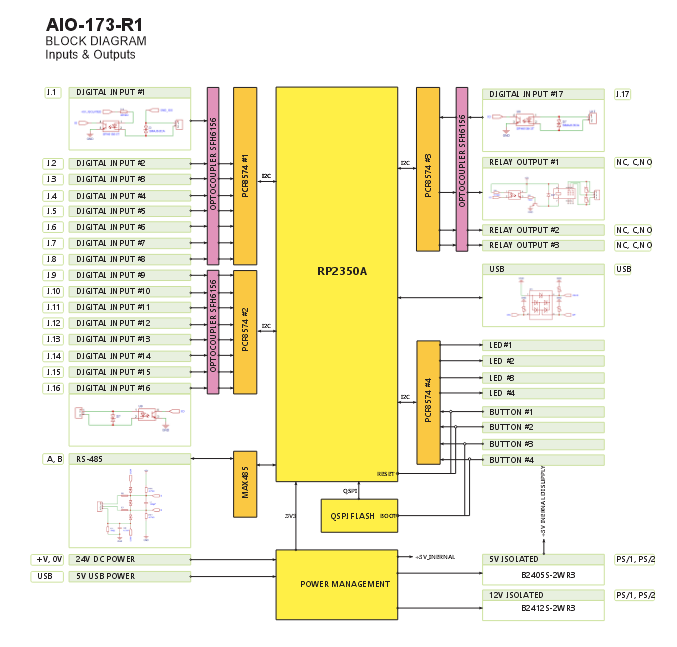
      </td>
      <td align="center">
        <strong>RP2350 MCU Pinout</strong><br>
        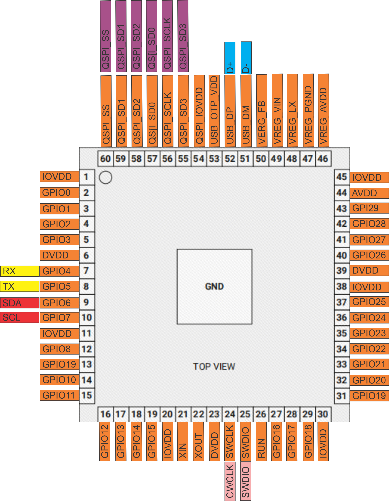
      </td>
    </tr>
    <tr>
      <td align="center">
        <strong>Field Board Layout</strong><br>
        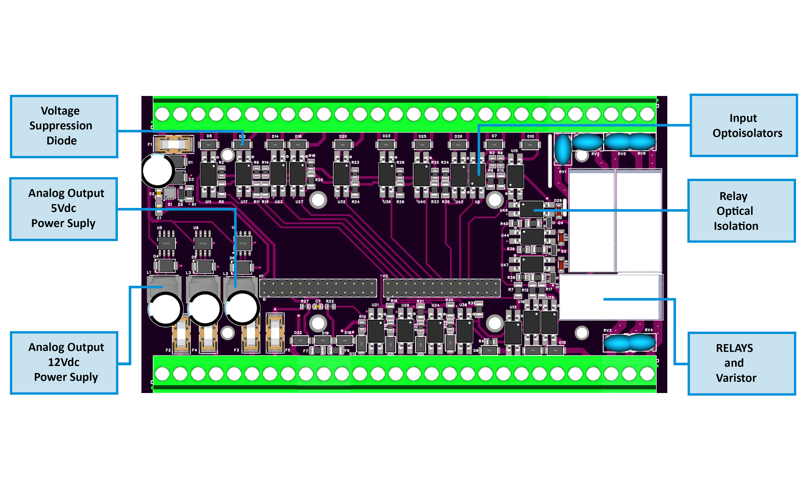
      </td>
      <td align="center">
        <strong>MCU Board Layout</strong><br>
        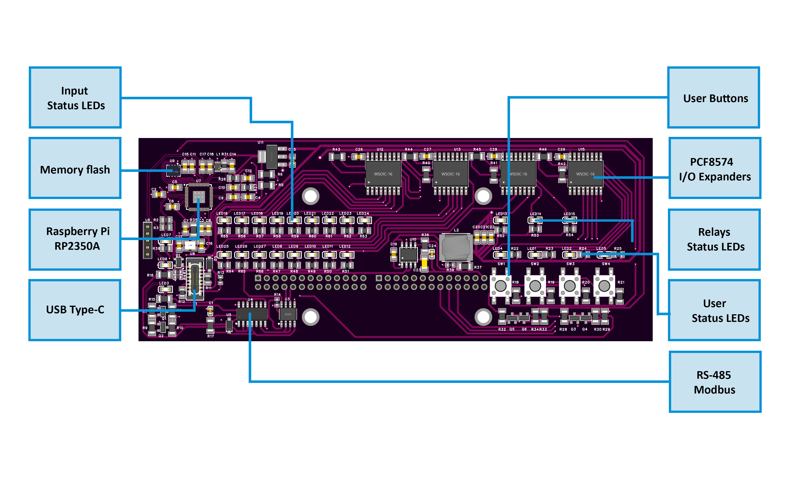
      </td>
    </tr>
  </table>
</div>

## 3.4 ALM-173-R1 — Technical Specification

### Overview

- **Function:** Alarm and annunciation I/O module with **17× opto-isolated digital inputs** and **3× SPDT relay outputs**  
- **System role:** RS-485 **Modbus RTU** slave for MicroPLC/MiniPLC and Home Automation 
- **Form factor:** DIN-rail module (compact multi-gang footprint), USB-C service port for Web-Serial setup

---

### I/O Summary

| Interface | Qty | Electrical / Notes |
|---|---:|---|
| **Digital Inputs (IN1…IN17)** | 17 | **Opto-isolated** inputs referenced to **GND_ISO**; suited for dry contacts and other isolated low-voltage signals. Per-channel conditioning and surge protection. |
| **Relays (RLY1…RLY3)** | 3 | **SPDT dry contacts** (COM/NO/NC) with transistor + opto drivers and contact suppression. Use snubbers/TVS for inductive loads; observe relay datasheet ratings (HF115F series). |
| **Isolated sensor rails** | 2 | **+12 V (PS/1)** and **+5 V (PS/2)**, each **isolated** and fuse-limited for powering field sensors (not actuators). |
| **User Buttons** | 4 | Front-panel buttons (SW1…SW4) to acknowledge alarms or manually override relays (configurable in UI). |
| **User LEDs** | 4 (+ status) | Front LEDs indicate groups/any alarm and overrides; **PWR** steady-on, **TX/RX** blink on bus activity. |
| **Field bus** | 1 | **RS-485 (A/B/COM)** with ESD/TVS and PTC protection; bias/termination per site design. |
| **Service** | 1 | **USB-C** with ESD protection for Web-Serial configuration and diagnostics. |

---

### Terminals & Pinout (field side)


#### Connector Map (front label reference)
> Use the front silkscreen to match terminals during wiring.

| Area (Front Label) | Purpose | Notes |
| :--- | :--- | :--- |
| **POWER — 24 Vdc (V+, 0 V)** | Primary SELV supply. | Verify polarity; isolate before service. |
| **DIGITAL INPUTS — IN1…IN17 (with GND_ISO groups)** | Dry-contact / isolated low-voltage inputs. | Use only within SELV limits; keep **GND_ISO** separate from logic ground unless design requires bonding. |
| **RELAY1…RELAY3 — C/NO/NC** | SPDT dry-contact outputs. | Observe relay ratings; snub inductive loads; avoid switching mains unless permitted by code and relay datasheet. |
| **OUTPUT 12 Vdc (PS/1)** | Isolated sensor supply (12 V). | Fuse-limited; no backfeeding or paralleling with other rails. |
| **OUTPUT 5 Vdc (PS/2)** | Isolated sensor supply (5 V). | Fuse-limited; for sensors only. |
| **RS-485 — COM, B, A** | Modbus RTU field bus. | Twisted pair; correct A/B polarity; one-point shield bond; termination per trunk design. |
| **USB (Service)** | Web-Serial configuration. | For service only; not a field power source. |
| **PWR/TX/RX LEDs** | Power and bus activity. | **PWR** = steady ON; **TX/RX** = **blink** when communication is active. If not blinking (stuck OFF/solid), isolate and check wiring, polarity, termination, and addressing. |

<br clear="left"/>

---

### Electrical

#### Power & Regulation
- **Primary input:** **24 VDC** nominal with input fuse, reverse-polarity protection, and surge suppression  
- **DC/DC & rails:**  
  - **Buck 24 V → +5 V** (primary logic rail)  
  - **LDO +5 V → +3.3 V** (MCU and logic)  
  - **Isolated rails:** **+12 V ISO** and **+5 V ISO** via isolated DC-DC modules with LC filtering and PTC fusing

#### Digital Inputs
- **Opto-isolators** per channel with series/network resistors for noise immunity  
- **Surge/ESD protection** on input lines; inputs referenced to **GND_ISO** return groups  
- Firmware options per input: **Enable**, **Invert**, **Group assignment (1/2/3/None)**, debounce in logic

#### Relay Outputs
- **HF115F series** SPDT relays with transistor drivers and opto-isolation on control side  
- **Contact suppression** network to reduce EMI/arcing; fit external snubbers/TVS for coils, locks, sirens  
- Wire loads directly to **COM/NO/NC**; keep load currents off logic returns

#### RS-485 (Modbus RTU)
- **MAX485-class** transceiver with DE/RE control  
- **Protection:** TVS diodes on A/B, series elements, bias network, and **PTC** resettable fuses on the bus  
- **Indicators:** **TX/RX LEDs** reflect line activity

#### USB-C (service/config)
- **ESD/EMI** protection array on D± and VBUS, CC pull-downs; reverse-current protection to the +5 V rail  
- Intended for **configuration and diagnostics**; not for powering external loads

---

### MCU & Storage

- **Controller:** **Raspberry Pi RP2350A** dual-core MCU  
- **External storage:** **W25Q32** (32-Mbit QSPI NOR flash) for firmware/config  
- **Clocking & debug:** 12 MHz crystal; **SWD** header for development/service access  
- **I/O expansion:** **PCF8574** I²C expanders for input/relay/LED/button matrixing

---

### Protections & Design for Reliability

- **Galvanic isolation:** Dedicated **GND_ISO** domain and **isolated +12 V/+5 V** rails for sensors  
- **Surge/ESD:** TVS arrays on RS-485 and USB; RC/series networks on data lines; **PTC** resettable fuses on field rails and bus  
- **Contact life:** Built-in suppression and guidance to apply external snubbers for inductive loads

---

### Firmware / Function (high-level)

- **Alarm engine:** map inputs → **Group 1/2/3** with modes **Active-while** or **Latched-until-ack**; **Any Alarm** summary  
- **Actuation:** per-relay **Enable/Invert/Group**; **Buttons** for acknowledges and manual relay overrides; **User LEDs** sourced to groups/any/override with **Steady/Blink**  
- **Setup & telemetry:** Web-Serial UI (USB-C) for **Modbus address/baud**, live input/relay/group status, and safe reset; operates stand-alone with a PLC/HMI supervising over Modbus


---

<a id="4-getting-started-1"></a>
# 4. Getting Started

The **ALM-173-R1** integrates into the HomeMaster system over the **RS-485 Modbus** bus. Initial setup has two parts: **physical wiring** and **digital configuration** (WebConfig + ESPHome).

---

## 4.1 What You Need

| Category | Item | Details |
|---|---|---|
| **Hardware** | **ALM-173-R1 Module** | DIN-rail alarm I/O module with **17× opto-isolated DIs**, **3× SPDT relays**, **4 buttons**, **4 user LEDs**, **RS-485**, and **USB-C** service port. |
|  | **HomeMaster Controller** | MiniPLC/MicroPLC (or any Modbus RTU master) to poll the ALM over RS-485 and integrate with HA/SCADA. |
|  | **24 VDC Power Supply** | Regulated SELV **24 VDC** wired to **V+ / 0V** terminals. Size for ALM + any sensors powered from the module’s isolated rails. |
|  | **RS-485 Cabling** | Twisted pair for **A/B** plus **COM/GND** reference; use **120 Ω** termination at the ends of the trunk and biasing per site design. |
|  | **USB-C Cable** | Connects the ALM to a PC for setup via **Web Serial** (Chrome/Edge). Service use only. |
|  | **Panel Enclosure & DIN Rail** | 35 mm DIN rail in a dry, clean enclosure with cable strain relief and shield management. |
| **Software** | **WebConfig Tool (browser page)** | Set **Modbus Address & Baud**, configure **Inputs/Relays/Buttons/LEDs**, select **Alarm Modes**, view **live status**, and **Reset Device**. No drivers required. |
|  | **ESPHome (optional)** | If using Home Assistant, run ESPHome on the controller to expose ALM states/actions as HA entities. |
| **I/O & Field Wiring** | **Dry-contact Sensors** | Door/PIR/tamper/aux contacts to **IN1…IN17**; use the labeled **GND I.x** returns; keep within SELV limits. |
|  | **Loads on Relays** | Siren/lock/indicator to **RLY1…RLY3 (COM/NO/NC)**; **observe relay ratings**. Fit **RC snubbers or TVS** across inductive loads. |
|  | **Isolated Sensor Power** | Use module outputs **PS/1 = +12 V iso** and **PS/2 = +5 V iso** for low-power sensors only; do **not** backfeed or parallel rails. |
| **Tools & Accessories** | **Screwdrivers & Ferrules** | Correctly torque terminal screws; ferrules recommended for stranded wire. |
|  | **Multimeter** | Verify polarity, continuity, and RS-485 A/B orientation during commissioning. |
|  | **120 Ω Resistors / Bias Network** | For RS-485 termination (ends of line) and biasing if not provided elsewhere on the trunk. |
|  | **Surge/EMC Aids** | Cable shields, gland plates; optional surge protectors for long outdoor runs. |

> **LED behavior:** **PWR** = steady ON in normal operation. **TX/RX** blink when RS-485 communication is active.

> **Quick start:** mount on DIN rail → wire **24 VDC** and RS-485 (**A/B/COM**) → connect **USB-C** and open WebConfig → set **Address/Baud** → configure **inputs → groups → relays/LEDs** → disconnect USB and hand over to the controller.


## 4.2 Powering the Devices

The ALM-173-R1 is powered from a **24 VDC primary input** on the field board. On-board regulators generate the internal rails for logic and provide **isolated 5 V / 12 V auxiliary rails** intended for low-power sensors.

> Relays are **dry contacts** (SPDT). Do **not** power valves/motors/lamps from the module’s internal rails; use a dedicated external supply and switch it via the relay contacts.

---

### 4.2.1 Power Supply Types

- **Regulated 24 VDC DIN-rail PSU:** Connect to the module’s **+V / 0V** power terminals. Size the PSU for the module plus any externally powered devices.
- **No power over RS-485:** The RS-485 bus carries signals only. Always provide local 24 VDC power to the module.
- **Sensor power from module:** Use the **isolated** rails — **+5 V** and **+12 V** — to power **low-power field sensors** connected to the DI terminals.  


---


### 4.2.2 Current Consumption

Actual current depends on configuration and what’s attached. Budget for:
- **Base electronics (logic/MCU/LEDs).**
- **Relays:** add coil current for each energized relay.
- **Sensor rails:** total draw of any devices on the isolated **+5 V / +12 V** rails.

**Sizing tip:** choose a 24 V supply that covers base load + worst-case **both relays ON** + all sensor current, with at least **30% headroom** for startup and temperature.

---

### 4.2.3 Power Safety Tips

- **Polarity & grounds:** Observe **24 V polarity** and keep logic ground and isolated sensor ground separate as designed.
- **Fusing & protection:** Keep upstream over-current protection (fuse/breaker). Do not bypass on-board protective elements.
- **Relay contact ratings:** Treat relay outputs as isolated contacts; follow the contact rating from the relay datasheet and local electrical codes.
- **Use sensor rails only for sensors:** Do **not** power valves, pumps, or sirens from the module’s **+5 V / +12 V** sensor rails.
- **De-energize before wiring:** Power down the 24 V supply before changing wiring. Double-check for shorts before re-energizing.
---

### 4.3 Networking & Communication

The ALM-173-R1 communicates with the controller over **RS-485 (Modbus RTU)** and exposes a **USB-C** port for local configuration via a browser (**Web Serial**). RS-485 is used for runtime control/telemetry; USB-C is used for setup, diagnostics, and safe resets. RS-485 carries **signals only** (no power).

---

#### 4.3.1 RS-485 Modbus

**Physical layer**
- **Terminals:** **A**, **B**, **COM (GND)** on the field board.
- **Cabling:** 2-wire twisted pair for **A/B** plus a **common reference (COM/GND)**.
- **Termination:** 120 Ω at the two ends of the bus. Keep stubs short.
- **Protection & robustness:** On-board surge suppressors/TVS and self-resetting fuses protect the transceiver; biasing and a MAX485-class transceiver handle the differential link.

**Protocol**
- **Role:** Modbus **RTU slave** on the RS-485 multi-drop bus; your MicroPLC/MiniPLC acts as **master**.
- **Address & speed:** Set **Address (1–255)** and **Baud** in WebConfig. Default/common speed is **19200**, 8N1.
- **No power over RS-485:** Provide 24 VDC locally to the module; RS-485 only carries data.

**Controller (ESPHome) notes**
- In your ESPHome YAML, configure `uart:` pins for the RS-485 transceiver and add a `modbus_controller:` for this device.
- Ensure the `alm_address` in YAML matches the address set in WebConfig.
- The controller will poll coils/holding registers and expose relays, DI states and alarms status as Home Assistant entities.

**Wiring checklist**
- A→A, B→B, COM↔COM between controller and module.
- Terminate the two bus ends; avoid star topologies.
- Keep A/B polarity consistent end-to-end.

---

#### 4.3.2 USB-C Configuration

**Purpose**
- Local setup and diagnostics via a **Chromium-based browser** (Chrome/Edge) using the **Web Serial API**. No drivers needed.

**How to use**
1. Connect a **USB-C** cable from your computer to the module.
2. Open the configuration page and click **Connect**.
3. Use the **Modbus** card to set **Address** and **Baud**; the header shows **Active Modbus Configuration**.
4. Configure **Digital Inputs**, **Relays**, **LEDs/Buttons**. Changes are applied live.
5. Use **Serial Log** for diagnostics.

**Troubleshooting**
- If the **Connect** button is disabled, ensure you’re using Chrome/Edge and that the browser has permission to access serial devices.

---

## 4.4 Quick Setup

**Phase 1 — Physical Wiring**

- **Power:** connect a regulated **24 VDC** supply to the **V+ / 0 V** POWER terminals.
- **RS-485:** wire **A → A**, **B → B**, and **COM/GND** between the **ALM-173-R1** and your controller. Keep polarity consistent. Terminate the two ends of the bus with **120 Ω** and apply biasing per your trunk design.
- **Digital inputs:** connect dry-contact/isolated signals to **IN1…IN17**; use the matching **GND I.x** returns printed on the lower terminal row.
- **Relays:** wire loads to **RLY1…RLY3 (COM/NO/NC)**. Use external **RC snubbers/TVS** for coils, locks, sirens, etc. Observe relay voltage/current ratings.
- **Isolated sensor power (optional):** low-power sensors can be fed from **PS/1 = +12 V iso** and **PS/2 = +5 V iso**. Do **not** backfeed or parallel these rails.

_For wiring safety, terminal maps, and cable practices, see your **Installation & Wiring** section._

---

**Phase 2 — Module Configuration (WebConfig)**

- **Connect:** plug a **USB-C** cable into the front service port and open the **ALM-173-R1 Config Tool** in a Chromium-based browser. Click **Connect**.
- **Set Modbus:** choose a unique **Modbus Address (1–255)** and a **Baud** rate (e.g., 9600/19200/38400/57600/115200). The header shows the **Active Modbus Configuration**.
- **Alarm modes:** for **Group 1/2/3**, pick **None**, **Active while condition is active (non-latched)**, or **Latched until acknowledged**.
- **Digital Inputs (IN1…IN17):** per input, set **Enabled**, **Inverted**, and **Alarm Group** (*None/1/2/3*). Watch the live state dot to verify wiring.
- **Relays (RLY1…RLY3):** set **Enabled**, **Inverted**, and **Alarm Group** mapping. The UI shows each relay’s live state.
- **Buttons (4):** assign actions such as **All acknowledge**, **Group 1/2/3 acknowledge**, or **Relay 1/2/3 override (manual)**.
- **User LEDs (4):** choose **Mode** (*Steady* / *Blink*) and **Source** (*Any alarm*, *Group 1/2/3*, *Relay 1/2/3 overridden*). Live LED status is shown.
- (Optional) **Reset Device** from the confirmation dialog if you need to restart the module; the browser will reconnect.

> For more details about **WebConfig** cards and fields, see **[Software & UI Configuration](#6-software--ui-configuration)**.

---

**Phase 3 — Controller Integration**

- **Controller role:** your MiniPLC/MicroPLC (or any Modbus master) polls the ALM-173-R1 over **RS-485** and exposes states/actions to your HMI or Home Assistant (via ESPHome on the controller, if used).
- **Match parameters:** ensure the controller’s **address** and **baud** match what you set in WebConfig.
- **Commission:** read DI and Alarm Group states from the controller; toggle relays for a functional test; expose “Acknowledge” and “Override” actions if desired.

> For protocol details and end-to-end examples, see **[Modbus RTU Communication](#7-modbus-rtu-communication)** and **[ESPHome Integration Guide (MicroPLC/MiniPLC + ALM-173-R1)](#8-esphome-integration-guide-microplcminiplc--alm-173-r1)**.

---

**Verify**

- **LEDs:** **PWR** should be **steady ON**; **TX/RX** should **blink** when the controller is communicating.
- **Inputs:** short/open a few inputs and confirm the **live dots** and **Group/Any** indicators react accordingly.
- **Relays:** command each relay from the UI or controller and verify field wiring (use a meter or indicator load).
- **Buttons/LEDs:** press front buttons to **acknowledge** or **override** as configured; confirm user LEDs reflect the chosen sources and modes.

<a id="5-wiring-1"></a>
# 5. Installation & Wiring

# 5. Installation & Wiring

> ⚠️ **Safety first.** Work must be performed by qualified personnel. De-energize the panel and verify with a meter before wiring. The ALM-173-R1 is a **SELV/low-voltage** device; do not connect mains to any logic/input terminal.

---

## 5.1 RS-485 Field Bus (Modbus RTU)

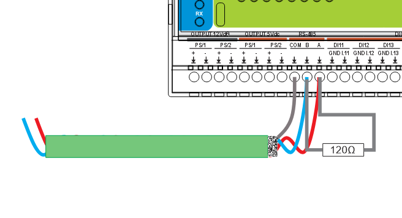

The controller is wired to the ALM-173-R1 using a twisted pair for **A/B** plus a **COM/GND** reference. A **120 Ω** end-of-line resistor is installed across **A–B** at the far end of the trunk.

**How to wire**

1. Use shielded twisted pair (e.g., 24–22 AWG).  
2. Wire **A → A**, **B → B**, **COM/GND → COM**; keep polarity consistent on all nodes.  
3. Terminate the **two physical ends** of the trunk with **120 Ω** between **A–B**.  
4. Bond the cable shield at **one point** only (usually at the controller) to avoid ground loops.  
5. Daisy-chain topology is recommended; avoid star wiring.

---

## 5.2 Primary Power (24 VDC)

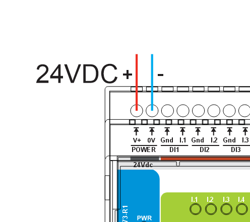

A regulated **24 VDC** supply connects to the top-left **POWER** terminals: **V+** (red) and **0 V** (blue).

**How to wire**

- Provide a clean SELV **24 VDC** source sized for the ALM plus any sensors powered from its isolated rails.  
- Observe polarity (**V+ / 0 V**).  
- Use an upstream fuse or breaker and proper panel bonding.  

---

## 5.3 Digital Inputs (IN1…IN17)

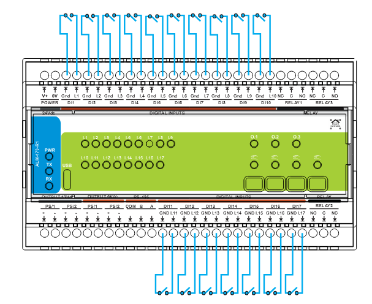

Dry-contact sensors are wired between each **INx** and the matching **GND I.x** return on the lower terminal row.

**How to wire**

- Inputs are **opto-isolated** and expect **dry contacts** or isolated low-voltage signals.  
- For each input, connect the sensor between **INx** and its **GND I.x** return as labeled on the front panel.  
- Do **not** inject external voltage into the inputs.  
- Use shielded cable for long runs and keep input wiring away from high-dv/dt conductors.  
- Configure each input in the WebConfig UI (**Enable / Invert / Group**) and verify with the live state dot.

---

## 5.4 Relay Outputs (RLY1…RLY3, COM/NO/NC)

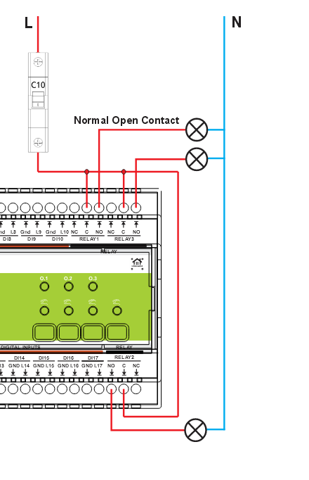

Each relay operates as a **dry contact** to switch an external supply. The example shows **NO** used to switch an AC line from a breaker (**L**) to the loads, with **N** routed directly.

**How to wire**

1. Bring the external supply **line (L)** to the relay **COM** terminal.  
2. From **NO** (or **NC** if fail-active behavior is needed) go to the load; return the other side of the load to **N/0 V** of the external supply.  
3. The relays **do not source power**—they only switch your external circuit.  
4. Respect relay voltage/current ratings and local electrical codes.  
5. Fit **RC snubbers or TVS** across inductive loads (locks, sirens, coils) to minimize arcing and EMI.

---

## 5.5 Final Checks

- All terminals torqued; strain relief applied.  
- **Isolation boundaries** respected (no unintended bonds between **GND_ISO** and logic ground).  
- RS-485 polarity, termination, and biasing verified.  
- Relays wired with the correct **COM/NO/NC** choice; snubbers fitted where needed.  
- Power up: **PWR** LED steady **ON**; **TX/RX** **blink** when the controller communicates.


<a id="6-software-ui-configuration-1"></a>
# 6 Software & UI Configuration

## 6.1 How to Connect to the Module

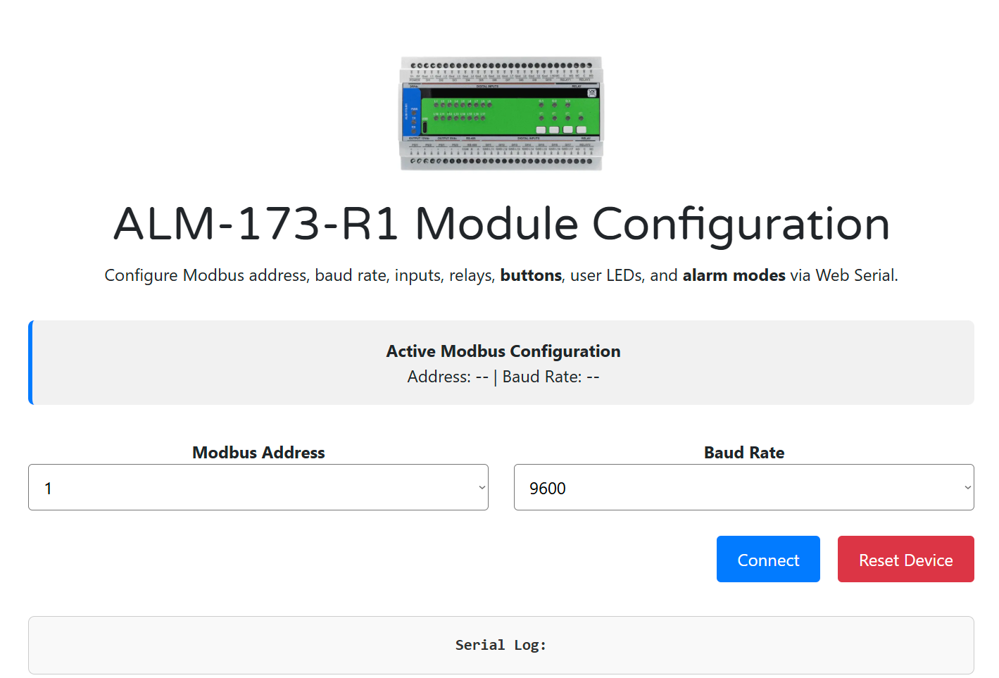

1. **Plug in USB-C.** Connect your computer to the ALM-173-R1’s USB-C port.  
2. **Open the config page.** In a Chromium-based browser (Chrome/Edge), open  
   **https://www.home-master.eu/configtool-alm-173-r1**  
3. **Click “Connect”.** When prompted, allow the browser to access the serial device.  
4. **Confirm connection.** The **Serial Log** shows events and the banner displays the **Active Modbus Configuration** (current **Address** and **Baud Rate**).  
5. **(Optional) Reset Device.** Click **Reset Device** for a safe reboot; the serial link will drop and then reconnect automatically.

> If you cannot connect to the module, check that no other app (serial console, uploader, etc.) is already using the USB port, and verify the browser has permission to access it. On macOS/Linux, ensure your user has the required USB serial permissions.

## 6.2 How to Configure Modbus

Use the top **Modbus Address** and **Baud Rate** selectors. Changes are sent to the device immediately; the **Serial Log** confirms with messages like “Modbus configuration updated” and “Configuration saved.”

- **Set Address (1…255):** Choose a **unique** Modbus RTU address for this module.  
- **Set Baud:** Pick one of the supported rates: **9600**, **19200** (default), **38400**, **57600**, **115200**.  
- **Verify live status:** The banner updates to show **Address** and **Baud Rate** currently active on the device.  
- **Controller match:** In your controller’s ESPHome YAML, ensure `uart` settings match your RS-485 pins/speed and set `wld_address` to the same address you chose here (e.g., `wld_address: "6"`).

> You can revisit this page anytime to adjust Modbus parameters. Configuration persists in the module’s flash memory.

## 6.3 How to Set Alarm Modes

Use the **Mode – Group 1/2/3** dropdowns to select the behavior for each group:
- **None** — group disabled.
- **Active while condition is active** — turns ON only while mapped inputs are active.
- **Latched until acknowledged** — stays ON after a trigger until acknowledged.

Top-row dots show live status for **Any Alarm**, **Group 1**, **Group 2**, **Group 3** (gray = idle, lit = active).
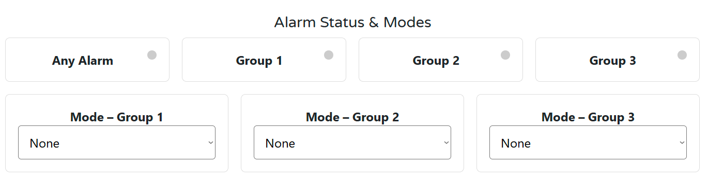


Use the **Mode – Group 1/2/3** dropdowns to select the behavior for each group:
- **None** — group disabled.
- **Active while condition is active** — turns ON only while mapped inputs are active.
- **Latched until acknowledged** — stays ON after a trigger until acknowledged.

## 6.4 How to Configure Digital Inputs

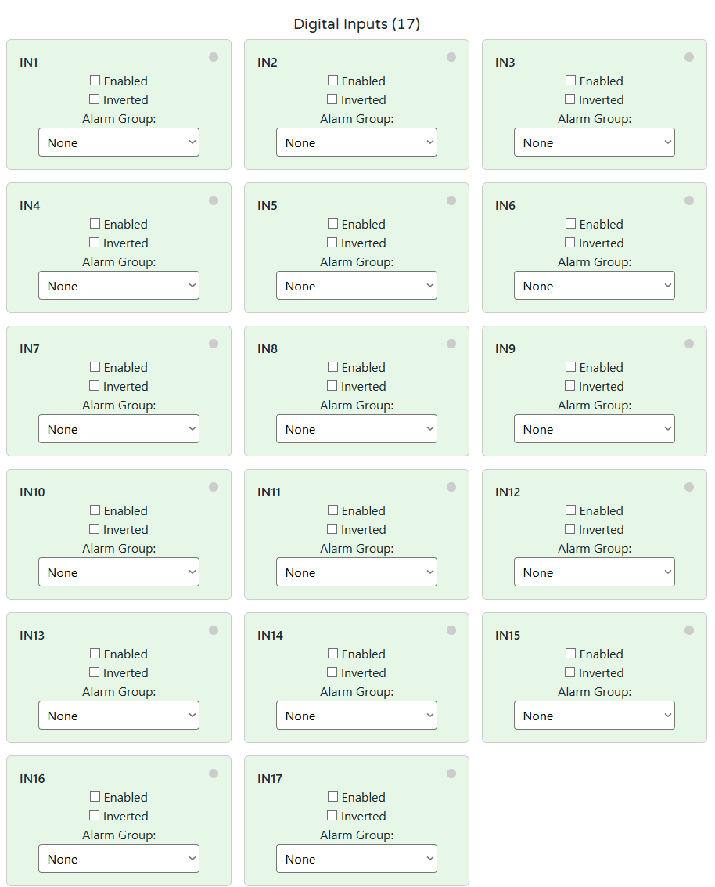

For each input **IN1…IN17**:

- **Enabled** — check to activate the input. (Unchecked = ignored by the alarm engine.)
- **Inverted** — check if the sensor is **NC** (closed = normal). This makes “open” read as **active**.
- **Alarm Group** — choose **None**, **1**, **2**, or **3** to route the input into a group.

The small dot in the top-right of each card shows the **live state** (off = idle, on = active) so you can verify wiring immediately.

## 6.5 How to Configure Relays

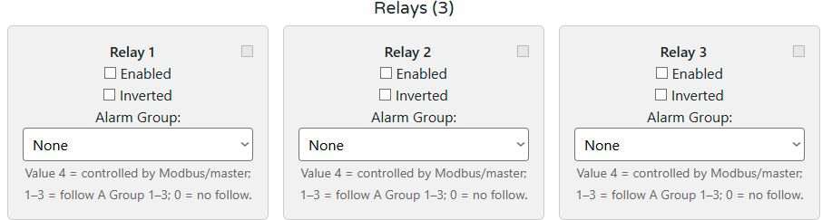


For each **Relay 1…3**:

- **Enabled** — allow the relay to operate. (Unchecked = relay forced **OFF**.)
- **Inverted** — flips the logic so the **energized** state reads opposite (useful for field wiring that is active-low).
- **Alarm Group** — choose how the relay is driven:
  - **None (0)** — relay does **not** follow any group; use only for manual/PLC control.
  - **Group 1 / Group 2 / Group 3 (1–3)** — relay **follows** the selected group’s state (including **latched** behavior if that mode is chosen).
  - **Modbus/Master (4)** — relay is **controller-controlled** (ESPHome/PLC writes it directly).

> Tip: For maintenance tests, assign a front-panel **Button** to “Relay x override (manual)” so you can toggle the relay locally while commissioning.

---


## 6.6 How to Configure LEDs and Buttons

### LEDs (4)
 
For each **User LED 1…4**:

- **Mode** — how the LED behaves when its source is active:
  - **Steady (when active)**
  - **Blink (when active)**
- **Trigger source** — what drives the LED:
  - **Any alarm**
  - **Group 1**, **Group 2**, **Group 3**
  - **Relay 1 overridden**, **Relay 2 overridden**, **Relay 3 overridden**
  - **None**
- The dot in the top-right shows the LED’s **live state** (off = inactive, on = active).

---

### Buttons (4)

For each **Button 1…4**:

- **Action** — choose what the button does when pressed:
  - **All acknowledge**
  - **Alarm group 1 acknowledge**
  - **Alarm group 2 acknowledge**
  - **Alarm group 3 acknowledge**
  - **Relay 1 override (manual)**
  - **Relay 2 override (manual)**
  - **Relay 3 override (manual)**
  - **None**
- The small dot in the card shows the **live press** state (off = idle, on = pressed).

---

<a id="7-modbus-rtu-communication-1"></a>
# 7 Modbus RTU Communication

**Slave role:** Modbus RTU over RS-485 (8N1, selectable **9600…115200** baud; typical **19200**).  
**Address:** **1…255** (set via WebConfig).  
**Data model:** **Discrete Inputs**, **Coils**, **Holding/Input Registers** (live telemetry + configuration snapshots).

> The tables below describe the **factory default** map used by the ALM-173-R1 firmware.

---

## 7.1 Input Registers (Read-Only)

Live, read-only snapshots convenient for dashboards and fast polling.

| Group | Address range | Type | Units (raw) | Scaling | Notes |
|---|---|---|---|---|---|
| **Firmware / Device** | 1100…1101 | U16×2 | enum | 1 | 1100 = firmware version, 1101 = build/variant |
| **Active Modbus config** | 1110…1111 | U16×2 | enum | 1 | 1110 = address (1–255), 1111 = baud code (1=9600,2=19200,3=38400,4=57600,5=115200) |
| **Digital Inputs bitmap** | 1120…1121 | U16×2 | bitfield | 1 | IN1…IN16 in 1120, IN17 in 1121 bit0 |
| **Alarm summary** | 1130 | U16 | bitfield | 1 | bit0=Any, bit1=G1, bit2=G2, bit3=G3 |
| **Relay state mirrors** | 1140 | U16 | bitfield | 1 | bits0..2 = RLY1..RLY3 (1=ON) |
| **LED state mirrors** | 1150 | U16 | bitfield | 1 | bits0..3 = LED1..LED4 (1=active) |
| **Buttons pressed** | 1160 | U16 | bitfield | 1 | bits0..3 = BTN1..BTN4 (1=pressed) |

> All 32-bit values (if any added in future) occupy **two** consecutive registers (lo, hi).

---

## 7.2 Holding Registers (Read/Write)

Configuration + low-rate control values (persisted by firmware where applicable).

| Group | Address range | Type | Description |
|---|---:|---:|---|
| **Alarm modes** | **1200…1202** | U16×3 | Mode per group: **0=None**, **1=Active-while**, **2=Latched-until-ack** (G1,G2,G3). |
| **Inputs (per IN1…IN17)** | **1300…1350** | U16×51 | Repeating triplet **[enable, invert, group]** per input. Group: **0=None**, **1=G1**, **2=G2**, **3=G3**. Layout: IN1 at 1300..1302, IN2 at 1303..1305, … IN17 at 1348..1350. |
| **Relays (RLY1…RLY3)** | **1400…1422** | U16×9 | Repeating triplet **[enable, invert, group]** per relay. Group: **0=None**, **1=G1**, **2=G2**, **3=G3**, **4=Master (controller controls)**. R1 at 1400..1402, R2 at 1410..1412, R3 at 1420..1422. |
| **Buttons (BTN1…BTN4)** | **1500…1503** | U16×4 | **Action** per button: **0=None**, **1=Ack All**, **2=Ack G1**, **3=Ack G2**, **4=Ack G3**, **5=Relay1 override**, **6=Relay2 override**, **7=Relay3 override**. |
| **User LEDs (LED1…LED4)** | **1600…1607** | U16×8 | Per LED: **mode** (0=Steady, 1=Blink) and **source** (0=None, 1=Any, 2=G1, 3=G2, 4=G3, 10=R1 overridden, 11=R2 overridden, 12=R3 overridden). |

> Most daily setup is done in WebConfig; exposing these fields enables headless provisioning/backups from PLC/HA.

---

## 7.3 Discrete Inputs & Coils

### Discrete Inputs (read-only flags)

| Range | Bits | Meaning |
|---|---:|---|
| **00001…00017** | 17 | **DI1…DI17** debounced state |
| **00050…00053** | 4 | **Any Alarm**, **Group 1**, **Group 2**, **Group 3** |
| **00060…00062** | 3 | **Relay 1…3** state mirrors |
| **00090…00093** | 4 | **LED 1…4** state mirrors |
| **00100…00103** | 4 | **BTN 1…4** pressed |

### Coils (write – single/multiple)

| Range | Count | Action |
|---|---:|---|
| **00200…00202** | 3 | **Relay ON** (RLY1…RLY3) |
| **00210…00212** | 3 | **Relay OFF** (RLY1…RLY3) |
| **00220…00222** | 3 | **Override ON** (force RLY1…RLY3) |
| **00230…00232** | 3 | **Override OFF / Release** (RLY1…RLY3) |
| **00240** | 1 | **Acknowledge All** (pulse) |
| **00241…00243** | 3 | **Acknowledge Group 1/2/3** (pulse) |
| **00300…00316** | 17 | **Enable DI i** (pulse per input) |
| **00320…00336** | 17 | **Disable DI i** (pulse per input) |

> Coils obey **priority**: an **Override** holds a relay irrespective of group/master writes until you release it.

---

## 7.4 Scaling Summary

No engineering scaling is required for ALM core points. All values are **boolean/bitfield** or **enum codes** as defined above.

---

## 7.5 Basics & Function Codes

- **Physical:** RS-485 half-duplex; 120 Ω termination at both ends; consistent **A/B** polarity; shared COM/GND recommended if separate PSUs.  
- **Function codes:** `0x01` Read Coils, `0x02` Read Discrete Inputs, `0x03` Read Holding, `0x04` Read Input (if utilized), `0x05/0x0F` Write Coils, `0x06/0x10` Write Holding.  
- **Polling:** Discrete/group bits at **5–10 Hz**; mirrors at **2–5 Hz**; holding snapshots **on change** or **1–5 s**.

---

## 7.6 Register Map (Summary)
```
Discrete Inputs
00001..00017 DI1..DI17 state
00050..00053 Any, G1, G2, G3
00060..00062 Relay1..Relay3 mirrors
00090..00093 LED1..LED4 mirrors
00100..00103 BTN1..BTN4 pressed

Coils
00200..00202 Relay ON (RLY1..RLY3)
00210..00212 Relay OFF (RLY1..RLY3)
00220..00222 Override ON (RLY1..RLY3)
00230..00232 Override OFF (RLY1..RLY3)
00240 Ack All (pulse)
00241..00243 Ack G1..G3 (pulse)
00300..00316 Enable DIi (pulse)
00320..00336 Disable DIi (pulse)

Input Registers (Read-Only)
01100 FW version (U16)
01101 FW build/variant (U16)
01110 Active address (U16)
01111 Active baud code (U16)
01120..01121 DI bitmap (U16 lo/hi)
01130 Alarm summary bitmap (Any,G1,G2,G3)
01140 Relay bitmap
01150 LED bitmap
01160 Button bitmap

Holding Registers (R/W)
01200..01202 Group modes G1..G3 (0=None,1=Active-while,2=Latched)
01300..01350 IN1..IN17 [enable,invert,group] triplets
01400..01402 RLY1 [enable,invert,group]
01410..01412 RLY2 [enable,invert,group]
01420..01422 RLY3 [enable,invert,group]
01500..01503 BTN1..BTN4 action
01600..01607 LED1..LED4 [mode,source] pairs
```
---

## 7.7 Override Priority

<a id="8-esphome-integration-guide-microplcminiplc-alm-173-r1-1"></a>
# 8. [ESPHome Integration Guide (MicroPLC/MiniPLC + ALM-173-R1)]

## 8.1 Hardware & RS-485 Wiring

1) **Power**  
- **ALM-173-R1:** supply **24 V DC** to **V+ / 0 V**.  
- **MicroPLC/MiniPLC:** per controller spec.  
- If the ALM and PLC have different PSUs, also share the **COM/GND** reference between devices.

2) **RS-485**  
- Wire **A↔A**, **B↔B** with a twisted pair; terminate the two bus ends (~**120 Ω**), bias at the master.  
- Default serial (firmware/UI): **19200 8N1**; device **address** is configurable (examples below use `5`).

3) **Field I/O (typical)**  
- **IN1…IN17:** dry contacts (door/PIR/tamper/aux). Map each to **Group 1/2/3** in WebConfig.  
- **Relays RLY1…RLY3:** siren/lock/indicator (dry contacts).  
- **Buttons/LEDs:** local **acknowledge** / **manual override** and visual status (Any/Group/Override).

---

## 8.2 ESPHome (PLC): Enable Modbus RTU & Import the ALM Package

Your MiniPLC usually already defines UART+Modbus. Import the **ALM** package and use the **exact variable names** shown (`enm_prefix`, `enm_id`, `enm_address`):

```yaml
uart:
  id: uart_modbus
  tx_pin: 17
  rx_pin: 16
  baud_rate: 19200
  parity: NONE
  stop_bits: 1

modbus:
  id: modbus_bus
  uart_id: uart_modbus

packages:
  alm1:
    url: https://github.com/isystemsautomation/HOMEMASTER
    ref: main
    files:
      - path: ALM-173-R1/Firmware/default_alm_173_r1_plc/default_alm_173_r1_plc.yaml
        vars:
          alm_prefix: "ALM#1"   # appears in HA entity names
          alm_id: alm_1         # unique internal ID
          ealm_address: 5        # set to your module’s Modbus ID
    refresh: 1d
```

> Add multiple ALMs by duplicating the `alm1:` block (`alm2:`, `alm3:`…) with unique `alm_id` / `alm_address` / `alm_prefix`.

---

## 8.3 What the External ALM Package Exposes (Entities)

The bundled **`default_alm_173_r1_plc.yaml`** publishes ready-to-use entities; addressing is embedded, so you don’t hand-map registers.

- **Binary sensors**
  - **IN1…IN17** (debounced digital inputs).
  - **Alarm summary & groups:** **Any Alarm**, **Group 1**, **Group 2**, **Group 3**.
  - **Buttons pressed:** BTN1…BTN4 (diagnostics).
  - **Relay/LED mirrors:** readbacks for dashboards.

- **Switches**
  - **RLY1…RLY3** (ON/OFF) for manual or HA-driven actuation.
  - **Acknowledge** actions (All / G1 / G2 / G3) as script/switch helpers.
  - **Override** actions for **Relay 1/2/3** (force ON/OFF, then release).

- **Numbers/Selects (optional)**
  - Readbacks for **address/baud**, group **modes**, and per-channel **enable/invert/group** (mostly for diagnostics or advanced provisioning).

> The ALM’s **LED sources/modes** and input/relay **group mapping** are usually configured in WebConfig; HA consumes the resulting states.

---

## 8.4 Command Coils You Can Use (Writes; FC05 / Read via FC01)

The package implements **pulse-safe** helpers (they auto-release after writing):

- **Relays**  
  - **R1 ON** / **OFF**, **R2 ON** / **OFF**, **R3 ON** / **OFF**

- **Overrides**  
  - **Override ON** / **Override OFF** for **R1/R2/R3** (forces relay regardless of group/master until released)

- **Acknowledges**  
  - **Ack All**, **Ack Group 1**, **Ack Group 2**, **Ack Group 3**

- **Input helpers (optional)**  
  - **Enable/Disable INx** pulses for commissioning workflows

These appear as internal ESPHome switches or scripts that you can call from HA automations.

---

## 8.5 Using Your MiniPLC YAML with ALM

1) Keep the existing **UART/Modbus** blocks (pins/baud).  
2) Add the **`packages:`** block above and set **`alm_address`** to the ALM’s address from WebConfig.  
3) Flash the controller; ESPHome will discover entities under **`alm_prefix`** (e.g., `ALM#1 IN1`, `ALM#1 Any Alarm`, `ALM#1 Relay 1`).  
4) Place the entities on dashboards and wire up acknowledge/override actions as HA buttons.

---

## 8.6 Home Assistant Integration

1) **Add the ESPHome device** in HA (`Settings → Devices & Services → ESPHome`) using your controller’s hostname/IP.  
2) **Dashboards**
   - **Annunciator**: tiles for **Any/Group1/2/3**, plus a button for **Ack All**.
   - **Zones**: show **IN1…IN17** grouped by area; add **Relay 1/2/3** toggles for tests.
   - **Service mode**: a helper (boolean) that gates HA from energizing sirens; use **Overrides** sparingly.
3) **Automations**
   - On **Any Alarm → ON**: push notification + flash a smart light; if **service_mode = off**, energize **Relay 1** for the siren.
   - On **Group X → ON** and **latched**: prompt an **Ack Group X** action.
   - On **Modbus unavailable**: raise a critical alert.

---

## 8.7 Troubleshooting & Tips

- **No data / timeouts**: check **A/B polarity**, shared **COM/GND** (when PSUs differ), and **termination/bias**.  
- **Wrong package vars**: use **`alm_prefix` / `alm_id` / `alm_address`** (not older variable names).  
- **Relays not responding**: verify the relay is **Enabled** in WebConfig and **not overridden**.  
- **Latched alarms won’t clear**: inputs must be normal **and** you must send the corresponding **Ack**.  
- **Multiple ALMs**: give each a unique **Modbus address** and **`enm_prefix`**.

---

## 8.8 Version & compatibility

- Tested with ESPHome 2025.8.0.
- The controller YAML uses ESP‑IDF; Arduino also works if preferred (adjust platform accordingly).

---
<a id="9-programming-customization-1"></a>
# 9. Programming & Customization

## 9.1 Supported Languages
- **MicroPython** (pre‑installed)  
- **C/C++**  
- **Arduino IDE**

## 9.2 Flashing via USB-C
1. Connect USB‑C.  
2. Enter boot/flash mode if required.  
3. Upload the provided firmware/source.

> **Boot/Reset combinations:**  
> - **Buttons 1 + 2** → forces the module into **BOOT mode**.  
> - **Buttons 3 + 4** → triggers a **hardware RESET**.  
> These behaviors are handled **in hardware**.  
> Use these combinations during firmware flashing or to restart the device manually.

📷 **Button numbering reference:**  
<p align="center">
  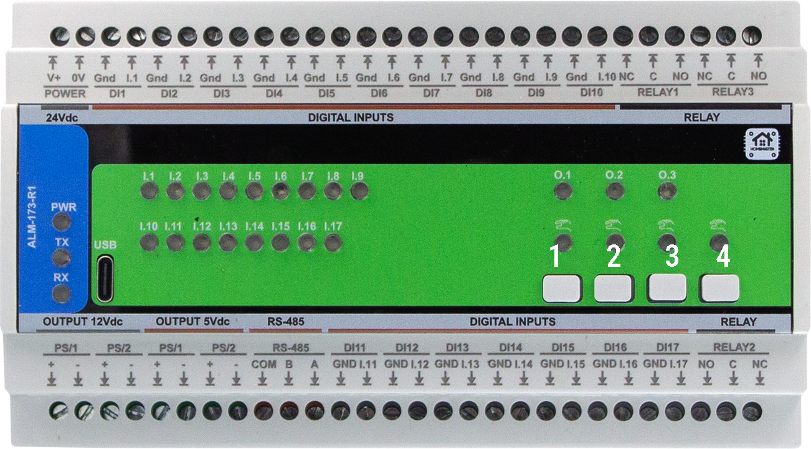
</p>

## 9.3 Arduino
- Select the appropriate board profile (Generic RP2350).  
- In the Tools select Flash size 2MB (Sketch: 1MB, FS: 1MB )
- Add 
  - #include <Arduino.h>
  - #include <ModbusSerial.h>
  - #include <SimpleWebSerial.h>
  - #include <Arduino_JSON.h>
  - #include <LittleFS.h>
  - #include <OneWire.h>
  - #include <utility>
  - #include "hardware/watchdog.h"


<a id="10-maintenance-troubleshooting-1"></a>
# 10. Maintenance & Troubleshooting


<a id="11-open-source-licensing-1"></a>
# 11. Open Source & Licensing

- **Hardware:** **CERN‑OHL‑W 2.0**  
- **Firmware & code samples:** **GPLv3** (unless otherwise noted)

<a id="12-downloads-1"></a>
# 12. Downloads

The following key project resources are included in this repository:

- **🧠 Firmware (Arduino/PlatformIO):** [`Firmware/default_alm_173_r1/`](Firmware/default_alm_173_r1/)  
  Main sketch implementing relays, button overrides, alarms, Modbus RTU, and WebSerial support.

- **🛠 Web Config Tool:** [`Firmware/ConfigToolPage.html`](Firmware/ConfigToolPage.html)  
  HTML‑based USB Web Serial configuration UI, used for meter options, calibration, relays, alarms, etc.

- **📷 Images & Visual Documentation:** [`Images/`](Images/)  
  Contains UI screenshots, module photos, diagrams, and layout references used in this documentation.

- **📐 Hardware Schematics:** [`Schematics/`](Schematics/)  
  Includes Field Board and MCU Board schematics in PDF format for hardware developers and integrators.

- **📖 Datasheet & Documentation (if available):** [`Manuals/`](Manuals/)  
  Contains PDF datasheets or technical overviews, if applicable.


<a id="13-support-1"></a>
# 13. Support

If you need help using or configuring the ALM-173-R1 module, the following resources are available:

- [🛠 Web Config Tool](https://www.home-master.eu/configtool-alm-173-r1) – Configure and calibrate via USB‑C in your browser.  
- [🌐 Official Support Page](https://www.home-master.eu/support) – Knowledge base and contact options.  

## 📡 Community & Updates
- [Hackster Projects](https://www.hackster.io/homemaster) – Integration guides, wiring, and code examples.  
- [YouTube Channel](https://www.youtube.com/channel/UCD_T5wsJrXib3Rd21JPU1dg) – Video tutorials and module demos.  
- [Reddit Community](https://www.reddit.com/r/HomeMaster) – Questions, help, and user contributions.  
- [Instagram](https://www.instagram.com/home_master.eu) – Visual updates and product insights.