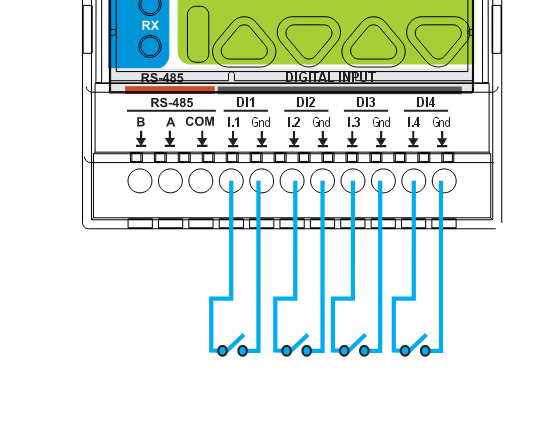
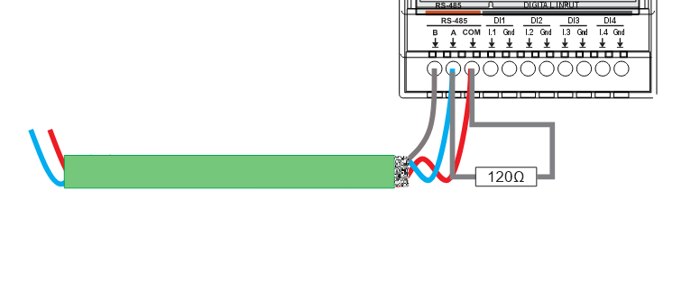
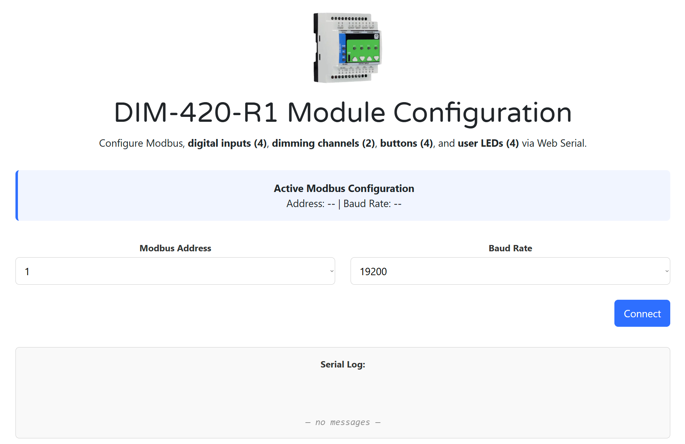
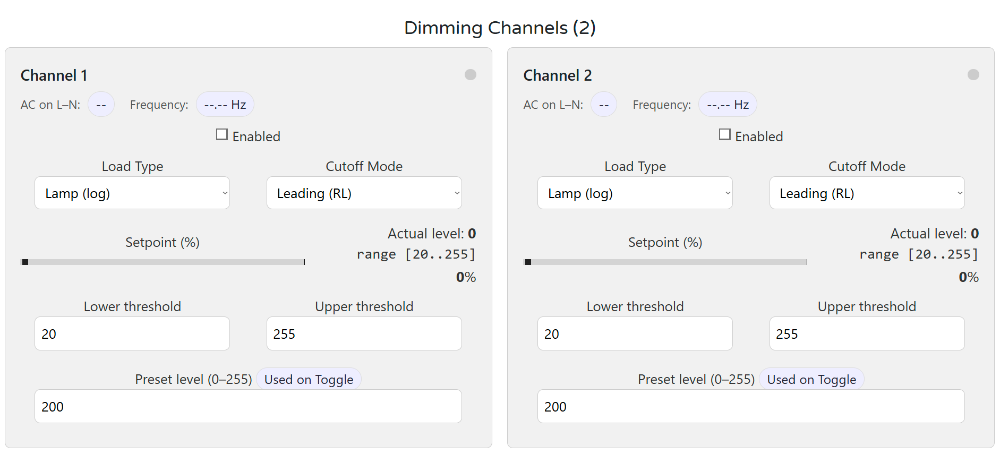
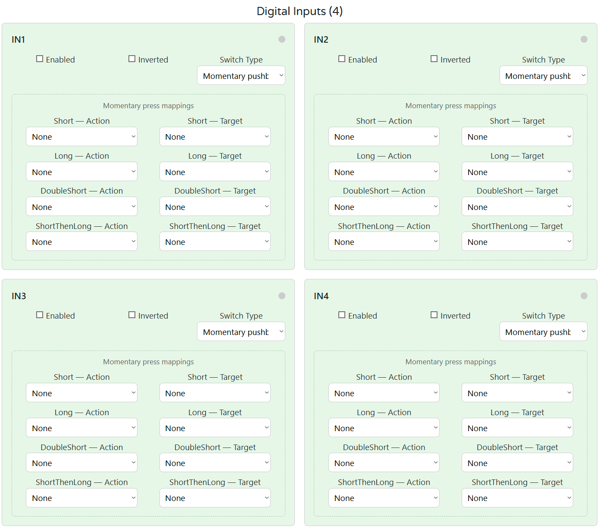
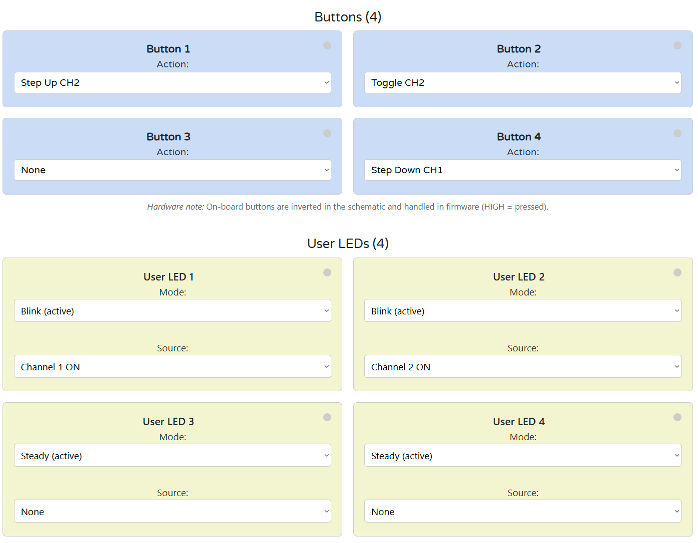
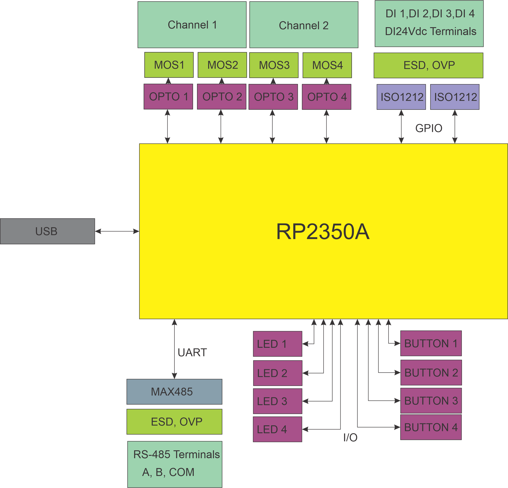
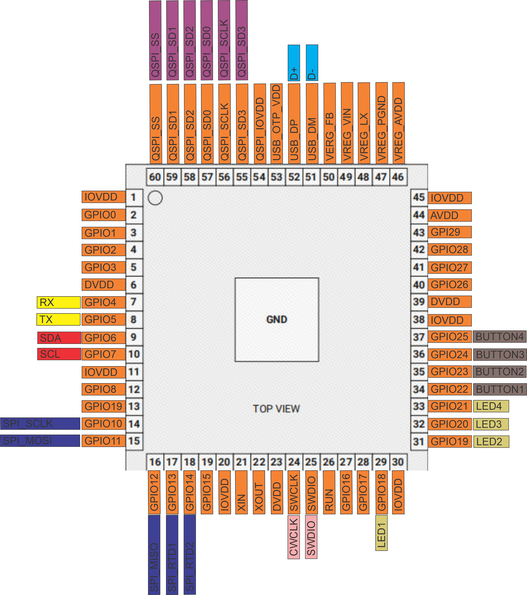
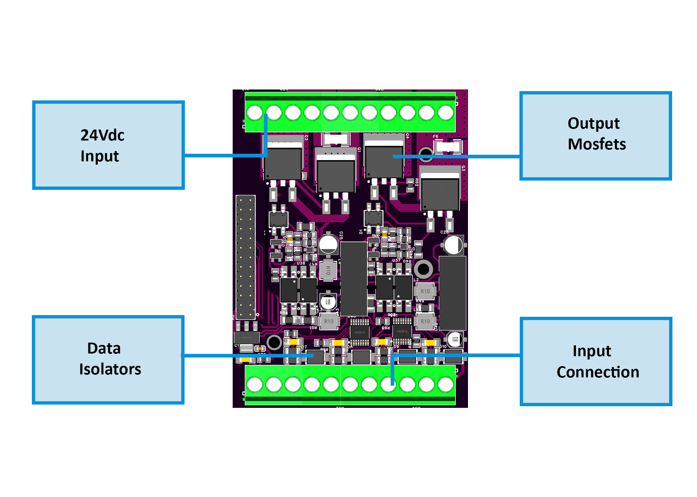
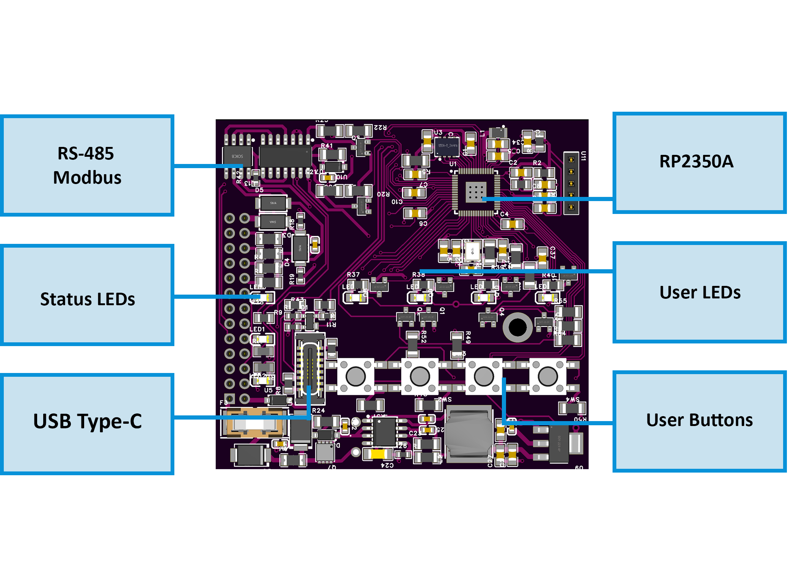

# 🚧 Project Status: Under Active Development & Testing

> **Important Notice:** This documentation, hardware designs, and firmware are for the **pre-release version** of the HomeMaster system. All information is preliminary and may contain errors or be subject to change.
>
> - **Hardware:** Modules are currently in the prototyping and testing phase. Final production versions may differ.
> - **Firmware:** Firmware is under active development and is considered **beta**. Features, configurations, and stability are being refined.
>
> Please use this information for evaluation and development purposes only. Check the [Releases page](../../releases) for the latest stable versions and updates.

---
**Firmware Version:** 2025-10 snapshot


# DIM-420-R1 — Module for Dual-Channel AC Dimming

**HOMEMASTER – Modular control. Custom logic.**


### Module Description

The **DIM-420-R1** is a configurable smart I/O module designed for **dimming AC loads via leading/trailing edge phase control**.  
It includes **4 digital inputs**, **2 dimming outputs**, **4 user buttons**, and **4 LEDs**, with configuration via **WebConfig** using **USB-C (Web Serial)**.  
It connects over **RS-485 (Modbus RTU)** to a **MicroPLC/MiniPLC**, enabling use in **smart lighting, scene control, and automation of resistive or LED loads**.

---


## Table of Contents

* [1. Introduction](#1-introduction)
* [2. Use Cases](#2-use-cases)
* [3. Safety Information](#3-safety-information)
* [4. Installation & Quick Start](#4-installation-quick-start)
* [5. MODULE-CODE — Technical Specification](#5-module-code--technical-specification)
* [6. Modbus RTU Communication](#6-modbus-rtu-communication)
* [7. ESPHome Integration Guide (if applicable)](#7-esphome-integration-guide)
* [8. Programming & Customization](#8-programming--customization)
* [9. Maintenance & Troubleshooting](#9-maintenance--troubleshooting)
* [10. Open Source & Licensing](#10-open-source--licensing)
* [11. Downloads](#11-downloads)
* [12. Support](#12-support)

<br clear="left"/>

---

<a id="1-introduction"></a>

# 1. Introduction

## 1.1 Overview of the DIM-420-R1 Module ✨

The **DIM‑420‑R1** is a modular dimmer I/O device for **dual‑channel phase‑cut AC dimming** in the **HomeMaster MicroPLC / MiniPLC** ecosystem. It exposes **2 dimming channels**, **4 isolated digital inputs**, **4 configurable user buttons**, **4 user LEDs**, and an **RS‑485 Modbus RTU** interface. Setup and diagnostics are performed in‑browser via **WebConfig over USB‑C (Web Serial)**—no special software required. 

It integrates seamlessly with **MiniPLC / MicroPLC controllers, third‑party Modbus masters, ESPHome / Home Assistant, and SCADA/PLC systems**. Typical use: connect wall switches to the DIs, pick **Leading/Trailing edge** per load, set **Lower/Upper thresholds**, and control scenes from a PLC or locally with press‑logic. 

> **Quick use case:**  
> Wire DI1–DI4 to wall switches → select *Momentary* or *Latching* with Short/Long/Double logic → choose **Cut Mode** and **Load Type** per channel → map LEDs/Buttons → connect RS‑485 A/B → control and monitor via PLC / ESPHome. 

---

## 1.2 Features & Architecture

### Core Capabilities

| Subsystem       | Qty    | Description |
|-----------------|--------|-------------|
| **Digital Inputs** | 4      | **Opto‑isolated** dry‑contact inputs (ISO1212 front‑end); modes: *Momentary*/*Latching* with **Short / Long / Double / Short‑then‑Long** press types. Debounced and firmware‑interpreted for actions.  |
| **Dimming Outputs** | 2      | MOSFET‑based **phase‑cut** AC outputs; **Leading/Trailing** per channel with **Lower/Upper** threshold limits and zero‑cross sync/monitoring.  |
| **Relays**         | 0      | – |
| **User LEDs**      | 4      | Steady/Blink; sources: CH1/CH2 state, DI1–DI4, or AC presence (**ZC OK**).  |
| **User Buttons**   | 4      | Local acknowledge/override; firmware press‑logic for toggle, ramp (ping‑pong), preset, max.  |
| **Config UI**      | Web Serial | **WebConfig** in Chromium browser over **USB‑C**; edit Modbus addr/baud, thresholds, cut mode, presets; live log & JSON snapshot.  |
| **Modbus RTU**     | RS‑485 | Multi‑drop slave; **FC01/05/02/03/06/16** with discrete inputs, coils, and holding registers. Defaults **ID=3, 19200, 8N1**.  |
| **MCU**            | RP2350A | Dual‑core MCU; **QSPI flash** for firmware/config; Arduino/PlatformIO supported.  |
| **Power**          | 24 VDC | Protected 24 V input; on‑board **isolated 5 V rails** for power stages (B2405S‑2WR3) and local 3.3 V regulation.  |
| **Protection**     | TVS, PTC | Surge/ESD protection and resettable fuses on field I/O and RS‑485/USB/power paths.  |

---

## 1.3 System Role & Communication 🔌

The **DIM‑420‑R1** is a **standalone Modbus RTU slave** on an **RS‑485** multi‑drop trunk. It executes local input press‑logic and dimming behavior, mirrors state to **discrete inputs/holding registers**, and accepts control via **coils/holding writes** from a master (PLC/SCADA/ESPHome). A live **JSON snapshot** and event log stream over Web Serial for commissioning and diagnostics. 

| Role                | Description |
|---------------------|-------------|
| **System Position** | Expansion/field module on RS‑485 bus (A/B/COM).  |
| **Master Controller** | MiniPLC / MicroPLC or any third‑party **Modbus RTU master**.  |
| **Address / Baud**  | Configurable via WebConfig; **default Slave ID = 3**, **19200 baud, 8N1** (persisted to flash).  |
| **Bus Type**        | RS‑485 multi‑drop with proper termination and biasing.  |
| **USB‑C Port**      | Setup/diagnostics, UF2 firmware updates via RP2350 bootloader; in‑browser WebConfig.  |
| **Polling Model**   | Master polls **DI/LED/AC status** and writes **coils/registers** for ON/OFF, presets, levels, and config.  |

> ⚠️ **Note:** If multiple DIM‑420‑R1 modules share the same RS‑485 line, assign unique **Modbus IDs** in WebConfig and verify termination/bias. 

---

<a id="2-use-cases"></a>

# 2. Use Cases

## Scene Control with Wall Switches

Control dimmed lighting scenes using standard wall switches wired to the digital inputs.

- Short press toggles CH1 to preset.
- Long press ramps CH1 up or down.
- Double press sets CH2 to max.

**Setup Instructions:**
- Wire DI1–DI4 to wall pushbuttons.
- In WebConfig → set DI1: **Momentary**.
- Map actions:
  - Short → Toggle CH1
  - Long → Increase CH1
  - DoubleShort → Go Max CH2
- Set CH1 preset = 180 and CH2 upper threshold = 255.
- Save configuration and test with physical input.

---

<a id="3-safety-information"></a>

# 3. Safety Information

These guidelines apply to the **DIM‑420‑R1** dimmer module. Ignoring them may result in **equipment damage, electric shock, or fire**.

> ⚠️ **Mixed‑voltage device** — The module contains both **SELV/PELV** control electronics **and hazardous AC mains** on the dimmer channels (`Lx_IN/Lx_OUT`, `Nx_IN/Nx_OUT`). The logic side is galvanically isolated (opto + isolated 5 V rails), but **mains is present** on the power section and output terminals. Handle as a mains device. 

---

## 3.1 General Requirements

| Requirement           | Detail |
|-----------------------|--------|
| Qualified Personnel   | Installation and servicing by trained technicians only (panel wiring + mains safety). |
| Power Isolation       | **Isolate both 24 VDC and AC mains** before touching wiring or terminals (lockout/tagout). |
| Environmental Limits  | Mount inside a **dry, clean, ventilated** enclosure; avoid condensation, conductive dust, vibration. |
| Grounding             | Bond the control panel to protective earth. Keep **SELV grounds** and **mains earth/neutral** managed per code. |
| Voltage Domains       | Treat `+5V_ISO1/ISO2`, `GND_ISO1/ISO2` and L/N terminals as **mains domain**; do **not** bridge to logic `GND`.  |

---

## 3.2 Installation Practices

| Task | Guidance |
|---|---|
| ESD Handling | Handle PCBs by the edges; use antistatic strap and grounded work surface. |
| DIN Mounting | Secure on **35 mm DIN rail** inside an enclosure; provide strain relief on all cables. |
| Isolation Domains | Respect isolation: logic (24 V, RS‑485, USB) vs. **power side** (AC L/N, isolated 5 V rails). **Never** tie `GND` to `GND_ISO1/2`.  |
| AC Load Wiring | Use proper gauge; route **mains L/N** to `Lx_IN/Nx_IN` and load to `Lx_OUT/Nx_OUT`. Keep AC wiring segregated from SELV cabling.  |
| Cut‑Mode Selection | Choose **Leading**/**Trailing** to match lamp/driver; verify **Lower/Upper** thresholds to prevent flicker.  |
| Over‑current Protection | Provide upstream MCB/RCD per load and locale. Use external snubbers only if required by the load. |
| Commissioning | With mains **OFF**: verify RS‑485 A/B polarity, DI logic, and LED/Button mapping. Power on with **no load first**, then connect loads and test gradually. |

---

## 3.3 I/O & Interface Warnings

### Power

| Area        | Warning |
|-------------|---------|
| **24 VDC Input** | Use a **clean SELV 24 VDC** source; observe polarity. Protected by fuses/TVS and buck → 5 V/3.3 V regulators.  |
| **Isolated Rails** | `+5V_ISO1/ISO2` feed the dimmer power stages; they belong to the **mains domain**. Do **not** use for external sensors.  |

### Inputs (SELV)

| Area | Warning |
|------|---------|
| **DI1–DI4** | **Dry contacts / isolated low‑voltage** only (isolated front end). Do **not** apply mains. Use `DIx_GND` returns and configure debounce/invert in UI.  |

### Dimming Channels (MAINS)

| Area | Warning |
|------|---------|
| **CH1 / CH2 AC Terminals** | `Lx_IN/Lx_OUT, Nx_IN/Nx_OUT` carry **hazardous mains**. Use appropriate insulation, creepage/clearance, and enclosure practices. Components include HV MOSFETs (**650 V class**) and opto interfaces.  |
| **Load Types** | Use loads compatible with selected **Leading/Trailing** edge. Many LED drivers require Trailing; check the datasheet.  |
| **Snubbers/EMI** | Internal suppression is provided in the power stage; add external RC snubbers only if the load manufacturer requires it. Keep mains wiring short and twisted where possible. |

### Communication & USB (SELV)

| Area | Warning |
|------|---------|
| **RS‑485 (A/B/COM)** | Use twisted pair (shielded). Terminate at bus ends (≈120 Ω). Maintain SELV separation from AC wiring.  |
| **USB‑C (setup only)** | For configuration/UF2 only. Avoid connecting a PC to the USB port while panels are open and mains wiring is exposed; mind ground loops.  |

---

### ✅ Pre‑Power Checklist

- All **AC and SELV** cables are routed separately with strain relief.  
- No bridges between **logic GND** and **GND_ISO1/2**; isolation gaps unobstructed.   
- **RS‑485** polarity/termination verified; DI wiring and logic mode match configuration.  
- **Cut Mode** and **Lower/Upper** thresholds set per lamp/driver datasheet; start with light loads.   
- Upstream **MCB/RCD** sized for the load; enclosure closed before applying mains.

---

<a id="4-installation-quick-start"></a>

# 4. Installation & Quick Start

The **DIM‑420‑R1** is a smart dual-channel dimmer with **Modbus RTU** and onboard **USB‑C WebConfig**. Setup has two main stages:

1. **Wiring & power** (24 V + RS‑485 + AC load)  
2. **Digital configuration** (WebConfig → Modbus ID, Cut Mode, etc.)

---

## 4.1 What You Need

| Category            | Item            | Details |
|---------------------|------------------|---------|
| **Hardware**         | DIM‑420‑R1       | DIN-rail dimmer with **2 AC outputs**, **4 DIs**, **4 buttons**, **4 LEDs**, **USB‑C**, **RS‑485** |
|                     | Controller (master) | HomeMaster MiniPLC / MicroPLC or any Modbus RTU master |
|                     | 24 VDC PSU (SELV) | Regulated 24 VDC to `V+ / 0V` (logic + UI). AC loads powered separately. |
|                     | RS‑485 Cable     | Twisted pair (shielded). Use `A/B/COM`, terminate with 120 Ω if needed. |
|                     | USB‑C cable      | For WebConfig via Chromium browser (setup only) |
| **Software**         | WebConfig (built-in) | Open `ConfigToolPage.html` in a Chromium browser |
|                     | PLC/HA YAML (optional) | For ESPHome/Home Assistant: exposes CH/DI/LED control |
| **Field I/O**        | AC Load          | CH1/CH2 outputs to **trailing- or leading-edge dimmable** loads |
|                     | DI Switches      | Wall switches (dry contact). Use `DIx` + `GND`. Momentary/latching supported. |
|                     | RS‑485 bus       | A / B / COM (use shielded twisted pair). COM is optional GND ref |
|                     | Power Terminals  | `V+`, `0V` = logic power (SELV). `Lx/Nx IN/OUT` = mains side. |

> 💡 **Quick path mount:** wire 24 VDC, RS‑485 (A/B/COM), and DI → connect USB‑C → open WebConfig → set Modbus & cut mode → tune thresholds → map DIs/LEDs → save → disconnect USB → go live.

---

## 4.2 Power

The DIM‑420‑R1 uses **24 VDC SELV** for logic, UI, RS‑485, and Web Serial.  
AC power is handled separately by the dimming channels (see §4.4).

### 🔌 Supply Details

| Type              | Description |
|------------------|-------------|
| **24 VDC Input**   | Primary logic power. Connect `V+` / `0V`. Protected by fuse + TVS. |
| **AC Power**       | CH1/CH2 output sections are powered via `Lx_IN/Nx_IN` terminals. **Do not share logic power and AC domains.** |
| **Internal Rails** | Onboard 5 V + 3.3 V (buck-regulated) for logic, UI, and isolated side. |

### ⚡ Current

- ~50 mA idle (logic + UI only)
- Add budget if using all 4 LEDs, buttons, and rapid RS‑485 comms.
- AC loads pull from **separate mains lines** — never through the 24 V rail.

---

## 4.3 Networking & Communication

DIM‑420‑R1 supports **RS‑485 Modbus RTU** for runtime control and **USB‑C WebConfig** for setup.

### 4.3.1 RS‑485 (Modbus RTU)

#### 🧷 Terminals

A B COM

Located bottom-left on module:


| Pin | Description |
|-----|-------------|
| A / B | RS‑485 differential pair |
| COM   | Optional GND reference (connect to controller GND if needed) |

Use **shielded twisted pair**, terminate at both ends (~120 Ω), and bias if required.

#### 🔁 Protocol

| Parameter      | Value         |
|----------------|---------------|
| Role           | Slave (DIM‑420‑R1) |
| Address Range  | 1–247 (default = `3`) |
| Baud           | 9600–115200 (default = `19200`) |
| Format         | 8 data bits, No parity, 1 stop bit (8N1) |

---

### 4.3.2 USB‑C (WebConfig)

For setup/diagnostics via Chromium:

#### 🖥 Steps

1. Connect USB‑C to PC
2. Open `ConfigToolPage.html` (local or hosted)
3. Click **Connect** (Web Serial)
4. Set:
   - **Modbus Address & Baud**
   - Channel **Cut Mode** (Leading/Trailing)
   - **Lower/Upper** thresholds
   - **Input mode**: Momentary/Latching
   - Map **LEDs / Buttons**
5. Click **Save**
6. Disconnect USB → RS‑485 master takes over

> 🔐 If **Connect** is disabled, ensure you're using Chromium + USB permission is granted. On macOS/Linux, close any app that may be holding the port (e.g., serial monitor).

---

Let me know if you'd like the follow-up section `4.4 Wiring Examples` or `5 Controller Integration`.


<a id="installation-wiring"></a>

## 4.4 Installation & Wiring

The DIM‑420‑R1 separates **low‑voltage logic** (24 VDC, RS‑485, USB‑C, DIs) from **mains‑side dimmer outputs** (L/N IN/OUT). Use the visuals below when wiring.

---

### 🔌 24 VDC Logic Power

Connect regulated **24 VDC (SELV)** to the top‑left POWER terminals `V+` and `0V`.  
This powers the MCU, LEDs, USB‑C (setup), and RS‑485 interface.

<div align="center">
  
</div>

---

### 🔘 Digital Inputs (DI1–DI4)

Wire **dry‑contact** switches to the opto‑isolated inputs.  
Each input has its own paired **Gnd** and must be wired independently.  
Input mode (Momentary/Latching), debounce, invert, and press‑logic are set in WebConfig.

<div align="center">
  
</div>

> Tip: keep DI wiring separate from mains cabling and provide strain relief.

---

### 🧷 RS‑485 (Modbus RTU)

Bottom‑left terminals are labeled **B  A  COM** (as on the front panel).

- **B / A** → RS‑485 differential pair (use shielded twisted pair)
- **COM** → optional reference ground to the controller
- Terminate the bus at both ends (~120 Ω) if not already present
- Defaults: **Slave ID 3**, **19200 baud**, **8N1** (change in WebConfig)

<div align="center">
  
</div>

---

### 🧰 USB‑C Port (Front)

For **setup/diagnostics only**:
- In‑browser WebConfig over Web Serial (Chromium‑based browsers)
- Firmware updates via UF2 bootloader

Disconnect USB‑C after commissioning; use RS‑485 for runtime control.

---


<a id="software-ui-configuration"></a>

## 4.5 Software & UI Configuration

You can configure the DIM‑420‑R1 entirely from a Chromium browser using **Web Serial**. No drivers or apps required.

> 🔗 **Online WebConfig:**  
> [https://www.home-master.eu/configtool-dim-420-r1](https://www.home-master.eu/configtool-dim-420-r1)

<div align="center">
  
</div>

---

### 🖥 Browser & Cable

- Use a **Chromium‑based browser** (Chrome / Edge / Brave).
- Connect a **USB‑C cable** to the module.
- Power the module with **24 VDC** (USB only provides data).

---

### 🔗 Modbus Connection

1. Open the WebConfig tool from the link above.
2. Select the current **Modbus Address** and **Baud Rate**.
3. Click **Connect** and allow Serial access.
4. The **Active Modbus Configuration** banner shows detected values.

> Default: Slave ID = **3**, Baud = **19200**, 8N1.

A live **Serial Log** keeps the last 5 messages for quick feedback.

---

### 🎚 Dimming Channels (CH1 & CH2)

Each dimmer channel can be configured for its intended load and behavior:

<div align="center">
  
</div>

- **AC Presence / Frequency** badges confirm input signal quality.
- **Load Type:** Lamp (log), Heater (linear), or Key (non‑dimmable).
- **Cutoff Mode:** Leading (RL) or Trailing (RC).
- **Lower/Upper Thresholds:** Clamp range for reliable dimming.
- **Preset Level:** Value used when toggle/on events occur.
- **Percent Slider:** Sends live target; UI reflects actual level (0–255).

Changes apply instantly and persist to flash ~1.5s after the last edit.

---

### 🟢 Digital Inputs (DI1–DI4)

Configure press logic, target channels, and press actions:

<div align="center">
  
</div>

- Input mode: Momentary or Latching
- Mappable press types: Short, Long, Double, Short‑then‑Long
- Actions: Turn on/off, Toggle, Ramp, Go to MAX, Ping‑pong

Each DI has its own mapping per event and an optional invert.

---

### 🔘 Buttons & LEDs

Configure onboard pushbuttons and indicator LEDs:

<div align="center">
  
</div>

- **Buttons:** Trigger actions like Toggle CH1, Ramp up/down, MAX preset.
- **LEDs:** Mode (Steady / Blink) and Source (Channel or None).

Button presses are de‑bounced and detected in firmware. LED states are updated live.

---

### 💾 Save & Restore

- Config is stored automatically in flash after changes.
- Settings persist through power loss and reset.

> If Connect is greyed out: check USB cable, browser support (Chrome/Edge), and Serial permissions.

---


<a id="5-module-code--technical-specification"></a>

# 5. DIM‑420‑R1 — Technical Specification

---

## 5.1 Diagrams & Pinouts

<div align="center">

| System Block Diagram | MCU Pinout |
|----------------------|------------|
|  |  |

| Field Board Layout | MCU Board Layout |
|--------------------|------------------|
|  |  |

</div>

---

## 5.2 I/O Summary

| Interface        | Qty | Description |
|------------------|-----|-------------|
| **Digital Inputs** | 4   | Opto-isolated sourcing inputs, surge-protected |
| **Dimming Outputs** | 2 | Phase-cut AC outputs (MOSFET, Leading/Trailing) |
| **User Buttons** | 4   | Local override / toggle / ramp / preset actions |
| **User LEDs**    | 4   | Configurable (CH state, AC presence, DI state) |
| **RS‑485 Bus**   | 1   | Modbus RTU slave (A/B/COM) |
| **USB‑C Port**   | 1   | Configuration & firmware via Web Serial (USB) |
| **Relays**       | 0   | Not present (uses solid-state AC dimming) |

---

## 5.3 Electrical Specifications

| Parameter             | Value                     |
|-----------------------|---------------------------|
| Supply Voltage (V+)   | 24 VDC ±10% SELV          |
| Power Consumption     | Typ. 1.85 W / Max. 3 W     |
| Logic Rails           | 5 V (Buck), 3.3 V (LDO)    |
| Isolated Power Rails  | +5V_ISO1 / +5V_ISO2        |
| Dimming Outputs       | 110/230 VAC, Leading/Trailing |
| DI Input Threshold    | 24 VDC, opto-isolated (ISO1212) |
| USB-C Function        | Web Serial + UF2 upload    |
| RS-485 Interface      | 115.2 kbps max, Modbus RTU |
| Temperature Range     | 0…+40 °C                   |
| Humidity Range        | ≤ 95 % RH, non-condensing |

> ⚠ Installer note: Fuse 24 VDC input externally; protect AC loads per local code.

---

## 5.4 Terminal Map

All terminals are 5.08 mm pitch, 300 V / 20 A rated, 26–12 AWG.

| Group     | Terminals                  | Description / Notes |
|-----------|----------------------------|----------------------|
| **POWER** | V+, 0V                     | Logic power (24 VDC SELV) |
| **DI**    | DI1–DI4 + GND pairs        | Opto-isolated inputs; each has dedicated GND |
| **AC OUT**| Lx_IN/OUT, Nx_IN/OUT       | Dimmed output channels (CH1/CH2) |
| **RS‑485**| A, B, COM                  | Differential bus + optional ground ref |
| **USB-C** | Front panel USB-C port     | For setup only (Web Serial & UF2) |

<div align="center">
  
</div>

---

## 5.5 Absolute Electrical Specifications

| Parameter                | Min   | Typ     | Max    | Notes |
|--------------------------|--------|---------|--------|-------|
| **Supply voltage (V+)**  | 20 V   | 24 V    | 30 V   | SELV; reverse polarity protected |
| **Power consumption**    | –      | 1.85 W  | 3 W    | Logic only (no load) |
| **Logic rails**          | –      | 5 V / 3.3 V | –  | Buck + LDO derived |
| **Isolated rails**       | +5V_ISO1/2 | –     | –     | Internal use for dimmer stage only |
| **Digital inputs**       | –      | –       | 24 VDC | ISO1212 front-end, protected |
| **AC dimmer outputs**    | –      | –       | 110/230 VAC | 2× WMM36N65C4 (MOSFET) |
| **RS-485 Interface**     | –      | –       | 115.2 kbps | TVS/ESD + fail-safe |
| **USB-C (setup only)**   | 5 V    | –       | –     | CP2102N bridge |
| **Ambient temperature**  | 0 °C   | –       | +40 °C | 32–104 °F |
| **Humidity (operating)** | –      | –       | 95 %RH | Non-condensing |

---

## 5.6 Protection Features

- **24 V Input**
  - Diode reversed path
  - TVS: **SMBJ33A**
  - High-side P-MOS + fuse (**F1206HI8000V024TM**)

- **DI Channels**
  - ISO1212 opto-isolated front end
  - PTC: **1206L016WR**
  - TVS: **SMBJ26CA**

- **Dimmer Stage**
  - Power switches: **WMM36N65C4**, 650 V
  - Isolation: **SFH6156‑3T** optocouplers
  - Input bridge: **MB6S**
  - Zero-cross & snubber integrated

- **RS‑485**
  - Transceiver: **MAX485**
  - TVS: **SMAJ6.8CA**
  - Pull-up/down: 4.7 kΩ bias
  - Termination pads included

- **USB-C**
  - USB-UART: **CP2102N**
  - ESD Clamp: **PRTR5V0U2X**
  - Data-line resistors: 27 Ω

---

## 5.7 Mechanical

| Attribute             | Value                             |
|-----------------------|-----------------------------------|
| Mounting              | DIN rail (EN50022, 35 mm)         |
| Material              | PC/ABS, UL V-0                    |
| Color / Finish        | Light Gray / Smoke, Matte         |
| Dimensions (L×W×H)    | 157.4 × 91 × 58.4 mm              |
| Division Units        | 9M                                |
| Net Weight            | 420 g                             |
| Terminal Specs        | 26–12 AWG, 0.5–0.6 Nm torque       |

---

## 5.8 Environmental & Compliance

| Parameter              | Value                             |
|------------------------|-----------------------------------|
| Operating Temp         | 0 °C … +40 °C                      |
| Operating Humidity     | ≤ 95 % RH, non-condensing         |
| Ingress Protection     | IP20                              |
| Pollution Degree       | 2                                 |
| Impulse Voltage        | 2.5 kV (UL60730-1)                |
| Operation Class        | Type 1 (UL60730-1, CSA E60730-1)  |
| Altitude Rating        | ≤ 2000 m                          |
| Certifications         | CE, UL60730-1, CSA E60730-1       |
| RoHS / Pb-free         | ✅ Compliant                      |

---

<a id="6-modbus-rtu-communication"></a>

# 6. Modbus RTU Communication

The DIM‑420‑R1 communicates via **Modbus RTU over RS‑485** as a **slave device**, polled by a PLC, SCADA, or ESPHome-based controller. It exposes **discrete inputs**, **coils**, and **holding registers** for full control and monitoring of the module.

---

## 6.1 Default Communication Settings

| Parameter        | Default     |
|------------------|-------------|
| Slave ID         | `3`         |
| Baud Rate        | `19200`     |
| Framing          | `8N1`       |
| Protocol         | Modbus RTU  |
| Port             | RS‑485 (A/B/COM) |
| Change via       | USB-C WebConfig |

---

## 6.2 Address Map

The following Modbus function codes are used:

- **FC01 / FC05** — Coils (write-triggered actions)
- **FC02** — Discrete Inputs (status flags)
- **FC03 / FC06 / FC16** — Holding Registers (configuration + real-time control)

---

## 6.3 Discrete Inputs (FC02)

| Addr | Name         | Description                              |
|------|--------------|------------------------------------------|
| 1–4  | DI1–DI4      | Digital input state (debounced, inverted) |
| 50   | CH1_ON       | CH1 active (enabled + Level > 0)          |
| 51   | CH2_ON       | CH2 active                                |
| 90–93| LED1–LED4    | Current physical LED output state         |
| 120  | ZC1_OK       | Zero-cross detected on CH1 AC input       |
| 121  | ZC2_OK       | Zero-cross detected on CH2 AC input       |

---

## 6.4 Coils (FC01 / FC05)

Coils are **momentary triggers**. Write `1` to trigger; auto-resets to `0`.

| Addr | Action                  |
|------|-------------------------|
| 200  | CH1 ON (to Preset)      |
| 201  | CH2 ON (to Preset)      |
| 210  | CH1 OFF                 |
| 211  | CH2 OFF                 |
| 300–303 | DI1..DI4 ENABLE      |
| 320–323 | DI1..DI4 DISABLE     |

---

## 6.5 Holding Registers (FC03 / FC06 / FC16)

| Addr (CH1/CH2) | Name        | Range / Type       | Description                            |
|----------------|-------------|--------------------|----------------------------------------|
| 400 / 401      | Level       | 0–255 (U8)         | Output level (0 = OFF)                 |
| 410 / 411      | Lower       | 0–255 (U8)         | Minimum level to light the load        |
| 420 / 421      | Upper       | 0–255 (U8)         | Maximum level                          |
| 430 / 431      | Freq_x100   | Hz×100 (RO)        | Measured AC mains frequency            |
| 440 / 441      | Percent×10  | 0–1000 (U16)       | Target dimming percent ×10             |
| 460 / 461      | LoadType    | 0=Lamp, 1=Heater, 2=Key | Affects mapping and logic         |
| 470 / 471      | CutMode     | 0=Leading, 1=Trailing | Phase-cut mode                      |
| 480 / 481      | Preset      | 0–255              | Value used by CH ON coil               |

> Writing **Percent×10** immediately recalculates and applies **Level** based on LoadType, Lower/Upper limits.

---

## 6.6 Register Usage Examples

| Operation                        | Write To / Read From      |
|----------------------------------|----------------------------|
| Turn CH1 ON                      | Coil `200` ← 1            |
| Set CH2 OFF                      | Coil `211` ← 1            |
| Set CH1 to 50%                   | Reg `440` ← 500           |
| Change CH2 to Trailing edge     | Reg `471` ← 1             |
| Clamp CH1 Level (e.g. 25–200)   | Reg `410` ← 25, `420` ← 200 |
| Disable DI3                     | Coil `322` ← 1            |
| Enable DI3                      | Coil `302` ← 1            |

---

## 6.7 Polling Recommendations

- **Interval**: 500–1000 ms recommended for discrete input/holding register polling
- **Write timing**: Momentary coils are safe to write every 1–2 seconds max
- **Avoid flooding**: Do not poll coils or write continuously at high speed
- **Sync strategy**: Read current Level before changing Percent to avoid flicker

---

## 6.8 Additional Notes

- All config/state is **mirrored** over Modbus and Web Serial snapshot
- Modbus address and baud rate are editable via USB-C (WebConfig)
- Disabling a DI via coil makes its press events inert until re-enabled

---

<a id="7-esphome-integration-guide"></a>

# 7. ESPHome Integration Guide

The DIM‑420‑R1 integrates natively with ESPHome and Home Assistant via **Modbus RTU** using a plug-and-play **YAML package**.  
No local logic is required — all channel control, DI events, LEDs, and feedback are exposed as entities.

---

## 7.1 Installation via `packages:` Block

Add the DIM‑420‑R1 using the official GitHub YAML:

```yaml
packages:
  dim1:
    url: https://github.com/isystemsautomation/HOMEMASTER
    ref: main
    files:
      - path: DIM-420-R1/Firmware/default_dim_420_r1_plc/default_dim_420_r1_plc.yaml
        vars:
          dim_prefix: "DIM#1"
          dim_id: dim_1
          dim_address: 5
    refresh: 1d
```

> Replace `dim_address` with the actual **Modbus ID** of your device.  
> `dim_prefix` controls the name of entities in Home Assistant (e.g., `DIM#1 CH1 Level`).

---

## 7.2 Required UART/Modbus Setup

Add this to your `configuration.yaml` if not using a package:

```yaml
uart:
  tx_pin: 17
  rx_pin: 16
  baud_rate: 19200

modbus:
  id: modbus_bus
```

> The DIM‑420‑R1 supports 9600–115200 baud. Defaults to 19200/8N1/ID 3.

---

## 7.3 Exposed Entities (Per Package)

| Entity Type     | Description                                 |
|------------------|---------------------------------------------|
| `switch:`        | CH1/CH2 ON triggers (momentary)             |
| `number:`        | Level, Lower, Upper, Preset, Percent        |
| `select:`        | Cut Mode, Load Type                         |
| `binary_sensor:` | DI1–DI4, ZC1 OK, ZC2 OK, CH1/CH2 ON, LEDs   |

Example:

- `DIM#1 CH1 On` (switch) → writes coil 200  
- `DIM#1 CH1 Percent` (number) → writes register 440  
- `DIM#1 DI1` (binary_sensor) → maps discrete input 1  
- `DIM#1 LED1` (binary_sensor) → LED status from Modbus

---

## 7.4 Override & Acknowledge Actions

The included YAML handles:
- **Ramp** via `button:` components (step up/down)
- **Preset recall** via `switch:` (CH ON)
- **DI disable/enable** via modbus write
- **Button logic** via controller or mapped automation

> Use the `on_turn_on:` + `delay:` + `switch.turn_off:` pattern for all **momentary actions** (e.g., toggles).

---

## 7.5 Home Assistant Tips

- **Device classification** is already embedded in the package
- Add `device_class: light` to numeric outputs if desired
- Use ESPHome’s `delta` filters to prevent value flooding
- Use `entity_id: contains "DIM#1"` for dashboard grouping
- All sensors/entities are safe to publish with `on_value:` logic

---

<a id="8-programming--customization"></a>

# 8. Programming & Customization

## 8.1 Supported Languages

- Arduino
- C++
- MicroPython

## 8.2 Flashing

Steps for:
- USB-C flashing
- BOOT/RESET button use
- PlatformIO / Arduino IDE setup

## 8.3 Arduino / PlatformIO Notes

Mention:
- Required libraries
- Pin mapping
- Board config

## 8.4 Firmware Updates

- How to update
- Preserving config
- Recovery methods

---

<a id="9-maintenance--troubleshooting"></a>

# 9. Maintenance & Troubleshooting

Optional section. Add:
- Status LED meanings
- Reset methods
- Common issues (no comms, relay won’t trigger, etc.)

---

<a id="10-open-source--licensing"></a>

# 10. Open Source & Licensing

- **Hardware:** CERN-OHL-W v2
- **Firmware:** GPLv3
- **Config Tools:** MIT or other as applicable

---

<a id="11-downloads"></a>

# 11. Downloads

Include links to:

- Firmware binaries
- YAML configs
- WebConfig tool
- Schematics (PDF)
- Images and diagrams
- Datasheets

---

<a id="12-support"></a>

# 12. Support

- [Official Support Portal](https://www.home-master.eu/support)
- [WebConfig Tool](https://www.home-master.eu/configtool-[module-code])
- [YouTube](https://youtube.com/@HomeMaster)
- [Hackster](https://hackster.io/homemaster)
- [Reddit](https://reddit.com/r/HomeMaster)
- [Instagram](https://instagram.com/home_master.eu)

