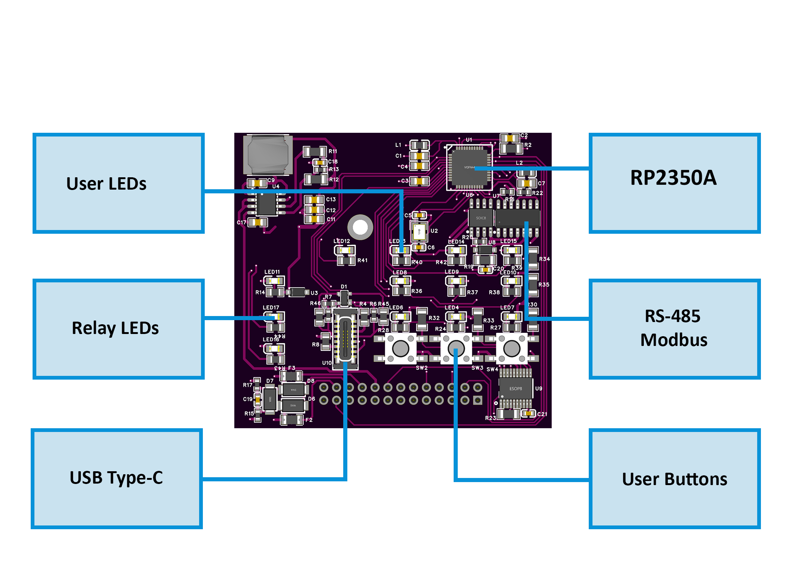
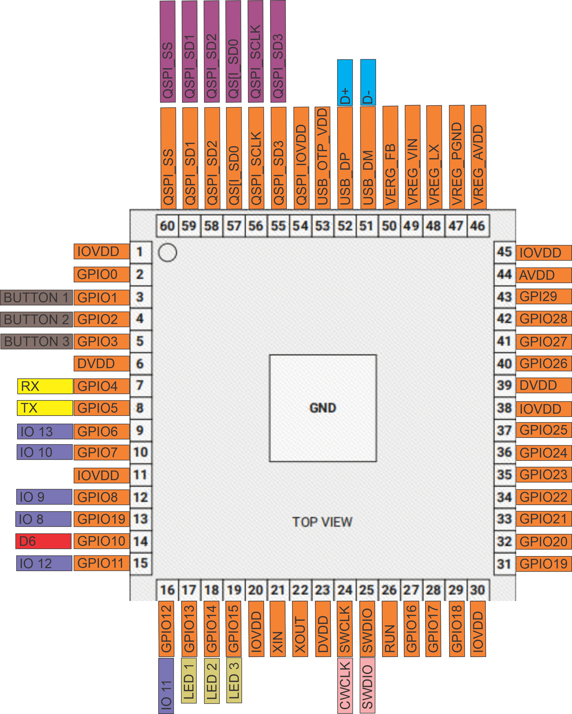
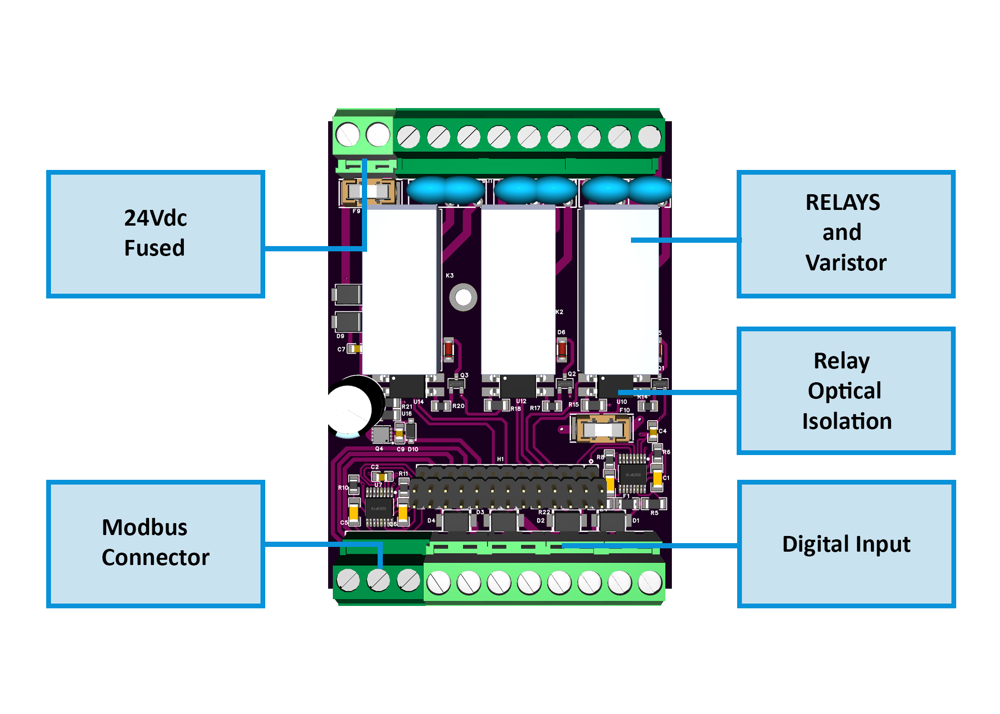

# 🚧 Project Status: Under Active Development & Testing

> **Important Notice:** This documentation, hardware designs, and firmware are for the **pre-release version** of the HomeMaster system. All information is preliminary and may contain errors or be subject to change.
>
> - **Hardware:** Modules are currently in the prototyping and testing phase. Final production versions may differ.
> - **Firmware:** Firmware is under active development and is considered **beta**. Features, configurations, and stability are being refined.
>
> Please use this information for evaluation and development purposes only. Check the [Releases page](../../releases) for the latest stable versions and updates.

---
# 📘 DIO-430-R1 – 3-Relay, 4-Digital Input, Configurable I/O Module  

The **DIO-430-R1** is a smart RS-485 Modbus RTU I/O module with:  
- **3 Relays**  
- **4 Isolated Digital Inputs**  
- **3 User Buttons**  
- **3 User LEDs**  

It features a **Web Config Tool** for easy configuration of Modbus parameters, I/O behavior, LED logic, and more — without programming.  
Fully compatible with **HomeMaster MicroPLC** and **MiniPLC** controllers, as well as **Home Assistant** via ESPHome.  

---

## 📎 Useful Links
- 🌐 **Web Config Tool:** [Open Online Tool](https://www.home-master.eu/configtool-dio-430-r1)  
- 💾 **Firmware & Source:**  
  - [DIO-430-R1_Default_Firmware.uf2](https://github.com/isystemsautomation/HOMEMASTER/tree/main/DIO-430-R1/Firmware/default_DIO_430_R1/build/rp2040.rp2040.generic_rp2350) – Default firmware with Web Config Tool support  
  - [default_DIO_430_R1.ino](https://github.com/isystemsautomation/HOMEMASTER/blob/main/DIO-430-R1/Firmware/default_DIO_430_R1/default_DIO_430_R1.ino) – Arduino IDE source  
  - [ConfigToolPage.html](https://github.com/isystemsautomation/HOMEMASTER/blob/main/DIO-430-R1/Firmware/ConfigToolPage.html) – Config Tool HTML/JS source  
- 📐 **Hardware Schematics:**  
  - [DIO-430-R1 Field Board PDF](https://github.com/isystemsautomation/HOMEMASTER/blob/main/DIO-430-R1/Schematics/DIO-430-R1-FieldBoard.pdf)  
  - [DIO-430-R1 MCU Board PDF](https://github.com/isystemsautomation/HOMEMASTER/blob/main/DIO-430-R1/Schematics/DIO-430-R1-MCUBoard.pdf)  

---

## 📑 Table of Contents
1. [Key Features](#-key-features)  
2. [Quick Start Guide](#-quick-start-guide)  
3. [Module Diagrams](#-module-diagrams)  
4. [Web Config Tool](#-web-config-tool)  
5. [Firmware Downloads & Source](#-firmware-downloads--source)  
6. [Firmware & Module Guide](#-firmware--module-guide)  
   - [Overview](#overview)  
   - [Features](#features)  
   - [Hardware & Pinout](#hardware--pinout)  
   - [Power-Up & Defaults](#power-up--defaults)  
   - [Button Shortcuts](#-button-shortcuts)  
   - [Connect to the Module (Web Serial)](#connect-to-the-module-web-serial)  
   - [Web Config UI — Panels & Fields](#web-config-ui--panels--fields)  
   - [I/O Logic & Modes](#io-logic--modes)  
   - [Modbus RTU Mapping](#modbus-rtu-mapping)  
   - [Save/Load/Factory/Reset](#saveloadfactoryreset)  
   - [Persistence (LittleFS) Details](#persistence-littlefs-details)  
   - [Quick Recipes](#quick-recipes)  
   - [Troubleshooting](#troubleshooting)  
   - [Build & Flash Notes](#build--flash-notes)  
   - [Appendix — Persisted Struct & CRC](#appendix--persisted-struct--crc)  
7. [Open Source & Re-Programming](#-open-source--re-programming)  
8. [License](#-license)  

---

## ⚙️ Key Features
- **3 × SPDT Relays (NO/NC)** – up to 16 A load, manual or remote control, pulse/toggle operation  
- **4 × Isolated Digital Inputs** – 24 VDC, configurable action & target (None, All, Relay 1–3)  
- **3 × User Buttons** – assignable to relay overrides and special boot/reset functions  
- **3 × User LEDs** – configurable mode (steady/blink) and activation source (None / Relay 1–3 state)  
- **RS-485 Modbus RTU** – configurable address (1–255), baud rate (9600–115200)  
- **USB-C Port** – firmware updates & Web Serial configuration  
- **Persistent Storage** – saves settings to internal flash (LittleFS)  
- **Open Firmware** – Arduino IDE compatible  

---

## 🚀 Quick Start Guide

### 1. Powering the Module
- Input: **24 VDC**, fused.  
- Power status LEDs are on..  

### 2. First Connection
- Connect via **USB-C** to your PC.  
- Open [Web Config Tool](https://www.home-master.eu/configtool-dio-430-r1) in Chrome/Edge/Opera.  
- Click **Connect** → select the Com port with RP2350.  

### 3. Configure  
- Adjust Modbus address/baud, relay modes, DI actions, LED logic.  
- Changes apply instantly and are auto-saved.  

### 4. Wiring Notes
- **Relays:** SPDT, 16 A max. Supports AC/DC loads.  
- **Digital Inputs:** 24 VDC, sourcing inputs, isolated.  
- **RS-485:** A/B lines → Modbus bus; ensure common GND-"COM" terminal.  

---

## 📐 Module Diagrams  

### Control Board  
  

### MCU Pinout (RP2350A)  
  

### Block Diagram  
  

### Relay Board  
  

---

## 🌐 Web Config Tool  

The **Web Config Tool** runs in your browser via the Web Serial API.  
No drivers or special software needed.  

**You can configure:**  
- Modbus: address, baud rate  
- Digital Inputs: enable, invert, toggle, pulse, mapping  
- Relays: enable, invert  
- Buttons: none / relay overrides  
- LEDs: steady/blink, source  
- Live status + serial logs  

📎 [Open Web Config Tool](https://www.home-master.eu/configtool-dio-430-r1)  

---

## 💾 Firmware Downloads & Source  

| File | Description |
|------|-------------|
| [`DIO-430-R1_Default_Firmware.uf2`](https://github.com/isystemsautomation/HOMEMASTER/tree/main/DIO-430-R1/Firmware/default_DIO_430_R1/build/rp2040.rp2040.generic_rp2350) | Default firmware with Web Config Tool |
| [`default_DIO_430_R1.ino`](https://github.com/isystemsautomation/HOMEMASTER/blob/main/DIO-430-R1/Firmware/default_DIO_430_R1/default_DIO_430_R1.ino) | Arduino IDE source |
| [`ConfigToolPage.html`](https://github.com/isystemsautomation/HOMEMASTER/blob/main/DIO-430-R1/Firmware/ConfigToolPage.html) | Config Tool HTML/JS |

---

# DIO-430-R1 — Firmware & Module Guide  

**MCU:** RP2350A | **I/O:** 4× DI, 3× Relays, 3× Buttons, 3× LEDs  
**Interfaces:** RS-485/Modbus RTU (UART2), USB Web Serial  
**Persistence:** LittleFS (`/cfg.bin`) with CRC-protected structure  

---

## Overview
Compact DIN-rail ready I/O expansion module.  
Can be configured via **USB/Web Serial** and controlled via **RS-485 Modbus RTU**.  

---

## Features
- Configurable relays, inputs, buttons, LEDs  
- RS-485: persisted baud/address  
- **Auto-save** after 1.5 s inactivity  
- **LittleFS** persistence with CRC guard  
- Status via Web Serial  

---

## Hardware & Pinout  

| Block | Count | MCU GPIO | Notes |
|-------|------:|----------|-------|
| Digital Inputs | 4 | 6, 11, 12, 7 | Active-HIGH; invertable |
| Relays | 3 | 10, 9, 8 | Active-HIGH drive; invertable |
| Buttons | 3 | 1, 2, 3 | Active-LOW; rising edge = press |
| User LEDs | 3 | 13, 14, 15 | Active-HIGH |
| RS-485 (UART2) | — | TX=4, RX=5 | No TXEN |

> ⚠️ Ensure proper RS-485 A/B wiring, termination, and common GND.  

---

## 🔘 Button Shortcuts
- **Button1 + Button2** → Reset the module  
- **Button2 + Button3** → Bootloader mode  
- **Button1 + Button2 + Button3 (release Button1)** → Enter **firmware load mode**  

---

## Power-Up & Defaults
On boot:  
1. Initialize GPIO (relays/LEDs OFF).  
2. Mount **LittleFS**, load `/cfg.bin`.  
   - If invalid: reset to factory defaults, save new file.  
3. Start Modbus RTU with persisted settings.  

**Factory defaults**:  
- Modbus: Address=3, Baud=19200  
- DIs: Enabled, Action=None, Target=All  
- Relays: Enabled, OFF  
- Buttons: None  
- LEDs: Steady, None  

---

## Connect to the Module (Web Serial)  

### Requirements
- Chrome/Edge (desktop)  
- Web Config Tool HTML  

### Steps
1. Open config tool.  
2. Connect port.  
3. See serial log (“Boot OK”, config loaded).  
4. Adjust settings.  
5. Save/reboot if needed.  

---

## Web Config UI — Panels & Fields  
- **Modbus:** address, baud  
- **Inputs:** enable, invert, toggle, pulse, target  
- **Relays:** enable, invert  
- **Buttons:** none / relay overrides  
- **LEDs:** steady, blink, source  

---

## I/O Logic & Modes  
- Inputs → Relays: Toggle or Pulse  
- Buttons → Relay override  
- Relays latched, invertable  
- LEDs follow relay logic (steady/blink)  

---

## Modbus RTU Mapping  
**Discrete Inputs (FC=02):**  
- 1–4 → DI states  
- 60–62 → Relay states  
- 90–92 → LED states  

**Coils (FC=05/15):**  
- 200–202 → Relay ON  
- 210–212 → Relay OFF  
- 300–303 → Enable DI  
- 320–323 → Disable DI  

---

## Save/Load/Factory/Reset  
- Auto-save after 1.5s idle  
- Web commands:  
  - `save` → force save  
  - `load` → reload config  
  - `factory` → reset defaults  
  - `reset` → save + reboot  

---

## Persistence (LittleFS) Details  
- Config stored in `/cfg.bin` with header + CRC  
- If invalid: reset → defaults → save → retry  
- Logged via Web Serial  

---

## Quick Recipes  
- Maintained switch toggles Relay 1 → INx: Toggle, Target=Relay1  
- Push-button toggles Relay 2 → INx: Pulse, Target=Relay2  
- Button 3 toggles Relay 3 → Override Relay 3  
- LED blinks when Relay 2 ON → LED Mode=Blink, Source=Relay2  
- Force Relay 1 ON → Coil 200=TRUE  

---

## Troubleshooting  
- **Save failed:** check LittleFS partition in Arduino IDE  
- **Not detected:** Chrome/Edge/Opera, reconnect  
- **No Modbus:** check address/baud, A/B wiring  
- **Relays not switching:** ensure enabled, check inversion  
- **DI/Buttons not reacting:** confirm enabled + edge logic  

---

## Build & Flash Notes  
- MCU: RP2350A  
- Arduino IDE / PlatformIO supported  
- Must enable **LittleFS partition**  
- Flash via USB-C (UF2 drag-drop) or bootloader  
- Required libs: `ModbusSerial`, `SimpleWebSerial`, `Arduino_JSON`  

---

## Appendix — Persisted Struct & CRC  

```c
typedef struct __attribute__((packed)) {
  uint32_t magic;       // 0x314D4C41 ('ALM1')
  uint16_t version;     // 0x0007
  uint16_t size;        // sizeof(PersistConfig)
  InCfg    diCfg[4];
  RlyCfg   rlyCfg[3];
  LedCfg   ledCfg[3];
  BtnCfg   btnCfg[3];
  bool     desiredRelay[3];
  uint8_t  mb_address;
  uint32_t mb_baud;
  uint32_t crc32;       // CRC32 of struct with this field = 0
} PersistConfig;


## 🛠 Open Source & Re-Programming  
- Reprogrammable in Arduino, PlatformIO, MicroPython  
- Firmware and hardware: **Open Source**  

---

## 📄 License  
- **Hardware:** CERN-OHL-W 2.0  
- **Firmware:** GNU GPLv3  

---

> 🔧 **HOMEMASTER – Modular control. Custom logic.**
