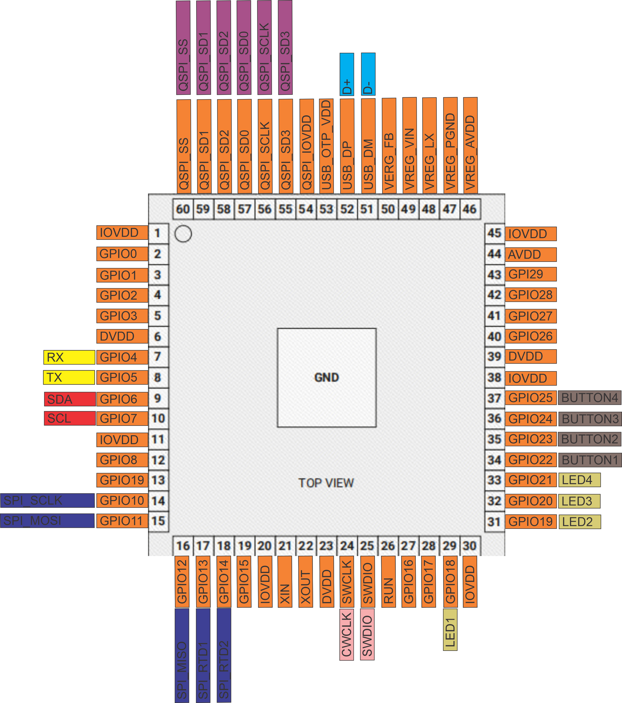
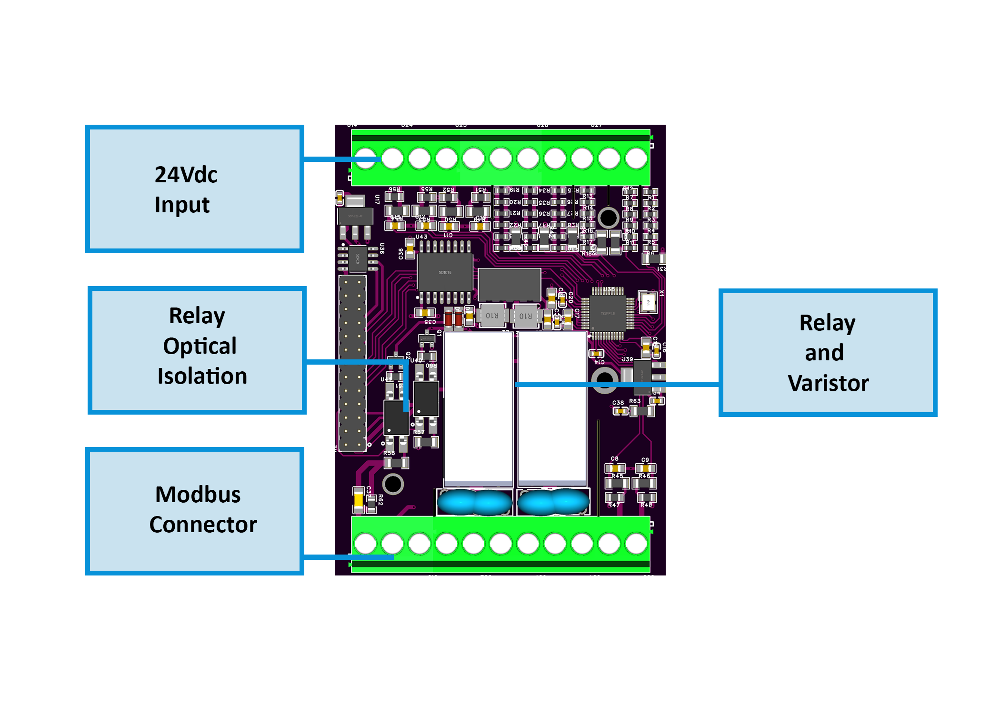
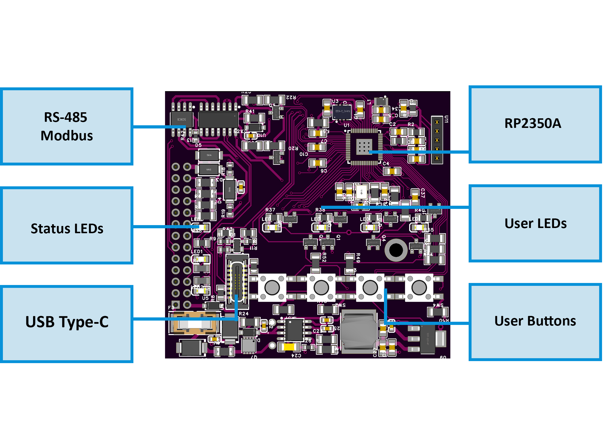
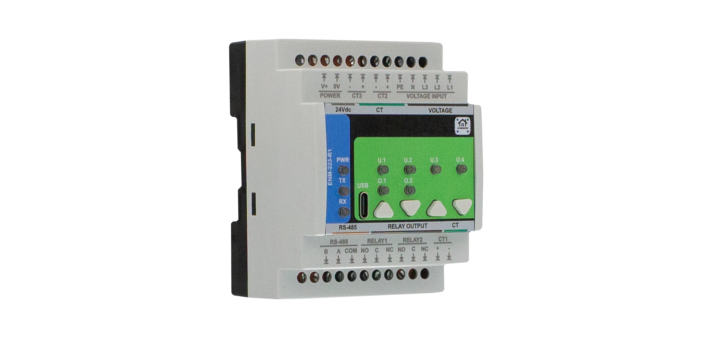
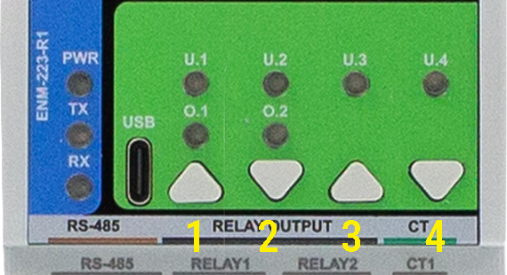

# ENM-223-R1 — 3‑Phase Power Quality & Energy Metering Module

**HOMEMASTER – Modular control. Custom logic.**


The **ENM‑223‑R1** is a high‑precision, compact metering module designed for seamless integration with **HomeMaster MicroPLC** and **MiniPLC** systems. It provides real‑time monitoring of 3‑phase electrical parameters, supports load control with **2× SPDT relays**, and is ideal for energy management, automation, and smart‑building applications.

<br clear="left"/>

## 📑 Table of Contents

### 1. [Introduction](#1-introduction)
- [1.1 Overview of the HOMEMASTER Ecosystem](#11-overview-of-the-homemaster-ecosystem)  
- [1.2 Supported Modules & Controllers](#12-supported-modules--controllers)  
- [1.3 Use Cases](#13-use-cases)  

### 2. [Safety Information](#2-safety-information)
- [2.1 General Electrical Safety](#21-general-electrical-safety)  
- [2.2 Handling & Installation](#22-handling--installation)  
- [2.3 Device-Specific Warnings](#23-device-specific-warnings)  

### 3. [System Overview](#3-system-overview)
- [3.1 Architecture & Modular Design](#31-architecture--modular-design)  
- [3.2 MicroPLC vs MiniPLC](#32-microplc-vs-miniplc)  
- [3.3 Integration with Home Assistant](#33-integration-with-home-assistant)  
- [3.4 Diagrams & Pinouts](#34-diagrams--pinouts)  
- [3.5 Technical Specifications](#35-technical-specifications)  

### 4. [Getting Started](#4-getting-started)
- [4.1 What You Need](#41-what-you-need)  
- [4.2 Quick Setup Checklist](#42-quick-setup-checklist)  

### 5. [Powering the Devices](#5-powering-the-devices)
- [5.1 Power Supply Types](#51-power-supply-types)  
- [5.2 Current Consumption](#52-current-consumption)  
- [5.3 Power Safety Tips](#53-power-safety-tips)  

### 6. [Networking & Communication](#6-networking--communication)
- [6.1 RS-485 Modbus](#61-rs-485-modbus)  
- [6.2 USB-C Configuration](#62-usb-c-configuration)  

### 7. [Installation & Wiring](#7-installation--wiring)
- [7.1 ENM-223-R1 Wiring](#71-enm-223-r1-wiring)  

### 8. [Software Configuration](#8-software-configuration)
- [8.1 Web Config Tool (USB Web Serial)](#81-web-config-tool-usb-web-serial)  
- [8.2 ESPHome / Home Assistant](#82-esphome--home-assistant)  
- [8.3 Meter Options & Calibration](#83-meter-options--calibration)  
- [8.4 Alarms](#84-alarms)  
- [8.5 Relays & Overrides](#85-relays--overrides)  
- [8.6 Buttons](#86-buttons)  
- [8.7 User LEDs, Energies & Live Meter](#87-user-leds-energies--live-meter)  

### 9. [Modbus RTU Communication](#9-modbus-rtu-communication)
- [9.1 Basics & Function Codes](#91-basics--function-codes)  
- [9.2 Register Map (Summary)](#92-register-map-summary)  
- [9.3 Override Priority](#93-override-priority)  

### 10. [Programming & Customization](#10-programming--customization)
- [10.1 Supported Languages](#101-supported-languages)  
- [10.2 Flashing via USB-C](#102-flashing-via-usb-c)  
- [10.3 PlatformIO & Arduino](#103-platformio--arduino)  

### 11. [Maintenance & Troubleshooting](#11-maintenance--troubleshooting)  
### 12. [Open Source & Licensing](#12-open-source--licensing)  
### 13. [Downloads](#13-downloads)  
### 14. [Support & Contact](#14-support--contact)
## 1. Introduction

The **ENM‑223‑R1** is a compact, high‑precision **3‑phase power quality & energy metering module** built around the **ATM90E32AS** metering IC. It integrates neatly with **HOMEMASTER MicroPLC** and **MiniPLC** controllers for real‑time monitoring, automation, and energy optimization.

### Overview of the HOMEMASTER Ecosystem
HOMEMASTER provides modular DIN‑rail controllers and I/O modules that interconnect via RS‑485 and 24 V DC. The ENM‑223‑R1 adds detailed power analytics and two relays for on‑board control.

### Supported Modules & Controllers
- **Controllers:** MicroPLC, MiniPLC
- **Companion I/O:** DIO, DIM, AIO, ALM series

### Use Cases
- Sub‑metering for tenants/circuits
- Power monitoring in data centers/industrial panels
- Load shedding & demand response (via relays)
- Preventive maintenance via power‑quality KPIs

---

## 2. Safety Information

### General Electrical Safety
- Installation and service by qualified personnel only.
- De‑energize equipment and follow lockout/tagout procedures.
- Treat all terminals as **live** until verified safe.

### Handling & Installation
- Mount on **35 mm DIN rail** in a suitable enclosure.
- Separate low‑voltage wiring from mains where possible.
- Use ferrules; torque terminals to spec.

### Device-Specific Warnings
- Connect **PE** (protective earth) and **N** (neutral) per wiring diagrams. Proper PE bonding improves safety and measurement stability.
- Use **split‑core CTs** with **1 V or 333 mV RMS** secondary (or intermediate CTs). **Do not** connect 5 A secondary CTs directly.
- Ensure **CT orientation** (arrow → **load**). If reversed, either flip the CT or enable **Invert** in configuration.

---

## 3. System Overview


### 3.4 Diagrams & Pinouts

<div align="center">
  <table>
    <tr>
      <td align="center">
        <strong>ENM System Diagram</strong><br>
        
      </td>
      <td align="center">
        <strong>RP2350 MCU Pinout</strong><br>
        
      </td>
    </tr>
    <tr>
      <td align="center">
        <strong>Field Board Layout</strong><br>
        
      </td>
      <td align="center">
        <strong>MCU Board Layout</strong><br>
        
      </td>
    </tr>
  </table>
</div>

### 3.4.1 Hardware Architecture Description

#### MCU Board

- **Processor:** RP2040 (RP2350A) with onboard QSPI Flash (W25Q32)
- **Interfaces:** USB‑C with ESD protection, RS‑485 via MAX485
- **Digital IOs:** 4× buttons (GPIO22–25), 4× LEDs (GPIO18–21)
- **Peripherals:** SPI and I²C routed to FieldBoard; connected to ATM90E32AS and FRAM
- **Other:** SWD debug header, logic-level signal protection

#### Field Board

- **Metering IC:** ATM90E32AS (3× Voltage, 3× Current)
- **Current Inputs:** CT terminals IAP/IAN, IBP/IBN, ICP/ICN with burden + anti-aliasing filters
- **Voltage Inputs:** Divider networks on L1/L2/L3 (220kΩ)
- **Isolation:** ISO7761 isolators between MCU and analog domain
- **Relays:** 2× SPDT relays (HF115F), opto-driven (SFH6156), with snubbers
- **FRAM:** FM24CL16B (2kB, I²C)
- **Power:** 24 V DC input → 5 V (buck) → 3.3 V (LDO); isolation via B0505S‑1WR3
- **Protections:** TVS, PTC, ferrites on all exposed ports

#### Interconnects

| Signal       | Description                            |
|--------------|----------------------------------------|
| SPI/I²C      | ATM90E32 + FRAM on shared bus          |
| GPIO         | For LEDs, Buttons, Relays              |
| RS-485       | Full duplex with A/B/GND wiring        |
| CTs & Ux     | Metering inputs, isolated              |
| Terminals    | L1/L2/L3, PE/N, V+/GND, CT1/2/3, A/B   |
### 3.4.2 Front View of ENM‑223‑R1

<div align="center">
  <table>
    <tr>
      <td align="center">
        <strong>Front View</strong><br>
        
      </td>
      <td align="center">
        <strong>Angled View (Left)</strong><br>
        
      </td>
    </tr>
  </table>
</div>

The ENM‑223‑R1 module is housed in a compact DIN-rail mountable enclosure with clearly labeled terminal blocks and an interactive front interface.

#### 🔍 Key Features Visible

- **USB-C Port**: Located at the bottom left, used for WebSerial configuration and firmware flashing.
- **LED Indicators**: PWR, TX, RX — for power and RS‑485 activity.
- **Buttons**: Four tactile push-buttons for relay control, LED override, and user-defined actions.
- **Relay Status LEDs**: Dual status indicators above buttons for R1 and R2.
- **Terminal Blocks**:
  - **Top row**: 24 V DC power input, CT1/2/3 terminals, and voltage inputs (PE, N, L1, L2, L3).
  - **Bottom row**: RS‑485 (A/B/COM), Relay 1 and 2 outputs (NO/NC/COM), and CT1 input.

This layout enables direct field wiring, interactive diagnostics, and ease of integration into HomeMaster‑based systems.

### 3.5 Technical Specifications

| Parameter                | Value                        |
|-------------------------|------------------------------|
| Processor               | RP2040 (RP2350A package)     |
| Metering IC             | ATM90E32AS                   |
| Voltage Inputs          | 3-phase, direct connect      |
| Current Inputs          | External CTs (333 mV or 1 V) |
| Relay Outputs           | 2x SPDT (NO/NC), 5A rated     |
| Communication           | RS-485 (Modbus RTU), USB-C   |
| Buttons                 | 4 Tactile Inputs (GPIO 22–25)|
| LEDs                    | 4 User LEDs (GPIO 18–21)     |
| Storage                 | LittleFS on internal flash   |
| Mounting                | DIN rail or custom enclosure |


### Architecture & Modular Design
- **Metering IC:** ATM90E32AS (3×U, 3×I)
- **Measurements:** Urms/Upeak, Irms/Ipeak, P/Q/S/N, PF, phase angle, frequency (per phase & totals)
- **Control:** 2 × SPDT relays (NO/NC)
- **Indicators:** Status LED(s); CF pulse LED (1000 pulses = 1 kWh)

### MicroPLC vs MiniPLC
- **MicroPLC:** Higher I/O density, RS‑485 master, rule engine—ideal for multi‑module racks.  
- **MiniPLC:** Compact controller—suitable for smaller panels.

### Integration with Home Assistant
Connect ENM‑223‑R1 to a MicroPLC/MiniPLC that exposes data to Home Assistant (Modbus/ESPHome). Create automations using real‑time energy metrics and events.

---

## 4. Getting Started

### What You Need
- ENM‑223‑R1 module
- 24 V DC power supply
- RS‑485 wiring (A/B; shared **GND** recommended if separate PSUs)
- 3 split‑core CTs (1 V or 333 mV)
- DIN enclosure, **PE** and **N** available
- USB‑C cable (for config/firmware)

### Quick Setup Checklist
1. Mount ENM‑223‑R1 on DIN rail.  
2. Wire **PE** and **N** (high‑voltage block).  
3. Wire **L1/L2/L3** (through appropriate fuses/breakers).  
4. Install CTs on phase conductors (arrows → load) and land secondaries on CT inputs (+/−).  
5. Power interface side with **24 V DC** (**V+**, **GND**).  
6. Connect **RS‑485 A/B**; tie **GNDs** if devices use different supplies.  
7. Set Modbus address & baud (USB‑C config).  
8. Verify readings and **phase mapping**; correct CT inversion if needed.

---

## 5. Powering the Devices

### Power Supply Types
- **Interface power:** 24 V DC to **V+/GND**.  
- **Measurement side:** derived from phase inputs; energy counters are retained across power cycles.

### Current Consumption
- Typical interface power < **1 W** (planning figure).

### Power Safety Tips
- Always connect **PE**. Without PE, fault conditions can induce dangerous potentials on CT wiring.  
- Use separate breakers for measurement voltage taps.

---

## 6. Networking & Communication

### RS-485 Modbus
- **Default:** `9600 8N2` (configurable).  
- **Address range:** 1–247.  
- Standard Modbus RTU function codes supported for input/holding registers; relays via coils/registers.

### USB-C Configuration
Use USB‑C for initial configuration, firmware updates, and diagnostics via the **Web Serial Config Tool**.

---

## 7. Installation & Wiring

### ENM-223-R1 Wiring
- **Phases:** Connect **L1, L2, L3, N, PE** in the correct order.  
- **Single‑phase use:** Populate **L1** only; tie unused **Lx** to **N** to avoid induced phantom readings.  
- **CT leads:** Keep short or use shielded cable; observe CT loop resistance limits.  
- **Verification:** With ~100 W per phase, check PF/angles (≈ −40°…+40° for resistive loads). If angles are large or **P < 0**, remap phases or invert CTs.

---

## 8. Software & UI Configuration

### Web Config Tool (USB Web Serial)
The included **Config Tool** (HTML) communicates over Web Serial in Chromium‑based browsers. It lets you:
- Read live measurements  
- Set **Modbus address/baud**  
- Configure **phase mapping** (assign Ux to Ix)  
- Enter **CT parameters** (turns/ratio, phase shift), **Invert** flags  
- Test **relay outputs** and LEDs

> Open `tools/ConfigToolPage.html` (or serve it locally), connect via USB‑C, choose the ENM serial port, and follow the on‑screen steps.

### ESPHome/Home Assistant
Expose ENM registers via your controller (ESPHome/Modbus). Create sensors for **Urms, Irms, P, PF, Frequency, Energy** and switches for **Relay 1/2**.

---

> This section is generated for the **ENM‑223‑R1 (2025‑09 firmware snapshot)** and documents what you see in the included **Web Serial Config UI** and what the firmware actually does behind the scenes.

### Meter Options & Calibration
**Where in UI:** *Meter Options* and *Calibration (Phase A/B/C)* cards.  
**Firmware:** pushed every 1 s via `MeterOptions`/`CalibCfg` messages; persisted to **LittleFS** with CRC32.

#### Meter Options
- **Line Frequency (Hz)** — `50` or `60` → applies to ATM90E32 `MMode0` and protection thresholds.  
- **Sum Mode** *(0=algorithmic, 1=absolute)* — affects totalization inside the metering IC.  
- **Ucal (gain)** — base voltage gain used for sag threshold/voltage scaling.  
- **Sample Interval (ms)** — main sampling/publish period (10…5000 ms).  
**How to change:** Edit a field and press **Enter**. The field shows an "editing…" badge and is *locked* until you press Enter or Esc.  
**Persistence:** Changes are auto‑saved ~1.2 s after the last touch. Re‑initialization of the chip occurs automatically when needed (line freq / sum mode changes).

#### Calibration (per phase A/B/C)
- **Ugain/Igain** — 16‑bit unsigned (0…65535).  
- **Uoffset/Ioffset** — 16‑bit signed (−32768…32767).  
**Workflow:** Enter values for each phase and press **Enter** → firmware writes to the ATM90E32 (`UgainX/IgainX/UoffsetX/IoffsetX`) under config‑access, then exits config mode and saves to flash.

> Tip: Perform calibration with stable loads. Verify PF and angles after applying calibration.

### Alarms
**Where in UI:** *Alarms (L1, L2, L3, Totals)* grid. Each channel has **Alarm**, **Warning**, **Event** rows and an **Ack required** toggle.  
**Firmware:** `AlarmsCfg` (config), `AlarmsState` (runtime). Evaluated against integer engineering units, not raw counts.

#### Metrics & Units
Choose a **Metric** per rule (drop‑down), and enter **min/max** thresholds in the indicated units:
- `Voltage (Urms)` — **0.01 V** units (e.g., 230.00 V → enter 23000)  
- `Current (Irms)` — **0.001 A** units (e.g., 5.000 A → 5000)  
- `Active power P` — **W**  
- `Reactive power Q` — **var** (sign follows phase angle)  
- `Apparent power S` — **VA**  
- `Frequency` — **0.01 Hz** units (e.g., 50.00 Hz → 5000; channel selection is ignored)

**Enable** a rule to make it effective. When **Ack required** is enabled for a channel, an out‑of‑band condition **latches** until acknowledged; otherwise it auto‑clears when back in range.

**Acknowledge:** Click **Ack [channel]** or use **Ack All** in the UI. Over Modbus, coils `610..613` acknowledge channels L1/L2/L3/Totals.

### Relays & Overrides
**Where in UI:** *Relays (2)*.  
**Firmware:** `RelaysCfg` (config) and `RelaysSet` (actions). Two logical layers protect the outputs: **Mode** and **Button Override**.

- **Enabled at power‑on** (per relay) — default state after boot.  
- **Inverted (active‑low)** — single polarity setting that applies to **both relays** in hardware.  
- **Mode:**  
  - **None** — firmware ignores external writes; relay stays at its internal state/defaults.  
  - **Modbus Controlled** — coil writes (`600` for R1, `601` for R2) are honored **unless** an override is active.  
  - **Alarm Controlled** — relay follows selected **Channel** (L1/L2/L3/Totals) and **Kinds** (Alarm/Warning/Event bit‑mask). Direct writes are **blocked** in this mode.
- **Toggle button** in UI sends `RelaysSet { idx, toggle:true }` (honored only if Mode ≠ Alarm and no override).

**Override with Button (per‑relay):**  
Assign a button action **“Override Relay 1 (hold 3s)”** or **“… Relay 2 (hold 3s)”**.  
- **Hold 3 s** → enters/leaves override mode for that relay (captures current state).  
- While in override, **short‑press** of the same button toggles the relay state.  
- Exiting override hands control back to **Modbus** / **Alarm** according to the configured **Mode**.

### Buttons
**Where in UI:** *Buttons (4)*.  
**Hardware:** GPIO22…25, debounced in firmware; long‑press threshold = **3 s**.  
**Actions:**  
`0 None` • `1 Toggle R1` • `2 Toggle R2` • `3 Toggle LED1` • `4 Toggle LED2` • `5 Toggle LED3` • `6 Toggle LED4` • `7 Override R1 (hold 3s)` • `8 Override R2 (hold 3s)`

> **Boot/Reset Combinations:**  
> - **Buttons 1 + 2** → forces the module into **BOOT mode**   
> - **Buttons 3 + 4** → triggers a **hardware RESET**  
> These behaviors are handled **in hardware**  
> Use these combinations during firmware flashing or to restart the device manually.

📷 **Button Numbering Reference:**  
<p align="center">
  
</p>

### User LEDs
**Where in UI:** *User LEDs (4)*.  
- **Mode:** `Steady` or `Blink` *(when active)*.  
- **Source:** Select what drives each LED — override state indicators and alarm sources are available:  
  - `Override R1`, `Override R2`  
  - `Alarm/Warning/Event` for L1/L2/L3/Totals  
  - `Any (A|W|E)` for L1/L2/L3/Totals  
When the chosen **Source** is active, the LED is ON (or blinks if **Mode=Blink**). You can also toggle LEDs manually via **button actions 3–6**; manual toggles layer on top of source logic.

### Energies
**UI:** *Energies* cards show **k‑units** from the metering IC: per‑phase (A/B/C) and **Totals**:  
- **Active + (kWh)** import, **Active − (kWh)** export  
- **Reactive + (kvarh)** inductive, **Reactive − (kvarh)** capacitive  
- **Apparent (kVAh)**

**Modbus:** 32‑bit **Wh/varh/VAh** pairs (Hi/Lo words) for A/B/C/Totals. Values are derived from ATM90E32 counters using the firmware’s internal scaling factors and published at the main sampling rate.

### Live Meter
**UI:** *Live Meter* shows at 1 Hz (while connected):  
- **L1/L2/L3 cards:** `U (V)`, `I (A)`, `P (W)`, `Q (var)`, `S (VA)`, `PF`, `Angle (°)`  
- **Totals:** `P/Q/S`, `PF (tot)`, `Freq (Hz)`, `Temp (°C)`  
While you are typing in a field elsewhere, that field pauses auto‑refresh (field lock). The **Serial Log** captures every command and echo for traceability.

## 9. Modbus RTU Communication

**Slave ID:** Configurable (default `3`)  
**Baud Rate:** Configurable (default `19200`, 8N1)  
**Data Model:**  
- **Input Registers (3xxxx / FC04):** Real-time telemetry  
- **Holding Registers (4xxxx / FC03/06/16):** Runtime options  
- **Discrete Inputs (1xxxx / FC02):** Read-only flags  
- **Coils (0xxxx / FC01/05/15):** Output and ack control  

---

### 9.1 Input Registers (Read-Only)

| Addr | Type  | Description                    | Units | Scaling     |
|------|-------|--------------------------------|-------|-------------|
| 100  | U16   | Voltage L1                     | V     | ×0.01       |
| 101  | U16   | Voltage L2                     | V     | ×0.01       |
| 102  | U16   | Voltage L3                     | V     | ×0.01       |
| 110  | U16   | Current L1                     | A     | ×0.001      |
| 111  | U16   | Current L2                     | A     | ×0.001      |
| 112  | U16   | Current L3                     | A     | ×0.001      |
| 200–207 | S32 | Active Power L1–L3, Total     | W     | 1           |
| 210–217 | S32 | Reactive Power L1–L3, Total   | var   | 1           |
| 220–227 | S32 | Apparent Power L1–L3, Total   | VA    | 1           |
| 240–243 | S16 | Power Factor L1–L3, Total     | -     | ×0.001      |
| 244–246 | S16 | Phase Angle L1–L3             | °     | ×0.1        |
| 250  | U16   | Frequency                      | Hz    | ×0.01       |
| 251  | S16   | Temperature                    | °C    | 1           |

#### Energy Registers (Wh/varh/VAh, 32-bit pairs)

| Addr | Type  | Description            | Units | Scaling |
|------|-------|------------------------|--------|---------|
| 300–307 | U32 | Active Energy + (A/B/C/Total) | Wh | 1 |
| 308–315 | U32 | Active Energy − (A/B/C/Total) | Wh | 1 |
| 316–323 | U32 | Reactive Energy + (A/B/C/Total) | varh | 1 |
| 324–331 | U32 | Reactive Energy − (A/B/C/Total) | varh | 1 |
| 332–339 | U32 | Apparent Energy (A/B/C/Total) | VAh | 1 |

---

### 9.2 Holding Registers (Read/Write)

| Addr | Type | Description                | Range         |
|------|------|----------------------------|---------------|
| 400  | U16  | Sample Interval (ms)       | 10 – 5000     |
| 401  | U16  | Line Frequency             | 50 or 60      |
| 402  | U16  | Sum Mode                   | 0 = alg, 1 = abs |
| 403  | U16  | Ucal                       | 1 – 65535     |

---

### 9.3 Discrete Inputs & Coils

#### Discrete Inputs (Read-Only)

| Addr | Description                     |
|------|---------------------------------|
| 500–503 | LED States 1–4              |
| 520–523 | Button States 1–4           |
| 540–541 | Relay States 1–2            |
| 560–571 | Alarms (ch×3 + kind idx)    |

#### Coils (Writable)

| Addr | Description                     |
|------|---------------------------------|
| 600  | Relay 1 ON/OFF                  |
| 601  | Relay 2 ON/OFF                  |
| 610–613 | Ack alarms (L1, L2, L3, Tot) |

---

### Scaling Summary

- Voltage = `value / 100`
- Current = `value / 1000`
- Power Factor = `value / 1000`
- Frequency = `value / 100`
- Angle = `value / 10`
- Energy values are 32-bit unsigned (no multiplier)

---
### Basics & Function Codes
- **Physical:** RS‑485 half‑duplex, multi‑drop, termination at both ends.  
- **Function codes:** `0x03` Read Holding, `0x04` Read Input, `0x06` Write Single, `0x10` Write Multiple, `0x01/0x05/0x0F` for coils (if exposed).

### Register Map (Summary)
> Exact addresses depend on firmware build and will be published in `/docs/registers_enm_223_r1.md`.

- **Identification:** Model, FW version  
- **Comms:** Modbus address, baud, parity/stop  
- **Per Phase:** Urms, Upeak, Irms, Ipeak, P, Q, S, N, PF, PhaseAngle  
- **Totals:** P_total, Q_total, S_total, PF_total, Frequency  
- **Energies:** Active/Reactive/Apparent/Non‑active — Import/Export  
- **CT Config:** Turns_Lx, Phi_Lx, Invert_Lx  
- **Phase Mapping:** ActualPhase_Lx (map Ix ↔ Ux)  
- **Relays:** R1/R2 state, override, pulse width  
- **Diagnostics:** Status, alarms, counters

### Override Priority
1. Safety lock (if enabled)  
2. Manual override (front button)  
3. Modbus command  
4. PLC/HA automations

---


---

## 10. Programming & Customization

### Supported Languages
- **MicroPython** (pre‑installed)  
- **C/C++**  
- **Arduino IDE**

### Flashing via USB-C
1. Connect USB‑C.  
2. Enter boot/flash mode if required.  
3. Upload the provided firmware/source via your preferred toolchain.

### PlatformIO & Arduino
- Select the appropriate board profile.  
- Add ATM90E32 and Modbus libraries.  
- Match serial/RS‑485 settings to your network.

---

## 11. Diagrams & Pinouts

```
L1/L2/L3 → Attenuation → ATM90E32AS ← CT1/2/3
                          │
                          ├─ PLC/MCU ↔ RS‑485 (A/B/GND)
                          ├─ Relays (NO/COM/NC ×2)
                          └─ LEDs/Buttons
```

**Terminals**  
- Voltage: **PE, N, L1, L2, L3**  
- Interface: **V+, GND, A, B (RS‑485)**  
- CT: **CT1+/−, CT2+/−, CT3+/−** (white/red = **+**, black = **−**)

---

## 12. Maintenance & Troubleshooting

- **Negative active power:** CT reversed → flip or set *Invert*.  
- **Large phase angle (>100°):** CT on wrong phase → fix mapping.  
- **Phantom voltage on unused phases:** Tie unused **Lx** to **N** (single‑phase).  
- **RS‑485 timeouts/noise:** Check termination, biasing, common GND reference.

Reset & Factory Restore: write the reset register or use the button sequence (TBD). Energy counters are retained across power cycles.

---

## 13. Technical Specifications

| Parameter             | Value                              |
|----------------------|------------------------------------|
| Voltage Inputs       | 3‑phase, **85–265 VAC**            |
| Current Inputs       | External CTs (**1 V** or **333 mV** RMS) |
| Relay Outputs        | **2× SPDT (NO/NC)**, up to **5 A** |
| Communication        | **RS‑485 (Modbus RTU)**            |
| Programming          | MicroPython / C++ / Arduino IDE    |
| Power Supply         | **24 V DC** (interface)            |
| Mounting             | **DIN rail**                       |
| Accuracy             | Active **0.5S**, Reactive **1** (typ.) |
| Indicators           | Status, **CF** (1000 pulses = 1 kWh) |

> Measurement metrics include RMS & peak U/I; P, Q, S, N; PF; phase angles; frequency; per‑phase and totals.

---

## 14. Open Source & Licensing

- **Hardware:** **CERN‑OHL‑W 2.0**  
- **Firmware & code samples:** **GPLv3** (unless otherwise noted)

---

## 15. Downloads

The following key project resources are included in this repository:

- **🧠 Firmware (Arduino/PlatformIO):** [`firmware/default_enm_223_r1.ino`](firmware/default_enm_223_r1.ino)  
  Main sketch implementing ATM90E32 metering, relays, button overrides, alarms, Modbus RTU, and WebSerial support.

- **🛠 Web Config Tool:** [`tools/ConfigToolPage.html`](tools/ConfigToolPage.html)  
  HTML-based USB Web Serial configuration UI, used for meter options, calibration, relays, alarms, etc.

- **📷 Images & Visual Documentation:** [`Images/`](Images/)  
  Contains UI screenshots, module photos, diagrams, and layout references used in this documentation.

- **📐 Hardware Schematics:** [`Schematics/`](Schematics/)  
  Includes Field Board and MCU Board schematics in PDF format for hardware developers and integrators.

- **📖 Datasheet & Documentation (if available):** [`Manuals/`](Manuals/)  
  Contains PDF datasheets or technical overviews, if applicable.

## 16. Support & Contact

**ISYSTEMS AUTOMATION SRL**  
• GitHub Issues: use the Issues tab of this repo  
• Website: *TBD*

---

### Attribution
Parts of the best‑practice wiring, CT orientation, and phase mapping guidance are inspired by established industry practice for three‑phase sub‑metering devices.

