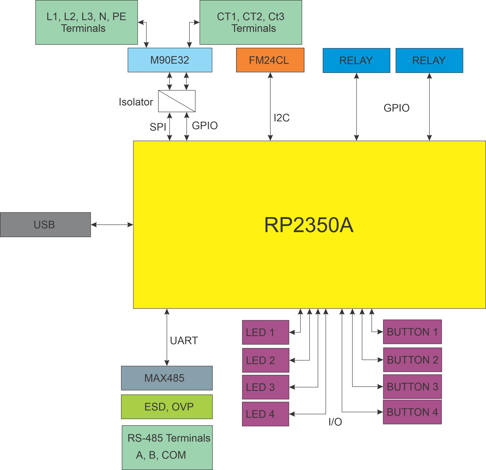

# ENM-223-R1 — 3‑Phase Power Quality & Energy Metering Module

**HOMEMASTER – Modular control. Custom logic.**

> **Config & Calibration:** Use the hosted Web Config Tool: https://www.home-master.eu/configtool-enm-223-r1  
> *(The local `tools/ConfigToolPage.html` is provided as source only.)*


The **ENM‑223‑R1** is a high‑precision, compact metering module designed for seamless integration with **HomeMaster MicroPLC** and **MiniPLC** systems. It provides real‑time monitoring of 3‑phase electrical parameters, supports load control with **2× SPDT relays**, and is ideal for energy management, automation, and smart‑building applications.

<br clear="left"/>

---

## 📑 Table of Contents

### 1. [Introduction](#1-introduction)
- [1.1 Overview of the HOMEMASTER Ecosystem](#11-overview-of-the-homemaster-ecosystem)
- [1.2 Supported Modules & Controllers](#12-supported-modules--controllers)
- [1.3 Use Cases](#13-use-cases)

### 2. [Safety Information](#2-safety-information)
- [2.1 General Electrical Safety](#21-general-electrical-safety)
- [2.2 Handling & Installation](#22-handling--installation)
- [2.3 Device-Specific Warnings](#23-device-specific-warnings)

### 3. [System Overview](#3-system-overview)
- [3.1 Architecture & Modular Design](#31-architecture--modular-design)
- [3.2 MicroPLC vs MiniPLC](#32-microplc-vs-miniplc)
- [3.3 Integration with Home Assistant](#33-integration-with-home-assistant)
- [3.4 Diagrams & Pinouts](#34-diagrams--pinouts)
- [3.5 Technical Specifications](#35-technical-specifications)

### 4. [Getting Started](#4-getting-started)
- [4.1 What You Need](#41-what-you-need)
- [4.2 Quick Setup Checklist](#42-quick-setup-checklist)

### 5. [Powering the Devices](#5-powering-the-devices)
- [5.1 Power Supply Types](#51-power-supply-types)
- [5.2 Current Consumption](#52-current-consumption)
- [5.3 Power Safety Tips](#53-power-safety-tips)

### 6. [Networking & Communication](#6-networking--communication)
- [6.1 RS‑485 Modbus](#61-rs-485-modbus)
- [6.2 USB‑C Configuration](#62-usb-c-configuration)

### 7. [Installation & Wiring](#7-installation--wiring)
- [7.1 ENM‑223‑R1 Wiring](#71-enm-223-r1-wiring)

### 8. [Software & UI Configuration](#8-software--ui-configuration)
- [8.1 Web Config Tool](#81-web-config-tool)
- [8.2 ESPHome / Home Assistant](#82-esphome--home-assistant)
- [8.3 Meter Options & Calibration](#83-meter-options--calibration)
- [8.4 Alarms](#84-alarms)
- [8.5 Relays & Overrides](#85-relays--overrides)
- [8.6 Buttons](#86-buttons)
- [8.7 User LEDs, Energies & Live Meter](#87-user-leds-energies--live-meter)

### 9. [Modbus RTU Communication](#9-modbus-rtu-communication)
- [9.1 Input Registers (Read‑Only)](#91-input-registers-read-only)
- [9.2 Holding Registers (Read/Write)](#92-holding-registers-readwrite)
- [9.3 Discrete Inputs & Coils](#93-discrete-inputs--coils)
- [9.4 Scaling Summary](#94-scaling-summary)
- [9.5 Basics & Function Codes](#95-basics--function-codes)
- [9.6 Register Map (Summary)](#96-register-map-summary)
- [9.7 Override Priority](#97-override-priority)

### 10. [Programming & Customization](#10-programming--customization)
- [10.1 Supported Languages](#101-supported-languages)
- [10.2 Flashing via USB‑C](#102-flashing-via-usb-c)
- [10.3 PlatformIO & Arduino](#103-platformio--arduino)

### 11. [Diagrams & Pinouts](#11-diagrams--pinouts)
### 12. [Maintenance & Troubleshooting](#12-maintenance--troubleshooting)
### 13. [Technical Specifications](#13-technical-specifications)
### 14. [Open Source & Licensing](#14-open-source--licensing)
### 15. [Downloads](#15-downloads)
### 16. [Support](#16-support)

---

## 1. Introduction

The **ENM‑223‑R1** is a compact, high‑precision **3‑phase power quality & energy metering module** built around the **ATM90E32AS** metering IC. It integrates neatly with **HOMEMASTER MicroPLC** and **MiniPLC** controllers for real‑time monitoring, automation, and energy optimization.

### 1.1 Overview of the HOMEMASTER Ecosystem
HOMEMASTER provides modular DIN‑rail controllers and I/O modules that interconnect via RS‑485 and 24 V DC. The ENM‑223‑R1 adds detailed power analytics and two relays for on‑board control.

### 1.2 Supported Modules & Controllers
- **Controllers:** MicroPLC, MiniPLC
- **Companion I/O:** DIO, DIM, AIO, ALM series

### 1.3 Use Cases
- Sub‑metering for tenants/circuits
- Power monitoring in data centers/industrial panels
- Load shedding & demand response (via relays)
- Preventive maintenance via power‑quality KPIs

---

## 2. Safety Information

### 2.1 General Electrical Safety
- Installation and service by qualified personnel only.
- De‑energize equipment and follow lockout/tagout procedures.
- Treat all terminals as **live** until verified safe.

### 2.2 Handling & Installation
- Mount on **35 mm DIN rail** in a suitable enclosure.
- Separate low‑voltage wiring from mains where possible.
- Use ferrules; torque terminals to spec.

### 2.3 Device-Specific Warnings
- Connect **PE** (protective earth) and **N** (neutral) per wiring diagrams. Proper PE bonding improves safety and measurement stability.
- Use **split‑core CTs** with **1 V or 333 mV RMS** secondary (or intermediate CTs). **Do not** connect 5 A secondary CTs directly.
- Ensure **CT orientation** (arrow → **load**). If reversed, either flip the CT or enable **Invert** in configuration.

---

## 3. System Overview

### 3.1 Architecture & Modular Design
- **Metering IC:** ATM90E32AS (3×U, 3×I)
- **Measurements:** Urms/Upeak, Irms/Ipeak, P/Q/S/N, PF, phase angle, frequency (per phase & totals)
- **Control:** 2 × SPDT relays (NO/NC)
- **Indicators:** Status LED(s); CF pulse LED (1000 pulses = 1 kWh)

### 3.2 MicroPLC vs MiniPLC
- **MicroPLC:** Higher I/O density, RS‑485 master, rule engine—ideal for multi‑module racks.
- **MiniPLC:** Compact controller—suitable for smaller panels.

### 3.3 Integration with Home Assistant
Connect ENM‑223‑R1 to a MicroPLC/MiniPLC that exposes data to Home Assistant (Modbus/ESPHome). Create automations using real‑time energy metrics and events.

### 3.4 Diagrams & Pinouts

<div align="center">
  <table>
    <tr>
      <td align="center">
        <strong>ENM System Diagram</strong><br>
        
      </td>
      <td align="center">
        <strong>RP2350 MCU Pinout</strong><br>
        
      </td>
    </tr>
    <tr>
      <td align="center">
        <strong>Field Board Layout</strong><br>
        
      </td>
      <td align="center">
        <strong>MCU Board Layout</strong><br>
        
      </td>
    </tr>
  </table>
</div>

### 3.5 Technical Specifications

| Parameter                | Value                                  |
|-------------------------|----------------------------------------|
| Processor               | RP2350 (RP2350A package)               |
| Metering IC             | ATM90E32AS                              |
| Voltage Inputs          | 3‑phase, direct connect                 |
| Current Inputs          | External CTs (333 mV or 1 V)           |
| Relay Outputs           | 2× SPDT (NO/NC), 5 A rated             |
| Communication           | RS‑485 (Modbus RTU), USB‑C             |
| Buttons                 | 4 Tactile Inputs (GPIO 22–25)          |
| LEDs                    | 4 User LEDs (GPIO 18–21)               |
| Storage                 | LittleFS on internal flash              |
| Mounting                | DIN rail or custom enclosure           |

> **Note:** RS‑485 is **half‑duplex** multi‑drop.

#### Front Views

<div align="center">
  <table>
    <tr>
      <td align="center">
        <strong>Front View</strong><br>
        
      </td>
      <td align="center">
        <strong>Angled View (Left)</strong><br>
        
      </td>
    </tr>
  </table>
</div>

---

## 4. Getting Started

### 4.1 What You Need
- ENM‑223‑R1 module
- 24 V DC power supply
- RS‑485 wiring (A/B; shared **GND** recommended if separate PSUs)
- 3 split‑core CTs (1 V or 333 mV)
- DIN enclosure, **PE** and **N** available
- USB‑C cable (for config/firmware)

### 4.2 Quick Setup Checklist
1. Mount ENM‑223‑R1 on DIN rail.
2. Wire **PE** and **N** (high‑voltage block).
3. Wire **L1/L2/L3** (through appropriate fuses/breakers).
4. Install CTs on phase conductors (arrows → load) and land secondaries on CT inputs (+/−).
5. Power interface side with **24 V DC** (**V+**, **GND**).
6. Connect **RS‑485 A/B**; tie **GNDs** if devices use different supplies.
7. Set Modbus address & baud (USB‑C config).
8. Verify readings and **phase mapping**; correct CT inversion if needed.

---

## 5. Powering the Devices

### 5.1 Power Supply Types
- **Interface power:** 24 V DC to **V+/GND**.
- **Measurement side:** derived from phase inputs; energy counters are retained across power cycles.

### 5.2 Current Consumption
- Typical interface power < **1 W** (planning figure).

### 5.3 Power Safety Tips
- Always connect **PE**. Without PE, fault conditions can induce dangerous potentials on CT wiring.
- Use separate breakers for measurement voltage taps.

---

## 6. Networking & Communication

### 6.1 RS‑485 Modbus
- **Default:** `19200 8N1` (configurable).
- **Address range:** 1–247.
- Standard Modbus RTU function codes supported for input/holding registers; relays via coils/registers.

### 6.2 USB‑C Configuration
Use USB‑C for initial configuration, firmware updates, and diagnostics via the **Web Config Tool**.

---

## 7. Installation & Wiring

### 7.1 ENM‑223‑R1 Wiring
- **Phases:** Connect **L1, L2, L3, N, PE** in the correct order.
- **Single‑phase use:** Populate **L1** only; tie unused **Lx** to **N** to avoid induced phantom readings.
- **CT leads:** Keep short or use shielded cable; observe CT loop resistance limits.
- **Verification:** With ~100 W per phase, check PF/angles (≈ −40°…+40° for resistive loads). If angles are large or **P < 0**, remap phases or invert CTs.

---

## 8. Software & UI Configuration

### 8.1 Web Config Tool
- Hosted tool: **https://www.home-master.eu/configtool-enm-223-r1**
- Local source (for reference): `tools/ConfigToolPage.html`

The Web Config Tool communicates over Web Serial in Chromium‑based browsers. It lets you:
- Read live measurements
- Set **Modbus address/baud**
- Configure **phase mapping** (assign Ux to Ix)
- Enter **CT parameters** (turns/ratio, phase shift), **Invert** flags
- Test **relay outputs** and LEDs

### 8.2 ESPHome / Home Assistant
Expose ENM registers via your controller (ESPHome/Modbus). Create sensors for **Urms, Irms, P, PF, Frequency, Energy** and switches for **Relay 1/2**.

> The following subsections reflect the **ENM‑223‑R1 (2025‑09 firmware snapshot)**.

### 8.3 Meter Options & Calibration
**Where in UI:** *Meter Options* and *Calibration (Phase A/B/C)* cards.  
**Firmware:** pushed every 1 s via `MeterOptions`/`CalibCfg`; persisted to **LittleFS** with CRC32.

**Meter Options**
- **Line Frequency (Hz)** — `50` or `60`.
- **Sum Mode** *(0=algorithmic, 1=absolute)* — affects totalization inside the metering IC.
- **Ucal (gain)** — base voltage gain.
- **Sample Interval (ms)** — 10…5000.

**Calibration (per phase A/B/C)**
- **Ugain/Igain** — 16‑bit unsigned.
- **Uoffset/Ioffset** — 16‑bit signed.

### 8.4 Alarms
- Configure **metric**, **min/max thresholds**, and **Ack required** per channel (L1/L2/L3/Totals).
- Acknowledge via UI or Modbus coils `610..613`.

### 8.5 Relays & Overrides
- **Modes:** *None*, *Modbus Controlled*, *Alarm Controlled*.
- **Button Override:** hold 3 s to enter/exit override; short‑press toggles while overridden.

### 8.6 Buttons
Actions: `None`, `Toggle R1/ R2`, `Toggle LED1..LED4`, `Override R1 (hold 3s)`, `Override R2 (hold 3s)`.

> **Boot/Reset Combinations (hardware):** **Buttons 1+2** → **BOOT mode**; **Buttons 3+4** → **hardware RESET**.  
> Button numbering reference:  
> <p align="center"></p>

### 8.7 User LEDs, Energies & Live Meter
- LED source can follow **Override R1/ R2** or **Alarm/Warning/Event** states.
- Energies: kWh/kvarh/kVAh for A/B/C/Totals (32‑bit pairs).
- Live Meter: phase cards (U, I, P, Q, S, PF, Angle), totals (P/Q/S, PF, Freq, Temp).

---

## 9. Modbus RTU Communication

**Slave ID:** Configurable (default `3`)  
**Baud Rate:** Configurable (default `19200`, 8N1)  
**Data Model:**  
- **Input Registers (3xxxx / FC04):** Real-time telemetry  
- **Holding Registers (4xxxx / FC03/06/16):** Runtime options  
- **Discrete Inputs (1xxxx / FC02):** Read-only flags  
- **Coils (0xxxx / FC01/05/15):** Output and ack control  

### 9.1 Input Registers (Read‑Only)

| Addr | Type  | Description                    | Units | Scaling     |
|------|-------|--------------------------------|-------|-------------|
| 100  | U16   | Voltage L1                     | V     | ×0.01       |
| 101  | U16   | Voltage L2                     | V     | ×0.01       |
| 102  | U16   | Voltage L3                     | V     | ×0.01       |
| 110  | U16   | Current L1                     | A     | ×0.001      |
| 111  | U16   | Current L2                     | A     | ×0.001      |
| 112  | U16   | Current L3                     | A     | ×0.001      |
| 200–207 | S32 | Active Power L1–L3, Total     | W     | 1           |
| 210–217 | S32 | Reactive Power L1–L3, Total   | var   | 1           |
| 220–227 | S32 | Apparent Power L1–L3, Total   | VA    | 1           |
| 240–243 | S16 | Power Factor L1–L3, Total     | –     | ×0.001      |
| 244–246 | S16 | Phase Angle L1–L3             | °     | ×0.1        |
| 250  | U16   | Frequency                      | Hz    | ×0.01       |
| 251  | S16   | Temperature                    | °C    | 1           |

**Energy Registers (Wh/varh/VAh, 32‑bit pairs)**

| Addr | Type  | Description                         | Units | Scaling |
|------|-------|-------------------------------------|-------|---------|
| 300–307 | U32 | Active Energy + (A/B/C/Total)      | Wh    | 1       |
| 308–315 | U32 | Active Energy − (A/B/C/Total)      | Wh    | 1       |
| 316–323 | U32 | Reactive Energy + (A/B/C/Total)    | varh  | 1       |
| 324–331 | U32 | Reactive Energy − (A/B/C/Total)    | varh  | 1       |
| 332–339 | U32 | Apparent Energy (A/B/C/Total)      | VAh   | 1       |

### 9.2 Holding Registers (Read/Write)

| Addr | Type | Description                | Range         |
|------|------|----------------------------|---------------|
| 400  | U16  | Sample Interval (ms)       | 10 – 5000     |
| 401  | U16  | Line Frequency             | 50 or 60      |
| 402  | U16  | Sum Mode                   | 0 = alg, 1 = abs |
| 403  | U16  | Ucal                       | 1 – 65535     |

### 9.3 Discrete Inputs & Coils

**Discrete Inputs (Read‑Only)**

| Addr | Description                  |
|------|------------------------------|
| 500–503 | LED States 1–4           |
| 520–523 | Button States 1–4        |
| 540–541 | Relay States 1–2         |
| 560–571 | Alarms (ch×3 + kind idx) |

**Coils (Writable)**

| Addr | Description                     |
|------|---------------------------------|
| 600  | Relay 1 ON/OFF                  |
| 601  | Relay 2 ON/OFF                  |
| 610–613 | Ack alarms (L1, L2, L3, Tot) |

### 9.4 Scaling Summary
- Voltage = `value / 100`
- Current = `value / 1000`
- Power Factor = `value / 1000`
- Frequency = `value / 100`
- Angle = `value / 10`
- Energy values are 32‑bit unsigned (no multiplier)

### 9.5 Basics & Function Codes
- **Physical:** RS‑485 half‑duplex, multi‑drop, termination at both ends.
- **Function codes:** `0x03` Read Holding, `0x04` Read Input, `0x06` Write Single, `0x10` Write Multiple, `0x01/0x05/0x0F` for coils.

### 9.6 Register Map (Summary)
> Exact addresses may vary by build and will be mirrored here if they change.

- **Identification:** Model, FW version
- **Comms:** Modbus address, baud, parity/stop
- **Per Phase:** Urms, Upeak, Irms, Ipeak, P, Q, S, N, PF, PhaseAngle
- **Totals:** P_total, Q_total, S_total, PF_total, Frequency
- **Energies:** Active/Reactive/Apparent — Import/Export
- **CT Config:** Turns_Lx, Phi_Lx, Invert_Lx
- **Phase Mapping:** ActualPhase_Lx (map Ix ↔ Ux)
- **Relays:** R1/R2 state, override
- **Diagnostics:** Status, alarms, counters

### 9.7 Override Priority
1. Safety lock (if enabled)
2. Manual override (front button)
3. Modbus command
4. PLC/HA automations

---

## 10. Programming & Customization

### 10.1 Supported Languages
- **MicroPython**
- **C/C++**
- **Arduino IDE**

### 10.2 Flashing via USB‑C
1. Connect USB‑C.
2. Enter boot/flash mode if required.
3. Upload the provided firmware/source via your preferred toolchain.

### 10.3 PlatformIO & Arduino
- Select the appropriate board profile.
- Add ATM90E32 and Modbus libraries.
- Match serial/RS‑485 settings to your network.

---

## 11. Diagrams & Pinouts

```
L1/L2/L3 → Attenuation → ATM90E32AS ← CT1/2/3
                          │
                          ├─ PLC/MCU ↔ RS‑485 (A/B/GND)
                          ├─ Relays (NO/COM/NC ×2)
                          └─ LEDs/Buttons
```

**Terminals**  
- Voltage: **PE, N, L1, L2, L3**  
- Interface: **V+, GND, A, B (RS‑485)**  
- CT: **CT1+/−, CT2+/−, CT3+/−** (white/red = **+**, black = **−**)

---

## 12. Maintenance & Troubleshooting

- **Negative active power:** CT reversed → flip or set *Invert*.
- **Large phase angle (>100°):** CT on wrong phase → fix mapping.
- **Phantom voltage on unused phases:** Tie unused **Lx** to **N** (single‑phase).
- **RS‑485 timeouts/noise:** Check termination, biasing, common GND reference.

Reset & Factory Restore: write the reset register or use the button sequence (TBD). Energy counters are retained across power cycles.

---

## 13. Technical Specifications

| Parameter             | Value                              |
|----------------------|------------------------------------|
| Voltage Inputs       | 3‑phase, **85–265 VAC**            |
| Current Inputs       | External CTs (**1 V** or **333 mV** RMS) |
| Relay Outputs        | **2× SPDT (NO/NC)**, up to **5 A** |
| Communication        | **RS‑485 (Modbus RTU)**            |
| Programming          | MicroPython / C++ / Arduino IDE    |
| Power Supply         | **24 V DC** (interface)            |
| Mounting             | **DIN rail**                       |
| Accuracy             | Active **0.5S**, Reactive **1** (typ.) |
| Indicators           | Status, **CF** (1000 pulses = 1 kWh) |

> Metrics include RMS & peak U/I; P, Q, S, N; PF; phase angles; frequency; per‑phase and totals.

---

## 14. Open Source & Licensing

- **Hardware:** **CERN‑OHL‑W 2.0**
- **Firmware & code samples:** **GPLv3** (unless otherwise noted)

---

## 15. Downloads

The following key project resources are included in this repository:

- **🧠 Firmware (Arduino/PlatformIO):** [`firmware/default_enm_223_r1.ino`](firmware/default_enm_223_r1.ino)  
  Main sketch implementing ATM90E32 metering, relays, button overrides, alarms, Modbus RTU, and WebSerial support.

- **🛠 Web Config Tool (source):** [`tools/ConfigToolPage.html`](tools/ConfigToolPage.html)  
  USB Web Serial configuration UI source (use the hosted tool for daily use).

- **📷 Images & Visual Documentation:** [`Images/`](Images/)  
  Module photos, diagrams, and layout references used in this documentation.

- **📐 Hardware Schematics:** [`Schematics/`](Schematics/)  
  Field Board and MCU Board schematics in PDF for hardware developers and integrators.

- **📖 Manuals & Extras (if any):** [`Manuals/`](Manuals/)

---

## 16. Support

If you need help using or configuring the ENM‑223‑R1 module:

- **🛠 Web Config Tool:** https://www.home-master.eu/configtool-enm-223-r1  
- **🌐 Support Page:** https://www.home-master.eu/support

### 📡 Community & Updates
- **Hackster Projects:** https://www.hackster.io/homemaster  
- **YouTube:** https://www.youtube.com/channel/UCD_T5wsJrXib3Rd21JPU1dg  
- **Reddit:** https://www.reddit.com/r/HomeMaster  
- **Instagram:** https://www.instagram.com/home_master.eu
