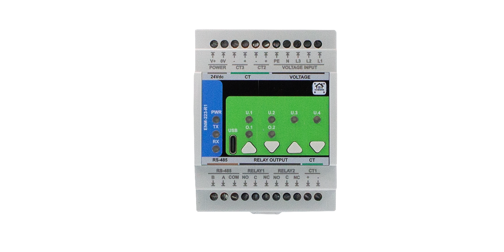

**Firmware Version:** 2025-09 snapshot

# ENM-223-R1 — 3-Phase Power Metering & I/O Module

**HOMEMASTER – Modular control. Custom logic.**

### Module Description

The **ENM-223-R1** is a configurable smart I/O module designed for **3-phase power quality and energy metering**.  
It includes **3 voltage inputs, 3 current channels**, **2 relays**, and optional **4 buttons / 4 LEDs**, with configuration via **WebConfig** using **USB-C (Web Serial)**.  
It connects over **RS-485 (Modbus RTU)** to a **MicroPLC/MiniPLC**, enabling use in **energy monitoring, automation, and smart building applications**.

---

## Table of Contents

* [1. Introduction](#1-introduction)
* [2. Use Cases](#2-use-cases)
* [3. Safety Information](#3-safety-information)
* [4. Installation & Quick Start](#4-installation-quick-start)
* [5. MODULE-CODE — Technical Specification](#5-module-code--technical-specification)
* [6. Modbus RTU Communication](#6-modbus-rtu-communication)
* [7. ESPHome Integration Guide (if applicable)](#7-esphome-integration-guide)
* [8. Programming & Customization](#8-programming--customization)
* [9. Maintenance & Troubleshooting](#9-maintenance--troubleshooting)
* [10. Open Source & Licensing](#10-open-source--licensing)
* [11. Downloads](#11-downloads)
* [12. Support](#12-support)

 

---

# 1. Introduction

## 1.1 Overview of the ENM‑223‑R1 Module ⚡

The **ENM‑223‑R1** is a modular **3‑phase energy metering + I/O** device for power monitoring, automation, and local control. It features **3 voltage channels (L1/L2/L3‑N)**, **3 current channels (external CTs)**, **2 SPDT relays**, **4 user LEDs**, and **4 buttons**—all driven by an **RP2350** MCU with QSPI flash and a dedicated **ATM90E32AS** metering IC.

It integrates with **MiniPLC/MicroPLC** controllers or any **Modbus RTU** master over **RS‑485**, and it’s configured in‑browser via **USB‑C Web Serial** (no drivers). Typical uses include **energy dashboards, demand response, alarm‑driven relay control, and building automation**. Defaults ship as **Modbus address 3 @ 19200 8N1** (changeable in WebConfig).

> Quick device flow:  
> **Wire Lx/N/PE + CTs → set address/baud in WebConfig → calibrate gains/offsets → define alarms per L1/L2/L3/Totals → map relays/LEDs/buttons → connect RS‑485 A/B (and GND if separate PSUs) → poll via Modbus.**

---

## 1.2 Features & Architecture

### Core Capabilities

| Subsystem       | Qty | Description |
|-----------------|-----|-------------|
| Voltage Inputs  | 3   | L1/L2/L3‑N measurement (divider network on FieldBoard) feeding ATM90E32AS |
| Current Inputs  | 3   | Differential CT inputs (IAP/IAN, IBP/IBN, ICP/ICN) with filtering/burdens |
| Relays          | 2   | **SPDT** dry contacts (NO/NC); opto‑driven; alarm‑ or Modbus‑controlled |
| LEDs            | 4   | User LEDs; sources: overrides/alarms/warnings/events; steady or blink |
| Buttons         | 4   | User actions (toggle relays/LEDs, overrides, acks) with live state feedback |
| Metering & Energy | — | ATM90E32AS: Urms/Irms, **P/Q/S**, PF, angle, freq; energy kWh/kvarh/kVAh (phase & totals) |
| Config UI       | Web Serial | In‑browser **WebConfig** over **USB‑C** (Chrome/Edge); live meter, calibration, alarms, relays, LEDs, buttons |
| Modbus RTU      | RS‑485 | Multi‑drop slave; address 1…255; baud 9600–115200 (default **19200 8N1**) |
| MCU             | RP2350 + QSPI | Dual‑core MCU, native USB, external W25Q32 flash; RS‑485 via MAX485 transceiver |
| Power           | 24 VDC | Buck to 5 V → 3.3 V LDO; **isolated analog domain** via B0505S DC‑DC + ISO7761 |
| Protection      | TVS, PTC, fuses | Surge/ESD on USB & RS‑485; resettable fuses on field I/O; reverse‑polarity protection |

---

## 1.3 System Role & Communication 🍰

The **ENM‑223‑R1** is a **smart Modbus RTU slave**. It executes local alarm logic (thresholds & acks) and mirrors states/values to a PLC or SCADA via registers/coils. Configuration (meter options, calibration, relay/LED logic, button actions, Modbus address/baud) is done via **USB‑C WebConfig**, stored to non‑volatile memory.

| Role                 | Description |
|----------------------|-------------|
| System Position      | Expansion meter+I/O on the **RS‑485** trunk (A/B/GND) |
| Master Controller    | MiniPLC / MicroPLC or any third‑party Modbus RTU **master** (polling) |
| Address / Baud       | Configurable 1…255 / **9600–115200**; **factory default: ID 3 @ 19200 8N1** |
| Bus Type             | RS‑485 half‑duplex; termination/bias per bus rules; share **GND** if separate PSUs |
| USB‑C Port           | Setup/diagnostics via Chromium browser (Web Serial); native USB D+/D− to MCU |
| Default Modbus ID    | **3** (change in WebConfig) |
| Daisy‑Chaining       | Multi‑drop on shared A/B; ensure unique IDs and end‑of‑line termination |

> **Note:** The UI exposes per‑channel **Alarm / Warning / Event** with min/max thresholds and **Ack required** option; relays can follow selected alarm kinds or be **Modbus‑controlled**. Buttons can toggle/override relays; LEDs reflect overrides or alarm states.

# 2. Use Cases

This section outlines practical application examples for the **ENM‑223‑R1** module. Each use case includes a functional goal and a clear configuration procedure using the WebConfig tool and/or Modbus RTU integration.

These templates are applicable in energy management, automation, industrial control, and building infrastructure deployments.

---

## 2.1 Overcurrent Alarm with Manual Reset

**Purpose:** Activate **Relay 1** when current exceeds a configured threshold and hold it until manually acknowledged.

### Configuration:
- **Alarms** → Channel: `Totals`  
  - Enable **Alarm**  
  - Metric: `Current (Irms)`  
  - Max threshold: e.g. `> 5000` (for 5 A)  
  - Enable **Ack required**
- **Relays** → Relay 1  
  - Mode: `Alarm Controlled`  
  - Channel: `Totals`, Kinds: `Alarm`
- **LEDs** → LED 1  
  - Source: `Alarm Totals`, Mode: `Steady`
- **Acknowledge**: via Web UI, Modbus coils `610–613`, or front panel button (if assigned)

---

## 2.2 Manual Override for Load Control

**Purpose:** Allow field operators to override **Relay 2** using a button, regardless of Modbus or automation control.

### Configuration:
- **Relays** → Relay 2  
  - Mode: `Modbus Controlled`  
  - Enabled at power-on
- **Buttons** → Button 2  
  - Action: `Override Relay 2 (hold 3s)`
- **LEDs** → LED 2  
  - Source: `Override R2`, Mode: `Blink` or `Steady`

> Holding the button for 3 seconds enters override mode. A short press toggles the relay. Holding again exits override mode.

---

## 2.3 Environmental Voltage/Frequency Alarm with Auto-Clear

**Purpose:** Detect power quality faults (sag/swell or freq drift), activate **Relay 1** as an output, and auto-reset when back in range.

### Configuration:
- **Alarms** → Channel: `L1`  
  - Enable **Alarm**  
  - Metric: `Voltage (Urms)`  
  - Min: `21000` (210 V), Max: `25000` (250 V)  
  - Leave **Ack required** unchecked
- **Relays** → Relay 1  
  - Mode: `Alarm Controlled`, Channel: `L1`, Kinds: `Alarm`
- **LEDs** → LED 1  
  - Source: `Alarm L1`

---

## 2.4 Staged Load Shedding via Modbus Scenes

**Purpose:** Use a controller to shed non-critical loads as power consumption increases.

### Configuration:
- **Relays** → Relay 1 and Relay 2  
  - Mode: `Modbus Controlled`
- In PLC logic:
  - Monitor `Totals S (VA)` via Input Register
  - If `S > 8000`, write coil `600 = OFF` (Relay 1)
  - If `S > 10000`, write coil `601 = OFF` (Relay 2)
  - Restore relays when values drop below defined hysteresis limits

> Ideal for HVAC or lighting where priority-based power shedding is needed.

---

### Summary Table

| Use Case                               | Feature Used                | Reset Method         | Relay Mode         |
|----------------------------------------|-----------------------------|----------------------|--------------------|
| Overcurrent Alarm + Ack                | Alarms, Ack, Relay 1        | Manual (Ack)         | Alarm Controlled   |
| Manual Override via Button             | Button override, LED        | Button toggle        | Modbus Controlled  |
| Voltage/Frequency Fault Auto-Reset     | Alarm (no ack), Relay       | Auto (value returns) | Alarm Controlled   |
| Load Shedding (Staged Scenes)          | PLC Modbus, Relay 1 & 2     | PLC-controlled       | Modbus Controlled  |

> 🛠 All parameters are configurable via USB‑C WebConfig. Modbus control assumes master-side logic (PLC, SCADA, or MicroPLC/MiniPLC).

---

# 3. Safety Information

These safety guidelines apply to the **ENM‑223‑R1 energy monitoring module**. Ignoring them may result in **equipment damage, system failure, or personal injury**.

> ⚠️ **Low-Voltage (SELV) only** — The ENM‑223‑R1 is designed for operation in **SELV circuits only**. Never connect mains voltage directly to digital I/O, relays, RS‑485, or USB-C.

---

## 3.1 General Requirements

| Requirement           | Detail |
|-----------------------|--------|
| Qualified Personnel   | Installation and servicing must be done by trained technicians familiar with panel wiring and control systems. |
| Power Isolation       | Always disconnect **24 V DC power** and relay loads before servicing. Use lockout/tagout where applicable. |
| Environmental Limits  | Mount inside a clean, ventilated enclosure. Avoid condensation, conductive dust, or vibration. |
| Grounding             | Always connect the **PE terminal**. Bond control panel to earth. Maintain separation between **logic GND** and **GND_ISO**. |
| Voltage Compliance    | Connect only sources within the module’s specified range. Fusing and protection must be applied upstream. |

---

## 3.2 Installation Practices

| Task                | Guidance |
|---------------------|----------|
| ESD Protection       | Handle only by the case. Use antistatic wrist strap and surface during service. |
| DIN Rail Mounting    | Mount securely on **35 mm DIN rail** inside an enclosure. Apply strain relief to all cabling. |
| Wiring               | Use proper gauge and torque terminals. Separate relay, CT, and RS‑485 wiring paths. |
| Isolation Domains    | Respect analog vs digital ground. Do **not bridge GND_ISO** (CT/metrology side) to logic GND. |
| Commissioning        | Before applying power, verify voltage wiring, RS‑485 polarity, CT orientation, and relay contacts (NO/NC). |

---

## 3.3 I/O & Interface Warnings

### ⚡ Power

| Area            | Warning |
|-----------------|---------|
| **24 V DC Input** | Use a clean SELV 24 V DC supply. Reverse polarity is internally protected but may disable the module. |
| **Voltage Input (L1–L3/N)** | Must be fused upstream. Do not apply voltage without PE/N wiring. Use appropriate circuit protection. |
| **Sensor Power (CT)** | Use **1 V or 333 mV RMS** CTs only. Never connect high-current 5 A outputs directly. |

### 🧲 Inputs & Relays

| Area             | Warning |
|------------------|---------|
| **CT Inputs**     | Connect only split-core or intermediate CTs with 333 mV or 1 V outputs. Observe `+` and `−` polarity. |
| **Relay Outputs** | Dry contacts only. Max: 5 A @ 250 VAC / 30 VDC. Add **snubber circuits** (RC/TVS) on inductive loads. |

### 🖧 Communication & USB

| Area             | Warning |
|------------------|---------|
| **RS‑485 Bus**    | Use **twisted pair (shielded)** cable. Terminate at both ends (120 Ω). Match **A/B polarity**. Share GND if powered from different sources. |
| **USB-C (Front)** | For **setup only**. Not suitable for continuous field use. During storms or exposed operation, unplug USB. |

### 🎛 Front Panel

| Area               | Warning |
|--------------------|---------|
| **Buttons & LEDs** | Can override relays or acknowledge alarms. Use firmware settings to disable if safety‑critical. |

### 🛡 Shielding & EMC

| Area            | Recommendation |
|-----------------|----------------|
| **Cable Shields** | Terminate shielding at **one point only** (preferably at the PLC/controller side). Keep signal wiring away from VFDs or high-voltage switchgear. |

---

### ✅ Pre‑Power Checklist

- [x] **All terminals** are torqued and strain-relieved  
- [x] No accidental bridges between **logic GND** and **GND_ISO**  
- [x] PE and N are connected  
- [x] RS‑485 **A/B polarity and termination** are correct  
- [x] CTs are connected with correct orientation (+/−)  
- [x] Voltage inputs are protected and within 85–265 V range  
- [x] Relay outputs do **not** exceed 5 A (use snubbers for inductive loads)

> 🧷 **Tip:** If using only L1 in a single-phase setup, tie **L2/L3 → N** to avoid phantom readings.

# 4. Installation & Quick Start

## 4.1 What You Need

| Item | Description |
|------|-------------|
| Module | MODULE-CODE unit |
| Controller | MiniPLC/MicroPLC or Modbus RTU master |
| PSU | Regulated 24 VDC |
| Cable | USB-C and RS-485 twisted pair |
| Software | Browser with Web Serial support |

## 4.2 Power

- Describe 24 VDC input
- List expected current
- Explain isolated sensor power if present

## 4.3 Communication

- RS-485 pinout
- Address & baudrate setup
- Use of COM/GND reference

## 4.4 Installation & Wiring

Use diagrams and explain:
- Inputs
- Relays
- Sensor rails (12/5V)
- RS-485 terminals
- USB port

## 4.5 Software & UI Configuration

Cover:
- WebConfig setup (address, baud)
- Input enable/invert/group
- Relay logic mode (group/manual)
- LED and Button mapping

## 4.6 Getting Started

Summarize steps in 3 phases:
1. Wiring
2. Configuration
3. Integration

---

# 5. MODULE-CODE — Technical Specification

## 5.1 Diagrams & Pinouts

Add photos/diagrams:
- System block diagram
- Board layouts
- Terminal maps

## 5.2 I/O Summary

Summarize in a table:

| Interface | Qty | Description |
|-----------|-----|-------------|
| Inputs |   | Opto-isolated |
| Relays |   | SPST/SPDT |
| LEDs |   | Status indication |
| USB-C | 1 | Setup only |

## 5.3 Electrical Specs

Cover:
- Input voltage range
- Current consumption
- Sensor rail current
- Relay contact ratings
- Isolation details

## 5.4 Firmware Behavior

Explain:
- Alarm logic (latched/momentary)
- Override priority
- LED feedback modes

---

# 6. Modbus RTU Communication

Include:
- Address range and map
- Input/holding register layout
- Coil/discrete inputs
- Register use examples
- Polling recommendations

---

# 7. ESPHome Integration Guide

Only if supported. Cover:
- YAML setup (`uart`, `modbus`, `package`)
- Entity list (inputs, relays, buttons, LEDs)
- Acknowledge, override controls
- Home Assistant integration tips

---

# 8. Programming & Customization

## 8.1 Supported Languages

- Arduino
- C++
- MicroPython

## 8.2 Flashing

Steps for:
- USB-C flashing
- BOOT/RESET button use
- PlatformIO / Arduino IDE setup

## 8.3 Arduino / PlatformIO Notes

Mention:
- Required libraries
- Pin mapping
- Board config

## 8.4 Firmware Updates

- How to update
- Preserving config
- Recovery methods

---

# 9. Maintenance & Troubleshooting

Optional section. Add:
- Status LED meanings
- Reset methods
- Common issues (no comms, relay won’t trigger, etc.)

---

# 10. Open Source & Licensing

- **Hardware:** CERN-OHL-W v2
- **Firmware:** GPLv3
- **Config Tools:** MIT or other as applicable

---

# 11. Downloads

Include links to:

- Firmware binaries
- YAML configs
- WebConfig tool
- Schematics (PDF)
- Images and diagrams
- Datasheets

---

# 12. Support

- [Official Support Portal](https://www.home-master.eu/support)
- [WebConfig Tool](https://www.home-master.eu/configtool-[module-code])
- [YouTube](https://youtube.com/@HomeMaster)
- [Hackster](https://hackster.io/homemaster)
- [Reddit](https://reddit.com/r/HomeMaster)
- [Instagram](https://instagram.com/home_master.eu)

