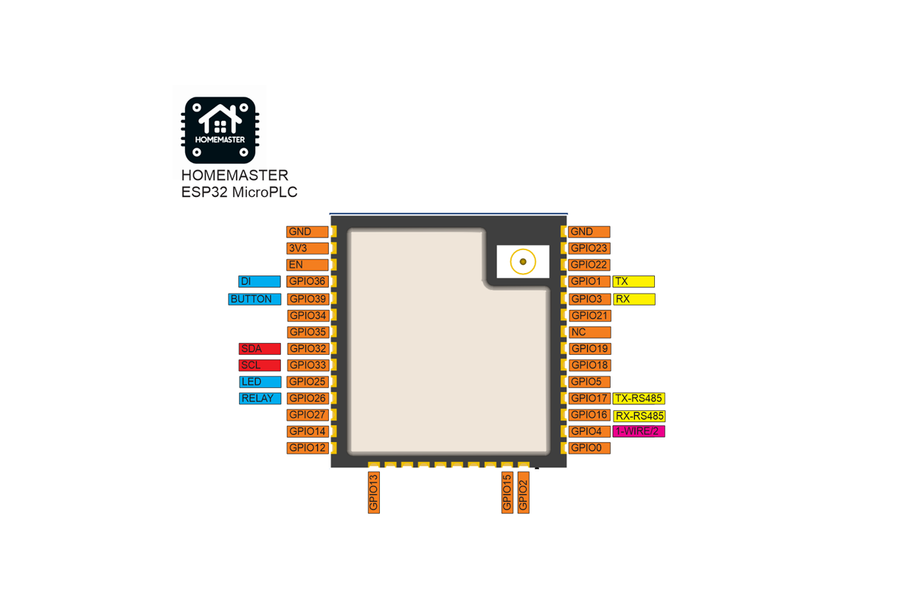
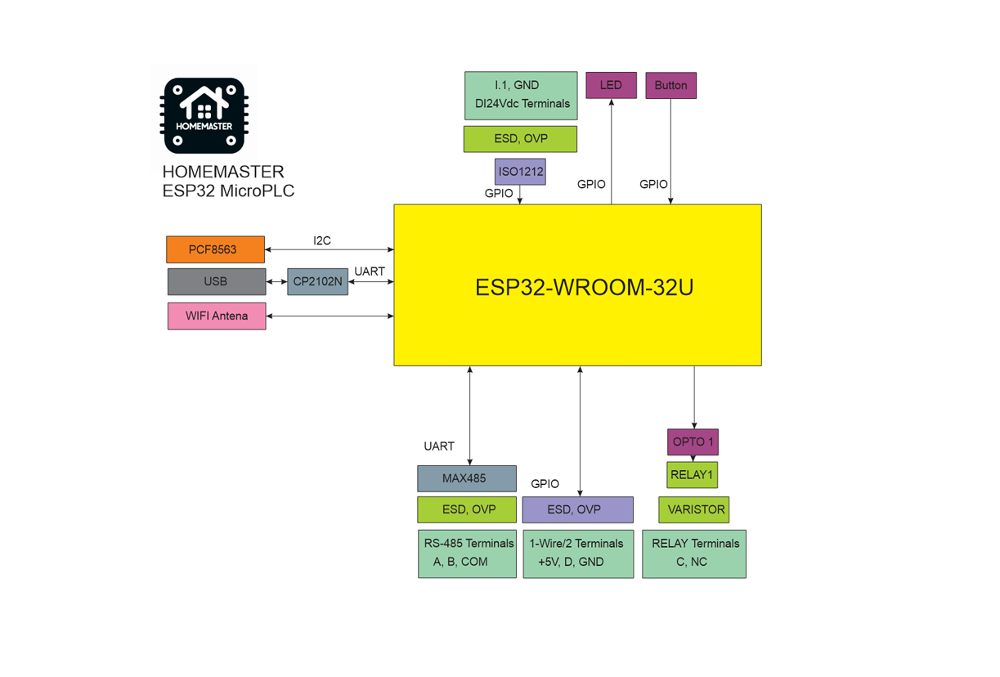

# 🚧 Project Status: Under Active Development & Testing

> **Important Notice:** This documentation, hardware designs, and firmware are for the **pre-release version** of the HomeMaster system. All information is preliminary and may contain errors or be subject to change.
>
> - **Hardware:** Modules are currently in the prototyping and testing phase. Final production versions may differ.
> - **Firmware:** Firmware is under active development and is considered **beta**. Features, configurations, and stability are being refined.
>
> Please use this information for evaluation and development purposes only. Check the [Releases page](../../releases) for the latest stable versions and updates.

---
---
Homemaster-MicroPLC
---

## Product description

The HOMAMASTER MicroPLC is a compact and powerful open-source automation controller based on the ESP32-WROOM-32U. Designed for seamless integration with Home Assistant using ESPHome, it enables control of smart home devices, sensors, actuators, and industrial systems through RS-485 Modbus and wireless communication.

Maker: https://www.home-master.eu/

Product page: https://www.home-master.eu/shop/esp32-microplc-56
Schematics: https://github.com/isystemsautomation/HOMEMASTER/tree/main/MicroPLC/Schematic

## Features

- **ESP32-WROOM-32U** microcontroller with Wi-Fi and Bluetooth
- **ESPHome compatible firmware** for seamless Home Assistant integration
- **RS-485 Modbus RTU** interface for extension module communication
- **USB Type-C port** for programming, debugging, and power
- **1-Wire interface** with ESD and overvoltage protection
- **PCF8563 RTC** for accurate time-based automation
- **One industrial-grade relay** with varistor and opto-isolation
- **One 24V digital input** with surge protection (ISO1212)
- **Four front-panel buttons** and **status LEDs** for local control and diagnostics
- **DIN-rail mountable** for standard electrical enclosures

## Networking

Wi-Fi Connectivity – Integrated Wi-Fi for wireless access and Home Assistant integration.

## Pinout

## MicroPLC Functional Block Diagram

## Programming

The MicroPLC comes with ESPHome pre-installed and can be confgured via:

### Improve

Wi-Fi Configuration with Improv

1. Power on your HomeMaster MicroPLC.
2. Go to 👉 improv-wifi.com (works in Chrome/Edge on desktop or mobile).
3. Connect via USB (Serial) or Bluetooth LE.
4. Enter your Wi-Fi SSID and password, then press Connect.
5. The device joins your Wi-Fi and is now ready.

You can then access it via its local address (e.g., http://homemaster-microplc.local) or directly in Home Assistant.

### One-Click Import (ESPHome Dashboard Import)

Once connected to Wi-Fi, the MicroPLC will be automatically discovered in ESPHome Dashboard.
When the device appears in ESPHome Dashboard, click “Take Control”.
The MicroPLC supports dashboard import, automatically pulling its official configuration from GitHub

### USB Type-C: Use the ESPHome Dashboard to upload the configuration

1. Connect the MicroPLC to your computer with a USB Type-C cable.
2. Download the YAML configuration file from our GitHub repository.(https://github.com/isystemsautomation/HOMEMASTER/blob/main/MicroPLC/Firmware/microplc.yaml)
3. Open the ESPHome Dashboard, import the YAML file, and update it with your Wi-Fi SSID and password.
4. Flash the device directly from ESPHome Dashboard.
5. The MicroPLC supports automatic reset and boot control — there is no need to press reset or boot buttons during programming.
6. After flashing, the device will reboot automatically and run the updated firmware.

## Bus system configuration

### I2C

|        | PIN                           |
| ------ | ----------------------------- |
| SDA    | GPIO32                        |
| SCL    | GPIO33                        |

### I2C addresses

|              | address                     |
| ------------ | --------------------------- |
| pcf8563      | 0x51                        |

## Specifications

| Feature              | Details                              |
|----------------------|--------------------------------------|
| Microcontroller      | ESP32-WROOM-32U                      |
| Power Supply         | 5V via USB-C for programming or 24V via terminal     |
| Relay Output         | 1x 16A (optically isolated)     |
| Digital Input        | 1x 24V DI (ISO1212-based)            |
| Communication        | RS-485, Wi-Fi, Bluetooth, USB-C      |
| RTC                  | PCF8563                              |
| 1-Wire               | 1 channel (ESD/OVP protected)        |
| Mounting             | DIN-rail                             |
| Firmware             | ESPHome (pre-installed), Arduino |

---

## 📄 License

All hardware design files and documentation are licensed under **CERN-OHL-W 2.0**.  
Firmware and code samples are released under the **GNU General Public License v3 (GPLv3)** unless otherwise noted.

---

> 🔧 **HOMEMASTER – Modular control. Custom logic.**
