# HomeMaster MiniPLC (ESP32)


*DIN rail • 24 V DC • ESP32 • Modbus RTU • Home Assistant*

## Overview

The **HomeMaster MiniPLC** is a professional, open-source DIN rail controller built around the ESP32 platform, designed for robust and scalable smart automation in residential, commercial, and light industrial environments. It combines extensive onboard I/O—including relays, digital and analog inputs, temperature sensors, and a user interface—with native Home Assistant integration via pre-installed ESPHome.

Engineered for reliability and flexibility, the MiniPLC supports multiple power input options (24V DC or wide-range AC/DC) and features RS-485 Modbus interface for expansion with a wide range of compatible I/O modules. Its local processing capability ensures continued operation even when network or cloud connectivity is lost, making it suitable for mission-critical applications.

This controller operates as a complete standalone automation system using its comprehensive onboard I/O, while also offering seamless expansion via the RS-485 bus to connect HomeMaster smart modules for energy metering, lighting control, security, and more. It provides a versatile, ready-to-integrate platform for HVAC control, energy management, security systems, lighting automation, and custom industrial applications.

## Quick Overview

- Pre-installed **ESPHome** for native Home Assistant integration
- Industrial **DIN-rail form factor** with 24 V DC supply
- Runs **locally and offline** without cloud or HA
- **Expandable** via RS-485 Modbus field devices

## Typical Applications

- Smart home central controller
- HVAC automation and plant control
- Solar and energy management systems
- Laboratory automation
- Industrial I/O gateway
- Building management systems (BMS)
- SCADA edge controller
- RS-485 Modbus master / field gateway

## Tech Specs

| Specification | Details |
|--------------|---------|
| **Microcontroller** | ESP32-WROOM-32U (dual-core) |
| **Power Input** | 24 V DC nominal (V+ / 0V) **OR** 85–265 V AC (L / N) **OR** 120–370 V DC (L / N + / −) |
| **Digital Inputs** | 4 × isolated, 24 V DC compatible |
| **Relay Outputs** | 6 × SPDT — **3 A MAX continuous per output** (board/system limit).<br>Relay component contacts rated up to 12 A @ 250 V AC (resistive). |
| **Analog Inputs** | 4 × 0–10 V, 16-bit (ADS1115) |
| **Analog Output** | 1 × 0–10 V, 12-bit (MCP4725) |
| **Temperature Inputs** | 2 × RTD (PT100/PT1000 via MAX31865), 2 × 1-Wire (DS18B20 compatible) |
| **Display** | 128 × 64 OLED (SH1106) |
| **User Interface** | 4 buttons, 3 user LEDs, 1 status LED, onboard buzzer (GPIO2, PWM) |
| **Wi-Fi** | Wi-Fi (ESP32) |
| **Ethernet** | Optional Ethernet (LAN8720 PHY) |
| **RS-485** | RS-485 Modbus RTU (MAX485, half-duplex) with TVS surge protection, PTC fuses, EMI choke, and fail-safe biasing |
| **Storage** | MicroSD card (SPI interface, power-switched 3.3 V rail) |
| **USB** | USB-C (ESD protected, CC detection, data to ESP32) |
| **RTC** | PCF8563 with battery backup |

> **Note:** Relay outputs are not internally fused. Use external overcurrent protection per local code and use an external contactor/relay for loads above 3 A or with high inrush/inductive characteristics.

## Installation, Environmental & Mechanical

| Category | Specification | Details |
|----------|---------------|---------|
| **Terminal Specifications** | Terminal type | Pluggable screw terminal blocks, 5.08 mm pitch |
| | Terminal pitch | 5.08 mm |
| | Wire cross-section | 0.2–2.5 mm² (AWG 24–12) |
| | Conductor type | Solid or stranded copper |
| | Stranded wire | Ferrules recommended |
| | Tightening torque | 0.4 Nm (max) |
| **Environmental Ratings** | Operating temperature | 0 °C to +40 °C |
| | Storage temperature | -10 °C to 55 °C |
| | Relative humidity | 0–90 % RH, non-condensing |
| | Ingress protection | **IP20** (inside cabinet) |
| | Installation | Indoor control cabinet only; not for outdoor or exposed installation |
| | Terminal protection | All wiring terminals must be protected against accidental contact |
| **Mechanical & Packaging** | Product dimensions | **157.4 × 91 × 58.4 mm**<br>(6.2 × 3.58 × 2.3 in) (L × W × H) |
| | DIN units | 9 division units (≈ 90 mm DIN rail mounting width) |
| | Mounting | 35 mm DIN rail |
| | Net weight | 300 g |
| | Gross weight | 450 g |
| | Pack size | 230 × 140 × 87 mm (9 × 5.5 × 3.4 in) (L × W × H) |
| | Mechanical drawing | Front + side views with DIN-clip depth (see below) |
| | Notes | All dimensions shown in millimeters unless stated otherwise |

Install only inside a control cabinet with ventilation; the cabinet must include a protective front plate covering all module connection terminals and a closing protective door; not for outdoor or exposed installation.

**All wiring terminals must be protected against accidental contact by an insulating front plate, wiring duct, or terminal cover. Exposed live terminals are not permitted.**


*Mechanical drawing: front view + side view + DIN-clip depth (all dimensions in mm).*

## Home Assistant & ESPHome Integration

The MiniPLC comes with **ESPHome pre-installed** and can be integrated directly into Home Assistant without flashing custom firmware.

### Quick Setup Process (Improv Wi-Fi)

1. **Mount & Power** – Install on a 35mm DIN rail and connect power.
2. **Open Improv** – Go to [improv-wifi.com](https://improv-wifi.com).
3. **Connect** – Use USB-C (Serial) or Bluetooth LE.
4. **Enter Wi-Fi** – Input SSID and password, then press Connect.
5. **Auto-Discovery** – Device appears in Home Assistant & ESPHome Dashboard.

### One-Click Import (ESPHome Dashboard)

Once connected to Wi-Fi, the MiniPLC is automatically discovered in the ESPHome Dashboard. Click **"Take Control"** to import the official configuration directly from GitHub.

### USB Type-C Manual Flashing (Optional)

1. Connect the MiniPLC to your computer using USB Type-C.
2. Download the official YAML configuration: [miniplc.yaml](https://cdn.jsdelivr.net/gh/isystemsautomation/HOMEMASTER@main/MiniPLC/Firmware/miniplc.yaml)
3. Open ESPHome Dashboard and import the YAML file.
4. Update Wi-Fi credentials in the YAML.
5. Flash directly from ESPHome (no reset or boot buttons required).
6. The device reboots automatically and runs the new firmware.

- No firmware flashing required for basic use
- Native Home Assistant API
- OTA updates supported
- Automatic ESPHome dashboard import
- Full YAML customization

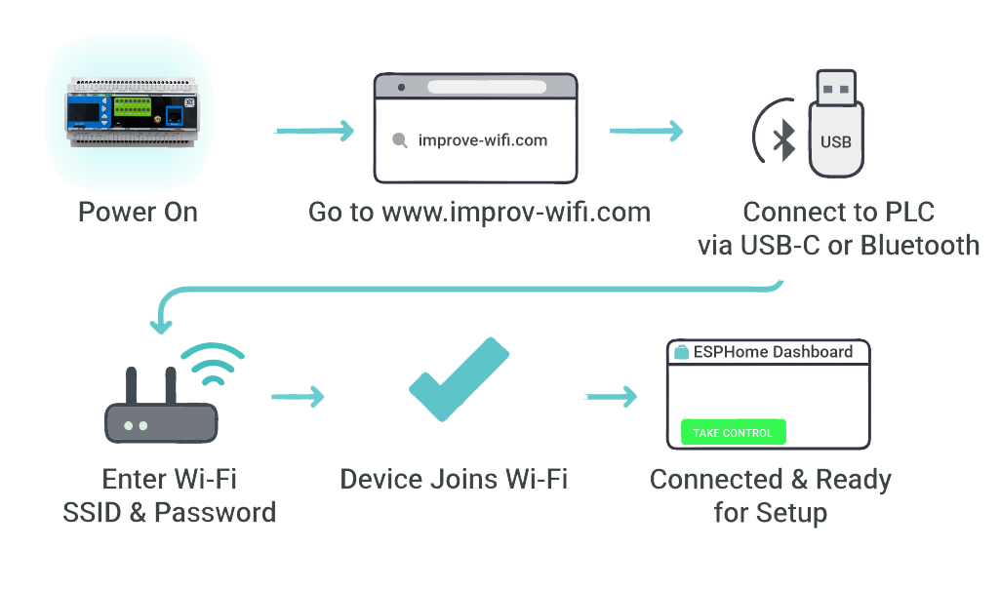

## Documentation

The MiniPLC is open-source hardware. You can build your own board using the files below.

### Hardware Design Files

| File | Description | Link |
|------|-------------|------|
| **Schematic (MCU Board)** | Main controller board schematic | [MCU_Board.pdf](https://cdn.jsdelivr.net/gh/isystemsautomation/HOMEMASTER@main/MiniPLC/Schematic/MCU_Board.pdf) |
| **Schematic (Relay Board)** | Relay and power section schematic | [Relay_Board.pdf](https://cdn.jsdelivr.net/gh/isystemsautomation/HOMEMASTER@main/MiniPLC/Schematic/Relay_Board.pdf) |
| **Schematic (USB Board)** | USB-C interface and power management | [USB_Board.pdf](https://cdn.jsdelivr.net/gh/isystemsautomation/HOMEMASTER@main/MiniPLC/Schematic/USB_Board.pdf) |

### Firmware & Software

| Resource | Description | Link |
|----------|-------------|------|
| **Default ESPHome Config** | Pre-configured YAML for Home Assistant | [miniplc.yaml](https://cdn.jsdelivr.net/gh/isystemsautomation/HOMEMASTER@main/MiniPLC/Firmware/miniplc.yaml) |
| **Firmware Source Code** | Latest firmware builds and source | [Firmware/](https://github.com/isystemsautomation/HOMEMASTER/tree/main/MiniPLC/Firmware/) |
| **ESPHome Integration Guide** | Complete setup instructions | [README.md](https://github.com/isystemsautomation/HOMEMASTER/tree/main/MiniPLC/README.md) |

### Manuals & Datasheets

| Document | Description | Link |
|----------|-------------|------|
| **Datasheet** | Technical specifications and ratings | [Datasheet.pdf](https://cdn.jsdelivr.net/gh/isystemsautomation/HOMEMASTER@main/MiniPLC/Manuals/Datasheet.pdf) |
| **User Manual** | Installation and configuration guide | [User_Manual.pdf](https://cdn.jsdelivr.net/gh/isystemsautomation/HOMEMASTER@main/MiniPLC/Manuals/User_Manual.pdf) |

All design files and documentation are available in the [HomeMaster GitHub repository](https://github.com/isystemsautomation/HOMEMASTER/tree/main/MiniPLC).

## Power Supply

> ⚠️ **Hazardous voltage:** Terminals **L / N** may carry mains AC or high-voltage DC. Wiring must be performed by qualified personnel. Disconnect power before wiring or servicing. Provide external overcurrent protection per local electrical code.

> ⚠️ **Critical:** Exactly **ONE** power input method may be used at a time. **V+ / 0V** and **L / N** must **never** be connected simultaneously.

MiniPLC supports **one** power input method at a time: **24 V DC nominal** on **V+ / 0V** (recommended) *or* **Mains AC / High-Voltage DC** on **L / N** via the onboard isolated power module.

**When to use which:** **24 V DC** is recommended when available, as it is safer and simpler to install. **Mains AC / High-Voltage DC** on **L / N** is for installations where 24 V DC is not available and must be installed by qualified personnel in accordance with local electrical codes.

> ⚠️ **Safety reminder:** When using **L / N** terminals for mains AC or high-voltage DC, ensure all power is disconnected before any wiring work. Installation and maintenance must be carried out by qualified personnel in accordance with local electrical codes, including proper overcurrent protection.

### Power Input Specifications

| Input Option | Terminals | Range | Notes |
|--------------|-----------|-------|-------|
| **24 V DC (recommended)** | V+ / 0V | 24 V DC | Preferred for most installations. Powers internal rail **+24VDC_FUSED**. |
| **Mains AC** | L / N | 85–265 V AC, 47–63 Hz | Uses onboard isolated module to generate the internal 24 V rail. External protection required. |
| **High-Voltage DC** | L / N (+ / −) | 120–370 V DC | Uses onboard isolated module to generate the internal 24 V rail. External protection required. |

### 24 V DC Input (V+ / 0V)

<table>
<tr>
<td width="50%">
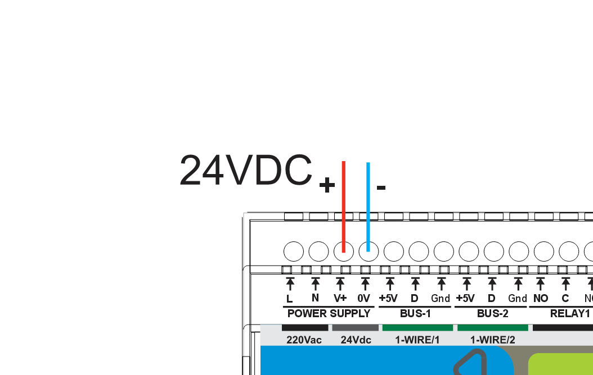
<br><small>Connect <strong>+</strong> to <strong>V+</strong> and <strong>−</strong> to <strong>0V</strong>.</small>
</td>
<td width="50%">
<strong>Installation checklist</strong>
<ul>
<li>Use a regulated <strong>24 V DC</strong> supply</li>
<li>Install <strong>0.5 A</strong> fuse/breaker upstream of <strong>V+</strong></li>
<li>Observe polarity: <strong>V+ / 0V</strong></li>
<li>Route power wiring away from low-level analog signal wiring</li>
</ul>
</td>
</tr>
</table>

- **Typical operating current:** **150 mA @ 24 V** (≈ **3.6 W**) — measured typical device power consumption
- **Internal rail:** 24 V input is conditioned into **+24VDC_FUSED**
- **Input protection:** surge suppression (TVS), EMI filtering, reverse-polarity / power-path protection
- **Internal service fuse:** **1.0 A** (soldered) — service replacement required if blown
- **Upstream protection (recommended):** external **0.5 A** slow-blow fuse or **0.5 A** breaker on **V+** so the external device clears before the internal service fuse. Recommended for 24 V DC installations to protect wiring and simplify troubleshooting.

### Mains AC / High-Voltage DC Input (L / N)

The onboard isolated power module generates the internal **24 V** rail from **85–265 V AC** or **120–370 V DC** on **L / N**.

<table>
<tr>
<td width="50%">
<strong>85–265 V AC (L / N)</strong>
<br>
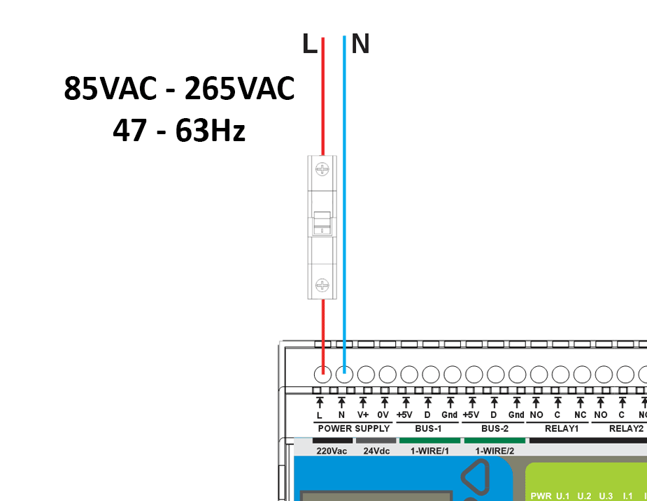
<ul style="margin-top:10px;">
<li><strong>Input:</strong> 85–265 V AC, 47–63 Hz</li>
<li><strong>Qualified personnel only</strong></li>
<li><strong>External fuse/breaker required</strong></li>
</ul>
</td>
<td width="50%">
<strong>120–370 V DC (L / N + / −)</strong>
<br>
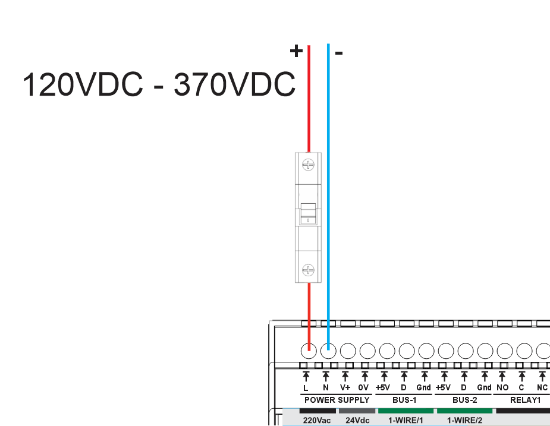
<ul style="margin-top:10px;">
<li><strong>Input:</strong> 120–370 V DC</li>
<li>Observe polarity where marked on <strong>L / N</strong></li>
<li><strong>External fuse/breaker required</strong></li>
</ul>
</td>
</tr>
</table>

> ⚠️ **Mandatory upstream protection (L / N):** Install an external **T0.5 A (slow-blow) fuse** or **0.5 A breaker** upstream. Increase rating only if required by local code or to prevent nuisance trips due to inrush. External protection is **required** for mains AC / high-voltage DC installations due to safety regulations and the higher fault current available from these sources.

**Onboard Isolated Power Module:**

| Parameter | Specification |
|-----------|---------------|
| **Type** | Isolated AC/DC power module |
| **Input** | 85–265 V AC (47–63 Hz) or 120–370 V DC |
| **Output** | 24 V DC auxiliary rail — maximum capacity **220 mA** (power module rating, not typical device draw) |
| **Protection** | Overcurrent, short-circuit, thermal shutdown with auto-recovery |

**Current draw clarification:** The **150 mA** figure is the typical operating current drawn by the MiniPLC device itself. The **220 mA** figure is the maximum output capacity rating of the onboard isolated power module. Current is drawn by the load (the MiniPLC); the higher number represents the module's capacity limit, not additional current consumption.

> **Important:** Use only one input method at a time: **V+/0V** or **L/N**.

## Inputs & Outputs

### Digital Inputs (4 channels)

| Channel | Pin | Type | Voltage | Description |
|---------|-----|------|---------|-------------|
| DI #1 | GPIO36 | Sourcing | 24 V DC | Isolated 24 V digital input with internal field supply, dry contact |
| DI #2 | GPIO39 | Sourcing | 24 V DC | Isolated 24 V digital input with internal field supply, dry contact |
| DI #3 | GPIO34 | Sourcing | 24 V DC | Isolated 24 V digital input with internal field supply, dry contact |
| DI #4 | GPIO35 | Sourcing | 24 V DC | Isolated 24 V digital input with internal field supply, dry contact |

**Features:**
- 4× isolated 24 V DC digital inputs using ISO1212 digital input receivers
- Internal fused 24 V field supply for dry-contact sensing
- Sourcing-type inputs for passive devices (relay contacts, open-collector outputs)
- Separate field ground and logic ground domains
- Per-channel protection with resettable PTC fuses and TVS surge suppression
- Integrated EMI and noise filtering on each input
- Configurable input inversion and debounce filtering via ESPHome
- Status monitoring via Home Assistant binary sensors

<table>
<tr>
<td width="50%">
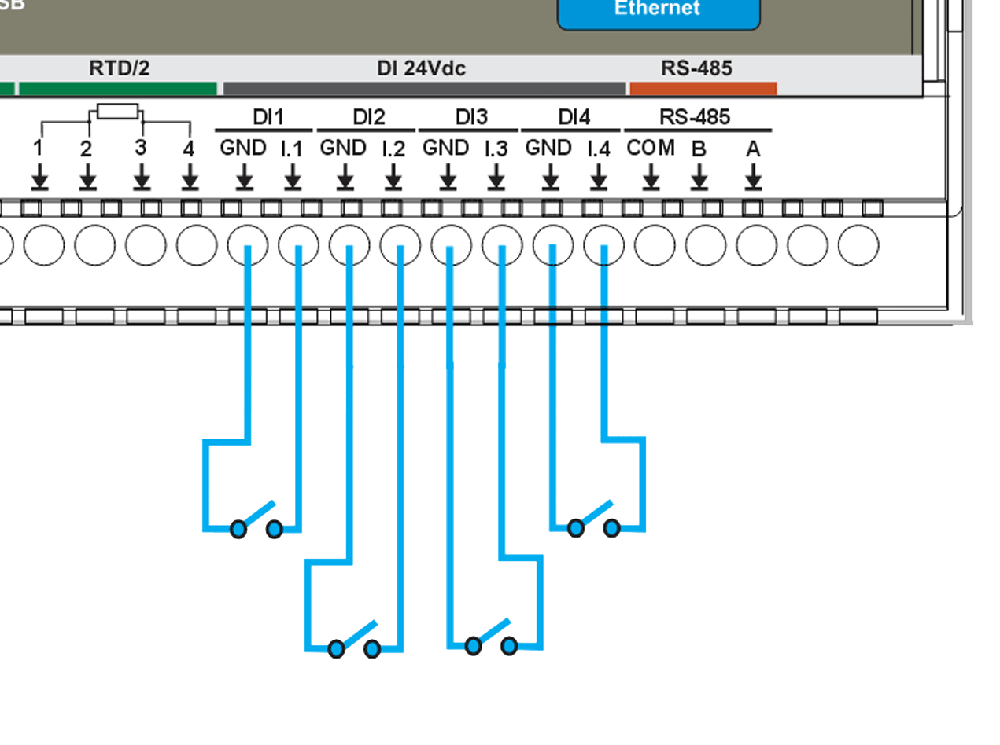
<br><small>Wiring example: dry contact wiring to DI inputs.</small>
</td>
<td width="50%">
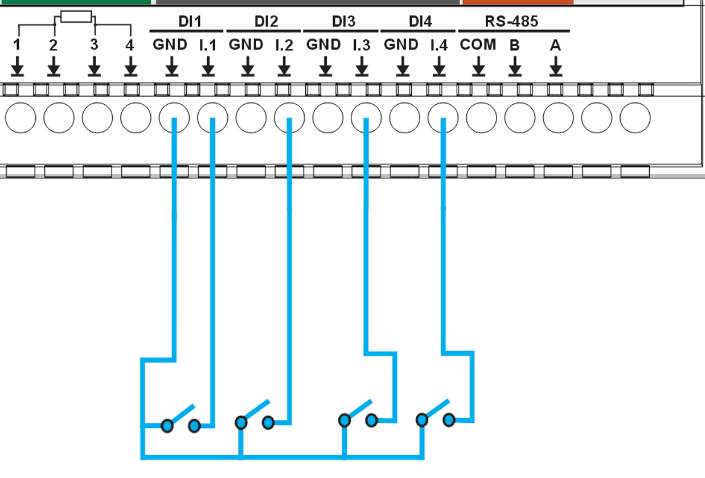
<br><small>Wiring example: shared common wiring approach.</small>
</td>
</tr>
</table>

### Relay Outputs

The MiniPLC provides **6 SPDT mechanical relays (HF115F/005-1ZS3)** for switching AC or DC loads. Each relay exposes **NO / NC / COM** contacts and is driven via optocoupler-isolated control circuitry.

**System/board rating:** **3 A MAX per output** (system limit). The MiniPLC board/system can safely carry ONLY 3 A per relay output. Using more than 3 A directly can overheat and permanently damage the board.

**Relay contact (component) rating:** 12 A @ 250 V AC (resistive). **This value belongs ONLY to the relay component itself and is NOT usable as a system output rating.** The MiniPLC must NOT be used above 3 A.

**Loads above 3 A (or inductive/inrush loads) MUST be switched using an external contactor or power relay.** The MiniPLC relay may be used as a control signal for the external contactor. Do not attempt to switch loads above 3 A directly through the MiniPLC relay outputs.

> ⚠️ **External protection required:** Every relay output MUST be protected by an external fuse or circuit breaker (max 3 A per channel). Relay output circuits are **not internally fused**. External overcurrent protection is mandatory for safe operation.

#### Relay Specifications

| Channel | Control Pin | Type | Rating | Description |
|---------|-------------|------|--------|-------------|
| Relay #1 | PCF8574B:2 | SPDT | 12A @ 250V AC (relay component rating, NOT usable as system output)<br>3 A MAX per output (board/system limit) | General purpose relay output 1 (NO/NC/COM) |
| Relay #2 | PCF8574B:1 | SPDT | 12A @ 250V AC (relay component rating, NOT usable as system output)<br>3 A MAX per output (board/system limit) | General purpose relay output 2 (NO/NC/COM) |
| Relay #3 | PCF8574B:0 | SPDT | 12A @ 250V AC (relay component rating, NOT usable as system output)<br>3 A MAX per output (board/system limit) | General purpose relay output 3 (NO/NC/COM) |
| Relay #4 | PCF8574A:6 | SPDT | 12A @ 250V AC (relay component rating, NOT usable as system output)<br>3 A MAX per output (board/system limit) | General purpose relay output 4 (NO/NC/COM) |
| Relay #5 | PCF8574A:5 | SPDT | 12A @ 250V AC (relay component rating, NOT usable as system output)<br>3 A MAX per output (board/system limit) | General purpose relay output 5 (NO/NC/COM) |
| Relay #6 | PCF8574A:4 | SPDT | 12A @ 250V AC (relay component rating, NOT usable as system output)<br>3 A MAX per output (board/system limit) | General purpose relay output 6 (NO/NC/COM) |

#### Relay Wiring Examples

<table>
<tr>
<td width="50%">
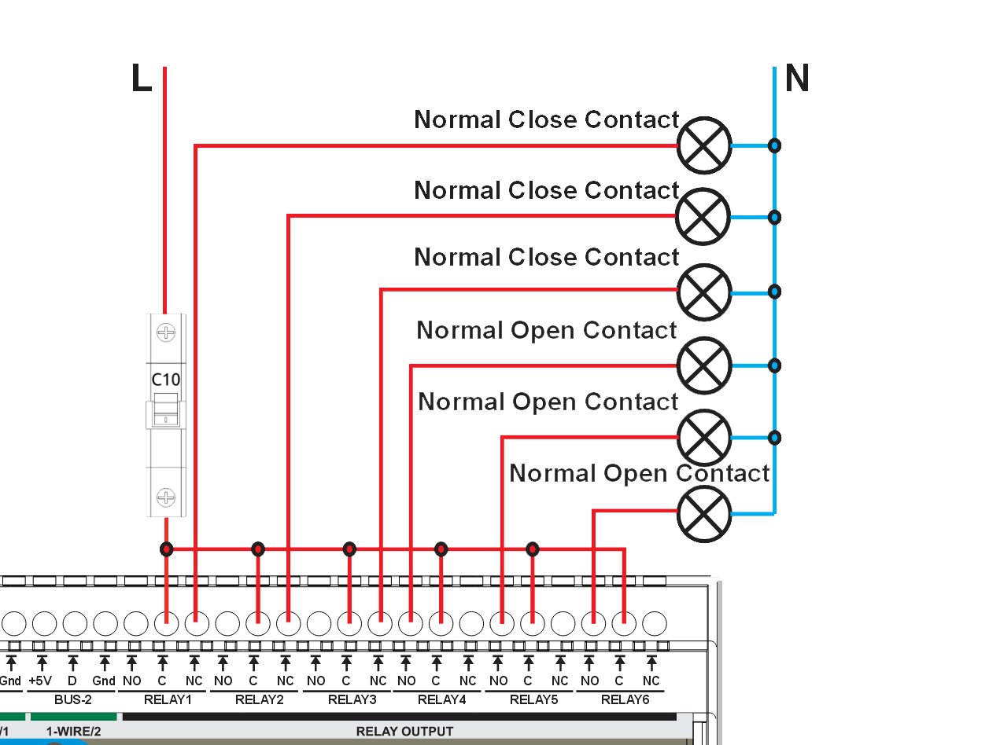
<br><small>Example wiring using <strong>Normally Open (NO)</strong> and <strong>Normally Closed (NC)</strong> relay contacts.</small>
</td>
<td width="50%">
<ul>
<li>Each relay has <strong>COM / NO / NC</strong> terminals</li>
<li>Use <strong>NO</strong> for default OFF loads</li>
<li>Use <strong>NC</strong> for default ON loads</li>
<li>⚡ Loads may carry hazardous voltage</li>
<li>Supports AC and DC switching (DC and inductive loads require derating)</li>
</ul>

> ⚠️ **External protection rule:** Every relay output MUST be protected by an external fuse or circuit breaker. The rated current of the protective device shall not exceed **3 A MAX per output** (board/system limit).

> ⚠️ **Common protection warning:** If a **single common fuse or circuit breaker** is used to protect multiple relay outputs (as shown in the wiring example), the protective device **shall NOT be sized by summing relay outputs**. The rating of the common protective device shall not exceed **3 A MAX per output** (board/system limit).

For inductive or DC loads (contactors, solenoids, motors), use appropriate suppression (RC snubbers, MOVs, or flyback diodes). Loads exceeding the recommended PCB current limit shall be switched using external contactors or wiring methods that bypass PCB copper paths.
</td>
</tr>
</table>

### Analog I/O (0–10V)

MiniPLC provides **4 analog inputs** and **1 analog output** with a standard **0–10V** signal range. Use these channels for common sensors, transmitters, and control devices that accept/produce 0–10V signals.

#### Analog Inputs (AI) — 4 Channels

##### Analog Input Specifications

| Channel | Signal Range | Resolution | Description |
|---------|--------------|------------|-------------|
| AI #1 | 0–10V | 16-bit | Analog input 1 |
| AI #2 | 0–10V | 16-bit | Analog input 2 |
| AI #3 | 0–10V | 16-bit | Analog input 3 |
| AI #4 | 0–10V | 16-bit | Analog input 4 |

##### Analog Input Wiring

<table>
<tr>
<td width="50%">

<br><small>Example: multiple 0–10V sensors powered from a shared supply (PS) with common 0V/GND.</small>
</td>
<td width="50%">
<strong>Wiring Checklist (AI)</strong>
<ul>
<li><strong>Signal:</strong> 0–10V</li>
<li><strong>Reference:</strong> connect sensor <strong>0V</strong> to <strong>AI GND</strong></li>
<li>Use a <strong>shared 0V/common ground</strong> between sensors and MiniPLC</li>
<li>For long runs, use a <strong>twisted pair</strong> (Signal + GND)</li>
<li>Keep analog wiring away from relay outputs and mains/AC wiring</li>
</ul>
</td>
</tr>
</table>

#### Analog Output (AO) — 1 Channel

##### Analog Output Specifications

| Channel | Signal Range | Resolution | Description |
|---------|--------------|------------|-------------|
| AO #1 | 0–10V | 12-bit (4096 steps) | Analog output for control signals |

##### Analog Output Wiring

<table>
<tr>
<td width="50%">
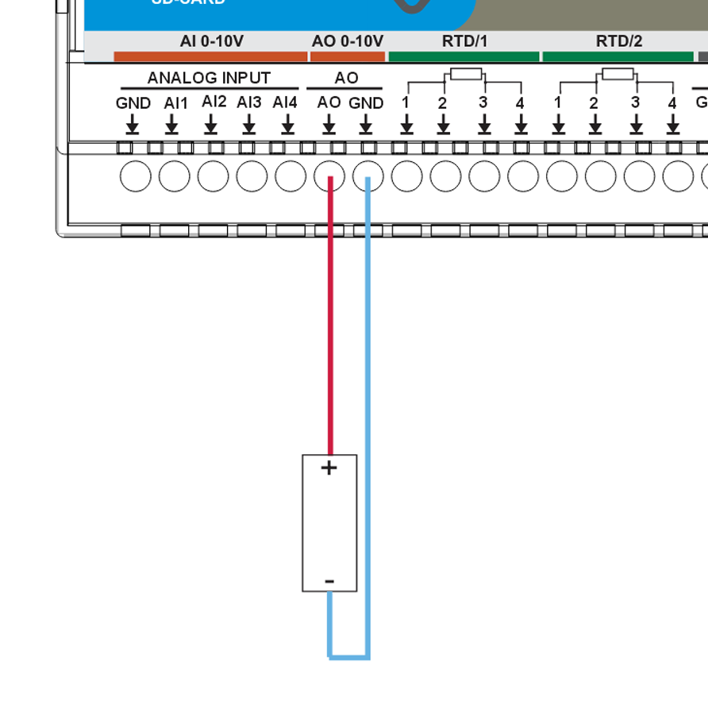
<br><small>Example: 0–10V analog output connection to an external device.</small>
</td>
<td width="50%">
<strong>Wiring Checklist (AO)</strong>
<ul>
<li><strong>Signal:</strong> 0–10V</li>
<li><strong>Reference ground:</strong> <strong>AO GND</strong></li>
<li>Use a <strong>twisted pair</strong> (AO + AO GND) for long runs</li>
<li>Keep AO wiring away from power switching and motor/VFD cables</li>
</ul>
<small>Typical use cases: analog setpoints (VFD speed), valve/actuator positioning, controller reference signals.</small>
</td>
</tr>
</table>

### Temperature Inputs

MiniPLC supports **RTD sensors** (PT100/PT1000) and **1-Wire temperature sensors** (DS18B20 or compatible) for reliable cabinet and process temperature monitoring.

#### Temperature Input Specifications

| Type | Channel | Sensor / Interface | Range | Accuracy |
|------|---------|-------------------|-------|----------|
| RTD | RTD #1 | PT100/PT1000 (SPI front-end) | -200°C to +850°C | ±0.5°C typical |
| RTD | RTD #2 | PT100/PT1000 (SPI front-end) | -200°C to +850°C | ±0.5°C typical |
| 1-Wire | BUS #1 | DS18B20 (or compatible) | -55°C to +125°C | ±0.5°C |
| 1-Wire | BUS #2 | DS18B20 (or compatible) | -55°C to +125°C | ±0.5°C |

#### Wiring Examples

<table>
<tr>
<td width="50%">
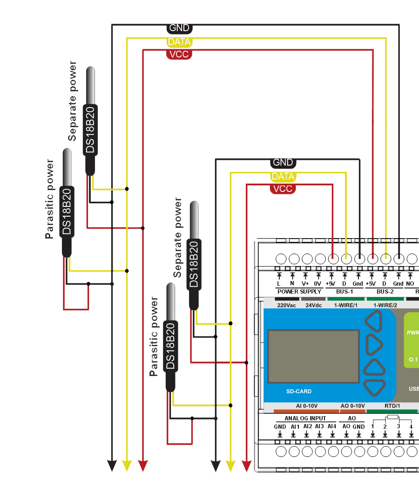
<br><small>1-Wire wiring example.</small>
</td>
<td width="50%">
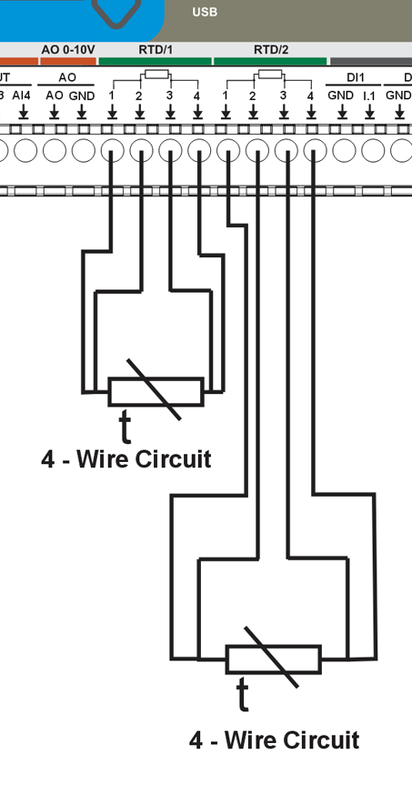
<br><small>RTD wiring example (4-wire).</small>
</td>
</tr>
<tr>
<td width="50%">
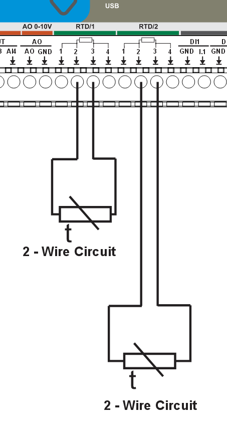
<br><small>RTD wiring example (2-wire).</small>
</td>
<td width="50%">
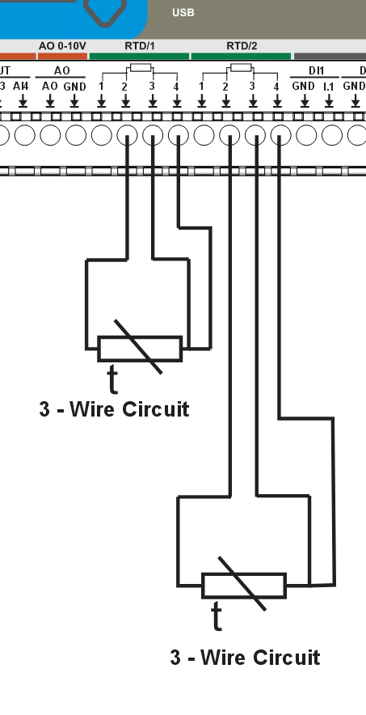
<br><small>RTD wiring example (3-wire).</small>
</td>
</tr>
</table>

### User Interface

| Component | Quantity | Control | Description |
|-----------|----------|---------|-------------|
| Front Panel Buttons | 4 | PCF8574A:0-3 | Tactile buttons for local control |
| User LEDs | 3 | PCF8574A:4-6 | Configurable indicator LEDs |
| Status LED | 1 | PCF8574A:7 | System status indicator |
| OLED Display | 1 | I²C (0x3C) | 128×64 pixel SH1106 display |
| Buzzer | 1 | GPIO2 | Audible alarm/notification |

**Features:**
- Buttons can be mapped to toggle relays, trigger scenes, or custom actions
- LEDs can show relay status, system state, or custom patterns
- OLED displays time, sensor readings, and system status
- Buzzer provides audible feedback for alarms or notifications

### Communication & Protocols

- **Modbus RTU (RS-485)** – UART-based communication for expansion modules and field devices
- **Wi-Fi** – ESP32 integrated (Improv onboarding supported)
- **Ethernet** – Optional via LAN8720 PHY

#### RS-485 Communication (Modbus RTU)

The MiniPLC provides a **half-duplex RS-485 interface** with integrated protection and fail-safe biasing. The interface is available on the **A / B / COM** terminals.

**Hardware Features:**
- RS-485 transceiver: **MAX485** (half-duplex)
- Fail-safe biasing network on A/B (idle state defined)
- Common-mode choke for EMI suppression
- TVS surge and ESD protection on A/B/COM
- Resettable PTC fuses on A and B lines
- Bidirectional logic level shifting between MCU and transceiver

#### RS-485 Wiring

<table>
<tr>
<td width="50%">
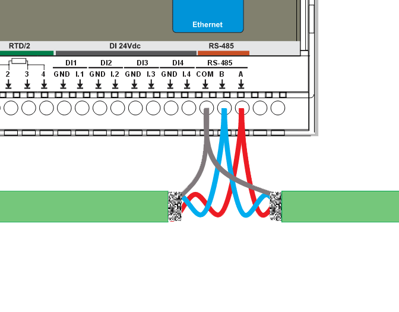
<br><small>Connect <strong>A</strong>, <strong>B</strong>, and <strong>COM</strong> to the bus.</small>
</td>
<td width="50%">
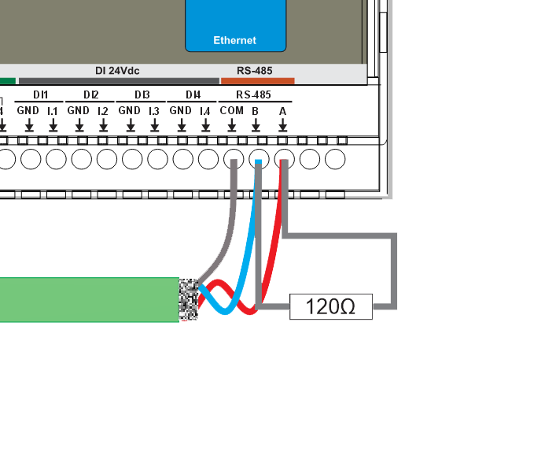
<br><small>Add <strong>120Ω termination</strong> only at the two physical ends of the bus.</small>
</td>
</tr>
</table>

#### Termination & Biasing

- Terminate with **120 Ω** only at the two ends of the line.
- Do not terminate intermediate devices.
- Fail-safe biasing is already provided inside the MiniPLC.

#### COM / Reference Ground

- Connect **COM** between all RS-485 nodes.
- This limits common-mode voltage and prevents communication faults.

#### Power Supply for Extension Modules

- **Recommended:** Use the **same power supply** for MiniPLC and all RS-485 extension modules.
- Distribute power in a **star topology** from the PSU.
- If separate PSUs are used, connect **0V references together at one point** (unless the extension module is galvanically isolated).

A common 0V reference prevents RS-485 common-mode voltage errors and communication faults.

> **Tip:** Cable recommendations, shield bonding, and routing rules are defined in the **Cable Recommendations & Shield Grounding** section below.

### Cable Recommendations & Shield Grounding

This section applies to **Analog (0–10V)**, **Temperature (RTD / 1-Wire)**, and **RS-485**. Use shielded, twisted constructions and bond shields correctly to reduce EMI and ground-loop issues.

#### General Routing Rules

- Route low-level signal cables (Analog/RTD/1-Wire/RS-485) separately from mains, relay outputs, contactors, VFD motor cables, and power wiring.
- If crossing power cables is unavoidable, cross at **90°**.
- Keep cable runs as short as practical and avoid parallel runs with high-current conductors.

#### Analog (0–10V) Cable

- **Construction:** twisted pair (Signal + GND) per channel
- **Shielding:** overall shield (standard) or individually shielded pairs (high-EMI)
- **Examples:** **J-Y(ST)Y** (overall shield) or **LI2YCY PIMF** (shielded twisted pairs; one pair per channel)

#### Temperature Cable

**RTD (PT100/PT1000):**
- **Recommended:** shielded multi-core for 2/3-wire; shielded pairs for best accuracy (4-wire)
- **Examples:** **J-Y(ST)Y** (overall shield) or **LI2YCY PIMF** (pairs; e.g. 2×2×0.50 for 4-wire)

**1-Wire (DS18B20):**
- **Recommended:** shielded 3-core ( +5V / DATA / GND ) for typical installations
- **High-EMI / long runs:** shielded pairs + overall shield (e.g. **LI2YCY PIMF 2×2×0.50**)
- **Topology:** daisy-chain (bus). Avoid star wiring.
- **Stubs:** keep sensor stubs ≤ **0.5 m**.
- **Pull-up (DATA):** **4.7 kΩ** typical; **2.2–3.3 kΩ** for long/heavy loads.

#### RS-485 Cable

- **Construction:** twisted pair for **A/B**
- **Characteristic impedance:** **120 Ω** (recommended)
- **Shielding:** overall shield is recommended in cabinets; use individually shielded pairs + overall shield in high-EMI
- **Examples:** **J-Y(ST)Y 2×2×0.5 mm²** or **LI2YCY PiMF 2×2×0.50**
- Use one twisted pair for **A/B**. Use the second pair for **COM (0V reference)** or spare.

#### Shield Grounding

- **Default recommendation:** bond cable shield(s) to cabinet **PE/EMC ground at the PLC end only**.
- **Do not** connect shields to signal terminals (AI/AO/RTD/1-Wire/RS-485 A/B/COM).
- If both ends are in equipotential bonded cabinets, shields may be bonded at both ends using proper 360° clamps.

### System Architecture & Pinout

<table>
<tr>
<td width="50%">
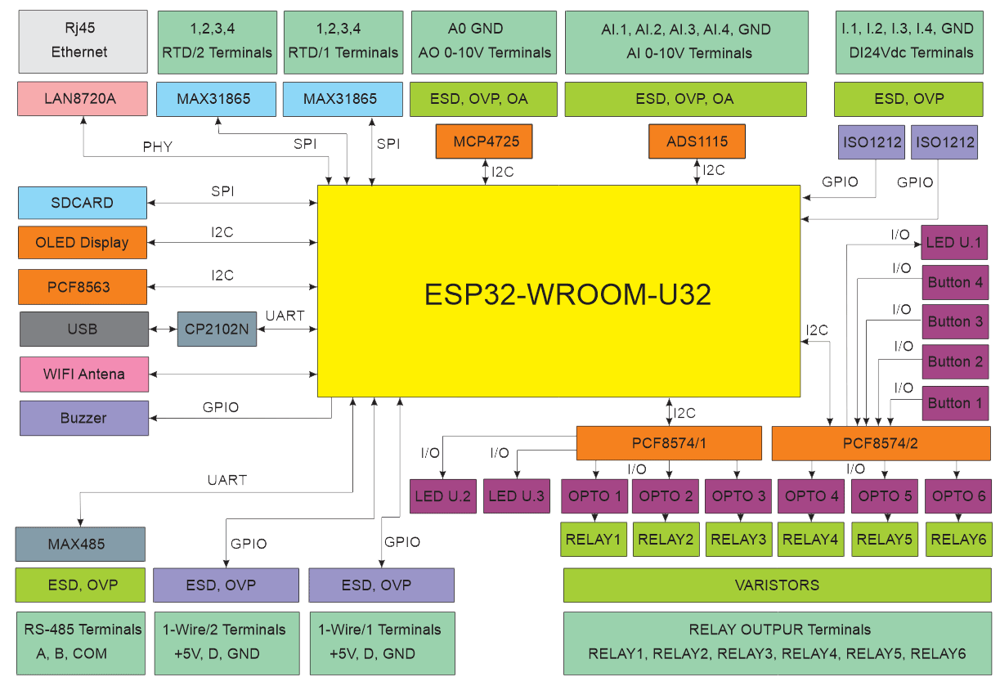
<br><small>System block diagram showing internal architecture and interfaces.</small>
</td>
<td width="50%">
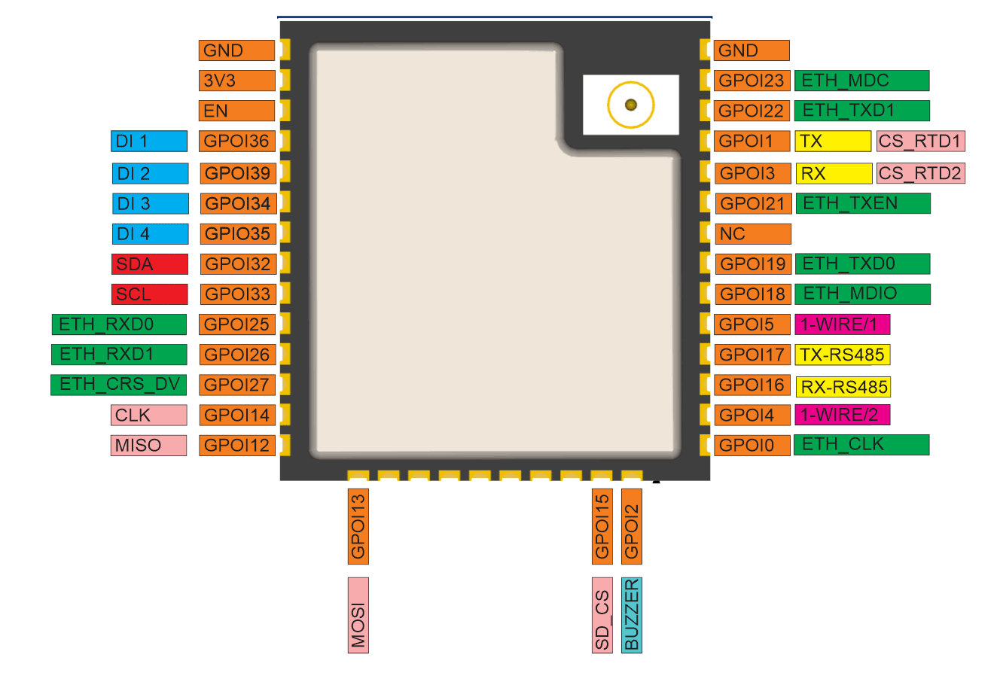
<br><small>Complete GPIO and connector pin assignments.</small>
</td>
</tr>
</table>

## ESPHome YAML Configuration & Hardware Pinout Manual

### Introduction

The HomeMaster MiniPLC has **ESPHome preinstalled**, and the behavior is defined by the `miniplc.yaml` configuration file. This file contains all hardware definitions, sensor configurations, and I/O mappings for the device.

The default configuration can be downloaded from GitHub:

- [`miniplc.yaml` on GitHub](https://github.com/isystemsautomation/HOMEMASTER/blob/main/MiniPLC/Firmware/miniplc.yaml)

The default configuration includes all essential components enabled, while optional features such as Ethernet, RTD temperature sensors, 1-Wire sensors, microSD card, and web server are commented out. To enable any optional feature, remove the `#` comment markers from the beginning of the relevant configuration block and adjust parameters as needed for your specific installation.

### ESP32 GPIO Pinout (MiniPLC)

| GPIO | Net Name | Function | Used By |
|------|----------|----------|---------|
| GPIO36 | DI24V-1 | Digital Input 1 | 24V DI #1 |
| GPIO39 | DI24V-2 | Digital Input 2 | 24V DI #2 |
| GPIO34 | DI24V-3 | Digital Input 3 | 24V DI #3 |
| GPIO35 | DI24V-4 | Digital Input 4 | 24V DI #4 |
| GPIO32 | ESP_SDA | I²C SDA | OLED, RTC, ADC, DAC, PCF8574 |
| GPIO33 | ESP_SDL | I²C SCL | OLED, RTC, ADC, DAC, PCF8574 |
| GPIO17 | TXD_RS0 | UART TX | RS-485 |
| GPIO16 | RXD_RS0 | UART RX | RS-485 |
| GPIO5 | 1-WIRE1 | 1-Wire Bus #1 | DS18B20 |
| GPIO4 | 1-WIRE2 | 1-Wire Bus #2 | DS18B20 |
| GPIO2 | BUZZER | PWM Output | Buzzer |
| GPIO12 | MISO | SPI MISO | SD / RTD |
| GPIO13 | MOSI | SPI MOSI | SD / RTD |
| GPIO14 | SCLK | SPI Clock | SD / RTD |
| GPIO15 | SD_CS | SPI CS | microSD |
| GPIO23 | ETH_MDC | RMII MDC | Ethernet PHY |
| GPIO18 | ETH_MDIO | RMII MDIO | Ethernet PHY |
| GPIO19 | ETH_TXD0 | RMII TXD0 | Ethernet PHY |
| GPIO22 | ETH_TXD1 | RMII TXD1 | Ethernet PHY |
| GPIO21 | ETH_TXEN | RMII TXEN | Ethernet PHY |
| GPIO26 | ETH_RXD0 | RMII RXD0 | Ethernet PHY |
| GPIO25 | ETH_RXD1 | RMII RXD1 | Ethernet PHY |
| GPIO27 | ETH_CRS_DV | RMII CRS_DV | Ethernet PHY |
| GPIO0 | ETH_CLK | RMII 50 MHz REF | Ethernet Clock |
| GPIO1 | CS_RTD1 | SPI CS | MAX31865 #1 |
| GPIO3 | CS_RTD2 | SPI CS | MAX31865 #2 |

### PCF8574 Mapping

#### PCF8574A (0x38)

| Pin | Signal | Function |
|-----|--------|----------|
| P0 | BTN1 | Button 1 |
| P1 | BTN2 | Button 2 |
| P2 | BTN3 | Button 3 |
| P3 | BTN4 | Button 4 |
| P4 | LED1 | User LED 1 |
| P5 | LED2 | User LED 2 |
| P6 | LED3 | User LED 3 |
| P7 | LED_STATUS | Status LED |

#### PCF8574B (0x39)

| Pin | Relay |
|-----|-------|
| P0 | Relay 3 |
| P1 | Relay 2 |
| P2 | Relay 1 |
| P4 | Relay 6 |
| P5 | Relay 5 |
| P6 | Relay 4 |

### ADS1115 Analog Inputs

| Channel | Terminal | ESPHome Name |
|---------|----------|--------------|
| A0 | AI0 | Analog Input 1 |
| A1 | AI1 | Analog Input 2 |
| A2 | AI2 | Analog Input 3 |
| A3 | AI3 | Analog Input 4 |

#### WiFi

Wi‑Fi credentials by default YAML config are set via **Improv (Serial/BLE)** and do not require changes to the YAML.  
If you need to force static Wi‑Fi configuration instead of Improv, you can manually edit the `wifi:` block in `miniplc.yaml` (SSID, password, static IP, gateway, subnet, DNS).

#### Ethernet

Enable when you want to use Ethernet **instead of** Wi‑Fi. The ESPHome stack and ESP32‑WROOM do **not** support using Wi‑Fi and Ethernet at the same time. To use Ethernet, you must **comment out** the `wifi:` block that is normally configured via Improv (Serial/BLE) and **uncomment** the `ethernet:` block in `miniplc.yaml`.

The Ethernet block uses fixed hardware pins as defined in the MiniPLC schematics: GPIO23 for MDC, GPIO18 for MDIO, GPIO0 for the 50 MHz RMII reference clock, and PHY address 1. These pins and `clk_mode` are part of the MiniPLC hardware design and **must not be changed**.

```yaml
ethernet:
  type: LAN8720
  mdc_pin: GPIO23
  mdio_pin: GPIO18
  clk_mode: GPIO0_OUT
  phy_addr: 1
```

#### I²C

The I²C bus is used by the OLED display, RTC (PCF8563), ADC (ADS1115), DAC (MCP4725), and PCF8574 I/O expanders.  
It is enabled by default and required for most MiniPLC functionality.  
Change `frequency` to adjust I²C speed (default **400 kHz**). Modify `timeout` for bus timeout. Set `scan: true` to scan for devices on boot.

**MiniPLC I²C Address Map**

| Device | I²C Address | YAML ID / Usage | Function |
|--------|-------------|-----------------|----------|
| **OLED (SH1106 128×64)** | `0x3C` | `display:` | Status screen |
| **RTC (PCF8563)** | `0x51` | `time:` | Real-time clock |
| **ADC (ADS1115)** | `0x48` | `ads1115:` | 4× analog inputs (AI0–AI3) |
| **IO Expander A (PCF8574)** | `0x38` | `pcf8574_hub_a` | Buttons + LEDs |
| **IO Expander B (PCF8574)** | `0x39` | `pcf8574_hub_b` | Relays |
| **DAC (MCP4725)** | `0x60` | `output:` | 0–10 V analog output (AO) |

```yaml
i2c:
  - id: bus_a
    sda: 32
    scl: 33
    frequency: 400kHz
    timeout: 1s
    scan: true
```

#### RS-485 UART & Modbus

The MiniPLC exposes a **half‑duplex RS‑485 bus** on the A/B/COM terminals, driven by the ESP32 UART on **GPIO17 (TX)** and **GPIO16 (RX)**.  
This bus is used for **Modbus RTU** communication with external expansion modules such as DIO‑430‑R1, DIM‑420‑R1, and ENM‑223‑R1.

- The `uart:` block configures the physical RS‑485 port (GPIO pins, baud rate, parity, stop bits).  
- The `modbus:` block defines a shared Modbus bus instance that all extension modules attach to via `modbus_controller:` or `packages:`.

You normally only change the **baud_rate** (default `19200`) and, if required, `parity`/`stop_bits` to match your Modbus network.  
The TX/RX pins are fixed by hardware and must remain **GPIO17/16**.  
Each extension module must have a unique Modbus address set in its own WebConfig (DIP/menu) and referenced in the YAML.

**Base RS‑485 + Modbus bus configuration:**

```yaml
uart:
  id: uart_modbus
  tx_pin: 17
  rx_pin: 16
  baud_rate: 19200
  parity: NONE
  stop_bits: 1

modbus:
  id: modbus_bus
  uart_id: uart_modbus
```

##### Example: DIO‑430‑R1 Digital I/O Module

Minimal controller-side YAML on the MiniPLC to talk to one DIO‑430‑R1 using the official package:

```yaml
uart:
  id: uart_modbus
  tx_pin: 17
  rx_pin: 16
  baud_rate: 19200
  parity: NONE
  stop_bits: 1

modbus:
  id: modbus_bus
  uart_id: uart_modbus

packages:
  dio1:
    url: https://github.com/isystemsautomation/HOMEMASTER
    ref: main
    files:
      - path: DIO-430-R1/Firmware/default_dio_430_r1_plc/default_dio_430_r1_plc.yaml
        vars:
          dio_prefix: "DIO#1"   # Shown in Home Assistant entity names
          dio_id: dio_1         # Internal unique ID in ESPHome
          dio_address: 4        # Modbus address set in the DIO WebConfig
    refresh: 1d
```

For multiple DIO‑430‑R1 units, duplicate the `dio1:` block (`dio2:`, `dio3:`, …) with unique `dio_id`, `dio_prefix`, and `dio_address` values.

> **Note:** Detailed instructions for wiring, Modbus addressing, and YAML options for each expansion module (DIO‑430‑R1, DIM‑420‑R1, ENM‑223‑R1, ALM‑173‑R1, etc.) are provided in their respective `README.md` files in the `HOMEMASTER` repository. Always refer to the module‑specific README for coil/register maps, entities, and recommended settings.

#### 1-Wire

The MiniPLC provides two independent 1-Wire buses for DS18B20 temperature sensors. The hardware pinout is fixed: **Bus #1 uses GPIO5**, **Bus #2 uses GPIO4**. These pins cannot be changed as they are defined by the PCB design.

To use 1-Wire sensors, uncomment the sensor blocks in the YAML and configure the sensor addresses. You can adjust `update_interval` and customize sensor `name` values, but the GPIO pins are hardware-defined.

```yaml
one_wire:
  - platform: gpio
    pin: GPIO05
    id: hub_1
  - platform: gpio
    pin: GPIO04
    id: hub_2

# Example sensor configuration:
sensor:
  - platform: dallas_temp
    one_wire_id: hub_1
    address: 0x0000000000000000  # Replace with actual sensor address
    name: "1-WIRE Dallas temperature BUS1"
    update_interval: 60s
  - platform: dallas_temp
    one_wire_id: hub_2
    address: 0x0000000000000000  # Replace with actual sensor address
    name: "1-WIRE Dallas temperature BUS2"
    update_interval: 60s
```

#### SPI

The MiniPLC SPI bus is used by the microSD card and MAX31865 RTD temperature sensors. The hardware pinout is fixed: **GPIO12 (MISO)**, **GPIO13 (MOSI)**, **GPIO14 (SCLK)**. These pins cannot be changed as they are defined by the PCB design.

To use SPI devices (microSD or RTD sensors), uncomment the `spi:` block. The pin assignments are hardware-defined and must match the PCB layout.

```yaml
spi:
  miso_pin: GPIO12
  mosi_pin: GPIO13
  clk_pin: GPIO14
```

#### Digital Inputs

The MiniPLC provides four 24V isolated digital inputs (DI #1 through DI #4). The hardware pinout is fixed: **GPIO36 (DI #1)**, **GPIO39 (DI #2)**, **GPIO34 (DI #3)**, **GPIO35 (DI #4)**. These pins cannot be changed as they are defined by the PCB design.

You can reconfigure the `name` values for Home Assistant, add `inverted: true` if input logic needs inversion, and adjust `filters` for debouncing or signal processing. The GPIO pin assignments are hardware-defined.

```yaml
binary_sensor:
  - platform: gpio
    pin:
      number: GPIO36
    name: "DI #1"
    # Optional: Add filters for debouncing
    # filters:
    #   - delayed_on: 50ms
    #   - delayed_off: 50ms
  - platform: gpio
    pin:
      number: GPIO39
    name: "DI #2"
  - platform: gpio
    pin:
      number: GPIO34
    name: "DI #3"
  - platform: gpio
    pin:
      number: GPIO35
    name: "DI #4"
```

#### Relays

The MiniPLC provides six SPDT relay outputs controlled via PCF8574B and PCF8574A I/O expanders. The hardware pinout is fixed: **Relay #1 (PCF8574B:2)**, **Relay #2 (PCF8574B:1)**, **Relay #3 (PCF8574B:0)**, **Relay #4 (PCF8574A:6)**, **Relay #5 (PCF8574A:5)**, **Relay #6 (PCF8574A:4)**. These PCF8574 pin assignments cannot be changed as they are defined by the PCB design.

You can reconfigure the `name` values for Home Assistant. The `inverted: true` setting is required for correct relay operation and must not be changed. The PCF8574 pin numbers are hardware-defined.

```yaml
switch:
  - platform: gpio
    name: "RELAY #1"
    pin:
      pcf8574: pcf8574_hub_b
      number: 2
      mode:
        output: true
      inverted: true
  - platform: gpio
    name: "RELAY #2"
    pin:
      pcf8574: pcf8574_hub_b
      number: 1
      mode:
        output: true
      inverted: true
  - platform: gpio
    name: "RELAY #3"
    pin:
      pcf8574: pcf8574_hub_b
      number: 0
      mode:
        output: true
      inverted: true
  - platform: gpio
    name: "RELAY #4"
    pin:
      pcf8574: pcf8574_hub_a
      number: 6
      mode:
        output: true
      inverted: true
  - platform: gpio
    name: "RELAY #5"
    pin:
      pcf8574: pcf8574_hub_a
      number: 5
      mode:
        output: true
      inverted: true
  - platform: gpio
    name: "RELAY #6"
    pin:
      pcf8574: pcf8574_hub_a
      number: 4
      mode:
        output: true
      inverted: true
```

#### Buttons

The MiniPLC provides four front panel buttons connected to PCF8574A pins P0-P3. The hardware pinout is fixed: **Button #1 (P0)**, **Button #2 (P1)**, **Button #3 (P2)**, **Button #4 (P3)**. These PCF8574 pin assignments cannot be changed as they are defined by the PCB design.

You can reconfigure the `name` values for Home Assistant. The `inverted: true` setting is required due to the button pull-up configuration and must not be changed. You can add `on_press` or `on_release` actions to trigger automations. The PCF8574 pin numbers are hardware-defined.

```yaml
binary_sensor:
  - platform: gpio
    name: "Button #1"
    pin:
      pcf8574: pcf8574_hub_a
      number: 0
      inverted: true
    # Optional: Add actions
    # on_press:
    #   - switch.toggle: relay_1
  - platform: gpio
    name: "Button #2"
    pin:
      pcf8574: pcf8574_hub_a
      number: 1
      inverted: true
  - platform: gpio
    name: "Button #3"
    pin:
      pcf8574: pcf8574_hub_a
      number: 2
      inverted: true
  - platform: gpio
    name: "Button #4"
    pin:
      pcf8574: pcf8574_hub_a
      number: 3
      inverted: true
```

#### LEDs

The MiniPLC provides three user LEDs (LED #1, #2, #3) and one status LED connected to PCF8574A pins P4-P7. The hardware pinout is fixed: **LED #1 (P4)**, **LED #2 (P5)**, **LED #3 (P6)**, **Status LED (P7)**. These PCF8574 pin assignments cannot be changed as they are defined by the PCB design.

You can reconfigure the `name` values for Home Assistant. The `inverted: true` setting is required for correct LED operation and must not be changed. The PCF8574 pin numbers are hardware-defined.

```yaml
switch:
  - platform: gpio
    name: "LED #1"
    pin:
      pcf8574: pcf8574_hub_a
      number: 4
      mode:
        output: true
      inverted: true
  - platform: gpio
    name: "LED #2"
    pin:
      pcf8574: pcf8574_hub_a
      number: 5
      mode:
        output: true
      inverted: true
  - platform: gpio
    name: "LED #3"
    pin:
      pcf8574: pcf8574_hub_a
      number: 6
      mode:
        output: true
      inverted: true

status_led:
  pin:
    pcf8574: pcf8574_hub_a
    number: 7
    mode:
      output: true
    inverted: false
```

#### RTC

The MiniPLC includes a PCF8563 real-time clock at I²C address **0x51**. The I²C address is fixed by the PCB design and cannot be changed.

You can modify synchronization settings in the `homeassistant` time platform block to adjust how the RTC syncs with Home Assistant time.

```yaml
time:
  - platform: pcf8563
    id: pcf8563_time
    address: 0x51
  - platform: homeassistant
    on_time_sync:
      then:
        pcf8563.write_time:
```

#### OLED

The MiniPLC includes a SH1106 128×64 OLED display at I²C address **0x3C**. The I²C address is fixed by the PCB design and cannot be changed.

You can reconfigure `rotation` to change display orientation (0, 90, 180, 270), adjust `contrast` percentage, and customize the `lambda` function to change displayed content. The I²C address is hardware-defined.

```yaml
display:
  - platform: ssd1306_i2c
    model: "SH1106 128x64"
    address: 0x3C
    rotation: 180
    contrast: 100%
    id: oled_display
    update_interval: 1s
    lambda: |-
      it.printf(64, 0, id(font1), TextAlign::TOP_CENTER, "HOMEMASTER");
      it.strftime(0, 60, id(font2), TextAlign::BASELINE_LEFT, "%H:%M", id(pcf8563_time).now());
```

#### ADC (Analog Inputs)

The MiniPLC includes an ADS1115 16-bit I²C ADC at address **0x48** for reading four single-ended 0–10 V analog inputs.

Each channel is hardware conditioned by an LM224 op-amp buffer and resistor divider that scales the external 0–10 V signal into the ADS1115 input range.

**Channel mapping (fixed by PCB)**

| ADS1115 Channel | Internal Net | Terminal |
|-----------------|--------------|----------|
| AIN0 | AI0_ADC | AI0 |
| AIN1 | AI1_ADC | AI1 |
| AIN2 | AI2_ADC | AI2 |
| AIN3 | AI3_ADC | AI3 |

This mapping is hardwired on the PCB and cannot be changed in software.

**Signal path (hardware)**

External 0–10 V input →  
resistor divider (47 kΩ / 47 kΩ network) →  
LM224 buffer →  
Schottky input clamps →  
ADS1115 AINx

(see schematic, page 2, "ADC")

**ESPHome configuration**

```yaml
ads1115:
  - address: 0x48
    id: adc_hub

sensor:
  - platform: ads1115
    ads1115_id: adc_hub
    multiplexer: A0_GND
    gain: 1
    name: "AI0"
    filters:
      - multiply: 0.00305

  - platform: ads1115
    ads1115_id: adc_hub
    multiplexer: A1_GND
    gain: 1
    name: "AI1"
    filters:
      - multiply: 0.00305

  - platform: ads1115
    ads1115_id: adc_hub
    multiplexer: A2_GND
    gain: 1
    name: "AI2"
    filters:
      - multiply: 0.00305

  - platform: ads1115
    ads1115_id: adc_hub
    multiplexer: A3_GND
    gain: 1
    name: "AI3"
    filters:
      - multiply: 0.00305
```

**What can be configured in YAML**

| Parameter | Purpose |
|-----------|---------|
| `multiplexer` | Selects AIN0–AIN3 |
| `gain` | Input range (must match hardware scaling) |
| `filters.multiply` | Converts raw ADC value to volts |
| `update_interval` | Sampling rate |

**What cannot be changed**

- I²C address (0x48)
- Channel-to-terminal mapping
- Input range (0–10 V)
- Analog front-end scaling

These are fixed by the PCB design.

#### DAC

The MiniPLC includes an **MCP4725 12-bit I²C DAC** at address **0x60** for generating a **single 0–10 V analog output (AO)**.

The DAC output is hardware conditioned by an **LM224 op-amp stage and resistor scaling network** that converts the MCP4725's 0–3.3 V output range into a field-level **0–10 V signal**.

The I²C address (**0x60**) and output channel are **fixed by the PCB design** and cannot be changed in software.

**Signal path (hardware):**  
MCP4725 DAC → RC filter → LM224 amplifier → scaling network → AO terminal

**ESPHome configuration:**

```yaml
output:
  - platform: mcp4725
    id: dac_output
```

The DAC is exposed in ESPHome as a 0.0–1.0 normalized analog output.

**Example (0–10 V control):**

```yaml
fan:
  - platform: speed
    output: dac_output
    name: "DAC 0–10V"
    speed_count: 100
```

| Fan speed | Output voltage |
|-----------|----------------|
| 0% | 0 V |
| 50% | ~5 V |
| 100% | ~10 V |

**Configurable in YAML:** `speed_count`, automations, `output.set_level`  
**Fixed by hardware:** I²C address, output range, scaling

#### Buzzer

The MiniPLC includes a buzzer connected to **GPIO2** as a PWM output for audible notifications and alarms. The GPIO pin is fixed by the PCB design and cannot be changed.

You can reconfigure the `frequency` in the switch action to change tone, modify `level` percentage to change volume, and add multiple switch actions for different tones. The GPIO pin assignment is hardware-defined.

```yaml
output:
  - platform: ledc
    pin: GPIO02
    id: buzzer_output

switch:
  - platform: template
    name: "Switch buzzer"
    optimistic: true
    turn_on_action:
      - output.turn_on: buzzer_output
      - output.ledc.set_frequency:
          id: buzzer_output
          frequency: "2441Hz"
      - output.set_level:
          id: buzzer_output
          level: "75%"
    turn_off_action:
      - output.turn_off: buzzer_output
```

## RTD Inputs (RTD1 & RTD2)

The MiniPLC includes **two MAX31865 RTD interface ICs** for direct connection of **PT100 and PT1000 sensors** in **2-, 3-, or 4-wire** configurations.

Each RTD channel has an on-board **8-position DIP switch block**  
(SW1 = RTD1, SW2 = RTD2) that configures the complete RTD bias, sense, and compensation network.

**Every switch position is functional.**  
There is no unused or "default OFF" position — the **entire 8-switch pattern** must match the selected sensor type and wiring mode.

---

### Factory DIP switch configuration (all 8 positions)

#### RTD1 → PT100, 2-wire

| Switch | 1 | 2 | 3 | 4 | 5 | 6 | 7 | 8 |
|--------|---|---|---|---|---|---|---|---|
| State  | **ON** | **ON** | **OFF** | **OFF** | **ON** | **ON** | **OFF** | **ON** |

#### RTD2 → PT1000, 2-wire

| Switch | 1 | 2 | 3 | 4 | 5 | 6 | 7 | 8 |
|--------|---|---|---|---|---|---|---|---|
| State  | **ON** | **OFF** | **ON** | **OFF** | **ON** | **OFF** | **ON** | **ON** |

---

### DIP switch logic (per channel)

| Switch | 1 | 2 | 3 | 4 | 5 | 6 | 7 | 8 |
|--------|---|---|---|---|---|---|---|---|
| **PT100** | – | ON | OFF | – | – | ON | OFF | – |
| **PT1000** | – | OFF | ON | – | – | OFF | ON | – |
| **2-wire** | ON | – | – | OFF | ON | – | – | ON |
| **3-wire** | OFF | – | – | ON | OFF | – | – | ON |
| **4-wire** | OFF | – | – | OFF | ON | – | – | OFF |

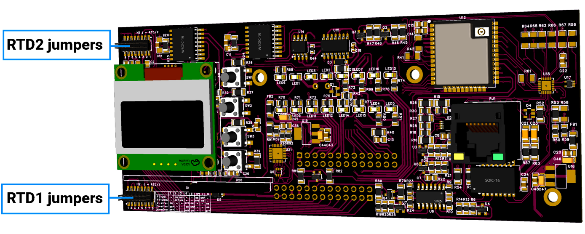

---

### Terminal mapping (fixed by PCB)

| Terminal | Signal |
|----------|--------|
| 1 | FORCE+ |
| 2 | RTDIN+ |
| 3 | RTDIN− |
| 4 | FORCE− |

---

### ESPHome YAML configuration

```yaml
spi:
  miso_pin: GPIO12
  mosi_pin: GPIO13
  clk_pin: GPIO14

sensor:
  - platform: max31865
    name: "RTD1 Temperature"
    cs_pin: GPIO1
    rtd_nominal_resistance: 100
    reference_resistance: 400
    wires: 2

  - platform: max31865
    name: "RTD2 Temperature"
    cs_pin: GPIO3
    rtd_nominal_resistance: 1000
    reference_resistance: 400
    wires: 2
```

**How to change sensor type or wiring**

1. Power OFF the MiniPLC
2. Set all 8 DIP positions according to the table above
3. Update YAML (`rtd_nominal_resistance` and `wires`)
4. Power ON and verify temperature

**Fixed by hardware**

- MAX31865 IC
- SPI pins and CS pins
- Reference resistor network
- Terminal order

**Configurable in YAML**

- Sensor type (PT100 / PT1000)
- Wiring mode (2/3/4 wire)
- Update interval and filtering
- Alarm thresholds

## Links

- **Product Page:** [home-master.eu/shop/esp32-miniplc-55](https://www.home-master.eu/shop/esp32-miniplc-55)
- **GitHub Repository:** [github.com/isystemsautomation/HOMEMASTER/tree/main/MiniPLC](https://github.com/isystemsautomation/HOMEMASTER/tree/main/MiniPLC)
- **Manufacturer:** [home-master.eu](https://www.home-master.eu/)
