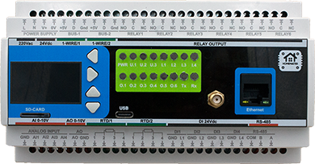

# HomeMaster MiniPLC (ESP32)

## Overview

The **HomeMaster MiniPLC** is a professional, open-source DIN rail controller built around the ESP32 platform, designed for robust and scalable smart automation in residential, commercial, and light industrial environments. It combines extensive onboard I/O—including relays, digital and analog inputs, temperature sensors, and a user interface—with native Home Assistant integration via pre-installed ESPHome.

Engineered for reliability and flexibility, the MiniPLC supports multiple power input options (24V DC or wide-range AC/DC) and features an isolated RS-485 Modbus interface for expansion with a wide range of compatible I/O modules. Its local processing capability ensures continued operation even when network or cloud connectivity is lost, making it suitable for mission-critical applications.

This controller operates as a complete standalone automation system using its comprehensive onboard I/O, while also offering seamless expansion via the RS-485 bus to connect HomeMaster smart modules for energy metering, lighting control, security, and more.

## Quick Overview

- Pre-installed **ESPHome** for native Home Assistant integration
- Industrial **DIN-rail form factor** with 24 V DC supply
- Runs **locally and offline** without cloud or HA
- **Expandable** via RS-485 Modbus field devices

## Typical Applications

- Smart home central controller
- HVAC automation and plant control
- Solar and energy management systems
- Laboratory automation
- Industrial I/O gateway
- Building management systems (BMS)
- SCADA edge controller
- RS-485 Modbus master / field gateway

## Technical Specifications

| Specification | Details |
|--------------|---------|
| **Microcontroller** | ESP32-WROOM-32U (dual-core) |
| **Power Input** | 24 V DC nominal (V+ / 0V) OR 85–265 V AC (L / N) OR 120–370 V DC (L / N + / −) |
| **Digital Inputs** | 4 × isolated, 24 V DC compatible |
| **Relay Outputs** | 6 × SPDT — **3 A MAX continuous per output** (board/system limit). Relay component contacts rated up to 12 A @ 250 V AC (resistive). |
| **Analog Inputs** | 4 × 0–10 V, 16-bit (ADS1115) |
| **Analog Output** | 1 × 0–10 V, 12-bit (MCP4725) |
| **Temperature Inputs** | 2 × RTD (PT100/PT1000 via MAX31865), 2 × 1-Wire (DS18B20 compatible) |
| **Display** | 128 × 64 OLED (SH1106) |
| **User Interface** | 4 buttons, 3 user LEDs, 1 status LED, onboard buzzer (GPIO2, PWM) |
| **Wi-Fi** | Wi-Fi (ESP32) |
| **Ethernet** | Optional Ethernet (LAN8720 PHY) |
| **RS-485** | RS-485 Modbus RTU (MAX485, half-duplex) with TVS surge protection, PTC fuses, EMI choke, and fail-safe biasing |
| **Storage** | MicroSD card (SPI interface, power-switched 3.3 V rail) |
| **USB** | USB-C (ESD protected, CC detection, data to ESP32) |
| **RTC** | PCF8563 with battery backup |

> **Note:** Relay outputs are not internally fused. Use external overcurrent protection per local code and use an external contactor/relay for loads above 3 A or with high inrush/inductive characteristics.

## Installation & Environmental

- **Mounting:** 35 mm DIN rail
- **Dimensions:** 157.4 × 91 × 58.4 mm (6.2 × 3.58 × 2.3 in) (L × W × H)
- **DIN units:** 9 division units (≈ 90 mm DIN rail mounting width)
- **Weight:** 300 g (net), 450 g (gross)
- **Operating Temperature:** 0 °C to +40 °C
- **Storage Temperature:** -10 °C to 55 °C
- **Relative Humidity:** 0–90 % RH, non-condensing
- **Ingress Protection:** IP20 (inside cabinet)
- **Installation:** Indoor control cabinet only; not for outdoor or exposed installation

> **Safety:** All wiring terminals must be protected against accidental contact by an insulating front plate, wiring duct, or terminal cover. Exposed live terminals are not permitted.

## Home Assistant & ESPHome Integration

The MiniPLC comes with **ESPHome pre-installed** and can be integrated directly into Home Assistant without flashing custom firmware.

### Quick Setup Process (Improv Wi-Fi)

1. **Mount & Power** – Install on a 35mm DIN rail and connect power.
2. **Open Improv** – Go to [improv-wifi.com](https://improv-wifi.com).
3. **Connect** – Use USB-C (Serial) or Bluetooth LE.
4. **Enter Wi-Fi** – Input SSID and password, then press Connect.
5. **Auto-Discovery** – Device appears in Home Assistant & ESPHome Dashboard.

### One-Click Import (ESPHome Dashboard)

Once connected to Wi-Fi, the MiniPLC is automatically discovered in the ESPHome Dashboard. Click **"Take Control"** to import the official configuration directly from GitHub.

### USB Type-C Manual Flashing (Optional)

1. Connect the MiniPLC to your computer using USB Type-C.
2. Open ESPHome Dashboard and add the device.
3. Import the configuration from [miniplc.yaml](Firmware/miniplc.yaml).
4. Compile and flash the firmware.
5. The device reboots automatically and runs the new firmware.

See [Firmware/miniplc.yaml](Firmware/miniplc.yaml) for the complete ESPHome configuration file with all sensors, switches, and I/O properly configured.

## Documentation & Resources

### Hardware Design Files

- [Schematic (MCU Board)](Schematic/MCU_Board.pdf) - Main controller board schematic
- [Schematic (Relay Board)](Schematic/Relay_Board.pdf) - Relay and power section schematic
- [Schematic (USB Board)](Schematic/USB_Board.pdf) - USB-C interface and power management

### Firmware & Software

- [Default ESPHome Config](Firmware/miniplc.yaml) - Pre-configured YAML for Home Assistant
- [Firmware Source Code](Firmware/) - Latest firmware builds and source
- [ESPHome Integration Guide](README.md) - Complete setup instructions (this file)

### Manuals & Datasheets

- [Datasheet](Manuals/Datasheet.pdf) - Technical specifications and ratings
- [User Manual](Manuals/User_Manual.pdf) - Installation and configuration guide

All design files and documentation are available in the [HomeMaster GitHub repository](https://github.com/isystemsautomation/HOMEMASTER/tree/main/MiniPLC).

## Power Supply

The MiniPLC supports **one power input method at a time**: **24 V DC nominal** on **V+ / 0V** (recommended) **OR** **Mains AC / High-Voltage DC** on **L / N** via the onboard isolated power module.

> ⚠️ **Critical:** Exactly **ONE** power input method may be used at a time. **V+ / 0V** and **L / N** must **never** be connected simultaneously.

### Power Input Specifications

| Input Option | Terminals | Range | Notes |
|--------------|-----------|-------|-------|
| **24 V DC (recommended)** | V+ / 0V | 24 V DC | Preferred for most installations. Powers internal rail **+24VDC_FUSED**. |
| **Mains AC** | L / N | 85–265 V AC, 47–63 Hz | Uses onboard isolated module to generate the internal 24 V rail. External protection required. |
| **High-Voltage DC** | L / N (+ / −) | 120–370 V DC | Uses onboard isolated module to generate the internal 24 V rail. External protection required. |

### 24 V DC Input (V+ / 0V)

**Specifications:**
- **Typical operating current:** 150 mA @ 24 V (≈ 3.6 W) — measured typical device power consumption
- **Internal rail:** 24 V input is conditioned into **+24VDC_FUSED**
- **Input protection:** surge suppression (TVS), EMI filtering, reverse-polarity / power-path protection
- **Internal service fuse:** 1.0 A (soldered) — service replacement required if blown
- **Upstream protection (recommended):** external 0.5 A slow-blow fuse or 0.5 A breaker on **V+** so the external device clears before the internal service fuse. Recommended for 24 V DC installations to protect wiring and simplify troubleshooting.

**Installation Checklist:**
- Use a regulated **24 V DC** supply
- Install **0.5 A** fuse/breaker upstream of **V+**
- Observe polarity: **V+ / 0V**
- Route power wiring away from low-level analog signal wiring

### Mains AC / High-Voltage DC Input (L / N)

The onboard isolated power module generates the internal **24 V** rail from **85–265 V AC** or **120–370 V DC** on **L / N**.

> ⚠️ **Mandatory upstream protection (L / N):** Install an external **T0.5 A (slow-blow) fuse** or **0.5 A breaker** upstream. Increase rating only if required by local code or to prevent nuisance trips due to inrush. External protection is **required** for mains AC / high-voltage DC installations due to safety regulations and the higher fault current available from these sources.

**Onboard Isolated Power Module:**

| Parameter | Specification |
|-----------|---------------|
| **Type** | Isolated AC/DC power module |
| **Input** | 85–265 V AC (47–63 Hz) or 120–370 V DC |
| **Output** | 24 V DC auxiliary rail — maximum capacity **220 mA** (power module rating, not typical device draw) |
| **Protection** | Overcurrent, short-circuit, thermal shutdown with auto-recovery |

**Current Draw Clarification:**
- The **150 mA** figure is the typical operating current drawn by the MiniPLC device itself.
- The **220 mA** figure is the maximum output capacity rating of the onboard isolated power module.
- Current is drawn by the load (the MiniPLC); the higher number represents the module's capacity limit, not additional current consumption.

> ⚠️ **Hazardous voltage:** Terminals **L / N** may carry mains AC or high-voltage DC. Wiring must be performed by qualified personnel. Disconnect power before wiring or servicing. Provide external overcurrent protection per local electrical code.

## Inputs & Outputs

### Digital Inputs (4 channels)

| Channel | Pin | Type | Voltage | Description |
|---------|-----|------|---------|-------------|
| DI #1 | GPIO36 | Sourcing | 24 V DC | Isolated 24 V digital input with internal field supply, dry contact |
| DI #2 | GPIO39 | Sourcing | 24 V DC | Isolated 24 V digital input with internal field supply, dry contact |
| DI #3 | GPIO34 | Sourcing | 24 V DC | Isolated 24 V digital input with internal field supply, dry contact |
| DI #4 | GPIO35 | Sourcing | 24 V DC | Isolated 24 V digital input with internal field supply, dry contact |

**Features:**
- 4× isolated 24 V DC digital inputs using ISO1212 digital input receivers
- Internal fused 24 V field supply for dry-contact sensing
- Sourcing-type inputs for passive devices (relay contacts, open-collector outputs)
- Separate field ground and logic ground domains
- Per-channel protection with resettable PTC fuses and TVS surge suppression
- Integrated EMI and noise filtering on each input
- Configurable input inversion and debounce filtering via ESPHome
- Status monitoring via Home Assistant binary sensors

### Relay Outputs

The MiniPLC provides **6 SPDT mechanical relays (HF115F/005-1ZS3)** for switching AC or DC loads. Each relay exposes **NO / NC / COM** contacts and is driven via optocoupler-isolated control circuitry.

**System/board rating:** **3 A MAX per output** (system limit). The MiniPLC board/system can safely carry ONLY 3 A per relay output. Using more than 3 A directly can overheat and permanently damage the board.

**Relay contact (component) rating:** 12 A @ 250 V AC (resistive). **This value belongs ONLY to the relay component itself and is NOT usable as a system output rating.** The MiniPLC must NOT be used above 3 A.

> ⚠️ **External protection required:** Every relay output MUST be protected by an external fuse or circuit breaker (max 3 A per channel). Relay output circuits are **not internally fused**. External overcurrent protection is mandatory for safe operation.

**Loads above 3 A (or inductive/inrush loads) MUST be switched using an external contactor or power relay.** The MiniPLC relay may be used as a control signal for the external contactor. Do not attempt to switch loads above 3 A directly through the MiniPLC relay outputs.

| Channel | Control Pin | Type | Rating | Description |
|---------|-------------|------|--------|-------------|
| Relay #1 | PCF8574B:2 | SPDT | 12A @ 250V AC (relay component rating, NOT usable as system output) 3 A MAX per output (board/system limit) | General purpose relay output 1 (NO/NC/COM) |
| Relay #2 | PCF8574B:1 | SPDT | 12A @ 250V AC (relay component rating, NOT usable as system output) 3 A MAX per output (board/system limit) | General purpose relay output 2 (NO/NC/COM) |
| Relay #3 | PCF8574B:0 | SPDT | 12A @ 250V AC (relay component rating, NOT usable as system output) 3 A MAX per output (board/system limit) | General purpose relay output 3 (NO/NC/COM) |
| Relay #4 | PCF8574A:6 | SPDT | 12A @ 250V AC (relay component rating, NOT usable as system output) 3 A MAX per output (board/system limit) | General purpose relay output 4 (NO/NC/COM) |
| Relay #5 | PCF8574A:5 | SPDT | 12A @ 250V AC (relay component rating, NOT usable as system output) 3 A MAX per output (board/system limit) | General purpose relay output 5 (NO/NC/COM) |
| Relay #6 | PCF8574A:4 | SPDT | 12A @ 250V AC (relay component rating, NOT usable as system output) 3 A MAX per output (board/system limit) | General purpose relay output 6 (NO/NC/COM) |

### Analog I/O (0–10V)

MiniPLC provides **4 analog inputs** and **1 analog output** with a standard **0–10V** signal range.

**Analog Inputs (AI) — 4 Channels:**

| Channel | Signal Range | Resolution | Description |
|---------|--------------|------------|-------------|
| AI #1 | 0–10V | 16-bit | Analog input 1 |
| AI #2 | 0–10V | 16-bit | Analog input 2 |
| AI #3 | 0–10V | 16-bit | Analog input 3 |
| AI #4 | 0–10V | 16-bit | Analog input 4 |

**Analog Output (AO) — 1 Channel:**

| Channel | Signal Range | Resolution | Description |
|---------|--------------|------------|-------------|
| AO #1 | 0–10V | 12-bit (4096 steps) | Analog output for control signals |

**Wiring Checklist:**
- **Signal:** 0–10V
- **Reference:** connect sensor **0V** to **AI GND** (for inputs) or **AO GND** (for output)
- Use a **shared 0V/common ground** between sensors and MiniPLC
- For long runs, use a **twisted pair** (Signal + GND)
- Keep analog wiring away from relay outputs and mains/AC wiring

### Temperature Inputs

MiniPLC supports **RTD sensors** (PT100/PT1000) and **1-Wire temperature sensors** (DS18B20 or compatible) for reliable cabinet and process temperature monitoring.

| Type | Channel | Sensor / Interface | Range | Accuracy |
|------|---------|-------------------|-------|----------|
| RTD | RTD #1 | PT100/PT1000 (SPI front-end) | -200°C to +850°C | ±0.5°C typical |
| RTD | RTD #2 | PT100/PT1000 (SPI front-end) | -200°C to +850°C | ±0.5°C typical |
| 1-Wire | BUS #1 | DS18B20 (or compatible) | -55°C to +125°C | ±0.5°C |
| 1-Wire | BUS #2 | DS18B20 (or compatible) | -55°C to +125°C | ±0.5°C |

### User Interface

| Component | Quantity | Control | Description |
|-----------|----------|---------|-------------|
| Front Panel Buttons | 4 | PCF8574A:0-3 | Tactile buttons for local control |
| User LEDs | 3 | PCF8574A:4-6 | Configurable indicator LEDs |
| Status LED | 1 | PCF8574A:7 | System status indicator |
| OLED Display | 1 | I²C (0x3C) | 128×64 pixel SH1106 display |
| Buzzer | 1 | GPIO2 | Audible alarm/notification |

**Features:**
- Buttons can be mapped to toggle relays, trigger scenes, or custom actions
- LEDs can show relay status, system state, or custom patterns
- OLED displays time, sensor readings, and system status
- Buzzer provides audible feedback for alarms or notifications

### Communication & Protocols

- **Modbus RTU (RS-485)** – UART-based communication for expansion modules and field devices
- **Wi-Fi** – ESP32 integrated (Improv onboarding supported)
- **Ethernet** – Optional via LAN8720 PHY

#### RS-485 Communication (Modbus RTU)

The MiniPLC provides a **half-duplex RS-485 interface** with integrated protection and fail-safe biasing. The interface is available on the **A / B / COM** terminals.

**Hardware Features:**
- RS-485 transceiver: **MAX485** (half-duplex)
- Fail-safe biasing network on A/B (idle state defined)
- Common-mode choke for EMI suppression
- TVS surge and ESD protection on A/B/COM
- Resettable PTC fuses on A and B lines
- Bidirectional logic level shifting between MCU and transceiver

**Termination & Biasing:**
- Terminate with **120 Ω** only at the two ends of the line.
- Do not terminate intermediate devices.
- Fail-safe biasing is already provided inside the MiniPLC.

**COM / Reference Ground:**
- Connect **COM** between all RS-485 nodes.
- This limits common-mode voltage and prevents communication faults.

**Power Supply for Extension Modules:**
- **Recommended:** Use the **same power supply** for MiniPLC and all RS-485 extension modules.
- Distribute power in a **star topology** from the PSU.
- If separate PSUs are used, connect **0V references together at one point** (unless the extension module is galvanically isolated).

A common 0V reference prevents RS-485 common-mode voltage errors and communication faults.

### Cable Recommendations & Shield Grounding

This section applies to **Analog (0–10V)**, **Temperature (RTD / 1-Wire)**, and **RS-485**. Use shielded, twisted constructions and bond shields correctly to reduce EMI and ground-loop issues.

#### General Routing Rules

- Route low-level signal cables (Analog/RTD/1-Wire/RS-485) separately from mains, relay outputs, contactors, VFD motor cables, and power wiring.
- If crossing power cables is unavoidable, cross at **90°**.
- Keep cable runs as short as practical and avoid parallel runs with high-current conductors.

#### Analog (0–10V) Cable

- **Construction:** twisted pair (Signal + GND) per channel
- **Shielding:** overall shield (standard) or individually shielded pairs (high-EMI)
- **Examples:** **J-Y(ST)Y** (overall shield) or **LI2YCY PIMF** (shielded twisted pairs; one pair per channel)

#### Temperature Cable

**RTD (PT100/PT1000):**
- **Recommended:** shielded multi-core for 2/3-wire; shielded pairs for best accuracy (4-wire)
- **Examples:** **J-Y(ST)Y** (overall shield) or **LI2YCY PIMF** (pairs; e.g. 2×2×0.50 for 4-wire)

**1-Wire (DS18B20):**
- **Recommended:** shielded 3-core ( +5V / DATA / GND ) for typical installations
- **High-EMI / long runs:** shielded pairs + overall shield (e.g. **LI2YCY PIMF 2×2×0.50**)
- **Topology:** daisy-chain (bus). Avoid star wiring.
- **Stubs:** keep sensor stubs ≤ **0.5 m**.
- **Pull-up (DATA):** **4.7 kΩ** typical; **2.2–3.3 kΩ** for long/heavy loads.

#### RS-485 Cable

- **Construction:** twisted pair for **A/B**
- **Characteristic impedance:** **120 Ω** (recommended)
- **Shielding:** overall shield is recommended in cabinets; use individually shielded pairs + overall shield in high-EMI
- **Examples:** **J-Y(ST)Y 2×2×0.5 mm²** or **LI2YCY PiMF 2×2×0.50**
- Use one twisted pair for **A/B**. Use the second pair for **COM (0V reference)** or spare.

#### Shield Grounding

- **Default recommendation:** bond cable shield(s) to cabinet **PE/EMC ground at the PLC end only**.
- **Do not** connect shields to signal terminals (AI/AO/RTD/1-Wire/RS-485 A/B/COM).
- If both ends are in equipotential bonded cabinets, shields may be bonded at both ends using proper 360° clamps.

### System Architecture & Pinout

#### Pin Mapping

**I2C Bus:**

| Signal | GPIO |
|--------|------|
| SDA    | GPIO32 |
| SCL    | GPIO33 |

**I2C Addresses:**

| Device | Address |
|--------|---------|
| PCF8574/2 | 0x38 |
| PCF8574/1 | 0x39 |
| ADS1115   | 0x48 |
| SH1106 128x64 | 0x3C |
| PCF8563   | 0x51 |

**SPI Bus:**

| Signal | GPIO |
|--------|------|
| MISO   | GPIO12 |
| MOSI   | GPIO13 |
| CLK    | GPIO14 |

**SPI Chip Select Pins:**

| Device | GPIO |
|--------|------|
| MAX31865 RTD1 | GPIO01 |
| MAX31865 RTD2 | GPIO03 |
| SD Card       | GPIO15 |

**Digital Inputs:**

| Input | GPIO |
|-------|------|
| DI1   | GPIO36 |
| DI2   | GPIO39 |
| DI3   | GPIO34 |
| DI4   | GPIO35 |

**RS-485 Modbus:**

| Signal | GPIO |
|--------|------|
| TX     | GPIO17 |
| RX     | GPIO16 |

**1-Wire Temperature Sensors:**

| Bus | GPIO |
|-----|------|
| 1-Wire 1 | GPIO05 |
| 1-Wire 2 | GPIO04 |

## Links

- **Product Page:** [home-master.eu/shop/esp32-miniplc-55](https://www.home-master.eu/shop/esp32-miniplc-55)
- **GitHub Repository:** [github.com/isystemsautomation/HOMEMASTER/tree/main/MiniPLC](https://github.com/isystemsautomation/HOMEMASTER/tree/main/MiniPLC)
- **Manufacturer:** [home-master.eu](https://www.home-master.eu/)

## License

This project is open-source. Please refer to the repository for license details.

---

**Manufacturer:** ISYSTEMS AUTOMATION (HomeMaster brand)
