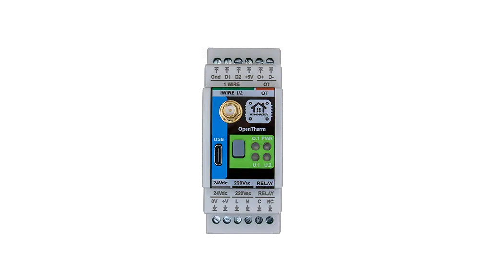
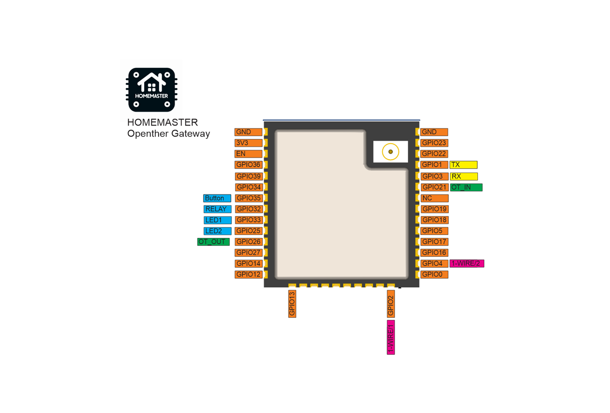
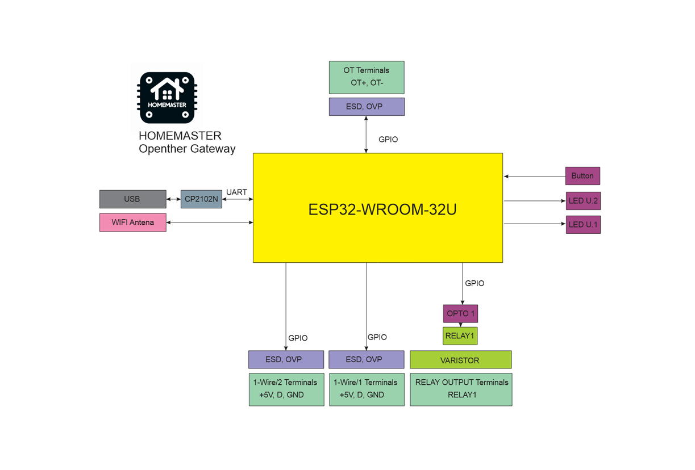

# 🚧 Project Status: Under Active Development & Testing

> **Important Notice:** This documentation, hardware designs, and firmware are for the **pre-release version** of the HomeMaster system. All information is preliminary and may contain errors or be subject to change.
>
> - **Hardware:** Modules are currently in the prototyping and testing phase. Final production versions may differ.
> - **Firmware:** Firmware is under active development and is considered **beta**. Features, configurations, and stability are being refined.
>
> Please use this information for evaluation and development purposes only. 

---
# 🔥 Opentherm Gateway – DIN-Rail Smart Heating Interface for Home Assistant

## Product description

## 🌡️ Description

The Opentherm Gateway enables full bidirectional OpenTherm communication for intelligent climate control. It supports monitoring and control of key heating parameters such as burner status, flame modulation, setpoint temperatures, and system diagnostics.

A built-in high-voltage relay allows local control of zone valves or backup heaters, while two independent **1-Wire interfaces** support digital temperature sensors (e.g., DS18B20) for detailed room or system temperature monitoring.

Maker: https://www.home-master.eu/

Product page: https://www.home-master.eu/shop/esp32-opentherm-gateway-59

Schematics: https://github.com/isystemsautomation/HOMEMASTER/tree/main/OpenthermGateway/Schematic

## Features

## ⚙️ Key Features

- **OpenTherm Interface**: Full OpenTherm communication with compatible boilers for temperature control and diagnostics
- **ESP32-WROOM-32U**: Wi-Fi/Bluetooth-enabled microcontroller with ESPHome pre-installed
- **Relay Output**: One high-voltage relay for local switching (e.g., heaters, zone valves)
- **Dual 1-Wire Interfaces**: Two isolated 1-Wire buses for temperature sensors like DS18B20
- **Power Options**: Operates on 24 VDC or 220 VAC/220VDC for flexible installation
- **USB Type-C**: For firmware updates, serial configuration, and power
- **OTA Updates**: Supported via ESPHome for wireless firmware management
- **Improv**: Wi-Fi Configuration 
- **DIN-Rail Mountable**: Standardized enclosure for electrical cabinets
- **Status LEDs**: Visual indicators for power, relay, OpenTherm, and Wi-Fi status
- **Open Source**: Both hardware and firmware are open for community contribution

## Networking

Wi-Fi Connectivity – Integrated Wi-Fi for wireless access and Home Assistant integration.

## Pinout

## OpenTherm Gateway Functional Block Diagram

## Programming

The OpenTherm Gateway comes with ESPHome pre-installed and can be confgured via:

### Improve

Wi-Fi Configuration with Improv

1. Power on your HomeMaster OpenTherm Gateway.
2. Go to 👉 improv-wifi.com (works in Chrome/Edge on desktop or mobile).
3. Connect via USB (Serial) or Bluetooth LE.
4. Enter your Wi-Fi SSID and password, then press Connect.
5. The device joins your Wi-Fi and is now ready.

You can then access it via its local address (e.g., http://opentherm.local) or directly in Home Assistant.

### One-Click Import (ESPHome Dashboard Import)

Once connected to Wi-Fi, the OpenTherm Gateway will be automatically discovered in ESPHome Dashboard.
When the device appears in ESPHome Dashboard, click “Take Control”.
The OpenTherm Gateway supports dashboard import, automatically pulling its official configuration from GitHub

### USB Type-C: Use the ESPHome Dashboard to upload the configuration

1. Connect the OpenTherm Gateway to your computer with a USB Type-C cable.
2. Download the YAML configuration file from our GitHub repository.(https://github.com/isystemsautomation/HOMEMASTER/blob/main/OpenthermGateway/Firmware/opentherm.yaml)
3. Open the ESPHome Dashboard, import the YAML file, and update it with your Wi-Fi SSID and password.
4. Flash the device directly from ESPHome Dashboard.
5. The OpenTherm Gateway supports automatic reset and boot control — there is no need to press reset or boot buttons during programming.
6. After flashing, the device will reboot automatically and run the updated firmware.

## Specifications

| Feature              | Details                              |
|----------------------|--------------------------------------|
| Microcontroller      | ESP32-WROOM-32U                      |
| Power Supply         | 5V via USB-C for programming, 24V via terminal or 220VAC/DC via terminal      |
| Relay Output         | 1x 16A (optically isolated)     |
| Communication        | RS-485, Wi-Fi, Bluetooth, USB-C      |
| 1-Wire               | 2 channels (ESD/OVP protected)        |
| Mounting             | DIN-rail                             |
| Firmware             | ESPHome (pre-installed), Arduino |

## 🏠 Integration with Home Assistant

When flashed with ESPHome, the Opentherm Gateway exposes the following entities in Home Assistant:

- Boiler on/off
- Burner status
- Flame modulation level (%)
- CH/DHW setpoint temperatures
- Boiler water temperature
- System pressure (if supported)
- Relay output status
- Temperature readings from connected 1-Wire sensors
- etc.

## 📄 License

All hardware design files and documentation are licensed under **CERN-OHL-W 2.0**.  
Firmware and code samples are released under the **GNU General Public License v3 (GPLv3)** unless otherwise noted.

---

> 🔧 **HOMEMASTER – Modular control. Custom logic.**
