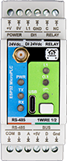
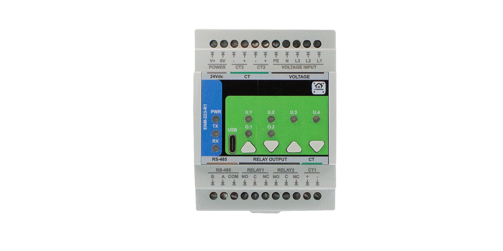
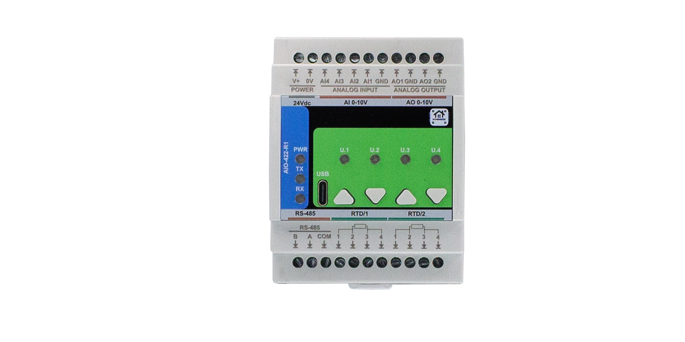
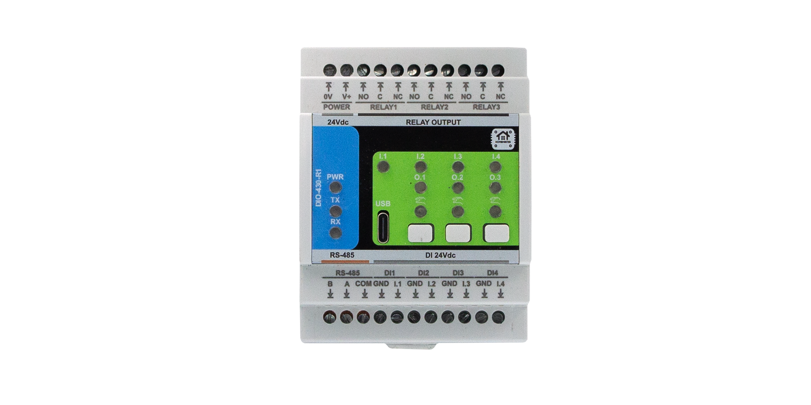
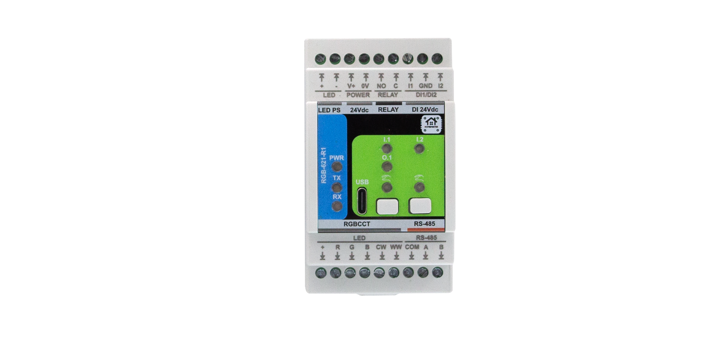
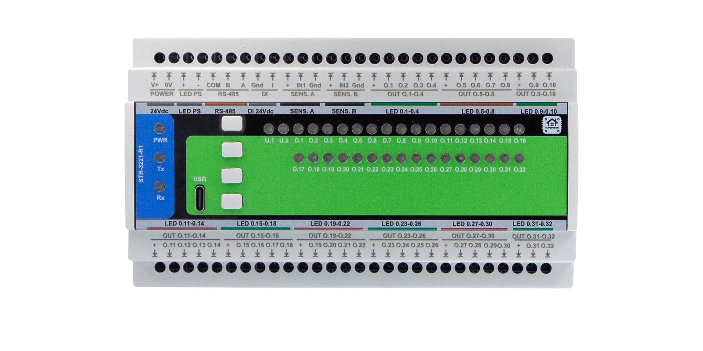

# HOMEMASTER – Modular, Resilient Smart Automation System

**Releases:** see the latest tagged build on GitHub Releases. Versioning uses **YYYY‑MM**.  
Fully open‑source hardware, firmware, and configuration tools.

---

## 📑 Quick navigation
- [1. Introduction](#1-introduction)
  - [1.1 Overview of the HomeMaster ecosystem](#11-overview-of-the-homemaster-ecosystem)
  - [1.2 Modules & controllers](#12-modules--controllers)
  - [1.3 Use cases](#13-use-cases)
  - [1.4 Why HomeMaster? (Mission)](#14-why-homemaster-mission)
- [2. Quick start](#2-quick-start)
- [3. Safety information](#3-safety-information)
- [4. System overview](#4-system-overview)
  - [4.1 Topology diagram](#41-topology-diagram)
  - [4.2 Integration with Home Assistant](#42-integration-with-home-assistant)
- [5. Networking & communication](#5-networking--communication)
- [6. Software & UI configuration](#6-software--ui-configuration)
- [7. Programming & customization](#7-programming--customization)
- [8. Troubleshooting & FAQ](#8-troubleshooting--faq)
- [9. Open source & licensing](#9-open-source--licensing)
- [10. Downloads](#10-downloads)
- [11. Support](#11-support)

---

## 1. Introduction

### 1.1 Overview of the HomeMaster ecosystem
HomeMaster is an **industrial‑grade, modular automation system** for smart homes, labs, and professional installations. It features:

- ESP32‑based PLC controllers (**MiniPLC & MicroPLC**) — same platform & memory class
- A family of smart I/O modules (energy monitoring, lighting, alarms, analog I/O, etc.)
- **RS‑485 Modbus RTU** communication
- **ESPHome** compatibility for **Home Assistant**
- **USB‑C** & **WebConfig** UI for driverless configuration

> **Local resilience:** Modules include onboard logic and continue functioning even if the controller or network is offline.

### 1.2 Modules & controllers

<table>
<tr>
<td align="center" width="50%">
  <strong>🔵 MicroPLC</strong> 
   Click to view full size
</td>
<td align="center" width="50%">
  <strong>🟢 MiniPLC</strong> 
   Click to view full size
</td>
</tr>
</table>

#### Controllers

| Controller | Description |
|-----------|-------------|
| **MiniPLC**  | Full DIN‑rail controller with **Ethernet**, **Wi‑Fi**, **USB‑C**, **BLE/Improv**, **RTC**, OLED, **6 relays**, **4 DI**, **2 AI/O**, **2 RTD**, microSD logging. Works as a **standalone PLC** and also expands via RS‑485 modules. |
| **MicroPLC** | Compact DIN‑rail controller with **Wi‑Fi**, **USB‑C**, **BLE/Improv**, **RTC**, **1 relay**, **1 DI**, 1‑Wire, RS‑485. Designed to be **affordable** and used **primarily with extension modules**. |

#### Extension modules (detailed)

> Images on the left, concise summary on the right. Click a photo to open full resolution. Full specs live on each module page.

<table>
  <tr>
    <td width="35%" align="center" valign="top">
      
       <b>ENM‑223‑R1 — 3‑Phase Energy Meter</b>
    </td>
    <td width="65%" valign="top">
      ATM90E32AS‑based sub‑metering (per‑phase Urms/Irms/P/Q/S/PF + totals) with **2× SPDT relays**. RS‑485 Modbus RTU; USB‑C WebConfig. 24 VDC DIN‑rail.
    </td>
  </tr>

  <tr>
    <td align="center" valign="top">
      
       <b>ALM‑173‑R1 — Alarm I/O</b>
    </td>
    <td valign="top">
      **17 opto DIs** for sensors, **3× SPDT relays** (up to 16 A), isolated 12 V/5 V aux rails. RS‑485 + USB‑C WebConfig. 24 VDC DIN‑rail.
    </td>
  </tr>

  <tr>
    <td align="center" valign="top">
      
       <b>DIM‑420‑R1 — Dual‑Channel AC Dimmer</b>
    </td>
    <td valign="top">
      **2‑ch phase‑cut dimming** (per‑channel leading/trailing), **4 DIs** with rich press logic, dual zero‑cross sensing. RS‑485 + WebConfig.
    </td>
  </tr>

  <tr>
    <td align="center" valign="top">
      
       <b>AIO‑422‑R1 — Analog I/O + RTD</b>
    </td>
    <td valign="top">
      **4× 0–10 V inputs** (ADS1115), **2× 0–10 V outputs** (MCP4725+op‑amp), **2× RTD** (MAX31865). RS‑485 + USB‑C. 24 VDC DIN‑rail (~3M).
    </td>
  </tr>

  <tr>
    <td align="center" valign="top">
      
       <b>DIO‑430‑R1 — Digital I/O</b>
    </td>
    <td valign="top">
      **3× SPDT relays** (up to 16 A), **4× isolated 24 VDC inputs**, override buttons, RS‑485 + USB‑C WebConfig. 24 VDC DIN‑rail.
    </td>
  </tr>

  <tr>
    <td align="center" valign="top">
      
       <b>RGB‑620‑R1 — RGBCCT LED Control</b>
    </td>
    <td valign="top">
      **5‑ch PWM** (RGB+CCT) with smooth fades, **2 DIs**, **1× relay**. RS‑485 + USB‑C; ESPHome‑ready. 24 VDC DIN‑rail.
    </td>
  </tr>

  <tr>
    <td align="center" valign="top">
      
       <b>STR‑3221‑R1 — Staircase LED Controller</b>
    </td>
    <td valign="top">
      **32 constant‑current LED channels** with animated sequences; **3 opto inputs**. RS‑485 + USB‑C. 24 VDC DIN‑rail.
    </td>
  </tr>

  <tr>
    <td align="center" valign="top">
      
       <b>WLD‑521‑R1 — Water/Leak Detection</b>
    </td>
    <td valign="top">
      **5 opto DIs** for leak probes & pulse meters (up to 1 kHz), **2 relays**, **1‑Wire** temp; isolated 12 V/5 V aux. RS‑485 + USB‑C.
    </td>
  </tr>
</table>

### 1.3 Use cases
- [x] Smart energy monitoring and control  
- [x] Smart lighting and climate control  
- [x] Leak detection and safety automation  
- [x] Modbus‑connected distributed systems  
- [x] Industrial and home lab control  

### 1.4 Why HomeMaster? (Mission)
- **Resilient by design:** Local logic ensures core functions continue without network/cloud.
- **Industrial yet maker‑friendly:** DIN‑rail hardware with ESPHome simplicity.
- **Open & repairable:** Open hardware, firmware, and tools; long‑term maintainability.

[Back to top ↑](#-quick-navigation)

---

## 2. Quick start

1. **Power the controller** — **ESPHome is pre‑installed** on MiniPLC and MicroPLC.  
2. **Join Wi‑Fi with Improv** — Use **Improv** (BLE **or** Serial) to set Wi‑Fi and adopt the device.  
3. **Wire RS‑485** — A/B differential pair; **120 Ω termination** at both bus ends.  
4. **Configure each module** — Connect via **USB‑C** and use **WebConfig** to set **Modbus address and module settings** (calibration, mapping, rules).  
5. **Open Home Assistant** — Add the ESPHome controller; modules appear as entities via the controller config.
---
## 3 Choosing the Right PLC and Modules

### 3.1 MiniPLC vs MicroPLC – Selection Guide

| Feature / Use Case             | 🟢 **MiniPLC**                                   | 🔵 **MicroPLC**                               |
|-------------------------------|--------------------------------------------------|-----------------------------------------------|
| Size                          | Full-width DIN enclosure                         | Compact DIN enclosure                         |
| Onboard I/O                   | 6x Relays, 4x DI, 2x RTD, 2x AI/O, Display, RTC  | 1x Relay, 1x DI, 1-Wire, RTC                   |
| Connectivity                  | Ethernet, USB‑C, Wi‑Fi, BLE + Improv             | USB‑C, Wi‑Fi, BLE + Improv                    |
| Storage                       | microSD card slot                                | Internal flash only                           |
| Ideal for                     | Full homes, labs, HVAC/solar, automation pros    | Makers, room‑level, modular expansion setups  |
| Power input                   | AC/DC wide range or 24 VDC                       | 24 VDC only                                   |
| ESPHome integration           | Yes, with rich entity exposure                   | Yes, ideal for modular configs                |
| Installation type             | Works as a standalone PLC and also expands via RS‑485 modules.                 | Designed to be affordable and used primarily with extension modules.systems                |

### 3.2 Module Comparison Table

| Module Code     | Digital Inputs | Analog / RTD      | Relay Outputs | Special Features                          | Typical Use Cases                         |
|-----------------|----------------|-------------------|----------------|--------------------------------------------|-------------------------------------------|
| **ENM‑223‑R1**  | —              | Voltage + CTs     | 2 relays       | 3‑phase metering, power KPIs              | Grid, solar, energy sub-metering          |
| **ALM‑173‑R1**  | 17 DI          | —                 | 3 relays       | Sensor AUX power, alarm logic             | Security, panic, tamper, window contacts  |
| **DIM‑420‑R1**  | 4 DI           | —                 | 2 dim outputs  | AC dimming, press logic, LED feedback     | Room lighting, stair lighting             |
| **AIO‑422‑R1**  | —              | 4 AI + 2 RTD      | 2 AO           | 0–10 V input/output, PT100/PT1000         | HVAC, environmental sensors               |
| **DIO‑430‑R1**  | 4 DI           | —                 | 3 relays       | Logic mapping, override buttons           | Generic input/output, control boards      |
| **RGB‑620‑R1**  | 2 DI           | —                 | 1 relay        | 5x PWM (RGB+CCT), LED fades               | RGB lighting, wall-switch control         |
| **STR‑3221‑R1** | 3 DI           | —                 | —              | 32-channel LED sequencing (TLC59208F)      | Stair lights, animation control           |
| **WLD‑521‑R1**  | 5 DI           | 1‑Wire Temp       | 2 relays       | Leak detection, pulse metering            | Bathrooms, kitchens, utility rooms        |

### 3.3 Recommended Setups

- 🏠 **Starter Setup (Lighting + I/O)**  
  🔹 MicroPLC + DIO‑430‑R1 + RGB‑620‑R1  
  👉 For basic lighting control, wall switch input, RGB strip control.

- ⚡ **Energy Monitoring Setup**  
  🔹 MicroPLC + ENM‑223‑R1  
  👉 For tracking grid power, solar production, or 3-phase loads.

- 🧪 **Lab / Professional Setup**  
  🔹 MiniPLC + any mix of modules  
  👉 Best for complex automation with analog, temperature, safety logic.

- 💧 **Safety & Leak Detection**  
  🔹 MicroPLC + WLD‑521‑R1 + ALM‑173‑R1  
  👉 Secure your home with leak sensors, alarm inputs, and auto-valve control.

- 🌈 **RGB + Dimming + Scenes**  
  🔹 MiniPLC or MicroPLC + RGB‑620‑R1 + DIM‑420‑R1  
  👉 Create scenes with ESPHome automations and HA dashboards.

## 5. Networking & communication

### 5.1 RS‑485 Modbus
- All modules use Modbus RTU (slave) over RS‑485.
- Default: `19200 8N1` (configurable).
- Bus topology supported; use **120 Ω termination** at ends; observe biasing.

### 5.2 USB‑C configuration
- Use `ConfigToolPage.html` (no drivers needed) in Chrome/Edge.
- Enables calibration, phase mapping, relay control, alarm config, etc.
- Available for each module type.

### 5.3 Wi‑Fi and Bluetooth
- Wi‑Fi on **MiniPLC** and **MicroPLC**.
- **Improv Wi‑Fi** onboarding via **BLE and Serial** on **both controllers**.
- Once connected, modules communicate over RS‑485; controllers expose them wirelessly.

### 5.4 Ethernet
- Available on **MiniPLC** only.
- Enables fast and stable connection to Home Assistant or MQTT brokers.

[Back to top ↑](#-quick-navigation)

---

## 6. Software & UI configuration

### 6.1 Controller ESPHome Setup 

All HomeMaster controllers come with **ESPHome pre-installed** and support **Improv onboarding** over **USB or Bluetooth** — no flashing required.

Once powered on:

- Connect via [improv-wifi.com](https://improv-wifi.com) to enter your Wi‑Fi credentials  
- The controller appears in **ESPHome Dashboard** or **Home Assistant**, ready to use  
- Add connected modules using `modbus_controller:` and per-module `packages:`  

Each controller supports automatic discovery and YAML import for easy customization. Full setup guides and YAML templates are available on each module's page.

> 💡 For advanced users, manual flashing via USB‑C is also supported — with no need for reset buttons.

### 6.2 Web Config Tool (USB Web Serial)

All HomeMaster extension modules include a built-in **USB WebConfig interface** — a single HTML file that runs in your browser (no install, no drivers).

It lets you configure each module in seconds:

- Set the **Modbus address** and **baud rate**
- Adjust **relay behavior**, **input mappings**, or **LED modes**
- Configure **alarm thresholds** (where applicable)
- Perform **calibration** (e.g. phase mapping, CT scaling)
- See **live diagnostics** for all inputs, relays, and logic

Each module has its own version of the tool with tailored panels, but the interface is consistent across the lineup.

> 💡 WebConfig works in Chrome or Edge via USB‑C — just plug in and click “Connect”. Full details live in each module’s manual.

### 6.3 Integration with Home Assistant
- Controllers ship with **ESPHome pre‑installed**.
- ESPHome exposes connected modules (via `modbus_controller:`) as sensors/switches/alarms.
- Use **YAML packages** to add ENM, ALM, DIM, etc., quickly in the controller config.

[Back to top ↑](#-quick-navigation)

---

## 7. Programming & Customization

### 7.1 Supported Languages
All HomeMaster controllers and modules support firmware customization via **USB‑C**.

- **ESPHome YAML** (pre-installed on controllers)
- **Arduino IDE** (both ESP32 and RP2040/RP2350)
- **PlatformIO** (cross-platform)
- **MicroPython** (via Thonny)
- **ESP-IDF** (for ESP32-based controllers)
- **Pico SDK / CircuitPython** (for RP2350-based modules)

### 7.2 USB‑C Developer Flashing (Optional)
Both controllers and modules support easy flashing and auto-reset via **USB‑C**, with no need to press BOOT or RESET buttons.

- **ESP32-based controllers** (MiniPLC, MicroPLC): programmable using Arduino IDE, PlatformIO, ESP-IDF, or ESPHome Dashboard.
- **RP2350-based modules**: support drag‑and‑drop **UF2 flashing** and tools from the RP2040 ecosystem (e.g., Pico SDK, CircuitPython).

> ⚠️ Note: All controllers and modules ship with pre-installed firmware.  
> - **Controllers** are ESPHome-ready and appear in Home Assistant.
> - **Modules** are fully functional out-of-the-box and configurable via the **WebConfig Tool**.

Flashing is only required for advanced users who want to replace default firmware.

### 7.3 Arduino & PlatformIO Notes
- Clone the firmware repository
- Use the provided `default_xxx.ino` sketches per module or controller
- Add libraries as needed:  
  `ModbusSerial`, `LittleFS`, `Arduino_JSON`, `SimpleWebSerial`

[Back to top ↑](#-quick-navigation)

---

## 3. Safety information

### 3.1 General electrical safety
- Only trained personnel should install or service modules.
- Disconnect all power sources before wiring or reconfiguring.
- Always follow local electrical codes and standards.

### 3.2 Handling & installation
- Mount on 35 mm DIN rails inside protective enclosures.
- Separate low‑voltage and high‑voltage wiring paths.
- Avoid exposure to moisture, chemicals, or extreme temperatures.

### 3.3 Device‑specific warnings
- Connect PE/N properly for metering modules.
- Use correct CTs (1 V or 333 mV) — never connect 5 A CTs directly.
- Avoid reverse polarity on RS‑485 lines.

[Back to top ↑](#-quick-navigation)

---

## 9. Open source & licensing

- **Hardware:** CERN‑OHL‑W v2  
- **Firmware:** GPLv3  
- **Tools & examples:** MIT  
See `LICENSE` for full terms.

---

## 10. Downloads

- 📥 **Firmware (INO / YAML examples):** <https://github.com/isystemsautomation/HOMEMASTER/tree/main/Firmware>
- 🛠 **Config Tools (HTML):** <https://github.com/isystemsautomation/HOMEMASTER/tree/main/tools>
- 📷 **Images & Diagrams:** <https://github.com/isystemsautomation/HOMEMASTER/tree/main/Images>
- 📐 **Schematics:** <https://github.com/isystemsautomation/HOMEMASTER/tree/main/Schematics>
- 📖 **Manuals (PDF):** <https://github.com/isystemsautomation/HOMEMASTER/tree/main/Manuals>

[Back to top ↑](#-quick-navigation)

---

## 11. Support

- 🌐 **Official Support Portal:** <https://www.home-master.eu/support>  
- 🧠 **Hackster.io Projects:** <https://www.hackster.io/homemaster>  
- 🎥 **YouTube Channel:** <https://www.youtube.com/channel/UCD_T5wsJrXib3Rd21JPU1dg>  
- 💬 **Reddit /r/HomeMaster:** <https://www.reddit.com/r/HomeMaster>  
- 📷 **Instagram:** <https://www.instagram.com/home_master.eu>

[Back to top ↑](#-quick-navigation)

---
