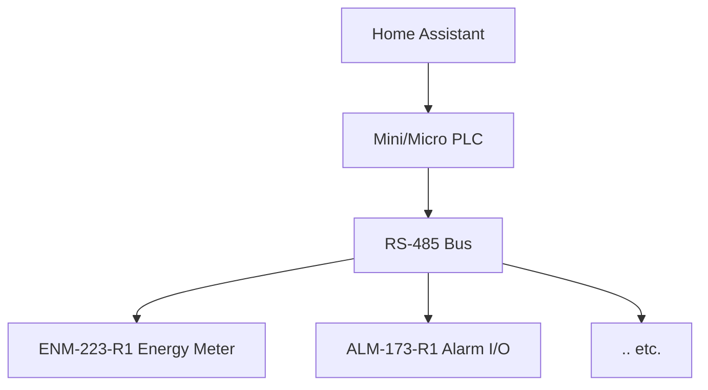

# HOMEMASTER – Modular, Resilient Smart Automation System


> **Releases:** see the latest tagged build on GitHub Releases. Versioning uses **YYYY‑MM**.  
> Fully open‑source hardware, firmware, and configuration tools.

---

## 🚀 Quick Start

### 5‑Minute Setup
1. **Power the controller** — **ESPHome is pre‑installed** on MiniPLC and MicroPLC.  
2. **Join Wi‑Fi with Improv** — Use **Improv** (BLE **or** Serial) to set Wi‑Fi and adopt the device.  
3. **Wire RS‑485** — A/B differential pair; **120 Ω termination** at both bus ends.  
4. **Configure each module** — Connect via **USB‑C** and use **WebConfig** to set **Modbus address and module settings** (calibration, mapping, rules).  
5. **Open Home Assistant** — Add the ESPHome controller; modules appear as entities via the controller config.

### 🔗 Quick Links
- 📥 **Latest Release:** https://github.com/isystemsautomation/HOMEMASTER/releases
- 🛠️ **Config Tools:** `./tools/`
- 📖 **Full Documentation:** `./Manuals/`
- 🐛 **Report Issues:** https://github.com/isystemsautomation/HOMEMASTER/issues

---

## 🛠️ Hardware Guide

### System Architecture


#### 🎯 Quick Module Selector
- 💡 **Lighting Control** → DIM‑420‑R1, RGB‑621‑R1, STR‑3221‑R1  
- ⚡ **Energy Monitoring** → ENM‑223‑R1  
- 🚨 **Security/Alarms** → ALM‑173‑R1, WLD‑521‑R1  
- 🌡️ **Environmental** → AIO‑422‑R1  
- 🔌 **General I/O** → DIO‑430‑R1  

### Controller Comparison
| Feature / Use Case | 🟢 **MiniPLC** | 🔵 **MicroPLC** |
|---|---|---|
| Size | Full‑width DIN enclosure | Compact DIN enclosure |
| Onboard I/O | 6× Relays, 4× DI, 2× RTD, 2× AI/O, Display, RTC | 1× Relay, 1× DI, 1‑Wire, RTC |
| Connectivity | Ethernet, USB‑C, Wi‑Fi, BLE + Improv | USB‑C, Wi‑Fi, BLE + Improv |
| Storage | microSD card slot | Internal flash only |
| Ideal For | Full homes, labs, HVAC/solar, automation pros | Makers, room‑level, modular expansion setups |
| Power Input | AC/DC wide range or 24 VDC | 24 VDC only |

### Module Overview
| Module | Inputs | Outputs | Key Features | Best For |
|---|---|---|---|---|
| **ENM‑223‑R1** — ⚡ Energy Meter | 3‑Phase CTs | 2 Relays | Per‑phase power metrics | Solar, grid monitoring |
| **ALM‑173‑R1** — 🚨 Alarm I/O | 17 DI | 3 Relays | AUX power, alarm logic | Security systems |
| **DIM‑420‑R1** — 💡 AC Dimmer | 4 DI | 2 Dimming | Phase‑cut dimming | Lighting control |
| **AIO‑422‑R1** — 🌡️ Analog I/O | 4 AI + 2 RTD | 2 AO | 0‑10V I/O, PT100/1000 | HVAC, sensors |
| **RGB‑621‑R1** — 🎨 LED Control | 2 DI | 5 PWM + 1 Relay | RGB+CCT, smooth fades | Color lighting |
| **DIO‑430‑R1** — 🔌 Digital I/O | 4 DI | 3 Relays | Override buttons, logic mapping | General control |
| **STR‑3221‑R1** — 💫 Staircase LED | 3 DI | 32 LED Channels | Animated sequences | Architectural lighting |
| **WLD‑521‑R1** — 💧 Leak Detection | 5 DI + Temp | 2 Relays | Leak detection, pulse metering | Safety systems |

### Recommended Setups
- 🏠 **Starter (Lighting + I/O)** — MicroPLC + DIO‑430‑R1 + RGB‑621‑R1  
  _Basic lighting control, wall switch input, RGB strip control_
- ⚡ **Energy Monitoring** — MicroPLC + ENM‑223‑R1  
  _Track grid power, solar production, or 3‑phase loads_
- 🧪 **Professional Lab** — MiniPLC + AIO‑422‑R1 + DIO‑430‑R1  
  _Complex automation with analog, temperature, safety logic_
- 💧 **Safety & Leak Detection** — MicroPLC + WLD‑521‑R1 + ALM‑173‑R1  
  _Leak sensors, alarm inputs, auto‑valve control_
- 🌈 **Advanced Lighting** — MiniPLC + RGB‑621‑R1 + DIM‑420‑R1 + STR‑3221‑R1  
  _Complete lighting control with scenes and animations_

---

## ⚙️ Configuration

### Compatibility
| Component | Home Assistant | ESPHome | Standalone |
|---|---|---|---|
| **All Modules** | ✅ Full | ✅ Native | ✅ Basic |
| **MiniPLC** | ✅ Full | ✅ Pre‑installed | ✅ Full |
| **MicroPLC** | ✅ Full | ✅ Pre‑installed | ✅ Basic |

### Controller Setup
All HomeMaster controllers come with ESPHome pre‑installed and support Improv onboarding:
1. Power on the controller  
2. Connect via **improv-wifi.com** (BLE or USB)  
3. Enter Wi‑Fi credentials  
4. Appears in **ESPHome Dashboard** & **Home Assistant**

### Module Configuration (WebConfig)
Each module includes **USB WebConfig** — no drivers needed:
- Set **Modbus address** and **baud rate**
- Configure **relay behavior** and **input mappings**
- Perform **calibration** and **live diagnostics**
- Adjust **alarm thresholds** and **LED modes**

> 💡 WebConfig works in Chrome/Edge — just plug in **USB‑C** and click **Connect**

### Networking
- **RS‑485 Modbus:** `19200 8N1` (default), **120 Ω termination** required  
- **Wi‑Fi:** Both controllers; **Improv** onboarding  
- **Ethernet:** MiniPLC only for stable connections  
- **USB‑C:** Configuration and programming

---

## 🔧 Advanced

### Firmware Development
Supported development platforms:
| Platform | Controllers | Modules | Use Case |
|---|---|---|---|
| **ESPHome** | ✅ Pre‑installed | ✅ Configurable | Home Automation |
| **Arduino IDE** | ✅ ESP32 | ✅ RP2350 | Custom Logic |
| **PlatformIO** | ✅ Full | ✅ Full | Professional |
| **MicroPython** | ✅ ESP32 | ✅ RP2350 | Scripting |
| **CircuitPython** | ❌ | ✅ RP2350 | Education |

### USB‑C Flashing
No buttons needed — automatic reset via USB‑C:
- **Controllers:** ESP32‑based, use Arduino IDE / PlatformIO / ESPHome
- **Modules:** RP2350‑based, drag‑and‑drop **UF2** flashing

> ⚠️ All devices ship with fully functional firmware. Flashing is for advanced customization only.

### Customization Example (ESPHome)
```yaml
# Example ESPHome configuration for energy meter
modbus_controller:
  - id: energymeter
    address: 0x01
    sensors:
      - name: "Grid Power"
        address: 0x0000
        unit_of_measurement: "W"
```

---

## 📚 Resources

### 📥 Downloads
- 🧩 **Firmware:** INO / YAML examples  
- 🛠️ **Config Tools:** HTML WebConfig  
- 📷 **Images & Diagrams:** Visual assets  
- 📐 **Schematics:** Hardware designs  
- 📖 **Manuals:** PDF documentation

### 🎓 Learning & Community
- 🌐 **Official Support:** https://home-master.eu/support  
- 🧠 **Hackster.io:** Projects & tutorials  
- 🎥 **YouTube:** Video guides  
- 💬 **Reddit:** r/HomeMaster  
- 📷 **Instagram:** @home_master.eu

---

## 🤝 Contributing
We welcome contributions! Please see our:
- **Contributing Guidelines**
- **Code of Conduct**
- **Development Guide**

---

## ❓ Frequently Asked Questions

**Q: Can I use modules without a controller?**  
A: Modules require a PLC controller for network connectivity and ESPHome integration. They have local logic but need a controller for Home Assistant.

**Q: What's the maximum RS‑485 bus length?**  
A: Up to 1200 m at 19200 baud with proper termination and biasing.

**Q: Can I create custom modules?**  
A: Yes! All hardware is open‑source. Check our development guide for creating custom modules.

**Q: Is cloud required?**  
A: No! HomeMaster works 100% locally. Cloud services are optional.

**Q: What CTs are supported?**  
A: Standard 333 mV or 1 V output CTs. Never connect 5 A CTs directly.

**Q: Can I expand beyond 8 modules?**  
A: Yes, Modbus supports up to 247 devices. Practical limits depend on cable quality and baud rate.

**Q: How do I update firmware?**  
A: Controllers update via ESPHome OTA. Modules use USB‑C WebConfig or UF2 flashing.

---

## ⚠️ Safety Information

### Electrical Safety
- Only trained personnel should install or service modules
- Disconnect all power before wiring
- Follow local electrical codes and standards

### Installation
- Mount on 35 mm DIN rails in protective enclosures
- Separate low‑voltage and high‑voltage wiring
- Avoid moisture, chemicals, and extreme temperatures

### Device‑specific Warnings
- Connect PE/N properly for metering modules
- Use correct CTs (1 V or 333 mV) — never connect 5 A CTs directly
- Avoid reverse polarity on RS‑485 lines

---

## 📄 Licensing
- **Hardware:** CERN‑OHL‑W v2  
- **Firmware:** GPLv3  
- **Tools & Examples:** MIT  
See `LICENSE` files for full terms.

---

## 🔄 Version Info
**Current:** HomeMaster 2024.12+ series  
**Check:** Releases page for version‑specific notes
