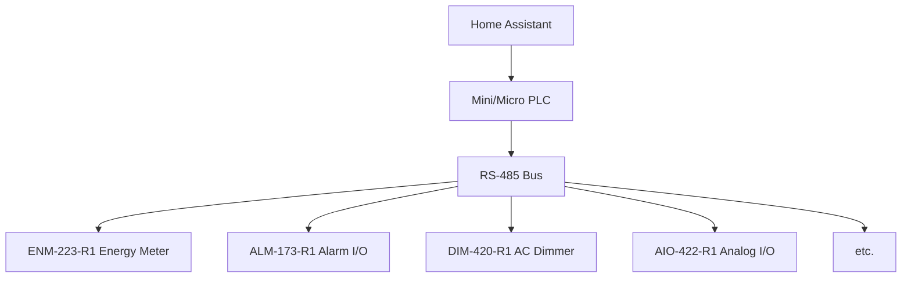

# HOMEMASTER – Modular, Resilient Smart Automation System


> **Releases:** see the latest tagged build on GitHub Releases. Versioning uses **YYYY‑MM**.  
> Fully open‑source hardware, firmware, and configuration tools.

---


## 🛠️ Hardware Guide
HomeMaster is an **industrial‑grade, modular automation system** for smart homes, labs, and professional installations. It features:

- ESP32‑based PLC controllers (**MiniPLC & MicroPLC**) — same platform & memory class
- A family of smart I/O modules (energy monitoring, lighting, alarms, analog I/O, etc.)
- **RS‑485 Modbus RTU** communication
- **ESPHome** compatibility for **Home Assistant**
- **USB‑C** & **WebConfig** UI for driverless configuration

> **Local resilience:** Modules include onboard logic and continue functioning even if the controller or network is offline.

### System Architecture


### System Architecture

```mermaid
graph TD
  HA[Home Assistant] --> PLC[MiniPLC / MicroPLC]
  PLC --> RS485[RS‑485 Bus]

  subgraph Extension Modules
    ENM[ENM‑223‑R1<br>⚡ Energy Meter]
    ALM[ALM‑173‑R1<br>🚨 Alarm I/O]
    DIM[DIM‑420‑R1<br>💡 AC Dimmer]
    AIO[AIO‑422‑R1<br>🌡️ Analog I/O]
    RGB[RGB‑621‑R1<br>🎨 LED Controller]
    DIO[DIO‑430‑R1<br>🔌 Digital I/O]
    STR[STR‑3221‑R1<br>💫 Staircase LED]
    WLD[WLD‑521‑R1<br>💧 Leak Detection]
  end

  RS485 --> ENM
  RS485 --> ALM
  RS485 --> DIM
  RS485 --> AIO
  RS485 --> RGB
  RS485 --> DIO
  RS485 --> STR
  RS485 --> WLD


#### 🎯 Quick Module Selector
- 💡 **Lighting Control** → DIM‑420‑R1, RGB‑621‑R1, STR‑3221‑R1  
- ⚡ **Measurment & Protecion** → ENM‑223‑R1 , WLD‑521‑R1 
- 🚨 **Security/Alarms** → ALM‑173‑R1
- 🔌 **General I/O** → DIO‑430‑R1, AIO‑422‑R1   

### Controller Comparison

| Feature / Use Case | 🟢 [**MiniPLC**](./MiniPLC/) <br> <a href="./MiniPLC/"></a> | 🔵 [**MicroPLC**](./MicroPLC/) <br> <a href="./MicroPLC/"></a> |
|--------------------|----------------------------------------------------------------------------------------------------------------------------------|--------------------------------------------------------------------------------------------------------------------------------------------|
| **Size**           | Full‑width DIN enclosure                                                                                                         | Compact DIN enclosure                                                                                 |
| **Onboard I/O**    | 6× Relays, 4× DI, 2× RTD, 2× AI/O, Display, RTC                                                                                   | 1× Relay, 1× DI, 1‑Wire, RTC                                                                          |
| **Connectivity**   | Ethernet, USB‑C, Wi‑Fi, BLE + Improv                                                                                             | USB‑C, Wi‑Fi, BLE + Improv                                                                           |
| **Storage**        | microSD card slot                                                                                                                | Internal flash only                                                                                  |
| **Ideal For**      | Full homes, labs, HVAC/solar, automation pros                                                                                    | Makers, room‑level, modular expansion setups                                                         |
| **Power Input**    | AC/DC wide range or 24 VDC                                                                                                       | 24 VDC only                                                                                           |


### Module Overview

| Image | Module | Inputs | Outputs | Key Features | Best For |
|---|---|---|---|---|---|
| <a href="./ENM-223-R1/"></a> | [**ENM‑223‑R1**](./ENM-223-R1/) | 3‑Phase CTs | 2 Relays | Per‑phase power metrics | Solar, grid monitoring |
| <a href="./ALM-173-R1/"></a> | [**ALM‑173‑R1**](./ALM-173-R1/) | 17 DI | 3 Relays | AUX power, alarm logic | Security systems |
| <a href="./DIM-420-R1/"></a> | [**DIM‑420‑R1**](./DIM-420-R1/) | 4 DI | 2 Dimming | Phase‑cut dimming | Lighting control |
| <a href="./AIO-422-R1/"></a> | [**AIO‑422‑R1**](./AIO-422-R1/) | 4 AI + 2 RTD | 2 AO | 0‑10V I/O, PT100/1000 | HVAC, sensors |
| <a href="./DIO-430-R1/"></a> | [**DIO‑430‑R1**](./DIO-430-R1/) | 4 DI | 3 Relays | Override buttons, logic mapping | General control |
| <a href="./RGB-621-R1/"></a> | [**RGB‑621‑R1**](./RGB-621-R1/) | 2 DI | 5 PWM + 1 Relay | RGB+CCT, smooth fades | Color lighting |
| <a href="./STR-3221-R1/"></a> | [**STR‑3221‑R1**](./STR-3221-R1/) | 3 DI | 32 LED Channels | Animated sequences | Architectural lighting |
| <a href="./WLD-521-R1/"></a> | [**WLD‑521‑R1**](./WLD-521-R1/) | 5 DI + Temp | 2 Relays | Leak detection, pulse metering | Safety systems |


### Recommended Setups
- 🏠 **Starter (Lighting + I/O)** — MicroPLC + DIO‑430‑R1 + RGB‑621‑R1  
  _Basic lighting control, wall switch input, RGB strip control_
- ⚡ **Energy Monitoring** — MicroPLC + ENM‑223‑R1  
  _Track grid power, solar production, or 3‑phase loads_
- 🧪 **Professional Lab** — MiniPLC + AIO‑422‑R1 + DIO‑430‑R1  
  _Complex automation with analog, temperature, safety logic_
- 💧 **Safety & Leak Detection** — MicroPLC + WLD‑521‑R1 + ALM‑173‑R1  
  _Leak sensors, alarm inputs, auto‑valve control_
- 🌈 **Advanced Lighting** — MiniPLC + RGB‑621‑R1 + DIM‑420‑R1 + STR‑3221‑R1  
  _Complete lighting control with scenes and animations_

---

## 🚀 Quick Start
### 5‑Minute Setup
1. **Power the controller** — **ESPHome is pre‑installed** on MiniPLC and MicroPLC.  
2. **Join Wi‑Fi with Improv** — Use **Improv** (BLE **or** Serial) to set Wi‑Fi and adopt the device.  
3. **Wire RS‑485** — A/B differential pair; **120 Ω termination** at both bus ends.  
4. **Configure each module** — Connect via **USB‑C** and use **WebConfig** to set **Modbus address and module settings** (calibration, mapping, rules).  
5. **Open Home Assistant** — Add the ESPHome controller; modules appear as entities via the controller config.

## ⚙️ Configuration

### Compatibility
| Component | Home Assistant | ESPHome | Standalone |
|---|---|---|---|
| **All Modules** | ✅ Full | ✅ Native | ✅ Basic |
| **MiniPLC** | ✅ Full | ✅ Pre‑installed | ✅ Full |
| **MicroPLC** | ✅ Full | ✅ Pre‑installed | ✅ Basic |

### Controller Setup
All HomeMaster controllers come with ESPHome pre‑installed and support Improv onboarding:
1. Power on the controller  
2. Connect via **improv-wifi.com** (BLE or USB)  
3. Enter Wi‑Fi credentials  
4. Appears in **ESPHome Dashboard** & **Home Assistant**

### Module Configuration (WebConfig)
Each module includes **USB WebConfig** — no drivers needed:
- Set **Modbus address** and **baud rate**
- Configure **relay behavior** and **input mappings**
- Perform **calibration** and **live diagnostics**
- Adjust **alarm thresholds** and **LED modes**

> 💡 WebConfig works in Chrome/Edge — just plug in **USB‑C** and click **Connect**

### Networking
- **RS‑485 Modbus:** `19200 8N1` (default), **120 Ω termination** required  
- **Wi‑Fi:** Both controllers; **Improv** onboarding  
- **Ethernet:** MiniPLC only for stable connections  
- **USB‑C:** Configuration and programming

---

## 🔧 Advanced

### Firmware Development
All HomeMaster controllers and modules support firmware customization via **USB‑C**.

- **ESPHome YAML** (pre-installed on controllers)
- **Arduino IDE** (both ESP32 and RP2040/RP2350)
- **PlatformIO** (cross-platform)
- **MicroPython** (via Thonny)
- **ESP-IDF** (for ESP32-based controllers)
- **Pico SDK / CircuitPython** (for RP2350-based modules)

### USB‑C Developer Flashing
Both controllers and modules support easy flashing and auto-reset via **USB‑C**, with no need to press BOOT or RESET buttons.

- **ESP32-based controllers** (MiniPLC, MicroPLC): programmable using Arduino IDE, PlatformIO, ESP-IDF, or ESPHome Dashboard.
- **RP2350-based modules**: support drag‑and‑drop **UF2 flashing** and tools from the RP2040 ecosystem (e.g., Pico SDK, CircuitPython).

> ⚠️ Note: All controllers and modules ship with pre-installed firmware.  
> - **Controllers** are ESPHome-ready and appear in Home Assistant.
> - **Modules** are fully functional out-of-the-box and configurable via the **WebConfig Tool**.

Flashing is only required for advanced users who want to replace default firmware.

### Arduino & PlatformIO Notes
- Clone the firmware repository
- Use the provided `default_xxx.ino` sketches per module or controller
- Add libraries as needed:  
  `ModbusSerial`, `LittleFS`, `Arduino_JSON`, `SimpleWebSerial`

### Home Assistant Example (ESPHome)
```yaml
# Example ESPHome configuration for Alarm Module
uart:
  id: uart_modbus
  tx_pin: 17
  rx_pin: 16
  baud_rate: 19200
  parity: NONE
  stop_bits: 1

modbus:
  id: modbus_bus
  uart_id: uart_modbus

# ---------- Pull ALM Modbus entities from GitHub ----------
packages:

  alm1:
    url: https://github.com/isystemsautomation/HOMEMASTER
    ref: main
    files:
      - path: ALM-173-R1/Firmware/default_alm_173_r1_plc/default_alm_173_r1_plc.yaml
```

---

## 📚 Resources

### 🎓 Learning & Community
- 🌐 **Official Support:** https://home-master.eu/support  
- 🧠 **Hackster.io:** [Projects & tutorials](https://www.hackster.io/homemaster)  
- 🎥 **YouTube:** [Video guides](https://www.youtube.com/@HomeMasterAutomation)  
- 💬 **Reddit:** [r/HomeMaster ](https://www.reddit.com/r/HomeMaster) 
- 📷 **Instagram:** [@home_master.eu](https://www.instagram.com/home_master.eu)


---

## ⚠️ Safety Information

### Electrical Safety
- Only trained personnel should install or service modules
- Disconnect all power before wiring
- Follow local electrical codes and standards

### Installation
- Mount on 35 mm DIN rails in protective enclosures
- Separate low‑voltage and high‑voltage wiring
- Avoid moisture, chemicals, and extreme temperatures

### Device‑specific Warnings
- Connect PE/N properly for metering modules
- Use correct CTs (1 V or 333 mV) — never connect 5 A CTs directly
- Avoid reverse polarity on RS‑485 lines

---

## 📄 Licensing
- **Hardware:** CERN‑OHL‑W v2  
- **Firmware:** GPLv3  
- **Tools & Examples:** MIT  
See `LICENSE` files for full terms.

---

## 🔄 Version Info
**Current:** HomeMaster 2024.12+ series  
**Check:** Releases page for version‑specific notes
