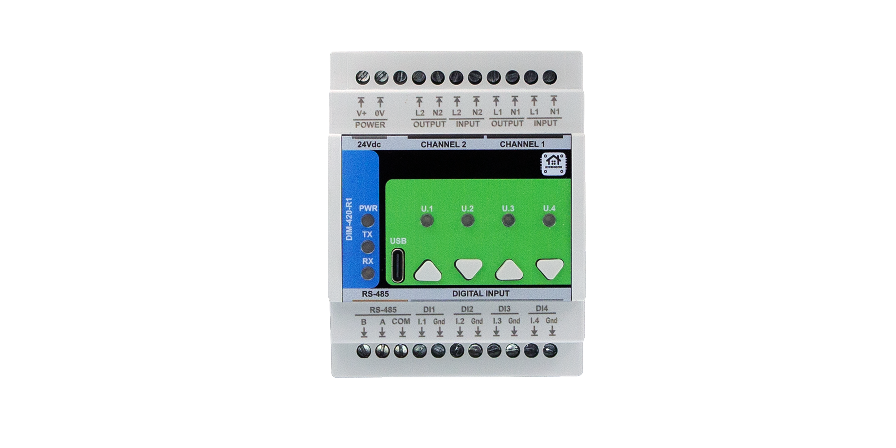

# HOMEMASTER – Modular, Resilient Smart Automation System

**Releases:** see the latest tagged build on GitHub Releases. Versioning uses **YYYY‑MM**.  
Fully open‑source hardware, firmware, and configuration tools.

---

## 📑 Quick navigation
- [1. Introduction](#1-introduction)
  - [1.1 Overview of the HomeMaster ecosystem](#11-overview-of-the-homemaster-ecosystem)
  - [1.2 Modules & controllers](#12-modules--controllers)
  - [1.3 Use cases](#13-use-cases)
  - [1.4 Why HomeMaster? (Mission)](#14-why-homemaster-mission)
- [2. Quick start](#2-quick-start)
- [3. Safety information](#3-safety-information)
- [4. System overview](#4-system-overview)
  - [4.1 Topology diagram](#41-topology-diagram)
  - [4.2 Integration with Home Assistant](#42-integration-with-home-assistant)
- [5. Networking & communication](#5-networking--communication)
- [6. Software & UI configuration](#6-software--ui-configuration)
- [7. Programming & customization](#7-programming--customization)
- [8. Troubleshooting & FAQ](#8-troubleshooting--faq)
- [9. Open source & licensing](#9-open-source--licensing)
- [10. Downloads](#10-downloads)
- [11. Support](#11-support)

---

## 1. Introduction

### 1.1 Overview of the HomeMaster ecosystem
HomeMaster is an **industrial‑grade, modular automation system** for smart homes, labs, and professional installations. It features:

- ESP32‑based PLC controllers (**MiniPLC & MicroPLC**) — same platform & memory class
- A family of smart I/O modules (energy monitoring, lighting, alarms, analog I/O, etc.)
- **RS‑485 Modbus RTU** communication
- **ESPHome** compatibility for **Home Assistant**
- **USB‑C** & **WebConfig** UI for driverless configuration

> **Local resilience:** Modules include onboard logic and continue functioning even if the controller or network is offline.

### 1.2 Modules & controllers

<table>
<tr>
<td align="center" width="50%">
  <strong>🔵 MicroPLC</strong> 
   Click to view full size
</td>
<td align="center" width="50%">
  <strong>🟢 MiniPLC</strong> 
   Click to view full size
</td>
</tr>
</table>

#### Controllers

| Controller | Description |
|-----------|-------------|
| **MiniPLC**  | Full DIN‑rail controller with **Ethernet**, **Wi‑Fi**, **USB‑C**, **BLE/Improv**, **RTC**, OLED, **6 relays**, **4 DI**, **2 AI/O**, **2 RTD**, microSD logging. Works as a **standalone PLC** and also expands via RS‑485 modules. |
| **MicroPLC** | Compact DIN‑rail controller with **Wi‑Fi**, **USB‑C**, **BLE/Improv**, **RTC**, **1 relay**, **1 DI**, 1‑Wire, RS‑485. Designed to be **affordable** and used **primarily with extension modules**. |

#### Extension modules (detailed)

> Images on the left, concise summary on the right. Click a photo to open full resolution. Full specs live on each module page.

<table>
  <tr>
    <td width="35%" align="center" valign="top">
      
       <b>ENM‑223‑R1 — 3‑Phase Energy Meter</b>
    </td>
    <td width="65%" valign="top">
      ATM90E32AS‑based sub‑metering (per‑phase Urms/Irms/P/Q/S/PF + totals) with **2× SPDT relays**. RS‑485 Modbus RTU; USB‑C WebConfig. 24 VDC DIN‑rail.
    </td>
  </tr>

  <tr>
    <td align="center" valign="top">
      
       <b>ALM‑173‑R1 — Alarm I/O</b>
    </td>
    <td valign="top">
      **17 opto DIs** for sensors, **3× SPDT relays** (up to 16 A), isolated 12 V/5 V aux rails. RS‑485 + USB‑C WebConfig. 24 VDC DIN‑rail.
    </td>
  </tr>

  <tr>
    <td align="center" valign="top">
      
       <b>DIM‑420‑R1 — Dual‑Channel AC Dimmer</b>
    </td>
    <td valign="top">
      **2‑ch phase‑cut dimming** (per‑channel leading/trailing), **4 DIs** with rich press logic, dual zero‑cross sensing. RS‑485 + WebConfig.
    </td>
  </tr>

  <tr>
    <td align="center" valign="top">
      
       <b>AIO‑422‑R1 — Analog I/O + RTD</b>
    </td>
    <td valign="top">
      **4× 0–10 V inputs** (ADS1115), **2× 0–10 V outputs** (MCP4725+op‑amp), **2× RTD** (MAX31865). RS‑485 + USB‑C. 24 VDC DIN‑rail (~3M).
    </td>
  </tr>

  <tr>
    <td align="center" valign="top">
      
       <b>DIO‑430‑R1 — Digital I/O</b>
    </td>
    <td valign="top">
      **3× SPDT relays** (up to 16 A), **4× isolated 24 VDC inputs**, override buttons, RS‑485 + USB‑C WebConfig. 24 VDC DIN‑rail.
    </td>
  </tr>

  <tr>
    <td align="center" valign="top">
      
       <b>RGB‑620‑R1 — RGBCCT LED Control</b>
    </td>
    <td valign="top">
      **5‑ch PWM** (RGB+CCT) with smooth fades, **2 DIs**, **1× relay**. RS‑485 + USB‑C; ESPHome‑ready. 24 VDC DIN‑rail.
    </td>
  </tr>

  <tr>
    <td align="center" valign="top">
      
       <b>STR‑3221‑R1 — Staircase LED Controller</b>
    </td>
    <td valign="top">
      **32 constant‑current LED channels** with animated sequences; **3 opto inputs**. RS‑485 + USB‑C. 24 VDC DIN‑rail.
    </td>
  </tr>

  <tr>
    <td align="center" valign="top">
      
       <b>WLD‑521‑R1 — Water/Leak Detection</b>
    </td>
    <td valign="top">
      **5 opto DIs** for leak probes & pulse meters (up to 1 kHz), **2 relays**, **1‑Wire** temp; isolated 12 V/5 V aux. RS‑485 + USB‑C.
    </td>
  </tr>
</table>

### 1.3 Use cases
- [x] Smart energy monitoring and control  
- [x] Smart lighting and climate control  
- [x] Leak detection and safety automation  
- [x] Modbus‑connected distributed systems  
- [x] Industrial and home lab control  

### 1.4 Why HomeMaster? (Mission)
- **Resilient by design:** Local logic ensures core functions continue without network/cloud.
- **Industrial yet maker‑friendly:** DIN‑rail hardware with ESPHome simplicity.
- **Open & repairable:** Open hardware, firmware, and tools; long‑term maintainability.

[Back to top ↑](#-quick-navigation)

---

## 2. Quick start

1. **Power the controller** — **ESPHome is pre‑installed** on MiniPLC and MicroPLC.  
2. **Join Wi‑Fi with Improv** — Use **Improv** (BLE **or** Serial) to set Wi‑Fi and adopt the device.  
3. **Wire RS‑485** — A/B differential pair; **120 Ω termination** at both bus ends.  
4. **Configure each module** — Connect via **USB‑C** and use **WebConfig** to set **Modbus address and module settings** (calibration, mapping, rules).  
5. **Open Home Assistant** — Add the ESPHome controller; modules appear as entities via the controller config.

---

## 3. Safety information

### 3.1 General electrical safety
- Only trained personnel should install or service modules.
- Disconnect all power sources before wiring or reconfiguring.
- Always follow local electrical codes and standards.

### 3.2 Handling & installation
- Mount on 35 mm DIN rails inside protective enclosures.
- Separate low‑voltage and high‑voltage wiring paths.
- Avoid exposure to moisture, chemicals, or extreme temperatures.

### 3.3 Device‑specific warnings
- Connect PE/N properly for metering modules.
- Use correct CTs (1 V or 333 mV) — never connect 5 A CTs directly.
- Avoid reverse polarity on RS‑485 lines.

[Back to top ↑](#-quick-navigation)

---

## 4. System overview

### 4.1 Topology diagram
> **Diagram placeholder:** include an `Images/system_topology.svg` illustrating:  
> Home Assistant ↔ (Wi‑Fi/Ethernet) ↔ **MiniPLC/MicroPLC** ↔ (RS‑485 Modbus RTU) ↔ **Extension Modules** (ENM/DIO/DIM/…);  
> Local logic highlighted inside each module.

### 4.2 Integration with Home Assistant
- Controllers ship with **ESPHome pre‑installed**.
- ESPHome exposes connected modules (via `modbus_controller:`) as sensors/switches/alarms.
- Use **YAML packages** to add ENM, ALM, DIM, etc., quickly in the controller config.

[Back to top ↑](#-quick-navigation)

---

## 5. Networking & communication

### 5.1 RS‑485 Modbus
- All modules use Modbus RTU (slave) over RS‑485.
- Default: `19200 8N1` (configurable).
- Bus topology supported; use **120 Ω termination** at ends; observe biasing.

### 5.2 USB‑C configuration
- Use `ConfigToolPage.html` (no drivers needed) in Chrome/Edge.
- Enables calibration, phase mapping, relay control, alarm config, etc.
- Available for each module type.

### 5.3 Wi‑Fi and Bluetooth
- Wi‑Fi on **MiniPLC** and **MicroPLC**.
- **Improv Wi‑Fi** onboarding via **BLE and Serial** on **both controllers**.
- Once connected, modules communicate over RS‑485; controllers expose them wirelessly.

### 5.4 Ethernet
- Available on **MiniPLC** only.
- Enables fast and stable connection to Home Assistant or MQTT brokers.

[Back to top ↑](#-quick-navigation)

---

## 6. Software & UI configuration

### 6.1 Web Config Tool (USB Web Serial)
- HTML file that runs locally in the browser (no install needed).
- Features per module:
  - **Modbus address & baud rate**
  - **Module settings** (relay control, alarm rules, input mappings, LED behavior)
  - Calibration / phase mapping
  - Live diagnostics

### 6.2 ESPHome setup (via controller)
- **No flashing needed** — MiniPLC/MicroPLC include ESPHome.
- The controller exposes connected modules using `modbus_controller:` in ESPHome.
- Use `packages:` with variable overrides for each ENM or DIM module.
- Add the ESPHome device to Home Assistant and select energy sensors or switches.

[Back to top ↑](#-quick-navigation)

---

## 7. Programming & customization

### 7.1 Supported languages
- **Arduino IDE**
- **PlatformIO**
- **MicroPython** (via Thonny)
- **ESPHome YAML** (default config for most users)

### 7.2 Optional developer flashing (USB‑C)
- Controllers and modules support auto‑reset via USB‑C.
- For custom firmware (Arduino/ESP‑IDF/MicroPython), use drag‑and‑drop UF2 (RP2040/RP2350) or ESPHome Web Flasher.
- **ESPHome users don’t need to flash.**

### 7.3 PlatformIO & Arduino
- Clone firmware repository.
- Use `default_xxx.ino` sketches for each module.
- Add libraries: `ModbusSerial`, `LittleFS`, `Arduino_JSON`, `SimpleWebSerial`.

[Back to top ↑](#-quick-navigation)

---

## 8. Troubleshooting & FAQ

- **ESPHome adoption fails** → Re‑run **Improv** and ensure 2.4 GHz Wi‑Fi is available.
- **No module entities** → Check RS‑485 A/B polarity and **120 Ω termination**; verify each module’s **Modbus address** in WebConfig.
- **Metering wrong** → Confirm CT type (333 mV/1 V) and phase mapping in WebConfig.
- Need help? See the **Support Portal** or open a GitHub issue.

---

## 9. Open source & licensing

- **Hardware:** CERN‑OHL‑W v2  
- **Firmware:** GPLv3  
- **Tools & examples:** MIT  
See `LICENSE` for full terms.

---

## 10. Downloads

- 📥 **Firmware (INO / YAML examples):** <https://github.com/isystemsautomation/HOMEMASTER/tree/main/Firmware>
- 🛠 **Config Tools (HTML):** <https://github.com/isystemsautomation/HOMEMASTER/tree/main/tools>
- 📷 **Images & Diagrams:** <https://github.com/isystemsautomation/HOMEMASTER/tree/main/Images>
- 📐 **Schematics:** <https://github.com/isystemsautomation/HOMEMASTER/tree/main/Schematics>
- 📖 **Manuals (PDF):** <https://github.com/isystemsautomation/HOMEMASTER/tree/main/Manuals>

[Back to top ↑](#-quick-navigation)

---

## 11. Support

- 🌐 **Official Support Portal:** <https://www.home-master.eu/support>  
- 🧠 **Hackster.io Projects:** <https://www.hackster.io/homemaster>  
- 🎥 **YouTube Channel:** <https://www.youtube.com/channel/UCD_T5wsJrXib3Rd21JPU1dg>  
- 💬 **Reddit /r/HomeMaster:** <https://www.reddit.com/r/HomeMaster>  
- 📷 **Instagram:** <https://www.instagram.com/home_master.eu>

[Back to top ↑](#-quick-navigation)

---
