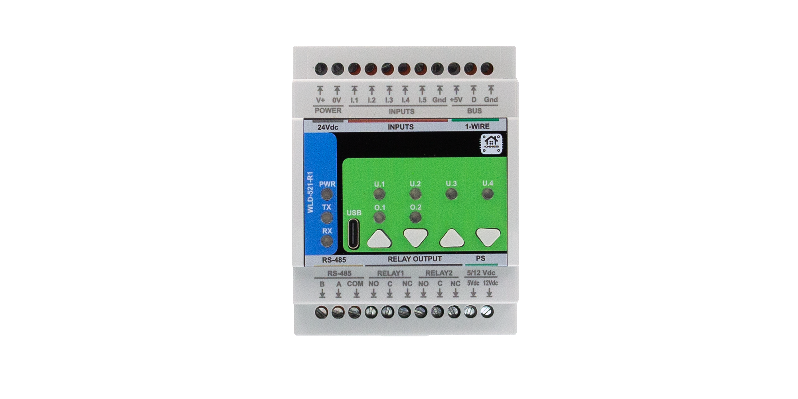

# HOMEMASTER – Modular, Resilient Smart Automation System


**Version: 2025‑09** — Fully open‑source hardware, firmware, and configuration tools.

---

## 📑 Quick navigation
- [1. Introduction](#1-introduction)
  - [1.1 Overview of the HomeMaster ecosystem](#11-overview-of-the-homemaster-ecosystem)
  - [1.2 Modules & controllers](#12-modules--controllers)
  - [1.3 Use cases](#13-use-cases)
  - [1.4 Why HomeMaster? (Mission)](#14-why-homemaster-mission)
- [2. Quick start](#2-quick-start)
- [3. Safety information](#3-safety-information)
- [4. System overview](#4-system-overview)
  - [4.1 Topology diagram](#41-topology-diagram)
  - [4.2 MicroPLC vs MiniPLC](#42-microplc-vs-miniplc)
  - [4.3 Integration with Home Assistant](#43-integration-with-home-assistant)
- [5. Networking & communication](#5-networking--communication)
- [6. Software & UI configuration](#6-software--ui-configuration)
- [7. Programming & customization](#7-programming--customization)
- [8. Troubleshooting & FAQ](#8-troubleshooting--faq)
- [9. Open source & licensing](#9-open-source--licensing)
- [10. Downloads](#10-downloads)
- [11. Support](#11-support)
- [Appendix A. MiniPLC power supply and protection](#appendix-a-miniplc-power-supply-and-protection)
- [Appendix B. I/O circuitry details](#appendix-b-io-circuitry-details)
- [Appendix C. Web server and OTA updates](#appendix-c-web-server-and-ota-updates)

---

## 1. Introduction

### 1.1 Overview of the HomeMaster ecosystem
HomeMaster is an **industrial‑grade, modular automation system** for smart homes, labs, and professional installations. It features:

- ESP32‑based PLC controllers (**MiniPLC & MicroPLC**)
- A family of smart I/O modules (energy monitoring, lighting, alarms, analog I/O, etc.)
- **RS‑485 Modbus RTU** communication
- **ESPHome** compatibility for **Home Assistant**
- **USB‑C** & **WebConfig** UI for driverless configuration

> **Local resilience:** Modules include onboard logic and continue functioning even if the controller or network is offline.

### 1.2 Modules & controllers

<table>
<tr>
<td align="center" width="50%">
  <strong>🔵 MicroPLC</strong><br>
  <a href="./MicroPLC/Images/MicroPLC.png">
    
  </a><br><sub>Click to view full size</sub>
</td>
<td align="center" width="50%">
  <strong>🟢 MiniPLC</strong><br>
  <a href="./MiniPLC/Images/MiniPLC2.png">
    
  </a><br><sub>Click to view full size</sub>
</td>
</tr>
</table>

#### Controllers

| Controller | Description |
|-----------|-------------|
| **MiniPLC**  | Advanced DIN‑rail controller with Ethernet, relays, analog I/O, RTD, display, SD logging |
| **MicroPLC** | Compact controller with RS‑485, relay, input, 1‑Wire, RTC, USB‑C |

#### Extension modules (summary)

| Extension Module | Key Features |
|------------------|--------------|
| **ENM‑223‑R1** | 3‑phase energy meter + 2 relays |
| **ALM‑173‑R1** | 17 digital inputs + 3 relays |
| **DIM‑420‑R1** | 2‑channel dimmer + 4 inputs |
| **AIO‑422‑R1** | Analog I/O + RTD |
| **DIO‑430‑R1** | Digital I/O |
| **RGB‑620‑R1** | 6× MOSFET RGB channels |
| **WLD‑521‑R1** | Leak detector + valve |
| **STR‑3221‑R1** | Staircase LED controller (32 channels) |

### 🧩 Extension modules — image gallery

> Thumbnails are sized for readability. Click an image to open the full‑resolution version.

<table>
<tr>
<td align="center" width="33%">
  <a href="./ENM-223-R1/Images/photo1.png">
    
  </a><br/><sub><b>ENM‑223‑R1</b></sub>
</td>
<td align="center" width="33%">
  <a href="./ALM-173-R1/Images/photo1.png">
    
  </a><br/><sub><b>ALM‑173‑R1</b></sub>
</td>
<td align="center" width="33%">
  <a href="./DIM-420-R1/Images/photo1.png">
    
  </a><br/><sub><b>DIM‑420‑R1</b></sub>
</td>
</tr>
<tr>
<td align="center" width="33%">
  <a href="./AIO-422-R1/Images/photo1.png">
    
  </a><br/><sub><b>AIO‑422‑R1</b></sub>
</td>
<td align="center" width="33%">
  <a href="./DIO-430-R1/Images/photo1.png">
    
  </a><br/><sub><b>DIO‑430‑R1</b></sub>
</td>
<td align="center" width="33%">
  <a href="./RGB-620-R1/Images/photo1.png">
    
  </a><br/><sub><b>RGB‑620‑R1</b></sub>
</td>
</tr>
<tr>
<td align="center" width="33%">
  <a href="./STR-3221-R1/Images/photo1.png">
    
  </a><br/><sub><b>STR‑3221‑R1</b></sub>
</td>
<td align="center" width="33%">
  <a href="./WLD-521-R1/Images/photo1.png">
    
  </a><br/><sub><b>WLD‑521‑R1</b></sub>
</td>
<td width="33%"></td>
</tr>
</table>

### 1.3 Use cases
- [x] Smart energy monitoring and control  
- [x] Smart lighting and climate control  
- [x] Leak detection and safety automation  
- [x] Modbus‑connected distributed systems  
- [x] Industrial and home lab control  

### 1.4 Why HomeMaster? (Mission)
- **Resilient by design:** Local logic ensures core functions continue without network/cloud.
- **Industrial yet maker‑friendly:** DIN‑rail hardware with ESPHome simplicity.
- **Open & repairable:** Open hardware, firmware, and tools; long‑term maintainability.

[Back to top ↑](#-quick-navigation)

---

## 2. Quick start

### 2.1 Choose a starting setup
- **Starter (lighting):** MicroPLC + DIO‑430‑R1 + RGB‑620‑R1  
- **Energy (monitoring):** MicroPLC + ENM‑223‑R1  
- **Lab/Pro:** MiniPLC + any modules needed over RS‑485

### 2.2 Flash & connect
1. Power the controller (see **Appendix A**).
2. Connect via **ESPHome Web Flasher** (USB‑C) or add the device with **Improv Wi‑Fi** (fallback SSID visible on first boot).
3. Use **WebConfig** to set each module’s **Modbus address/baud**.

### 2.3 Minimal ESPHome example (via `modbus_controller:`)
```yaml
esphome:
  name: homemaster-microplc

uart:
  id: rs485
  tx_pin: GPIO17
  rx_pin: GPIO16
  baud_rate: 19200
  stop_bits: 1

modbus:
  id: mbus
  uart_id: rs485

modbus_controller:
  - id: enm223
    address: 0x01
    modbus_id: mbus
    update_interval: 3s
# Use packages/ or sensors: blocks per module (see Downloads).
```

### 2.4 Verify in Home Assistant
- Add the ESPHome device; confirm sensors/switches appear.
- Create a test dashboard card (e.g., relay toggle or power reading).

[Back to top ↑](#-quick-navigation)

---

## 3. Safety information

### 3.1 General electrical safety
- Only trained personnel should install or service modules.
- Disconnect all power sources before wiring or reconfiguring.
- Always follow local electrical codes and standards.

### 3.2 Handling & installation
- Mount on 35 mm DIN rails inside protective enclosures.
- Separate low‑voltage and high‑voltage wiring paths.
- Avoid exposure to moisture, chemicals, or extreme temperatures.

### 3.3 Device‑specific warnings
- Connect PE/N properly for metering modules.
- Use correct CTs (1 V or 333 mV) — never connect 5 A CTs directly.
- Avoid reverse polarity on RS‑485 lines.

[Back to top ↑](#-quick-navigation)

---

## 4. System overview

### 4.1 Topology diagram
> **Diagram placeholder:** include an `Images/system_topology.svg` illustrating:  
> Home Assistant ↔ (Wi‑Fi/Ethernet) ↔ **MiniPLC/MicroPLC** ↔ (RS‑485 Modbus RTU) ↔ **Extension Modules** (ENM/DIO/DIM/…);  
> Local logic highlighted inside each module.

### 4.2 MicroPLC vs MiniPLC

| Feature      | MiniPLC        | MicroPLC      |
|--------------|----------------|---------------|
| Size         | Full DIN       | Compact DIN   |
| I/O          | Rich onboard   | Basic onboard |
| Connectivity | Ethernet + USB | USB only      |
| Expansion    | Modbus RTU     | Modbus RTU    |
| Target use   | Large systems  | Small systems |

### 4.3 Integration with Home Assistant
- ESPHome integration: modules appear as devices with sensors, switches, and alarms.
- Home Assistant can use entities for dashboards, automations, and energy monitoring.
- Use **YAML packages** to add ENM, ALM, DIM, etc. quickly.

[Back to top ↑](#-quick-navigation)

---

## 5. Networking & communication

### 5.1 RS‑485 Modbus
- All modules use Modbus RTU (slave) over RS‑485.
- Default: `19200 8N1` (configurable).
- Bus topology supported; use **120 Ω termination** at ends; observe biasing.

### 5.2 USB‑C configuration
- Use `ConfigToolPage.html` (no drivers needed) in Chrome/Edge.
- Enables calibration, phase mapping, relay control, alarm config, etc.
- Available for each module type.

### 5.3 Wi‑Fi and Bluetooth
- Wi‑Fi on **MiniPLC** and **MicroPLC**.
- **Improv Wi‑Fi** onboarding via BLE supported (MicroPLC only).
- Once connected, modules communicate over RS‑485; controllers expose them wirelessly.

### 5.4 Ethernet
- Available on **MiniPLC** only.
- Enables fast and stable connection to Home Assistant or MQTT brokers.

[Back to top ↑](#-quick-navigation)

---

## 6. Software & UI configuration

### 6.1 Web Config Tool (USB Web Serial)
- HTML file that runs locally in the browser (no install needed).
- Features per module:
  - Modbus address & baud rate
  - Relay control
  - Alarm rules
  - Input mappings
  - LED behavior
  - Calibration / phase mapping

### 6.2 ESPHome Wi‑Fi setup (via controller)
- MiniPLC/MicroPLC expose connected modules using `modbus_controller:` in ESPHome.
- Use `packages:` with variable overrides for each ENM or DIM module.
- Add ESPHome device to Home Assistant and select energy sensors or switches.

[Back to top ↑](#-quick-navigation)

---

## 7. Programming & customization

### 7.1 Supported languages
- **Arduino IDE**
- **PlatformIO**
- **MicroPython** (via Thonny)
- **ESPHome YAML** (default config for most users)

### 7.2 Flashing via USB‑C
- All controllers and modules support auto‑reset via USB‑C.
- No need to press buttons — supports drag‑and‑drop UF2 (RP2040/RP2350) or ESPHome Web Flasher.

### 7.3 PlatformIO & Arduino
- Clone firmware repository.
- Use `default_xxx.ino` sketches for each module.
- Add libraries: `ModbusSerial`, `LittleFS`, `Arduino_JSON`, `SimpleWebSerial`.

[Back to top ↑](#-quick-navigation)

---

## 8. Troubleshooting & FAQ

**Q1. WebConfig can’t detect my module over USB.**  
• Try Chrome or Edge (Web Serial API). • Use a known‑good USB‑C cable. • Press reset and reconnect. • Check that the device is not claimed by another serial app.

**Q2. Home Assistant doesn’t show my sensors.**  
• Confirm your ESPHome device is online. • Verify `uart:` pins and baud. • Ensure unique Modbus **addresses** for each module. • Increase `update_interval` temporarily to test.

**Q3. RS‑485 bus is unreliable.**  
• Add 120 Ω termination at both ends. • Ensure proper biasing. • Keep cable lengths reasonable; use twisted pair/shielded cable. • Separate high‑/low‑voltage wiring.

**Q4. Firmware update failed.**  
• Try USB flashing with Web Flasher. • Power‑cycle the device. • Check that no other app uses the serial port. • Use a shorter USB cable.

[Back to top ↑](#-quick-navigation)

---

## 9. Open source & licensing

- **Hardware:** **CERN‑OHL‑W v2.0** (modifiable; commercial use permitted with open‑source derivative)  
- **Firmware:** **GPLv3** (contributions welcome)  
- **Web UI:** **MIT** (ConfigToolPage.html files for each module)

[Back to top ↑](#-quick-navigation)

---

## 10. Downloads

- 📥 **Firmware (INO / YAML examples):** <https://github.com/isystemsautomation/HOMEMASTER/tree/main/Firmware>
- 🛠 **Config Tools (HTML):** <https://github.com/isystemsautomation/HOMEMASTER/tree/main/tools>
- 📷 **Images & Diagrams:** <https://github.com/isystemsautomation/HOMEMASTER/tree/main/Images>
- 📐 **Schematics:** <https://github.com/isystemsautomation/HOMEMASTER/tree/main/Schematics>
- 📖 **Manuals (PDF):** <https://github.com/isystemsautomation/HOMEMASTER/tree/main/Manuals>

[Back to top ↑](#-quick-navigation)

---

## 11. Support

- 🌐 **Official Support Portal:** <https://www.home-master.eu/support>  
- 🧠 **Hackster.io Projects:** <https://www.hackster.io/homemaster>  
- 🎥 **YouTube Channel:** <https://www.youtube.com/channel/UCD_T5wsJrXib3Rd21JPU1dg>  
- 💬 **Reddit /r/HomeMaster:** <https://www.reddit.com/r/HomeMaster>  
- 📷 **Instagram:** <https://www.instagram.com/home_master.eu>

[Back to top ↑](#-quick-navigation)

---

## Appendix A. 🔌 MiniPLC power supply and protection

The **MiniPLC** can be powered in two ways:

- Via **external 24 VDC** to the V+/0V terminals  
- Via the **internal MYRRA 47156 AC/DC power supply**, which accepts:
  - **85–265 VAC** or **120–370 VDC**
  - Output: 24 V / 220 mA (≈5 W), 79% efficiency

> ⚠️ **Do not connect 24 VDC to the terminal block if the internal PSU is active.**

### 🔧 Internal fuse & TVS protection
- TVS diodes on input/output terminals
- Resettable fuses on relay outputs and RS‑485 lines

---

## Appendix B. ⚙️ I/O circuitry details

### 🟥 Relay outputs (6x)
- Relays: **HF115F/005‑1ZS3** (SPDT, dry contact)
- Rated for:
  - 250 VAC 16 A (resistive)
  - 250 VAC 9 A (inductive, cosφ=0.4)
  - 30 VDC 10 A
- Internal varistors and optocouplers provide isolation

### 🟩 Digital inputs (4x)
- Isolated via **ISO1212** surge‑protected input ICs
- Voltage ranges:
  - Logic 0: 0–9.2 VDC
  - Undefined: 9.2–15.8 VDC
  - Logic 1: 15.8–24 VDC

### 🟦 RTD inputs (2x)
- **MAX31865‑based**. Supports PT100 / PT1000 (2‑, 3‑, 4‑wire).
- Jumper‑configurable:
  - J1–J8 for RTD type and wire count
  - Factory default: RTD1 = PT100 2‑wire, RTD2 = PT1000 2‑wire

```text
Jumper Setup:
  PT100:  J2=ON, J6=ON
  PT1000: J3=ON, J7=ON
  2‑Wire: J1=ON, J5=ON, J8=ON
  3‑Wire: J4=ON, J6=ON, J8=ON
  4‑Wire: J4=ON, J5=ON
```

#### ESPHome RTD YAML example
```yaml
sensor:
  - platform: max31865
    name: "RTD Channel 1"
    cs_pin: GPIO1
    reference_resistance: 400.0
    rtd_nominal_resistance: 100.0
    update_interval: 60s

  - platform: max31865
    name: "RTD Channel 2"
    cs_pin: GPIO3
    reference_resistance: 4000.0
    rtd_nominal_resistance: 1000.0
    update_interval: 60s
```

### 🟨 Analog I/O
- Inputs: **ADS1115** (4 channels, 16‑bit, 0–10 V)
- Output: **MCP4725** DAC (12‑bit, 0–10 V via op‑amp)
- ESD and EMI‑protected

---

## Appendix C. 🌐 Web server and OTA updates

The MiniPLC includes a built‑in **ESPHome OTA‑capable web server**.

### WebConfig access (ESPHome Improv)
1. Connect to the fallback Wi‑Fi hotspot: `MiniPLC Fallback`
2. Password: `12345678`
3. Visit: `http://192.168.4.1`
4. Join your home Wi‑Fi

### ESPHome OTA update flow
- Upload firmware via ESPHome Dashboard or OTA.
- Use USB‑C to flash manually if needed.

[Back to top ↑](#-quick-navigation)
