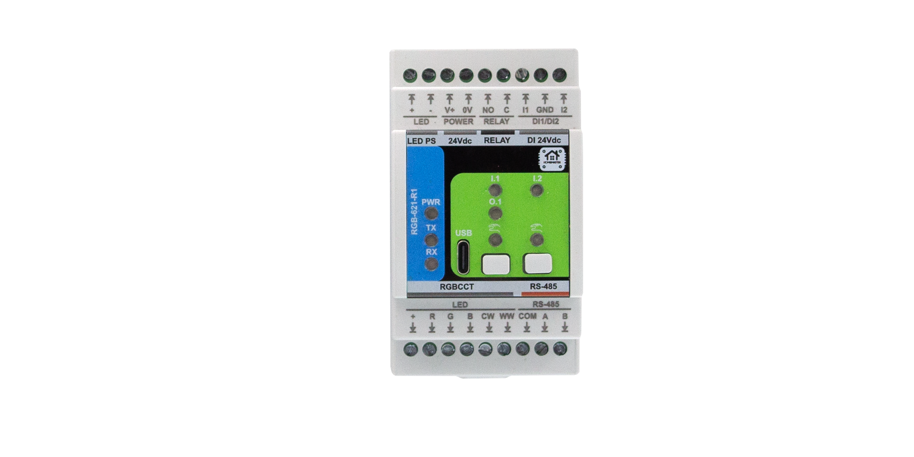

**Firmware Version:** 2025-07 snapshot

# RGB-621-R1 — Module for RGB+CCT LED Control

**HOMEMASTER – Modular control. Custom logic.**

### Module Description

The **RGB-621-R1** is a configurable smart I/O lighting module designed for **RGB + Tunable White (CCT)** LED control.  
It includes **5 PWM outputs**, **2 isolated digital inputs**, and **1 relay**, with configuration via **WebConfig** using **USB-C (Web Serial)**.  
It connects over **RS-485 (Modbus RTU)** to a **MicroPLC/MiniPLC**, enabling use in **home automation, ambient and architectural lighting, and color scene control**.

---

## Table of Contents

* [1. Introduction](#1-introduction)
* [2. Use Cases](#2-use-cases)
* [3. Safety Information](#3-safety-information)
* [4. Installation & Quick Start](#4-installation-quick-start)
* [5. MODULE-CODE — Technical Specification](#5-module-code--technical-specification)
* [6. Modbus RTU Communication](#6-modbus-rtu-communication)
* [7. ESPHome Integration Guide (if applicable)](#7-esphome-integration-guide)
* [8. Programming & Customization](#8-programming--customization)
* [9. Maintenance & Troubleshooting](#9-maintenance--troubleshooting)
* [10. Open Source & Licensing](#10-open-source--licensing)
* [11. Downloads](#11-downloads)
* [12. Support](#12-support)

 

---

# 1. Introduction

## 1.1 Overview of the RGB-621-R1

The **RGB-621-R1** is a **smart RGB + CCT LED controller module** designed for use in **HomeMaster automation systems**.  
It provides **five high-current PWM outputs** for controlling **RGB and Tunable White (CCT)** LED channels, along with **two isolated digital inputs** for wall switches or sensors, and **one relay output** for switching external loads or LED drivers.

Powered by the **Raspberry Pi RP2350A** microcontroller, the module features robust **RS-485 (Modbus RTU)** communication, **on-board WebConfig via USB-C**, and comprehensive surge and short-circuit protection.  
It connects directly to **HomeMaster MicroPLC** and **MiniPLC** controllers or can act as a standalone Modbus slave within any automation network.  

Configuration and diagnostics are performed via **Web Serial (USB-C)** using the integrated WebConfig interface — no drivers or external software required.  
Its isolated I/O architecture and dual-board design ensure electrical resilience, accurate dimming, and noise-free operation in demanding lighting environments.

---

## 1.2 Features & Architecture

| Subsystem         | Qty | Description |
|-------------------|-----|-------------|
| **Digital Inputs** | 2 | Galvanically isolated (ISO1212) dry-contact inputs with surge and reverse protection |
| **PWM Outputs** | 5 | N-channel MOSFET drivers (AP9990GH-HF), 12 V / 24 V LED channels for R / G / B / CW / WW |
| **Relay Output** | 1 | SPST-NO relay (HF115F/005-1ZS3), 5 V coil, rated 16 A @ 250 VAC / 30 VDC |
| **Buttons** | 2 | Local control or configuration triggers (SW1 / SW2) |
| **LED Indicators** | 8 | Power, TX/RX, input, and status LEDs for feedback and diagnostics |
| **Modbus RTU** | Yes | RS-485 interface via MAX485CSA+T transceiver; 120 Ω termination selectable |
| **USB-C** | Yes | WebConfig & firmware flashing with PRTR5V0U2X ESD protection |
| **Power Input** | 24 V DC | Protected by resettable fuses (1206L series), TVS (SMBJ33A), and reverse-blocking (STPS340U) |
| **Logic Supply** | — | AP64501SP-13 buck (5 V) + AMS1117-3.3 LDO chain |
| **MCU** | RP2350A | Dual-core Arm Cortex-M33 @ 133 MHz with 32 Mbit QSPI Flash (W25Q32JVUUIQ) |
| **Isolation & Protection** | — | Galvanic isolation, TVS diodes, PTC fuses, transient suppression on all field I/O |

**Architecture summary:**  
- **MCU Board:** manages logic, USB, Modbus, and power regulation  
- **Field Board:** contains LED drivers, relay circuit, and isolated input section  
This modular, two-board design ensures clean signal separation between logic and 24 V field wiring, improving reliability in mixed-voltage installations.

---

## 1.3 System Role & Communication

The **RGB-621-R1** operates as a **Modbus RTU slave** on an **RS-485 differential bus**, typically polled by a **HomeMaster controller** (MicroPLC / MiniPLC) or other Modbus master.  
Each module is assigned a unique Modbus address via WebConfig, supporting up to 32 devices per bus.

**Default communication parameters:**  
- **Address:** 1  
- **Baud rate:** 19200 bps  
- **Format:** 8 data bits, no parity, 1 stop bit (8N1)  
- **Termination:** 120 Ω enabled at end of bus  
- **Fail-safe:** retains last valid PWM and relay state if communication is lost  

The controller periodically polls holding registers to:  
- Write PWM duty values for R, G, B, CW, WW channels  
- Control the relay output  
- Read digital input and status bits  

WebConfig enables users to modify address, baud rate, test I/O, calibrate channels, and perform real-time diagnostics — simplifying setup and commissioning.

---

# 2. Use Cases

The **RGB-621-R1** module is primarily designed for multi-channel lighting control but can also be used in broader automation and signaling tasks.  
Its combination of isolated inputs, PWM outputs, and a relay makes it suitable for ambient lighting, architectural control, and user-interactive automation.

---

### 🏠 Use Case 1 — RGB Scene Control with Wall Switch Inputs

**Purpose:**  
Use two wall switches to trigger and cycle through preset color or brightness scenes stored in the controller.

**How it works:**  
Each digital input acts as a trigger to change the lighting mode or adjust brightness levels.

**Setup Steps:**
1. Connect **DI1** and **DI2** to wall switches (dry contact).  
2. Wire **RGBW LED strips** to PWM outputs R, G, B, CW, WW.  
3. In **WebConfig**, assign Modbus address and test LED channels.  
4. In the **MicroPLC / MiniPLC**, define scene logic (e.g., DI1 → next scene, DI2 → off).  
5. Use Modbus holding registers to control PWM duty cycles for each channel.

---

### 💡 Use Case 2 — Relay-Based Power Switching for LED Drivers

**Purpose:**  
Control a 24 V LED power supply or auxiliary lighting circuit via the onboard relay.

**How it works:**  
The relay output switches the driver’s DC line or AC supply based on PLC logic or local input triggers.

**Setup Steps:**
1. Connect the **relay COM/NO terminals** in series with the LED driver’s supply.  
2. Wire LED outputs to PWM channels for dimming control.  
3. In **WebConfig**, enable relay control via Modbus coil.  
4. Program the controller to energize the relay only when active scenes are running.  
5. Optionally, use a wall switch on **DI1** as a manual override for relay control.

---

### 🌈 Use Case 3 — Tunable White (CCT) Control with Daylight Automation

**Purpose:**  
Implement human-centric lighting that adjusts color temperature (CCT) throughout the day.

**How it works:**  
Two PWM channels (CW and WW) mix warm and cool light based on time of day or ambient sensor input.

**Setup Steps:**
1. Connect **CW** and **WW** LED strips to respective PWM outputs.  
2. Define a time-based profile in the controller (morning = warm, midday = cool).  
3. Use Modbus registers to update CW/WW duty cycles automatically.  
4. Optionally, map DI1 as a manual “Day/Night” mode toggle.  
5. Adjust max/min PWM limits in WebConfig for consistent brightness.

---

### 🚨 Use Case 4 — Status Indicator / Alarm Signaling

**Purpose:**  
Display system or alarm status using color lighting patterns.

**How it works:**  
The module’s PWM channels can drive RGB indicators or stack lights controlled by alarm flags from the PLC.

**Setup Steps:**
1. Wire a small 12 V RGB LED indicator to PWM outputs R, G, and B.  
2. Connect the module to the same Modbus bus as the alarm controller.  
3. Assign registers to display alarm colors (e.g., red = alert, green = normal).  
4. Use DI1 as a manual alarm acknowledge input.  
5. Configure the relay as an auxiliary siren or warning signal driver.

---

### 🧠 Use Case 5 — Standalone Mood Lighting Controller

**Purpose:**  
Operate ambient RGB lighting locally without an external PLC, using onboard inputs and preloaded logic.

**How it works:**  
The module can store simple input-to-output mapping rules (through WebConfig or firmware) for local lighting control.

**Setup Steps:**
1. Power the module from a 24 V DC supply.  
2. Connect LED strips to PWM outputs and wall switches to DI1/DI2.  
3. In WebConfig, set input-to-PWM mapping rules or fading behavior.  
4. Adjust brightness levels and transition speeds.  
5. Optionally, connect to Modbus later for centralized control or monitoring.

---

These examples illustrate how the **RGB-621-R1** can serve as both a **dedicated lighting driver** and a **multi-purpose automation node**, combining smooth dimming, robust field isolation, and Modbus integration.

---

# 3. Safety Information

## 3.1 General Requirements

| Requirement | Detail |
|--------------|--------|
| **Qualified Personnel** | Only trained or qualified technicians should install, wire, or service the module. |
| **Power Isolation** | Always disconnect the 24 V DC supply and RS-485 bus before working on terminals. |
| **Rated Voltages Only** | Use **SELV/PELV** (safety extra-low voltage) circuits only — no mains voltage connections. |
| **Grounding** | Ensure proper protective earth (PE) and system ground connection for the control cabinet. |
| **Enclosure** | Mount inside a dry, ventilated DIN-rail enclosure; avoid dust, humidity, and chemical exposure. |

---

## 3.2 Installation Practices

Follow these best practices derived from hardware design and schematic domains:

- **DIN Mounting**  
  Mount the module on a **35 mm DIN rail** with sufficient airflow. Leave ≥ 10 mm spacing to adjacent high-current or high-voltage devices.  

- **Isolation Domains**  
  The board contains **separate field and logic domains**:  
  - `24 VDC_FUSED` — LED drivers, relay coil, and input sensing  
  - `5 V` / `3.3 V` — MCU and communication logic  
  Maintain isolation between **GND_FUSED (field)** and **GND (logic)**. Never short or bridge these planes externally.

- **Relay Wiring**  
  The onboard **HF115F 5 V relay** switches **low-voltage DC or AC** loads only.  
  - Max: **16 A @ 250 VAC / 30 VDC** (resistive)  
  - Inductive loads require a **flyback diode or RC snubber**.  
  - Keep relay wiring twisted and away from signal lines.

- **Sensor and Input Wiring**  
  Inputs use **galvanically isolated channels (ISO1212)**; connect only **dry contacts or sourcing 24 V signals**.  
  - Each input is current-limited and TVS-protected.  
  - Never inject external power into DI pins.  
  - Use shielded cables for long runs (> 10 m).

---

## 3.3 Interface Warnings

### ⚡ Power Supply (24 V DC)

| Parameter | Specification |
|------------|----------------|
| Nominal Voltage | 24 V DC ± 10 % |
| Inrush / Fuse | PTC fuses (F1–F4) auto-resettable |
| Protection | Reverse polarity (STPS340U), TVS (SMBJ33A) |
| Isolation | Galvanically isolated from logic 5 V rail |
| Note | Use a clean, regulated SELV supply rated ≥ 1 A per module |

---

### 🟢 Digital Inputs

| Parameter | Specification |
|------------|----------------|
| Type | Isolated, dry contact or 24 V sourcing input |
| Circuit | ISO1212DBQ with TVS + PTC protection |
| Logic Voltage | 9 – 60 V DC (typ. 24 V DC) |
| Isolation Voltage | 3 kVrms (channel-to-logic) |
| Notes | Do not connect sensors with open-collector or powered outputs without interface relays. |

---

### 🔴 Relay Output

| Parameter | Specification |
|------------|----------------|
| Type | SPST-NO, mechanical relay (HF115F) |
| Coil Voltage | 5 V DC (driven from logic side) |
| Contact Rating | 16 A @ 250 VAC / 30 V DC |
| Protection | TVS + RC snubber recommended for inductive loads |
| Notes | Do not exceed voltage/current ratings. Separate signal and power wiring. |

---

### 🔵 RS-485 Communication

| Parameter | Specification |
|------------|----------------|
| Transceiver | MAX485CSA+T |
| Topology | Differential bus, multi-drop (A/B lines) |
| Default Settings | 19200 bps, 8N1 |
| Termination | 120 Ω at module end (enable if last device) |
| Protection | TVS + RC network for surge suppression |
| Notes | Maintain correct polarity: **A (+)**, **B (–)**; twisted-pair shielded cable recommended. |

---

### 🧰 USB-C Interface

| Parameter | Specification |
|------------|----------------|
| Function | WebConfig & Firmware flashing only |
| Protection | ESD (PRTR5V0U2X), current-limited (CG0603MLC-05E) |
| Logic Voltage | 5 V DC from host |
| Isolation | Not galvanically isolated — PC and field grounds connect via USB shield |
| Notes | Use only for configuration in a safe, non-energized environment. Not intended for field runtime use. |

---

> ⚠️ **Important:** The RGB-621-R1 is a SELV-only device.  
> Never connect mains voltage to any terminal.  
> Always maintain isolation boundaries and follow local electrical codes during installation.

---

# 4. Installation & Quick Start

## 4.1 What You Need

| Item | Description |
|------|-------------|
| Module | MODULE-CODE unit |
| Controller | MiniPLC/MicroPLC or Modbus RTU master |
| PSU | Regulated 24 VDC |
| Cable | USB-C and RS-485 twisted pair |
| Software | Browser with Web Serial support |

## 4.2 Power

- Describe 24 VDC input
- List expected current
- Explain isolated sensor power if present

## 4.3 Communication

- RS-485 pinout
- Address & baudrate setup
- Use of COM/GND reference

## 4.4 Installation & Wiring

Use diagrams and explain:
- Inputs
- Relays
- Sensor rails (12/5V)
- RS-485 terminals
- USB port

## 4.5 Software & UI Configuration

Cover:
- WebConfig setup (address, baud)
- Input enable/invert/group
- Relay logic mode (group/manual)
- LED and Button mapping

## 4.6 Getting Started

Summarize steps in 3 phases:
1. Wiring
2. Configuration
3. Integration

---

# 5. MODULE-CODE — Technical Specification

## 5.1 Diagrams & Pinouts

Add photos/diagrams:
- System block diagram
- Board layouts
- Terminal maps

## 5.2 I/O Summary

Summarize in a table:

| Interface | Qty | Description |
|-----------|-----|-------------|
| Inputs |   | Opto-isolated |
| Relays |   | SPST/SPDT |
| LEDs |   | Status indication |
| USB-C | 1 | Setup only |

## 5.3 Electrical Specs

Cover:
- Input voltage range
- Current consumption
- Sensor rail current
- Relay contact ratings
- Isolation details

## 5.4 Firmware Behavior

Explain:
- Alarm logic (latched/momentary)
- Override priority
- LED feedback modes

---

# 6. Modbus RTU Communication

Include:
- Address range and map
- Input/holding register layout
- Coil/discrete inputs
- Register use examples
- Polling recommendations

---

# 7. ESPHome Integration Guide

Only if supported. Cover:
- YAML setup (`uart`, `modbus`, `package`)
- Entity list (inputs, relays, buttons, LEDs)
- Acknowledge, override controls
- Home Assistant integration tips

---

# 8. Programming & Customization

## 8.1 Supported Languages

- Arduino
- C++
- MicroPython

## 8.2 Flashing

Steps for:
- USB-C flashing
- BOOT/RESET button use
- PlatformIO / Arduino IDE setup

## 8.3 Arduino / PlatformIO Notes

Mention:
- Required libraries
- Pin mapping
- Board config

## 8.4 Firmware Updates

- How to update
- Preserving config
- Recovery methods

---

# 9. Maintenance & Troubleshooting

Optional section. Add:
- Status LED meanings
- Reset methods
- Common issues (no comms, relay won’t trigger, etc.)

---

# 10. Open Source & Licensing

- **Hardware:** CERN-OHL-W v2
- **Firmware:** GPLv3
- **Config Tools:** MIT or other as applicable

---

# 11. Downloads

Include links to:

- Firmware binaries
- YAML configs
- WebConfig tool
- Schematics (PDF)
- Images and diagrams
- Datasheets

---

# 12. Support

- [Official Support Portal](https://www.home-master.eu/support)
- [WebConfig Tool](https://www.home-master.eu/configtool-[module-code])
- [YouTube](https://youtube.com/@HomeMaster)
- [Hackster](https://hackster.io/homemaster)
- [Reddit](https://reddit.com/r/HomeMaster)
- [Instagram](https://instagram.com/home_master.eu)

