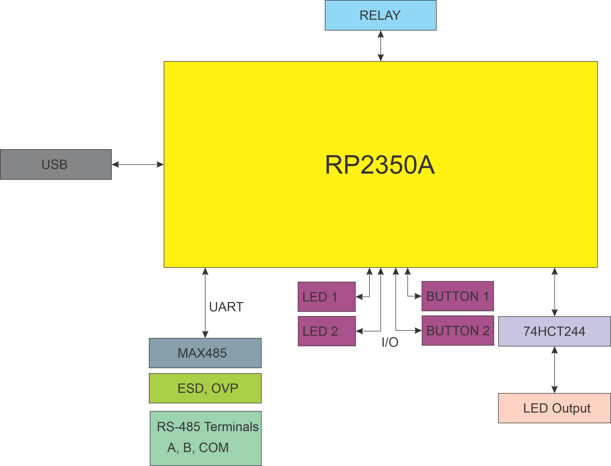
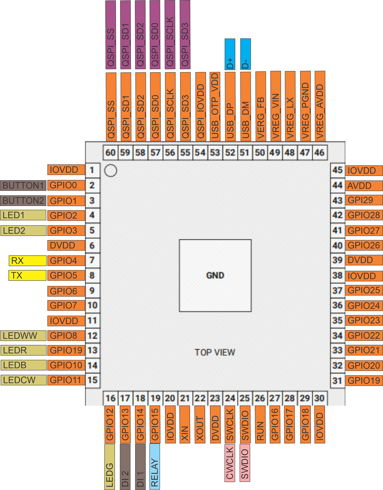
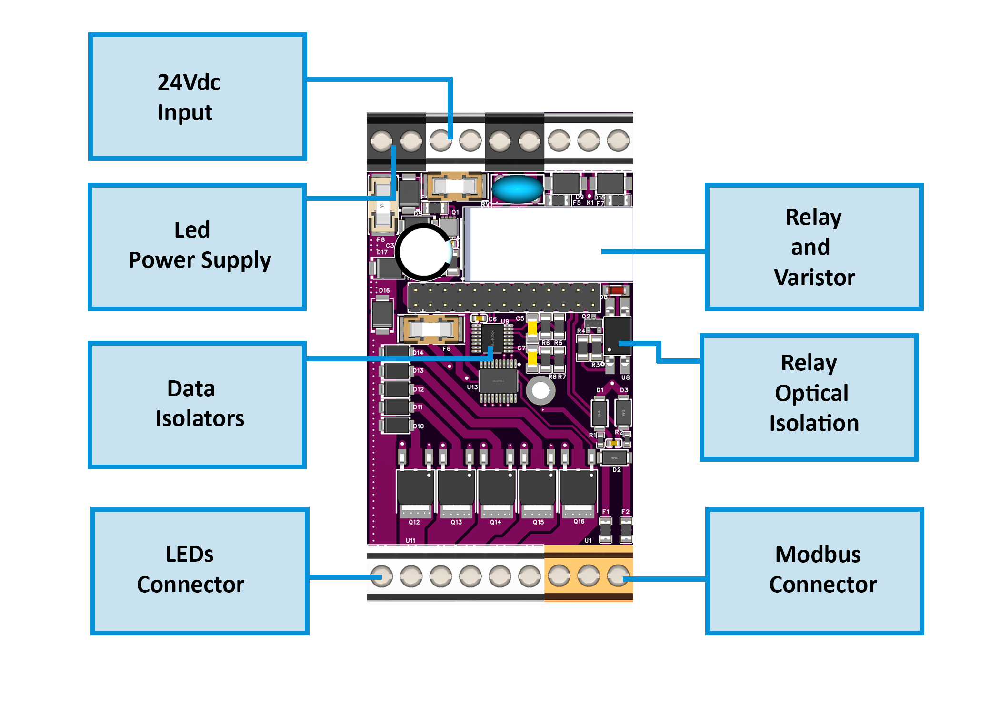
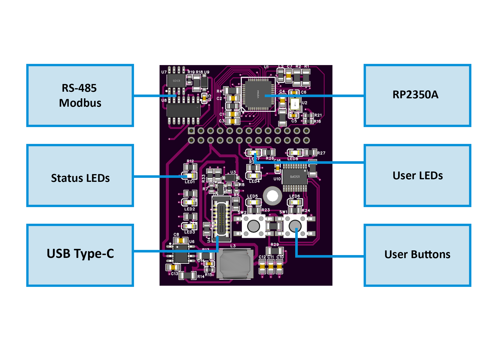
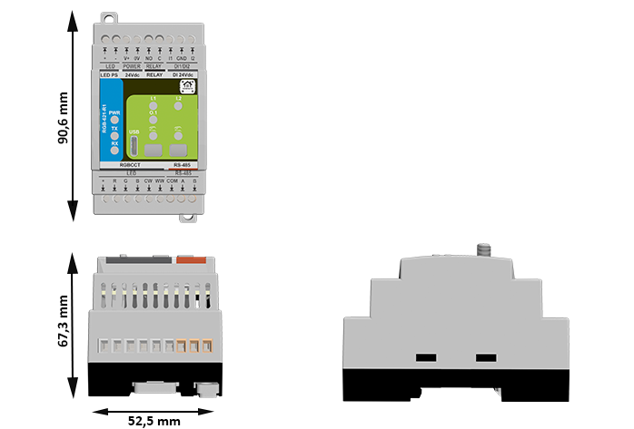

**Firmware Version:** 2025-07 snapshot

# RGB-621-R1 — Module for RGB+CCT LED Control

**HOMEMASTER – Modular control. Custom logic.**

### Module Description

The **RGB-621-R1** is a configurable smart I/O lighting module designed for **RGB + Tunable White (CCT)** LED control.  
It includes **5 PWM outputs**, **2 isolated digital inputs**, and **1 relay**, with configuration via **WebConfig** using **USB-C (Web Serial)**.  
It connects over **RS-485 (Modbus RTU)** to a **MicroPLC/MiniPLC**, enabling use in **home automation, ambient and architectural lighting, and color scene control**.

---

## Table of Contents

* [1. Introduction](#1-introduction)
* [2. Use Cases](#2-use-cases)
* [3. Safety Information](#3-safety-information)
* [4. Installation & Quick Start](#4-installation-quick-start)
* [5. MODULE-CODE — Technical Specification](#5-module-code--technical-specification)
* [6. Modbus RTU Communication](#6-modbus-rtu-communication)
* [7. ESPHome Integration Guide (if applicable)](#7-esphome-integration-guide)
* [8. Programming & Customization](#8-programming--customization)
* [9. Maintenance & Troubleshooting](#9-maintenance--troubleshooting)
* [10. Open Source & Licensing](#10-open-source--licensing)
* [11. Downloads](#11-downloads)
* [12. Support](#12-support)

 

---

# 1. Introduction

## 1.1 Overview of the RGB-621-R1

The **RGB-621-R1** is a **smart RGB + CCT LED controller module** designed for use in **HomeMaster automation systems**.  
It provides **five high-current PWM outputs** for controlling **RGB and Tunable White (CCT)** LED channels, along with **two isolated digital inputs** for wall switches or sensors, and **one relay output** for switching external loads or LED drivers.

Powered by the **Raspberry Pi RP2350A** microcontroller, the module features robust **RS-485 (Modbus RTU)** communication, **on-board WebConfig via USB-C**, and comprehensive surge and short-circuit protection.  
It connects directly to **HomeMaster MicroPLC** and **MiniPLC** controllers or can act as a standalone Modbus slave within any automation network.  

Configuration and diagnostics are performed via **Web Serial (USB-C)** using the integrated WebConfig interface — no drivers or external software required.  
Its isolated I/O architecture and dual-board design ensure electrical resilience, accurate dimming, and noise-free operation in demanding lighting environments.

---

## 1.2 Features & Architecture

| Subsystem         | Qty | Description |
|-------------------|-----|-------------|
| **Digital Inputs** | 2 | Galvanically isolated (ISO1212) dry-contact inputs with surge and reverse protection |
| **PWM Outputs** | 5 | N-channel MOSFET drivers (AP9990GH-HF), 12 V / 24 V LED channels for R / G / B / CW / WW |
| **Relay Output** | 1 | SPST-NO relay (HF115F/005-1ZS3), 5 V coil, rated 16 A @ 250 VAC / 30 VDC |
| **Buttons** | 2 | Local control or configuration triggers (SW1 / SW2) |
| **LED Indicators** | 8 | Power, TX/RX, input, and status LEDs for feedback and diagnostics |
| **Modbus RTU** | Yes | RS-485 interface via MAX485CSA+T transceiver; 120 Ω termination selectable |
| **USB-C** | Yes | WebConfig & firmware flashing with PRTR5V0U2X ESD protection |
| **Power Input** | 24 V DC | Protected by resettable fuses (1206L series), TVS (SMBJ33A), and reverse-blocking (STPS340U) |
| **Logic Supply** | — | AP64501SP-13 buck (5 V) + AMS1117-3.3 LDO chain |
| **MCU** | RP2350A | Dual-core Arm Cortex-M33 @ 133 MHz with 32 Mbit QSPI Flash (W25Q32JVUUIQ) |
| **Isolation & Protection** | — | Galvanic isolation, TVS diodes, PTC fuses, transient suppression on all field I/O |

**Architecture summary:**  
- **MCU Board:** manages logic, USB, Modbus, and power regulation  
- **Field Board:** contains LED drivers, relay circuit, and isolated input section  
This modular, two-board design ensures clean signal separation between logic and 24 V field wiring, improving reliability in mixed-voltage installations.

---

## 1.3 System Role & Communication

The **RGB-621-R1** operates as a **Modbus RTU slave** on an **RS-485 differential bus**, typically polled by a **HomeMaster controller** (MicroPLC / MiniPLC) or other Modbus master.  
Each module is assigned a unique Modbus address via WebConfig, supporting up to 32 devices per bus.

**Default communication parameters:**  
- **Address:** 1  
- **Baud rate:** 19200 bps  
- **Format:** 8 data bits, no parity, 1 stop bit (8N1)  
- **Termination:** 120 Ω enabled at end of bus  
- **Fail-safe:** retains last valid PWM and relay state if communication is lost  

The controller periodically polls holding registers to:  
- Write PWM duty values for R, G, B, CW, WW channels  
- Control the relay output  
- Read digital input and status bits  

WebConfig enables users to modify address, baud rate, test I/O, calibrate channels, and perform real-time diagnostics — simplifying setup and commissioning.

---

# 2. Use Cases

The **RGB-621-R1** module is primarily designed for multi-channel lighting control but can also be used in broader automation and signaling tasks.  
Its combination of isolated inputs, PWM outputs, and a relay makes it suitable for ambient lighting, architectural control, and user-interactive automation.

---

### 🏠 Use Case 1 — RGB Scene Control with Wall Switch Inputs

**Purpose:**  
Use two wall switches to trigger and cycle through preset color or brightness scenes stored in the controller.

**How it works:**  
Each digital input acts as a trigger to change the lighting mode or adjust brightness levels.

**Setup Steps:**
1. Connect **DI1** and **DI2** to wall switches (dry contact).  
2. Wire **RGBW LED strips** to PWM outputs R, G, B, CW, WW.  
3. In **WebConfig**, assign Modbus address and test LED channels.  
4. In the **MicroPLC / MiniPLC**, define scene logic (e.g., DI1 → next scene, DI2 → off).  
5. Use Modbus holding registers to control PWM duty cycles for each channel.

---

### 💡 Use Case 2 — Relay-Based Power Switching for LED Drivers

**Purpose:**  
Control a 24 V LED power supply or auxiliary lighting circuit via the onboard relay.

**How it works:**  
The relay output switches the driver’s DC line or AC supply based on PLC logic or local input triggers.

**Setup Steps:**
1. Connect the **relay COM/NO terminals** in series with the LED driver’s supply.  
2. Wire LED outputs to PWM channels for dimming control.  
3. In **WebConfig**, enable relay control via Modbus coil.  
4. Program the controller to energize the relay only when active scenes are running.  
5. Optionally, use a wall switch on **DI1** as a manual override for relay control.

---

### 🌈 Use Case 3 — Tunable White (CCT) Control with Daylight Automation

**Purpose:**  
Implement human-centric lighting that adjusts color temperature (CCT) throughout the day.

**How it works:**  
Two PWM channels (CW and WW) mix warm and cool light based on time of day or ambient sensor input.

**Setup Steps:**
1. Connect **CW** and **WW** LED strips to respective PWM outputs.  
2. Define a time-based profile in the controller (morning = warm, midday = cool).  
3. Use Modbus registers to update CW/WW duty cycles automatically.  
4. Optionally, map DI1 as a manual “Day/Night” mode toggle.  
5. Adjust max/min PWM limits in WebConfig for consistent brightness.

---

### 🚨 Use Case 4 — Status Indicator / Alarm Signaling

**Purpose:**  
Display system or alarm status using color lighting patterns.

**How it works:**  
The module’s PWM channels can drive RGB indicators or stack lights controlled by alarm flags from the PLC.

**Setup Steps:**
1. Wire a small 12 V RGB LED indicator to PWM outputs R, G, and B.  
2. Connect the module to the same Modbus bus as the alarm controller.  
3. Assign registers to display alarm colors (e.g., red = alert, green = normal).  
4. Use DI1 as a manual alarm acknowledge input.  
5. Configure the relay as an auxiliary siren or warning signal driver.

---

### 🧠 Use Case 5 — Standalone Mood Lighting Controller

**Purpose:**  
Operate ambient RGB lighting locally without an external PLC, using onboard inputs and preloaded logic.

**How it works:**  
The module can store simple input-to-output mapping rules (through WebConfig or firmware) for local lighting control.

**Setup Steps:**
1. Power the module from a 24 V DC supply.  
2. Connect LED strips to PWM outputs and wall switches to DI1/DI2.  
3. In WebConfig, set input-to-PWM mapping rules or fading behavior.  
4. Adjust brightness levels and transition speeds.  
5. Optionally, connect to Modbus later for centralized control or monitoring.

---

These examples illustrate how the **RGB-621-R1** can serve as both a **dedicated lighting driver** and a **multi-purpose automation node**, combining smooth dimming, robust field isolation, and Modbus integration.

---

# 3. Safety Information

## 3.1 General Requirements

| Requirement | Detail |
|--------------|--------|
| **Qualified Personnel** | Installation, wiring, and servicing must be performed by trained technicians familiar with 24 V DC SELV/PELV control systems. |
| **Power Isolation** | Always disconnect the 24 V DC supply and RS-485 network before wiring or servicing. |
| **Rated Voltages Only** | Operate only from a **Safety Extra-Low Voltage (SELV/PELV) 24 V DC** source. **12 V DC is not supported.** Never connect mains (230 V AC) to any terminal. |
| **Independent Power** | Each controller and I/O module must have its **own 24 V DC power supply**, sized for its load and fused appropriately. |
| **Grounding** | Ensure proper protective-earth (PE) connection of the control cabinet and shielded bus cable. |
| **Enclosure** | Mount the device on a DIN rail inside a dry, clean enclosure. Avoid condensation, dust, or corrosive atmosphere. |

---

## 3.2 Installation Practices

**DIN-Rail Mounting**  
- Mount on a **35 mm DIN rail (EN 60715)**.  
- Provide at least **10 mm** clearance above/below for airflow and terminal access.  
- Route LED-power wiring separately from communication lines.

**Electrical Domains**  
Two distinct domains exist:  

- **Field Power (24 V DC)** — supplies LED drivers, relay, and input circuits.  
- **Logic Power (5 V / 3.3 V)** — internal regulation for MCU, USB, and RS-485.  

The field return is **`GND_FUSED`**; the logic return is **`GND`**.  
🟡 **Important:** Do **not** externally bridge `GND_FUSED` and `GND`.  
Isolation between these domains is provided internally through the ISO1212 and SFH6156 devices.

**LED Power and Output Wiring**  
- The LED power rail (+24 V) enters through the protected input (fuses F3/F4, diode D5 STPS340U, surge D6 SMBJ33A).  
- It passes the relay K1 (HF115F) and feeds the **COM (+24 V)** terminal on the bottom connector.  
- LED channel outputs (**R, G, B, CW, WW**) are **low-side PWM sinks** using **AP9990GH-HF MOSFETs**.  
- Connect **LED +** to **COM**, and each color cathode to its respective channel output.  
- Only **24 V LED strips** (common-anode type) are supported.

**Relay Wiring**  
- Type HF115F (5 V coil, SPST-NO).  
- Contact rating: 16 A @ 250 VAC / 30 V DC (resistive).  
- For inductive loads, add an **external flyback diode or RC snubber**.  
- Keep relay conductors away from signal wiring.

**Digital Input Wiring**  
- Inputs use **ISO1212 galvanic isolation**.  
- Connect **dry contacts** or **24 V DC sourcing sensors** only.  
- Each input path has a **PTC fuse (F5/F6)**, **TVS D9**, and **reverse diodes (D10–D14)**.  
- Do not inject external voltage into DI pins.  
- Use shielded twisted-pair cable for runs > 10 m.

---

## 3.3 Interface Warnings

### ⚡ Power Supply (24 V DC)

| Parameter | Specification |
|------------|---------------|
| Nominal Voltage | 24 V DC ± 10 % |
| Input Protection | PTC fuses (F1–F4), reverse-polarity diode (STPS340U), surge TVS (SMBJ33A) |
| Ground Reference | Field return `GND_FUSED` |
| Isolation | Field side isolated from logic via DC/DC and opto-devices |
| Notes | Use a regulated SELV 24 V DC supply rated ≥ 1 A per module. Each module must have its own isolated 24 V supply rail. |

---

### 🟢 Digital Inputs

| Parameter | Specification |
|------------|---------------|
| Type | Galvanically isolated, dry-contact or sourcing 24 V DC input |
| Circuit | ISO1212 receiver with TVS (SMBJ26CA) + PTC protection |
| Operating Range | 9 – 36 V DC (typ. 24 V DC) |
| Isolation | 3 kVrms (input ↔ logic) |
| Notes | For switches or sensors only; debounce handled in firmware. |

---

### 🔴 Relay Output

| Parameter | Specification |
|------------|---------------|
| Type | SPST-NO mechanical relay (HF115F/005-1ZS3) |
| Coil Voltage | 5 V DC (via SFH6156 optocoupler + S8050 driver) |
| Contact Rating | 16 A @ 250 VAC / 30 V DC (resistive) |
| Protection | External RC snubber / flyback diode recommended |
| Notes | Keep field wiring separate from logic; observe polarity and isolation boundaries. |

---

### 🔵 RS-485 Communication

| Parameter | Specification |
|------------|---------------|
| Transceiver | MAX485CSA+T |
| Bus Type | Differential, multi-drop (A/B lines) |
| Default Settings | 19200 bps · 8N1 |
| Termination | 120 Ω enabled only at end-of-line device |
| Protection | Surge/ESD network integrated |
| Notes | Observe polarity (A = +, B = –). Use shielded twisted-pair cable; ground shield at one end only. |

---

### 🧰 USB-C Interface

| Parameter | Specification |
|------------|---------------|
| Function | WebConfig setup & firmware update only |
| Protection | PRTR5V0U2X ESD + CG0603MLC-05E current limiters |
| Supply | 5 V DC from host computer (logic domain) |
| Isolation | Shares logic ground (`GND`); not isolated from RS-485 logic |
| Notes | Use only when field power is disconnected; not for continuous operation in field. |

---

> ⚠️ **Important:**  
> • The **RGB-621-R1** operates **only on 24 V DC SELV/PELV** power.  
> • **12 V DC** operation is **not supported**.  
> • Each module and controller has its own 24 V DC supply.  
> • Never connect mains voltage to any terminal.  
> • Maintain isolation between `GND_FUSED` (field) and `GND` (logic).  
> • Follow local electrical codes for fusing and grounding.

---

# 4. Installation & Quick Start

## 4.1 What You Need

| Item | Description |
|------|-------------|
| **Module** | RGB-621-R1 LED control module |
| **Controller** | HomeMaster **MicroPLC** / **MiniPLC** or any **Modbus RTU master** |
| **Power Supply (PSU)** | Regulated **24 V DC SELV/PELV**, sized for module and LED load |
| **Cables** | 1× **USB-C** cable (for setup), 1× **twisted-pair RS-485** cable |
| **Software** | Any Chromium-based browser (Chrome/Edge) with **Web Serial** support for WebConfig |
| **Optional** | Shielded wiring for long RS-485 runs, DIN-rail enclosure, terminal labels |

---

## 4.2 Power

- The RGB-621-R1 operates exclusively from a **24 V DC SELV/PELV** supply.  
  Connect the **+24 V** and **0 V (GND)** to the top power terminals marked **V+** and **0V** or **LED PS**.

- The LED strip’s positive rail (**+24 V**) is routed internally through:
  - **PTC fuses (F3/F4)** for over-current protection  
  - **Reverse-polarity diode (STPS340U)**  
  - **Surge suppressor (SMBJ33A)**  
  - **Relay K1 (HF115F)**, which switches the LED power output (COM terminal)  

  The LED channels (R/G/B/CW/WW) act as **low-side PWM sinks**, and the LED strip must be **24 V common-anode**.

- **Current consumption (typical):**
  - Logic + RS-485: ≈ 100 mA  
  - Relay coil: ≈ 30 mA (active)  
  - LED load: dependent on connected strips (sized per external 24 V LED PSU)

- **Ground references:**  
  - `GND_FUSED` → field ground for LED and inputs  
  - `GND` → logic/USB ground  
  These are internally isolated — do **not** tie them together externally.

---

## 4.3 Communication

**RS-485 Pinout (bottom connector):**

| Terminal | Signal | Description |
|-----------|---------|-------------|
| **A** | RS-485 A (+) | Non-inverting line |
| **B** | RS-485 B (–) | Inverting line |
| **COM** | Common reference (optional) | Field ground reference (GND_FUSED) for long bus runs |

- Use a **twisted-pair shielded cable** (e.g., Cat-5 or RS-485 grade).  
  Connect the shield to protective earth (PE) at **one end only**.

- **Network topology:**  
  Daisy-chain (bus) — no star wiring.  
  Enable the 120 Ω termination resistor **only** at the last module in the chain.

- **Default Modbus settings:**  
  - **Address:** 1  
  - **Baud rate:** 19200 bps  
  - **Data format:** 8 data bits, no parity, 1 stop bit (**8N1**)  

- **Configuration:**  
  - Connect via **USB-C** and open **WebConfig** in a Chromium-based browser.  
  - Set module address, baud rate, and optional relay/input parameters.  
  - Save settings to non-volatile memory.  

- **Ground reference use:**  
  - In most RS-485 systems, differential A/B are sufficient.  
  - The **COM** terminal may be connected between devices only if bus transceivers require a shared reference (rare in modern isolated networks).

---

> ⚙️ **Quick Summary**
> 1. Mount the module on a DIN rail.  
> 2. Wire +24 V and 0 V to the **LED PS** terminals.  
> 3. Connect LED strips (common-anode to COM, cathodes to R/G/B/CW/WW).  
> 4. Wire RS-485 A/B to the controller.  
> 5. Plug in USB-C, open WebConfig, assign address, set baudrate, test outputs.  
> 6. Disconnect USB, power up the system, and verify Modbus communication.

---

## 4.4 Installation & Wiring

Use diagrams and explain:
- Inputs
- Relays
- Sensor rails (12/5V)
- RS-485 terminals
- USB port

## 4.5 Software & UI Configuration

Cover:
- WebConfig setup (address, baud)
- Input enable/invert/group
- Relay logic mode (group/manual)
- LED and Button mapping

## 4.6 Getting Started

Summarize steps in 3 phases:
1. Wiring
2. Configuration
3. Integration

---

# 5. RGB-621-R1 — Technical Specification

## 5.1 Diagrams & Pinouts

  <table>
    <tr>
      <td align="center">
        <strong>System Block Diagram</strong> 
        
      </td>
      <td align="center">
        <strong>RP2350A MCU Pinout</strong> 
        
      </td>
    </tr>
    <tr>
      <td align="center">
        <strong>Field Board Layout</strong> 
        
      </td>
      <td align="center">
        <strong>MCU Board Layout</strong> 
        
      </td>
    </tr>
  </table>

---

## 5.2 Overview

- **Function:** RGBCCT LED controller with **5 PWM channels**, **2 isolated digital inputs**, and **1 relay**. :contentReference[oaicite:0]{index=0}  
- **Role:** **RS-485 Modbus RTU** slave for MicroPLC/MiniPLC/SCADA; address/baud via **USB-C WebConfig**.   
- **Form factor:** DIN-rail; front **USB-C** service port (ESD-protected). :contentReference[oaicite:2]{index=2}

---

## 5.3 I/O Summary

| Interface | Qty | Electrical / Notes |
|---|---:|---|
| **Digital Inputs (DI1, DI2)** | 2 | **Galvanically isolated** (ISO1212), surge-protected; 24 V sourcing or dry-contact. :contentReference[oaicite:3]{index=3} |
| **Relay (RLY1)** | 1 | **SPST-NO**, coil 5 V; 16 A @ 250 VAC / 30 VDC (resistive).  |
| **PWM Outputs** | 5 | Low-side MOSFET sinks (AP9990GH-HF) for **R/G/B/CW/WW** channels; common-anode LED wiring. :contentReference[oaicite:5]{index=5} |
| **Status LEDs** | 8 | Power, TX/RX, DI1, DI2, plus user LEDs. :contentReference[oaicite:6]{index=6} |
| **Buttons** | 2 | Front buttons for test/override/config. :contentReference[oaicite:7]{index=7} |
| **RS-485 (Modbus)** | 1 | MAX485 half-duplex transceiver. :contentReference[oaicite:8]{index=8} |
| **USB-C** | 1 | Setup & firmware; CP2102N bridge per module datasheet. :contentReference[oaicite:9]{index=9} |

---

## 5.4 Terminals & Pinout (Front Label Reference)

**Top row**
- **LED PS — V+ / 0V:** primary **24 VDC SELV** input (reverse & surge protected). :contentReference[oaicite:10]{index=10}  
- **RELAY — NO / C:** dry contact output (see ratings below). :contentReference[oaicite:11]{index=11}  
- **DI 24Vdc — I1 / I2 + GND:** isolated inputs with per-channel protection. :contentReference[oaicite:12]{index=12}  

**Bottom row**
- **LED — R, G, B, CW, WW:** low-side PWM outputs;  
  **COM (+):** +24 V common anode to LED strips. :contentReference[oaicite:13]{index=13}  
- **RS-485 — A, B (COM optional):** Modbus RTU bus. :contentReference[oaicite:14]{index=14}

 

---

## 5.5 Electrical

### 5.5.1 Power & Regulation
- **Input:** **24 VDC ±10 %** (SELV/PELV); input fuses, reverse-polarity Schottky, and TVS surge clamp on field rail. :contentReference[oaicite:15]{index=15}  
- **Consumption (module only):** **typ. 1.85 W**, **max. 3 W**. :contentReference[oaicite:16]{index=16}  
- **Regulators:** 24 V → **5 V buck (AP64501)** → **3.3 V LDO (AMS1117-3.3)** for logic domain. :contentReference[oaicite:17]{index=17}

### 5.5.2 Digital Inputs
- **Front-end:** **ISO1212** dual industrial input receiver with TVS and PTC fusing; isolated to logic. :contentReference[oaicite:18]{index=18}  
- **Thresholds (datasheet):** logic 0: **0…9.2 V**, undefined: **9.2…15.8 V**, logic 1: **15.8…24 V**. :contentReference[oaicite:19]{index=19}

### 5.5.3 PWM Outputs (LED)
- **Channels:** **5×** (R/G/B/CW/WW), low-side MOSFETs **AP9990GH-HF**;  
  LED strips must be **24 V common-anode** (COM tied to +24 V). :contentReference[oaicite:20]{index=20}

### 5.5.4 Relay Output
- **Type:** **SPST-NO**, coil 5 V (optocoupled driver). :contentReference[oaicite:21]{index=21}  
- **Ratings (datasheet):** **16 A @ 250 VAC / 30 VDC (resistive)**; derate for inductive loads. :contentReference[oaicite:22]{index=22}

### 5.5.5 RS-485 (Modbus RTU)
- **Transceiver:** **MAX485**, half-duplex; protected front-end; activity LEDs on TX/RX. :contentReference[oaicite:23]{index=23}  
- **Data rate (datasheet):** up to **115.2 kbps**; default 19200 bps 8N1 (configurable via WebConfig). :contentReference[oaicite:24]{index=24}

### 5.5.6 USB-C (Service/Config)
- **Interface:** **USB 2.0 device**, ESD-protected; **CP2102N** USB-UART bridge per datasheet. :contentReference[oaicite:25]{index=25}

### 5.5.7 Environment
- **Operating:** **0…40 °C**, ≤ 95 % RH (non-condensing). :contentReference[oaicite:26]{index=26}

---

## 5.6 MCU & Storage
- **MCU:** **Raspberry Pi RP2350A** (dual-core) with crystal, decoupling, and RUN/BOOT circuitry. :contentReference[oaicite:27]{index=27}  
- **Flash:** **W25Q32** 32-Mbit QSPI NOR for firmware/config. :contentReference[oaicite:28]{index=28}  
- **Debug/Clock:** **SWD** header; **12 MHz** crystal oscillator. :contentReference[oaicite:29]{index=29}

---

## 5.7 Reliability & Protections
- **Field power:** resettable PTC fuses, reverse diode, **SMBJ33A** TVS; relay path with MOV/varistor. :contentReference[oaicite:30]{index=30}  
- **Inputs:** per-channel TVS + PTC; **ISO1212** galvanic isolation. :contentReference[oaicite:31]{index=31}  
- **Outputs:** MOSFET drivers with proper returns to **GND_FUSED**; guidance to snub inductive loads on relay. :contentReference[oaicite:32]{index=32}  
- **RS-485:** protected transceiver with biasing/termination provisions; TX/RX LEDs. :contentReference[oaicite:33]{index=33}  
- **USB:** **PRTR5V0U2X** ESD protection and current limiters on D±/VBUS. :contentReference[oaicite:34]{index=34}

---

## 5.8 Mechanical Details

- **Mounting:** DIN rail **EN 50022, 35 mm**; IP20 enclosure. :contentReference[oaicite:35]{index=35}  
- **Product dimensions (L×H×W front view):** **52.5 × 90.6 × 67.3 mm** (enclosure depth incl. rail foot). :contentReference[oaicite:36]{index=36}

   
  <em>RGB-621-R1 physical dimensions and DIN-rail profile</em>

---

## 5.9 Firmware Behavior

### Modbus & Configuration
- Operates as **Modbus RTU slave**; address/baud/parity set via **WebConfig** (USB-C). :contentReference[oaicite:37]{index=37}

### Alarm / Input Logic
- Inputs support **momentary** or **latched** modes with debounce; can trigger scenes or relay actions (configurable).  

### Override Priority
- Local buttons may **override** outputs in Test mode; PLC/master regains control on exit from Test/Override.

### LED Feedback
- **PWR** steady when powered; **TX/RX** blink on bus activity; **DI1/DI2** reflect input state; **RUN/ERR** patterns indicate mode/fault. :contentReference[oaicite:38]{index=38}

---

> 🔧 **HOMEMASTER – Modular control. Custom logic.**

# 6. Modbus RTU Communication

Include:
- Address range and map
- Input/holding register layout
- Coil/discrete inputs
- Register use examples
- Polling recommendations

---

# 7. ESPHome Integration Guide

Only if supported. Cover:
- YAML setup (`uart`, `modbus`, `package`)
- Entity list (inputs, relays, buttons, LEDs)
- Acknowledge, override controls
- Home Assistant integration tips

---

# 8. Programming & Customization

## 8.1 Supported Languages

- Arduino
- C++
- MicroPython

## 8.2 Flashing

Steps for:
- USB-C flashing
- BOOT/RESET button use
- PlatformIO / Arduino IDE setup

## 8.3 Arduino / PlatformIO Notes

Mention:
- Required libraries
- Pin mapping
- Board config

## 8.4 Firmware Updates

- How to update
- Preserving config
- Recovery methods

---

# 9. Maintenance & Troubleshooting

Optional section. Add:
- Status LED meanings
- Reset methods
- Common issues (no comms, relay won’t trigger, etc.)

---

# 10. Open Source & Licensing

- **Hardware:** CERN-OHL-W v2
- **Firmware:** GPLv3
- **Config Tools:** MIT or other as applicable

---

# 11. Downloads

Include links to:

- Firmware binaries
- YAML configs
- WebConfig tool
- Schematics (PDF)
- Images and diagrams
- Datasheets

---

# 12. Support

- [Official Support Portal](https://www.home-master.eu/support)
- [WebConfig Tool](https://www.home-master.eu/configtool-[module-code])
- [YouTube](https://youtube.com/@HomeMaster)
- [Hackster](https://hackster.io/homemaster)
- [Reddit](https://reddit.com/r/HomeMaster)
- [Instagram](https://instagram.com/home_master.eu)

