**Firmware Version:** 2025-09 snapshot

# WLD-521-R1 – Water Meter & Leak Detection Module

**HOMEMASTER – Modular control. Custom logic.**

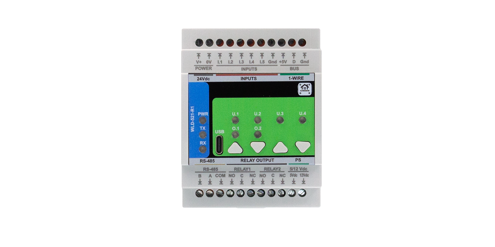

### Module Description

The **WLD-521-R1** is a smart, fully configurable input/control module for **leak detection**, **water flow**, **heat energy**, and **irrigation**. It connects to a **MicroPLC/MiniPLC** over **RS-485 (Modbus RTU)** and is configured via a USB-C **WebConfig** UI that lets you set Modbus params, choose per-input types (sensor/counter), map inputs to relay actions, calibrate flow, compute heat energy from paired 1-Wire sensors, run **two local irrigation zones** (flow supervision, interlocks, time windows, pump), and assign **LEDs/Buttons** with overrides—all with live status and optional clock sync for HA. Integration with **ESPHome + Home Assistant** is straightforward through the controller, which exposes the module’s **sensors** and **relays** as entities.

<br clear="left"/>

## Table of Contents
- [1. [Introduction]](#1-introduction-1)
- [2. Safety Information](#2-safety-information-1)
- [3. System Overview](#3-system-overview-1)
- [4. Getting Started](#4-getting-started-1)
- [5. Installation & Wiring](#5-Wiring)
- [6 Software & UI Configuration](#6-software-ui-configuration-1)
- [7 Modbus RTU Communication](#7-modbus-rtu-communication-1)
- [8. [ESPHome Integration Guide (MicroPLC/MiniPLC + WLD-521-R1)]](#8-esphome-integration-guide-microplcminiplc-wld-521-r1-1)
- [9. Programming & Customization](#9-programming-customization-1)
- [10. Maintenance & Troubleshooting](#10-maintenance-troubleshooting-1)
- [11. Open Source & Licensing](#11-open-source-licensing-1)
- [12. Downloads](#12-downloads-1)
- [13. Support](#13-support-1)


<br clear="left"/>


---
<a id="1-introduction-1"></a>
# 1. [Introduction]
## 1.1 Overview of the WLD-521-R1 Module 💧

The WLD-521-R1 is a specialized I/O module for water flow, heat energy (calorimetry), and irrigation/leak detection. It operates as an intelligent Modbus RTU slave that processes local sensor data and runs a fully configurable internal logic (e.g., input→relay actions, irrigation windows, flow supervision, safety interlocks) autonomously. Automation scenarios can then be extended and orchestrated by a central PLC/controller to add system-wide coordination, monitoring, history, and advanced rules.

| Component | Quantity | Key Functionality |
| :--- | :--- | :--- |
| **Digital Inputs (DI)** | 5 (DI1-DI5) | **Opto-isolated** inputs used for pulse counting (Flow Meters) or reading dry-contact status (Leak Sensors, Buttons, General Status). |
| **Relays (RLY)** | 2 (R1, R2) | **High-performance industrial relays** for switching external loads, most commonly used for **pumps** or **shut-off valves**. |
| **1-Wire Bus (OW)** | 1 | Dedicated bus supporting up to 32 **DS18B20 temperature sensors** for accurate temperature monitoring and heat energy calculation. |
| **Local Interface** | 4 LEDs, 4 Buttons | Provides local status indication, manual control, and **override functions**. |

---

## 1.2 WLD-521-R1 — Supported Controllers 🔌


The **WLD-521-R1** is an intelligent expansion module for the **HomeMaster MiniPLC / MicroPLC Modular Smart Control System**.

### MiniPLC / MicroPLC (via Modbus RTU)

| Feature          | Specification                                                                                                                                         |
|------------------|-------------------------------------------------------------------------------------------------------------------------------------------------------|
| **Controller Role** | Operates as a **Modbus Slave**. The MiniPLC/MicroPLC acts as the **Modbus Master** for network and system logic management.                          |
| **Communication**   | **Modbus RTU** (Serial).                                                                                                                             |
| **Physical Interface** | **RS-485** bus (using dedicated **UART2** pins).                                                                                                    |
| **Function**         | Master can **read** all I/O data (Flow, Heat, Leak Status) and **write** commands to actuate **Relays R1, R2** and control **irrigation zones**.     |
| **Modular Design**   | RS-485 architecture supports **daisy-chaining** multiple WLD-521-R1 modules and other expansion units for scalable I/O.                               |
| **Default ID**       | Factory-set **Modbus Slave ID: 3**.                                                                                                                  |

> **Note:** If multiple WLD-521-R1 modules share the same RS-485 segment, change the slave ID on each unit to avoid address conflicts.


---

## 1.3 Use Cases 🛠️

Below are practical ways to deploy the **WLD-521-R1** with the HomeMaster Mini/Micro PLC.

### 1) Basement leak detection + automatic water shut-off
- **Goal:** When water is detected, automatically close the main water valve and notify the PLC.
- **How:** Set **DI1** to **Water sensor**, enable it, and set its **Action** to *Toggle* with **Control target** → *Relay 1*. Wire a **motorized shut-off valve** (e.g., NC solenoid/actuated ball valve) to **R1** so the valve **closes on leak**. Optionally map an LED to **DI1** or **R1** for visual status. The PLC can read the leak status over Modbus for alerts or interlocks.

### 2) Garden irrigation with flow supervision & pump dry-run protection (merged)
- **Goal:** Safe, autonomous watering with pump protection and sensor interlocks.
- **How:** Configure **Zone 1/2** with a valve on **Relay 1/2** and select a **Flow DI (1..5)** tied to a pulse flowmeter. Enable **Use flow supervision** and set **Min rate (L/min)**, **Grace (s)**, **Timeout**, and optional **Target liters**.  
  Add protection and interlocks: set **R_pump** to the pump relay; require **DI_tank (OK when ON)**; use **DI_moist** (needs water when OFF) and **DI_rain** (block when ON)**.** The zone will **block or stop** when sensors are not OK or when flow drops below thresholds. Use **Irrigation Window** and **Auto-start** for time-based runs.

### 3) Water consumption metering
- **Goal:** Count liters for one or more branches (e.g., apartment/tenant billing).
- **How:** Set selected inputs to **Water counter**. Enter **Pulses per liter** and (optionally) calibrate **Total ×** and **Rate ×**. Use **Reset total** to move the accumulation baseline and **Calc from external** to align with an external meter after service. View **Rate (L/min)** and **Total (L)** live in the UI.

### 4) Hydronic loop heat-energy (ΔT) monitoring
- **Goal:** Track instantaneous heat power and energy per loop.
- **How:** For a DI configured as **Water counter**, open its **Heat** panel and enable **Heat**. Assign **Sensor A (supply)** and **Sensor B (return)** from stored **1-Wire** devices, then set **cp (J/kg·°C)**, **ρ (kg/L)**, and **Calibration (×)** as needed. The UI shows **TA**, **TB**, **ΔT**, **Power (W)**, **Energy (J / kWh)**. Use **Reset energy** to zero totals; manage sensors from **1-Wire** (scan, name, view live temperatures).

<a id="2-safety-information-1"></a>
# 2. Safety Information

This section outlines essential safety guidelines. Failure to adhere to these warnings may result in equipment damage, system failure, or personal injury.

## 2.1 General Electrical Safety

| Warning | Requirement |
| :--- | :--- |
| **Professional Service** | Installation and maintenance must be performed exclusively by **qualified personnel** familiar with electrical codes. |
| **Power Isolation** | **ALWAYS** disconnect the primary **24VDC** power supply and all connected loads before performing any wiring, installation, or maintenance. |
| **Voltage Verification** | Ensure the power source strictly adheres to the **24VDC** primary supply voltage. |
| **Grounding** | Ensure all field wiring and system components are properly grounded. |

## 2.2 Handling & Installation

| Requirement | Detail |
| :--- | :--- |
| **ESD Protection** | Handle the module by its casing or edges and observe **Electrostatic Discharge (ESD)** precautions when handling the bare printed circuit boards (PCBs). |
| **Wiring** | Use insulated wires of the appropriate gauge for the connected loads. **Secure all wires firmly** to the screw terminals; loose connections pose a fire and arcing risk. |
| **Mounting** | The module is designed for **DIN-rail mounting** . It must be secured within a protective enclosure to shield it from moisture, dust, and mechanical damage. |

## 2.3 Device-Specific Warnings

| Component | Warning |
| :--- | :--- |
| **Relays (R1, R2)** | Do not exceed the **maximum voltage and current ratings** of the dry-contact relay outputs. Overloading the relays will cause permanent device damage and is a fire hazard. |
| **Digital Inputs (DI1-DI5)** | Inputs are opto-isolated. Only connect **dry-contact** or **low-voltage, isolated** signals. Connecting high AC or DC voltages will compromise the internal isolation barrier. |
| **Power Outputs (+5V / +12V)** | Do not exceed the specified power budget for the isolated +5VDC and +12VDC sensor supply outputs. |
| **1-Wire Bus (OW)** | Use this interface only for low-voltage digital sensors (e.g., DS18B20). |


<a id="3-system-overview-1"></a>
# 3. System Overview
## 3.1 Architecture & Modular Design

The **WLD-521-R1 (Water Leak Detection, 5 Inputs, 2 Relays)** is a dedicated Extension Module designed for reliable, distributed automation within the HomeMaster system. It’s built on an **RP2350** microcontroller and concentrates water-safety I/O into a single DIN-rail Modbus device.

**Core I/O & Sensors**
- **5× Digital Inputs (DI):** configurable for flow meters and water-related sensors (leak/moisture/rain).
- **2× Relays (R1, R2):** for valves, pumps, sirens, or other actuators.
- **1-Wire bus (GPIO16):** for temperature sensors (e.g., DS18B20). Optional heat-energy on a counter DI using two 1-Wire sensors (A/B).

**Communication & Setup**
- **RS-485 Modbus RTU** to the central MiniPLC/MicroPLC (typ. **19200 8N1**).
- **WebConfig (USB-C):** set unique **Modbus Address (1–255)** and **Baud**, configure DI modes, relays, 1-Wire, and irrigation.

**Local Resilience**
- On-device logic executes critical actions without the controller: immediate **leak → relay action** and **two irrigation zones** with flow supervision, time windows, and interlocks. Core safety keep running even if the controller or Wi-Fi is down.

## 3.2 Integration with Home Assistant

Integration of the WLD-521-R1 into Home Assistant (HA) is achieved via the **ESPHome firmware** running on the HomeMaster controller (MiniPLC/MicroPLC). ESPHome handles Modbus polling/writes and exposes entities to HA.

**Home Assistant Communication**
- **ESPHome abstraction:** the controller periodically reads/writes Modbus **coils** and **holding registers** and publishes:
  - **binary_sensors** (DI / leak),
  - **sensors** (flow rate/total, temperatures / ΔT / power / energy),
  - **switches** (relays / valves),
  - plus irrigation state (via sensors/switches or template entities).

**Add in ESPHome**
- In the controller’s ESPHome YAML, add a `modbus_controller:` and the WLD package/templates for this module. ESPHome then exposes entities to Home Assistant (binary_sensors for DI/leaks, sensors for flow rate/total and temperatures/ΔT/power/energy, switches for relays; irrigation state can be mapped via sensors/switches or template entities).

**Timekeeping & schedules in HA**
- If you rely on the module’s **local irrigation window** or **daily counters**, schedule an HA automation at **00:00** to **pulse coil 360 (CMD_TIME_MIDNIGHT)** and write **HREG 1100/1101** for minute/day—this keeps the module clock aligned with HA.

## 3.3 Diagrams & Pinouts
<div align="center">
  <table>
    <tr>
      <td align="center">
        <strong>WLD System Diagram</strong><br>
        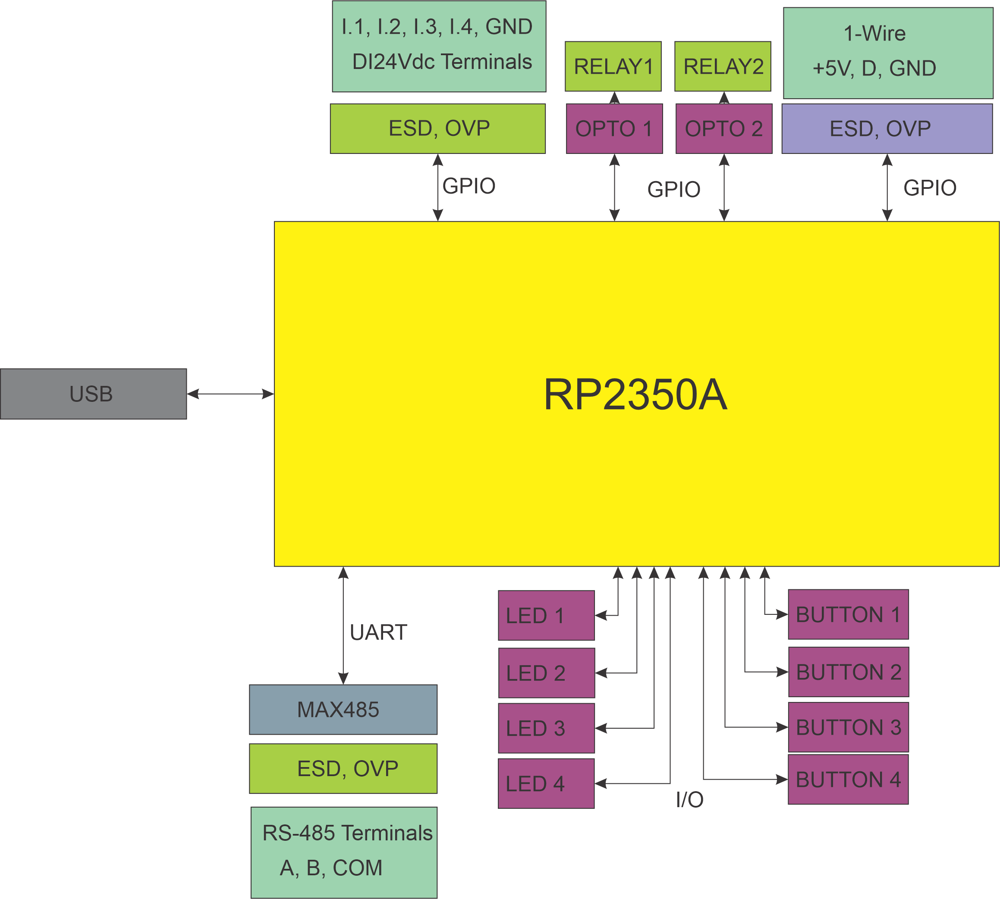
      </td>
      <td align="center">
        <strong>RP2350 MCU Pinout</strong><br>
        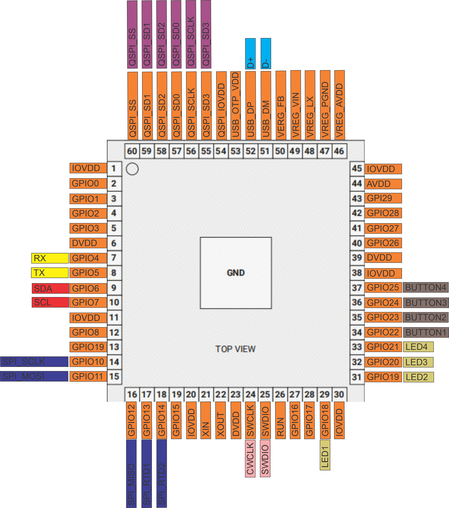
      </td>
    </tr>
    <tr>
      <td align="center">
        <strong>Field Board Layout</strong><br>
        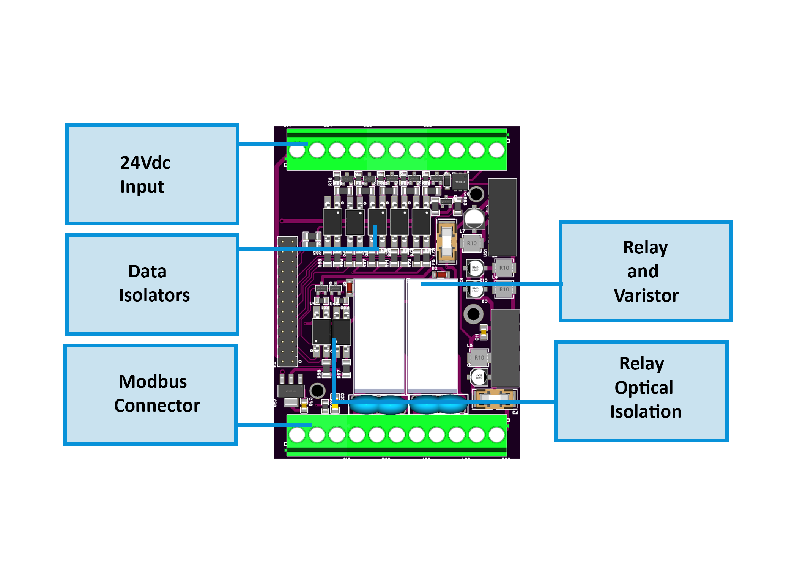
      </td>
      <td align="center">
        <strong>MCU Board Layout</strong><br>
        
      </td>
    </tr>
  </table>
</div>

## 3.4 WLD-521-R1 — Technical Specification

### Overview

- **Function**: Water leak detection, pulse water metering, irrigation control, and optional heat (ΔT) calculations  
- **System role**: RS-485 **Modbus RTU** slave; integrates with MicroPLC/MiniPLC and home automation stacks  
- **Form factor**: DIN-rail module, ~3M wide (approx. “3-gang” footprint).

---

### I/O Summary

| Interface | Qty | Electrical / Notes |
|---|---:|---|
| **Digital Inputs (DI1..DI5)** | 5 | **Opto-isolated**; supports dry-contact and pulse meters. Typical trigger ≈ **5 V**, ≈ **6 mA** input current; up to **~9 Hz** (firmware supports higher with configuration).|
| **Relays (R1, R2)** | 2 | SPDT (NO/NC/COM) dry contacts for valves/pumps; max **3 A @ 250 VAC**. Hardware uses **HF115F/005-1ZS3** relays with opto-isolated drivers.|
| **1-Wire bus** | 1 | 3-pin header: **+5 V / DATA / GND**. Protected by **DS9503** and MOSFET level shifting. Designed for DS18B20-class sensors.|
| **User buttons** | 4 | Panel buttons (SW1..SW4) routed to MCU GPIO; used for local control/overrides.|
| **User LEDs** | 4 + status | Front LEDs for status/override indication; driven via transistor stages from MCU GPIO.]|

---

### Terminals & Pinout (field side)


#### Connector Map (front label reference)

- **Top**: `V+`, `0V` (Power) • `I1..I5`, `GND` (Inputs) • `+5V`, `D`, `GND` (1-Wire) • `A`, `B`, `COM` (RS-485)  
- **Bottom**: `R1: NO, C, NC` • `R2: NO, C, NC` • `5/12 Vdc` sensor supply outputs. :contentReference
<br clear="left"/>
---

- **Power**: `24VDC` and `0V` (primary supply). 
- **Inputs**: `I1..I5` and **GND_ISO** (return for input side). Each DI has opto-isolation and input conditioning.  
- **Relays**:  
  - **Relay 1**: `R1_NO`, `R1_C`, `R1_NC`  
  - **Relay 2**: `R2_NO`, `R2_C`, `R2_NC`
- **RS-485**: `A`, `B`, `COM` (shield/earth reference). 
- **1-Wire**: `+5V`, `D`, `GND` (isolated 5 V sourced).
- **Aux sensor power**: **+5 V** and **+12 V** isolated rails available for external sensors (fuse-protected).

> The front-label silkscreen in the product photo aligns with the terminals above (Inputs, RS-485, Relays, +5/12 V sensor supply).

---

### Electrical

#### Power & Regulation
- **Primary input**: **24 VDC** nominal. On-board protection includes input fuse, reverse protection diode, and surge suppression. A synchronous buck (**AP64501**) generates +5 V, followed by **AMS1117-3.3** for +3.3 V logic.
- **Isolated sensor rails**:  
  - **+12 V iso**: **B2412S-2WR3** DC-DC  
  - **+5 V iso**: **B2405S-2WR3** DC-DC  
  Both rails are LC-filtered and fuse-limited for field use. :contentReference

#### Digital Inputs
- Opto-couplers **SFH6156-3** with series resistors and MOSFET front-ends for pulse handling and noise immunity. Pull-downs and Schmitt-style shaping provided per channel. :contentReference

#### Relay Outputs
- **HF115F/005-1ZS3** SPDT relays with transistor drivers and opto-isolated control; RC snubbers/EMI parts on contacts for suppression.

#### 1-Wire Interface
- **DS9503** ESD/short protection and **BSS138** level translation between 3V3 MCU and 5 V field bus. Schottky clamp on +5 V.

#### RS-485 (Modbus RTU)
- Transceiver **MAX485** with DE/RE control, series/TVS protection (**SMAJ6.8CA**), polyfuses on A/B, and bias/termination network. Level-shifted between 3V3 MCU UART and 5 V transceiver. TX/RX activity LEDs present.

#### USB-C (service/config)
- **Type-C** receptacle with ESD array (**PRTR5V0U2X**), CC pull-downs, series resistors on D±, and reverse-polarity protection to +5 V rail (Schottky). Used for firmware and the Web Config Tool.

---

### MCU & Storage

- **MCU**: **Raspberry Pi RP2350A** (dual-core; RP2 family) with external QSPI flash.
- **Boot/Flash**: **W25Q32JV** 32-Mbit QSPI NOR.
- **Clocks**: 12 MHz crystal with load network; SWD header exposed for debug.

---

### Protections & Compliance-Oriented Features

- Input surge/ESD: TVS on RS-485 lines, ESD arrays on USB, series resistors and RC on data lines. Polyfuses on field buses.
- Galvanic isolation: Separate **GND_ISO** domain for field inputs/power; isolated +5 V/+12 V DC-DC modules for sensors.
- Relay contact suppression and snubbers to reduce EMI and contact wear.

---

### Firmware / Function (high-level)

- **Leak & irrigation logic**, pulse-based **flow** and **totalization**, optional **heat power/energy** using dual 1-Wire temps and pulse-derived flow.  
- USB-based **Config UI**, **Modbus RTU** register map, and override priority for local/manual control.

---

<a id="4-getting-started-1"></a>
# 4. Getting Started

The **WLD-521-R1** integrates into the HomeMaster system over the **RS-485 Modbus** bus. Initial setup has two parts: **physical wiring** and **digital configuration** (WebConfig + ESPHome).

---

## 4.1 What You Need

| Category   | Item                    | Details                                                                                         |
|------------|-------------------------|-------------------------------------------------------------------------------------------------|
| **Hardware** | **WLD-521-R1 Module**   | DIN-rail I/O module with **5× DI**, **2× relays**, and **1-Wire** (DS18B20, etc.).              |
|            | **HomeMaster Controller** | MiniPLC/MicroPLC acting as **Modbus master** and network gateway; ESPHome uses `wld_address: "3"`. |
|            | **Power Supply**          | **24 VDC** to module power terminals (on-board 5 V/3.3 V rails derived).                        |
|            | **RS-485 Cabling**        | Two-wire **A/B** plus **COM/GND**; use **120 Ω** termination at bus ends.                       |
|            | **USB-C Cable**           | Connects the module to your computer to run WebConfig via Web Serial.                            |
| **Software** | **WebConfig Tool**       | Browser page to set **Modbus Address & Baud**, view **Active Modbus Configuration**, reset, and configure I/O/irrigation. |
|            | **ESPHome YAML**          | Controller config declaring the WLD on RS-485 (`modbus_controller:` + entities).                |
| **I/O**     | **Sensors / Actuators**   | Leak/moisture/rain probes & **pulse flow meters** on DIs; **DS18B20** on **1-Wire (GPIO16)**; valves/pumps on **R1/R2**. |
---

## 4.2 Powering the Devices

The WLD-521-R1 is powered from a **24 VDC primary input** on the field board. On-board regulators generate the internal rails for logic and provide **isolated 5 V / 12 V auxiliary rails** intended for low-power sensors.

> Relays are **dry contacts** (SPDT). Do **not** power valves/pumps from the module’s internal rails; use a dedicated external supply and switch it via the relay contacts.

---

### 4.2.1 Power Supply Types

- **Regulated 24 VDC DIN-rail PSU:** Connect to the module’s **+V / 0V** power terminals. Size the PSU for the module plus any externally powered devices.
- **No power over RS-485:** The RS-485 bus carries signals only. Always provide local 24 VDC power to the module.
- **Sensor power from module:** Use the **isolated** rails — **+5 V** and **+12 V** — **together with GND (DI ground)** to power **low-power field sensors** (leak probes, flow-meter heads) connected to the DI terminals.  
  **Note:** The **1-Wire bus uses the module’s non-isolated +5 V (logic domain)**. Do **not** power DI sensors from the 1-Wire **+5 V/GND**, and do **not** tie the 1-Wire ground to the DI ground. Keep the **isolated (DI)** and **logic (1-Wire)** domains separate to preserve isolation and avoid noise/ground loops.


---


### 4.2.2 Current Consumption

Actual current depends on configuration and what’s attached. Budget for:
- **Base electronics (logic/MCU/LEDs).**
- **Relays:** add coil current for each energized relay.
- **Sensor rails:** total draw of any devices on the isolated **+5 V / +12 V** rails.

**Sizing tip:** choose a 24 V supply that covers base load + worst-case **both relays ON** + all sensor current, with at least **30% headroom** for startup and temperature.

---

### 4.2.3 Power Safety Tips

- **Polarity & grounds:** Observe **24 V polarity** and keep logic ground and isolated sensor ground separate as designed.
- **Fusing & protection:** Keep upstream over-current protection (fuse/breaker). Do not bypass on-board protective elements.
- **Relay contact ratings:** Treat relay outputs as isolated contacts; follow the contact rating from the relay datasheet and local electrical codes.
- **Use sensor rails only for sensors:** Do **not** power valves, pumps, or sirens from the module’s **+5 V / +12 V** sensor rails.
- **De-energize before wiring:** Power down the 24 V supply before changing wiring. Double-check for shorts before re-energizing.
---

### 4.3 Networking & Communication

The WLD-521-R1 communicates with the controller over **RS-485 (Modbus RTU)** and exposes a **USB-C** port for local configuration via a browser (**Web Serial**). RS-485 is used for runtime control/telemetry; USB-C is used for setup, diagnostics, and safe resets. RS-485 carries **signals only** (no power).

---

#### 4.3.1 RS-485 Modbus

**Physical layer**
- **Terminals:** **A**, **B**, **COM (GND)** on the field board.
- **Cabling:** 2-wire twisted pair for **A/B** plus a **common reference (COM/GND)**.
- **Termination:** 120 Ω at the two ends of the bus. Keep stubs short.
- **Protection & robustness:** On-board surge suppressors/TVS and self-resetting fuses protect the transceiver; biasing and a MAX485-class transceiver handle the differential link.

**Protocol**
- **Role:** Modbus **RTU slave** on the RS-485 multi-drop bus; your MicroPLC/MiniPLC acts as **master**.
- **Address & speed:** Set **Address (1–255)** and **Baud** in WebConfig. Default/common speed is **19200**, 8N1.
- **No power over RS-485:** Provide 24 VDC locally to the module; RS-485 only carries data.

**Controller (ESPHome) notes**
- In your ESPHome YAML, configure `uart:` pins for the RS-485 transceiver and add a `modbus_controller:` for this device.
- Ensure the `wld_address` in YAML matches the address set in WebConfig.
- The controller will poll coils/holding registers and expose relays, DI states/counters, 1-Wire temps, and irrigation status as Home Assistant entities.

**Wiring checklist**
- A→A, B→B, COM↔COM between controller and module.
- Terminate the two bus ends; avoid star topologies.
- Keep A/B polarity consistent end-to-end.

---

#### 4.3.2 USB-C Configuration

**Purpose**
- Local setup and diagnostics via a **Chromium-based browser** (Chrome/Edge) using the **Web Serial API**. No drivers needed.

**How to use**
1. Connect a **USB-C** cable from your computer to the module.
2. Open the configuration page and click **Connect**.
3. Use the **Modbus** card to set **Address** and **Baud**; the header shows **Active Modbus Configuration**.
4. Configure **Digital Inputs**, **Relays**, **LEDs/Buttons**, **1-Wire**, and **Irrigation** zones. Changes are applied live.
5. Use **Serial Log** for diagnostics.

**Clock & HA sync (optional)**
- The **Module Time & Modbus Sync** panel lets you set the **minute-of-day** or pull browser time for testing.
- For production, schedule a nightly automation in Home Assistant to pulse the **CMD_TIME_MIDNIGHT (coil 360)** and keep the module’s internal clock aligned (useful for irrigation windows and daily counters).

**Troubleshooting**
- If the **Connect** button is disabled, ensure you’re using Chrome/Edge and that the browser has permission to access serial devices.

---

## 4.4 Quick Setup

**Phase 1 — Physical Wiring**

- **Power:** connect **24 VDC** to **V+ / 0 V** on the module.
- **RS-485:** wire **A → A**, **B → B**, and **COM/GND** between the WLD-521-R1 and the controller; keep polarity consistent. Terminate the two bus ends with **120 Ω**.
- **I/O:**
  - **Relays:** wire your valves/pumps to **R1/R2 (NO/NC/COM)**.
  - **Digital inputs:** connect leak sensors / flow meters / buttons to **DI1…DI5**.
  - **1-Wire:** connect **DS18B20** sensors to **1WIRE_5V / 1WIRE_DATA / 1WIRE_GND** (GPIO16).

_For diagrams, terminal pinouts, cable gauges, and safety notes, see **[Section 5 — Installation & Wiring]**._


**Phase 2 — Module Configuration (WebConfig)**

- **Connect:** plug **USB-C** into the module; open [ConfigToolPage.html](https://www.home-master.eu/configtool-wld-521-r1) in a Chromium browser and click **Connect**.
- **Set Modbus:** choose a unique **Modbus Address (1–255)** and **Baud** (default list includes **19200**). The header shows the **Active Modbus Configuration**.
- **Configure I/O:**  
  - **Digital Inputs:** set role per DI (e.g., flow meter vs. leak sensor); counters show **Rate (L/min)** / **Total (L)**, with **Pulses-per-liter** and **Rate×/Total×** calibration, plus **Reset** tools.
  - **Irrigation (2 zones, optional):** map **Valve relay** and **Flow DI**; set **Min rate**, **Grace**, **Timeout**, **Target liters**; add interlocks (**DI_moist / DI_rain / DI_tank / R_pump**) and an **Irrigation Window** (Start/End, Enforce, Auto-start).
  - **1-Wire:** scan, store, and name sensors for temperature/heat features.
- (Optional) **Reset Device** from the dialog if you need to restart; the serial link will reconnect.

_For more details about WebConfig cards and fields, see **[Software & UI Configuration](#6-software-ui-configuration-1)**._

**Phase 3 — Controller Integration (ESPHome)**

- **Update YAML:** In the ESPHome YAML configuration file for your MiniPLC/MicroPLC (using the provided template, **`default_wld_521_r1_plc.yaml`**):  
  - Verify the **`uart`** settings match your controller’s **RS-485 pins**.  
  - Add a new **`modbus_controller:`** entry, ensuring the **`wld_address`** substitution matches the Modbus Address set in Step 3 of Phase 2 (e.g., `wld_address: "3"`).
- **Compile & Upload:** Build and upload the updated ESPHome config to the controller. After reboot, the controller will poll the WLD-521-R1 and expose **DI states/counters**, **1-Wire temperatures**, **relay controls**, and **irrigation status** as HA entities.

_For protocol details and end-to-end examples, see **[Modbus RTU Communication](#7-modbus-rtu-communication-1)** and **[ESPHome Integration Guide (MicroPLC/MiniPLC + WLD-521-R1)](#8-esphome-integration-guide-microplcminiplc-wld-521-r1-1)**._
  

**Timekeeping (recommended for local schedules)**  
If you use the module’s **Irrigation Window** or daily counters, schedule a Home Assistant automation at **00:00** to pulse the **CMD_TIME_MIDNIGHT (coil 360)** and keep the module’s minute/day registers aligned with HA. (See the **Module Time & Modbus Sync** area in the UI and your controller automations.)

**Verify**  
Use WebConfig’s **Serial Log** and live status panels to confirm DI changes, flow **rate/total**, relay actions, and irrigation state.

<a id="6-software-ui-configuration-1"></a>
# 6 Software & UI Configuration

## 6.1 How to Connect to the Module

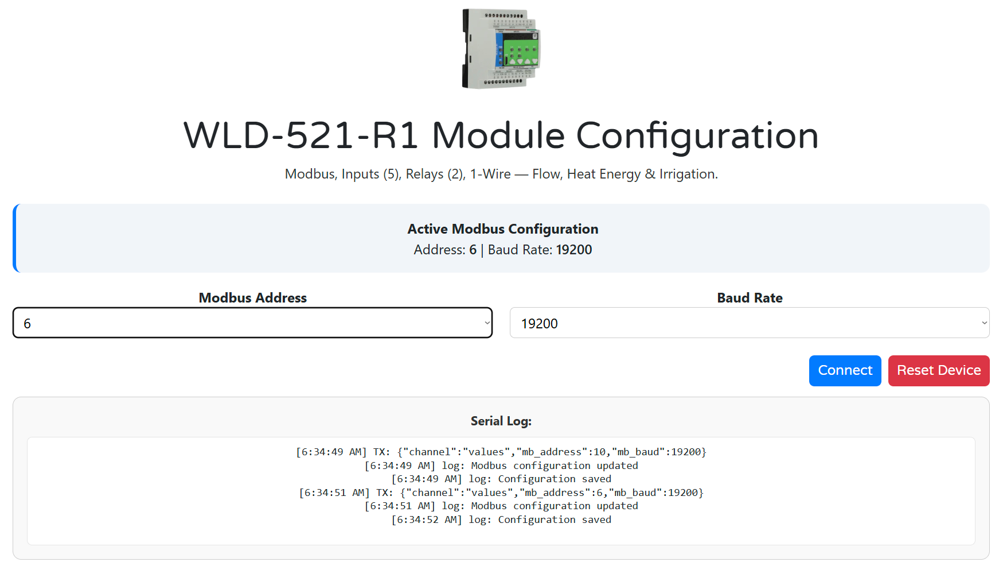

1. **Plug in USB-C.** Connect your computer to the WLD-521-R1’s USB-C port.  
2. **Open the config page.** In a Chromium-based browser (Chrome/Edge), open  
   **https://www.home-master.eu/configtool-wld-521-r1**  
3. **Click “Connect”.** When prompted, allow the browser to access the serial device.  
4. **Confirm connection.** The **Serial Log** shows events and the banner displays the **Active Modbus Configuration** (current **Address** and **Baud Rate**).  
5. **(Optional) Reset Device.** Click **Reset Device** for a safe reboot; the serial link will drop and then reconnect automatically.

> If you cannot connect to the module, check that no other app (serial console, uploader, etc.) is already using the USB port, and verify the browser has permission to access it. On macOS/Linux, ensure your user has the required USB serial permissions.

## 6.2 How to Configure Modbus

Use the top **Modbus Address** and **Baud Rate** selectors. Changes are sent to the device immediately; the **Serial Log** confirms with messages like “Modbus configuration updated” and “Configuration saved.”

- **Set Address (1…255):** Choose a **unique** Modbus RTU address for this module.  
- **Set Baud:** Pick one of the supported rates: **9600**, **19200** (default), **38400**, **57600**, **115200**.  
- **Verify live status:** The banner updates to show **Address** and **Baud Rate** currently active on the device.  
- **Controller match:** In your controller’s ESPHome YAML, ensure `uart` settings match your RS-485 pins/speed and set `wld_address` to the same address you chose here (e.g., `wld_address: "6"`).

> You can revisit this page anytime to adjust Modbus parameters. Configuration persists in the module’s flash memory.

## 6.3 How to Configure 1-Wire Devices

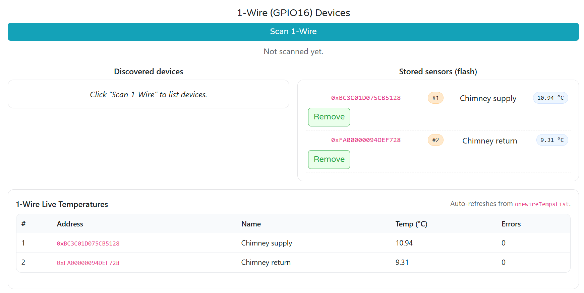


1. **Scan the bus**  
   Click **Scan 1-Wire**. New ROM addresses appear under **Discovered devices**.

2. **Store and name sensors**  
   For each discovered address: enter a **Name** (e.g., *Chimney supply*), then click **Add**.  
   The sensor moves to **Stored sensors (flash)** with a position tag (e.g., **#1**, **#2**) and a live temperature pill.

3. **Live temperatures**  
   The **1-Wire Live Temperatures** table auto-refreshes and shows **Address**, **Name**, **Temp (°C)**, and **Errors**.  
   - **Errors = 0** indicates a healthy read. If errors increment, check wiring and pull-up.

4. **Remove sensors (if needed)**  
   Click **Remove** to delete a stored sensor from the module’s flash.

5. **Use 1-Wire sensors in features**  
   - **Heat Energy / Calorimetry:** When enabling Heat on a DI in the Inputs section, pick **Sensor A** and **Sensor B** from the **stored sensor positions** (the **#** tags). The UI shows the chosen position next to each selector.

### Wiring & Power notes (important)
- The **1-Wire bus uses GPIO16** and the module’s **non-isolated +5 V (logic domain)**.  
- **Do not** power DI-side sensors from the 1-Wire +5 V/GND, and **do not** tie the 1-Wire ground to the DI ground. Keep **logic (1-Wire)** and **isolated (DI) sensor** domains separate.  

### Troubleshooting
- **No devices found:** verify DATA on GPIO16, +5 V, and GND; check the pull-up; rescan.  
- **Intermittent readings / errors:** shorten cable, improve connections, avoid star topologies, and keep 1-Wire wiring away from high-noise loads.  
- **Duplicate names:** rename stored sensors for clarity before assigning them to Heat A/B.

## 6.4 How to Configure Digital Inputs

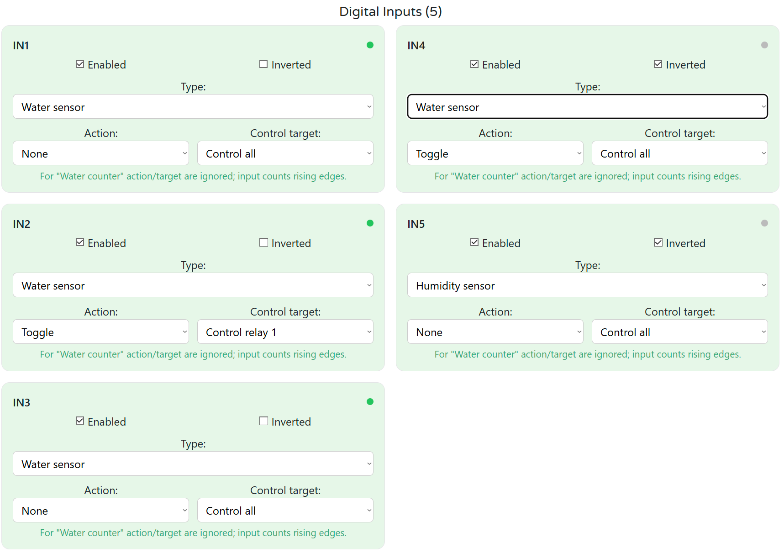

Each of the **5 digital inputs (IN1…IN5)** is configured independently. Changes apply immediately and you’ll see live state on the green dot in each card.

### 1) Enable & Polarity
- **Enabled:** turns the input on/off in firmware.
- **Inverted:** flips the logic (use when your sensor is active-low).

### 2) Choose the Type
- **Water sensor** – simple wet/dry (leak) contact.  
- **Soil moisture** – soil/moisture contact input.  
- **Water counter** – pulse input for flow meters (counts **rising edges**).

> Tip: The small dot in the card’s header shows the **live state** (ON/OFF).

### 3) Actions & Targets (for sensor types)
For **Water sensor** or **Soil moisture**:
- **Action:** `None`, `Toggle`, or `Pulse`.  
- **Control target:** `Control all`, `Control relay 1`, `Control relay 2`, or `None`.  
  - *Toggle* switches the selected relay(s) on each activation.  
  - *Pulse* momentarily closes the selected relay(s) (firmware default pulse length).

> **Note:** When **Type = Water counter**, the **Action/Control target are ignored** (the input is used as a meter, not a control button).

### 4) Flow Meter Setup (Type = Water counter)
When you pick **Water counter**, extra panels appear:
- **Counter:** shows **Pulses** with a **Reset pulses** button.
- **Flow panel:**
  - **Pulses per liter (PPL)** – enter your meter’s constant (e.g., 450).
  - **Calibration (Total × / Rate ×)** – fine-tune totals or rate.
  - **Rate (L/min)** and **Total (L)** – live values.
  - **Reset total** – moves the accumulation baseline (pulses are preserved).
  - **Calc from external** – enter an external liters value since last reset and click **Calc from external** to auto-derive Total calibration.

### 5) Optional: Heat Energy on a Counter DI
Enable **Heat** on that DI to compute calorimetry:
- Select **Sensor A (supply)** and **Sensor B (return)** from your stored **1-Wire** sensors (by position **#1, #2, …**).
- Set **cp (J/kg·°C)**, **ρ (kg/L)**, and **Calibration ×** if needed.
- Live readouts: **TA**, **TB**, **ΔT**, **Power**, **Energy (J / kWh)**.
- **Reset energy** clears the accumulated energy.

#### How Heat Energy Is Calculated

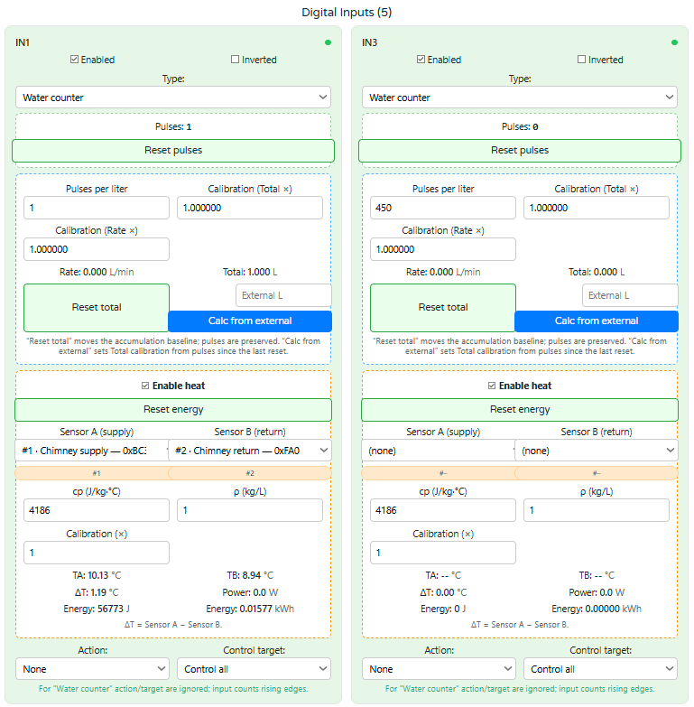

When a digital input (DI) is set to **Water counter** and **Enable heat** is turned on for that DI, the module computes **thermal power** and **accumulated energy** using the live flow and two 1-Wire temperatures:

##### Inputs used by the calculation
- **Flow (from the same DI):**  
  - **Rate (L/min)** is derived from pulses with your **Pulses per liter (PPL)** and optional **Rate ×** calibration.  
  - **Total (L)** is tracked with optional **Total ×** calibration (independent of the rate factor).
- **Temperatures:** **Sensor A (supply)** and **Sensor B (return)** selected from stored 1-Wire sensors.  
  - The UI shows **TA**, **TB**, and **ΔT = TA − TB**.
- **Fluid properties:**  
  - **cp (J/kg·°C)** — specific heat capacity (default 4186 for water).  
  - **ρ (kg/L)** — density (default 1.0 for water).  
- **Calibration (×):** optional scalar applied to the computed power/energy (useful for meter or sensor bias).

##### Formulas (executed in firmware)

1) Mass flow
   m_dot [kg/s] = rho [kg/L] * Rate_Lmin / 60

2) Thermal power
   P [W] = Calibration * cp [J/(kg·°C)] * m_dot [kg/s] * ΔT [°C]

3) Energy accumulation (integrated each cycle)
   E_J [J] += P [W] * Δt [s]
   E_kWh   = E_J / 3,600,000

**Notes**
- If either temperature is missing or flow is effectively zero, **power is treated as 0 W** for that cycle.  
- The **sign of ΔT** follows the UI definition: **A − B**. If your sensors are swapped, power will go negative—flip A/B in the selector.  
- **Reset energy** clears the accumulated **J** and **kWh** counters (does not affect flow totals or pulses).

##### Recommended setup checklist
1. Set the DI **Type = Water counter** and enter correct **PPL**; verify **Rate** rises when water flows.  
2. In the same DI card, **Enable heat**, then pick **Sensor A (supply)** and **Sensor B (return)**.  
3. Leave **cp = 4186**, **ρ = 1.0** for water, or adjust for other fluids/temperatures.  
4. Use **Calibration (×)** only if you have a known reference (e.g., compared against a heat meter).  
5. Watch **TA/TB/ΔT**, **Power (W)**, and **Energy (J/kWh)** update live; press **Reset energy** to start a new measurement interval.

##### Troubleshooting
- **Power stays at 0 W:** no pulses → check flow wiring/PPL; or ΔT ≈ 0 → verify sensor placement.  
- **Negative power:** swap **Sensor A/B**.  
- **Energy grows too fast/slow:** confirm **PPL** and **Rate × / Total ×**; use **Calibration (×)** only after verifying flow and temps.


### Troubleshooting
- **No counts:** confirm **Type = Water counter**, wiring to +5V, DI and GND, and that the sensor produces **clean rising edges**.
- **Rate = 0:** check **PPL** and the meter’s output; make sure the flow panel is visible for the correct DI.
- **Action not working:** ensure the DI is **not** in **Water counter** mode; actions are only for **sensor** types.
- **Heat values missing:** verify the two **1-Wire sensors** are stored and selected as **A/B**.

## 6.5 How to Configure Relays

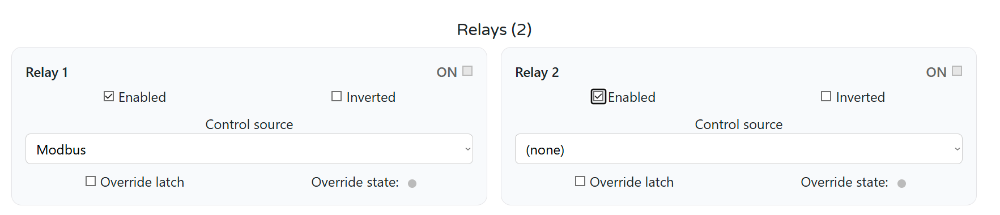

The module has **two SPDT relays** (Relay 1, Relay 2). Each relay is configured independently on its card and shows a live **ON/OFF** status in the header.

### 1) Enable & Polarity
- **Enabled** — turns the relay under firmware control.  
- **Inverted** — flips the logic so that “ON” drives the opposite coil state. Use only if your wiring requires reversed behavior.

> Wiring reminder: relays are **dry contacts**. Wire your load to **COM/NO/NC**; power the load from its own supply.

### 2) Control source
Select where commands for this relay come from:
- **Modbus** — the controller (e.g., ESPHome) drives the relay via registers; use this for HA control/automation.
- **(none)** — no automatic control; the relay only follows **Override** (manual) actions.
- **Local logic** — Modbus will not override while the local logic is active.

### 3) Manual override
- **Override state** — click to force **ON/OFF** manually (useful for test/maintenance).
- **Override latch** — keep the manual state latched until you clear it (survives incoming control commands from the selected source). Uncheck to let the next control command resume ownership.

### 4) Typical setups
- **HA-controlled shut-off valve:**  
  Relay 1 → **Control source: Modbus**. Use HA/ESPHome to switch it on leak detection.
- **Local irrigation valve:**  
  Relay 2 → **Control source: Local logic**. The zone logic starts/stops the valve with flow supervision/ Leak detection logic.
- **Service/testing:**  
  Set **(none)** and use **Override state** to click the relay without any automation.

### Troubleshooting
- **Relay doesn’t respond from HA:** ensure **Control source = Modbus** and the relay is **Enabled**; clear **Override latch** if set.

## 6.6 How to Configure Digital-Input Buttons & User LEDs

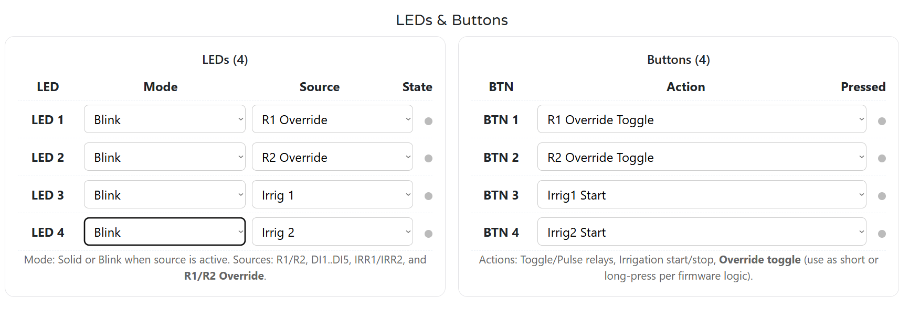

The WLD-521-R1 has **4 user LEDs** and **4 front buttons** that you can assign to common tasks. Settings apply immediately; each row shows a live **State/Pressed** dot.

---

### LEDs (4)
Each LED has:
- **Mode:** `Solid` or `Blink` when the selected source is **active**.
- **Source:** what the LED reflects. Options include  
  `Relay 1`, `Relay 2`, `DI1…DI5`, `Irrig 1`, `Irrig 2`, and `R1/R2 Override`.

**Examples**
- Show manual overrides:  
  `LED1 → Blink, Source: R1 Override`  
  `LED2 → Blink, Source: R2 Override`
- Show irrigation activity:  
  `LED3 → Blink, Source: Irrig 1`  
  `LED4 → Blink, Source: Irrig 2`

> The **State** dot at the right of each LED row mirrors the live on/off state.

---

### Buttons (4)
Each button has an **Action** that the firmware executes on press (short/long-press behavior is handled by firmware where applicable).

**Available actions**
- **Relays:** `Toggle R1`, `Toggle R2`, `Pulse R1`, `Pulse R2`
- **Irrigation:** `Irrig1 Start`, `Irrig1 Stop`, `Irrig2 Start`, `Irrig2 Stop`
- **Manual control:** `R1 Override Toggle`, `R2 Override Toggle`
- `(none)` to disable a button

**What the actions do**
- **Toggle / Pulse**: operate the selected relay directly.  
- **Irrig Start/Stop**: hand control to the chosen irrigation zone (flow supervision, time window, interlocks).  
- **Override Toggle**: flips the relay’s **manual override** state (useful for maintenance/testing even when the relay is owned by Modbus or Local logic).

> The **Pressed** dot shows real-time button presses—useful for verifying wiring and debounce.

#### Using a Button to Enter/Exit Override

- **Long-press (≈3 seconds):** Puts the relay into **Override mode**.  
  - The relay switches to the **Override state** and ignores Modbus/Irrigation until override is cleared.
- **Short-press:** **Toggles** the relay (ON ↔ OFF).  
  - In override mode, short-press changes the override state.
- **Long-press again (≈3 seconds):** **Exits Override mode** and returns control to the configured source (Modbus/Irrigation).

> Make sure the button’s **Action** is set to **`R1 Override Toggle`** or **`R2 Override Toggle`**, and the relay is **Enabled**.  
> (Optional) Map an LED source to **R1/R2 Override** to indicate when override is active.

---

## 6.7 How to Configure Irrigation

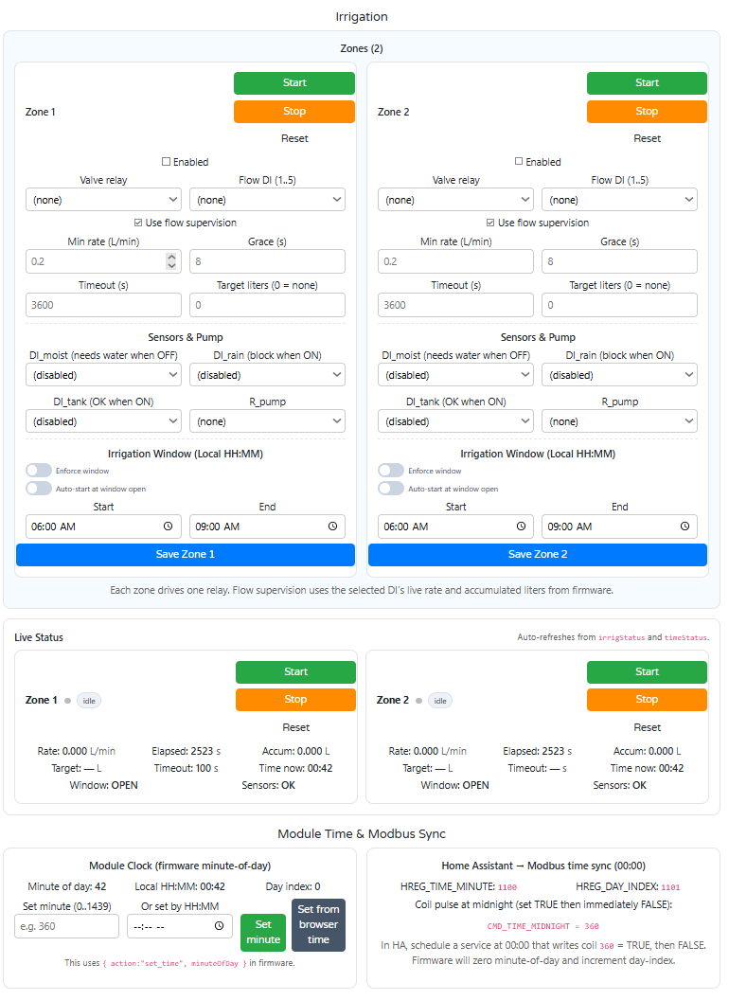

The module provides **2 independent zones** with local safety logic (flow supervision, interlocks, time windows). Configure each zone in its own card.

### 1) Map hardware
- **Valve relay:** choose which relay drives the valve for this zone (`Relay 1` or `Relay 2`).
- **Flow DI (1..5):** select the digital input that counts pulses from your flowmeter.
  - Make sure that DI is set to **Type = Water counter** and its **Pulses per liter (PPL)** is correct in the **Digital Inputs** section.

### 2) Enable flow supervision (recommended)
- **Use flow supervision:** turns on local safety.
- **Min rate (L/min):** minimum flow expected when the valve is ON.
- **Grace (s):** startup time allowed before the min rate must be met.
- **Timeout (s):** maximum run time (zone stops if exceeded).
- **Target liters (0 = none):** stop automatically after this volume is delivered.

### 3) Add interlocks & pump (optional)
- **DI_moist (needs water when OFF):** water only when this DI is OFF (e.g., dry soil probe).
- **DI_rain (block when ON):** block watering when rain sensor is active.
- **DI_tank (OK when ON):** allow watering only when tank/pressure OK.
- **R_pump:** pick a relay to run a pump while the zone is active (leave `(none)` if not used).

### 4) Time window (local time)
- **Enforce window:** zone can only run between **Start** and **End** (HH:MM, local).
- **Auto-start at window open:** if enabled and conditions are OK, the zone starts automatically at **Start**.
- Click **Save Zone 1/2** after editing.

> Tip: The module keeps its own minute-of-day clock. For daily windows/counters, sync at midnight from HA (coil **360** TRUE→FALSE and update HREG **1100/1101**).

### 5) Operate & monitor
- Use **Start / Stop / Reset** on each zone card, or the **Live Status** panel below.
- Live status shows **Rate (L/min)**, **Accumulated liters**, **Elapsed time**, **Target**, **Timeout**, **Window** (OPEN/CLOSED), **Sensors** (OK/BLOCK), and **Time now**.

### Typical setups
- **Basic garden valve:** `Valve relay = Relay 2`, `Flow DI = DI3`, **Use flow supervision** with `Min rate = 0.2`, `Grace = 8 s`, `Timeout = 3600 s`, `Target liters = 120`.
- **Tank + rain protected:** add `DI_tank = DI1 (OK when ON)` and `DI_rain = DI4 (block when ON)`.
- **Morning-only window:** enable **Enforce window**, set `Start 06:00`, `End 09:00`, and optionally **Auto-start**.

### Troubleshooting
- **Zone won’t start:** check **Enabled**, **Valve relay** is assigned, **Window = OPEN** (or disable enforcement), interlocks show **Sensors: OK**.
- **Stops immediately:** flowmeter not seen → confirm the **Flow DI** works (counts rising edges, correct **PPL**, wiring to **GND_ISO**).
- **HA can’t control valve:** if a zone owns the relay, set the relay **Control source** to *Irrigation Z1/Z2* or stop the zone first.

<a id="7-modbus-rtu-communication-1"></a>
# 7 Modbus RTU Communication

**Slave role:** Modbus RTU over RS‑485 (8N1, 9600…115200 baud; typical **19200**).  
**Address:** 1…255 (set via WebConfig).  
**Data model:** Coils, Discrete Inputs, Holding Registers (live telemetry + config snapshots).

---

## 7.1 Input Registers (Read‑Only)

Live, read‑only snapshots convenient for dashboards and fast polling.

| Group | Address range | Type | Units (raw) | Scaling | Notes |
|---|---|---|---|---|---|
| **Minute of day** | 1100 | U16 | minutes | 1 | Mirror of module clock (0…1439) |
| **Day index** | 1101 | U16 | days | 1 | Rolling day counter |
| **Flow rate (DI1…DI5)** | 1120…1129 | U32×5 | L/min ×1000 | ÷1000 | Two regs per DI (lo,hi) |
| **Flow total (DI1…DI5)** | 1140…1149 | U32×5 | L ×1000 | ÷1000 | Two regs per DI |
| **Heat ΔT (DI1…DI5)** | 1240…1249 | S32×5 | °C ×1000 | ÷1000 | Two regs per DI |
| **Heat power (DI1…DI5)** | 1200…1209 | S32×5 | W | 1 | Two regs per DI |
| **Heat energy (DI1…DI5)** | 1220…1229 | U32×5 | Wh ×1000 | Wh=÷1000, kWh=÷1e6 | Two regs per DI |
| **Irr. state (Z1…Z2)** | 1300…1301 | U16×2 | enum | 1 | 0=idle,1=running,2=alarm |
| **Irr. liters (Z1…Z2)** | 1310…1313 | U32×2 | L ×1000 | ÷1000 | Two regs per zone |
| **Irr. elapsed (Z1…Z2)** | 1320…1323 | U32×2 | s | 1 | Two regs per zone |
| **Irr. rate (Z1…Z2)** | 1330…1333 | U32×2 | L/min ×1000 | ÷1000 | Two regs per zone |
| **Irr. window open (Z1…Z2)** | 1340…1341 | U16×2 | flag | 1 | 0/1 |
| **Irr. sensors OK (Z1…Z2)** | 1342…1343 | U16×2 | flag | 1 | 0/1 |
| **1‑Wire temperatures (#1…#10)** | 1500…1519 | S32×10 | °C ×1000 | ÷1000 | Two regs per sensor |

> Notes: All multi‑word values occupy **two** consecutive registers (lo, hi).

---

## 7.2 Holding Registers (Read/Write)

Configuration + low‑rate control values (persisted by firmware where applicable).

| Group | Example registers | Description |
|---|---|---|
| **Clock** | 1100 (minute), 1101 (day) | Write to set module clock from HA (midnight sync recommended). |
| **DI (per input)** | type, enable, invert, PPL, rate×, total× | Configure each DI as leak/humidity/counter; flow calibration. |
| **Heat (per counter DI)** | cp, rho, calib×, sensorA#, sensorB# | Thermal properties and A/B sensor indices (from stored 1‑Wire list). |
| **Irrigation (per zone)** | valve_relay, flow_DI, min_rate, grace, timeout, target_L, DI_moist/rain/tank, pump, window start/end, enforce, auto_start | Local zone logic & safety thresholds. |
| **Relays / LEDs / Buttons** | mode, sources, actions | Runtime behavior for outputs and UI. |

> Although most setup is done in WebConfig, exposing key fields allows hands‑off provisioning or backups via PLC/HA.

---

## 7.3 Discrete Inputs & Coils

### Discrete Inputs (read‑only flags)
| Range | Bits | Meaning |
|---|---:|---|
| 1…5 | 5 | DI1…DI5 debounced state |
| 60…61 | 2 | Relay1, Relay2 state mirrors |
| 90…93 | 4 | LED1…LED4 state mirrors |
| 100…103 | 4 | BTN1…BTN4 pressed |

### Coils (write – single/multiple)
| Range | Count | Action |
|---|---:|---|
| 200…201 | 2 | Relay **ON** (per relay) |
| 210…211 | 2 | Relay **OFF** (per relay) |
| 300…304 | 5 | Enable DI *i* (pulse) |
| 320…324 | 5 | Disable DI *i* (pulse) |
| 340…344 | 5 | **Reset counter** DI *i* (pulse) |
| **360** | 1 | **CMD_TIME_MIDNIGHT** — pulse TRUE→FALSE at 00:00 |
| 370…371 | 2 | Irrigation **START** Z1/Z2 (pulse) |
| 380…381 | 2 | Irrigation **STOP** Z1/Z2 (pulse) |
| 390…391 | 2 | Irrigation **RESET** Z1/Z2 (pulse) |

> Coils are honored subject to **ownership** (override/irrigation priority).

---

## 7.4 Scaling Summary

Use these multipliers in the master (ESPHome/PLC) to obtain engineering units:

- **Temp (°C)** = raw / **1000**  
- **Flow rate (L/min)** = raw / **1000**  
- **Volume (L)** = raw / **1000**  
- **ΔT (°C)** = raw / **1000**  
- **Power (W)** = raw  
- **Energy:** Wh = raw / **1000**; kWh = raw / **1,000,000**

---

## 7.5 Basics & Function Codes

- **Physical:** RS‑485 half‑duplex; 120 Ω termination at both ends; consistent A/B polarity; common GND recommended if separate PSUs.  
- **Function codes:** `0x01` Read Coils, `0x02` Read Discrete Inputs, `0x03` Read Holding, `0x04` Read Input (if enabled), `0x05/0x0F` Write Coils, `0x06/0x10` Write Holding.  
- **Polling:** Live telemetry can be polled at 1 s; configuration writes should be event‑driven (on change).

---

## 7.6 Register Map (Summary)

```
Discrete Inputs
00001..00005  DI1..DI5 state
00060..00061  Relay1..Relay2 state
00090..00093  LED1..LED4 state
00100..00103  BTN1..BTN4 pressed

Coils
00200..00201  Relay ON (pulse)
00210..00211  Relay OFF (pulse)
00300..00304  Enable DIi (pulse)
00320..00324  Disable DIi (pulse)
00340..00344  Reset counter DIi (pulse)
00360         CMD_TIME_MIDNIGHT (pulse)
00370..00371  Irrigation START Z1..Z2 (pulse)
00380..00381  Irrigation STOP  Z1..Z2 (pulse)
00390..00391  Irrigation RESET Z1..Z2 (pulse)

Holding/Input (telemetry and control snapshots)
01100         TIME_MINUTE (U16)
01101         DAY_INDEX (U16)
01120..01129  FLOW rate DI1..DI5 (U32 L/min ×1000; 2 regs each)
01140..01149  FLOW total DI1..DI5 (U32 L ×1000; 2 regs each)
01200..01209  HEAT power DI1..DI5 (S32 W; 2 regs each)
01220..01229  HEAT energy DI1..DI5 (U32 Wh ×1000; 2 regs each)
01240..01249  HEAT ΔT DI1..DI5 (S32 °C ×1000; 2 regs each)
01300..01301  IRR state Z1..Z2 (U16)
01310..01313  IRR liters Z1..Z2 (U32 L ×1000; 2 regs each)
01320..01323  IRR elapsed Z1..Z2 (U32 s; 2 regs each)
01330..01333  IRR rate Z1..Z2 (U32 L/min ×1000; 2 regs each)
01340..01341  IRR windowOpen Z1..Z2 (U16 flag)
01342..01343  IRR sensorsOK Z1..Z2 (U16 flag)
01500..01519  1‑Wire temps #1..#10 (S32 °C ×1000; 2 regs each)
```

---

## 7.7 Override Priority

<a id="8-esphome-integration-guide-microplcminiplc-wld-521-r1-1"></a>
# 8. [ESPHome Integration Guide (MicroPLC/MiniPLC + WLD-521-R1)]

## 8. ESPHome Integration Guide (MicroPLC/MiniPLC + WLD-521-R1)

## 8.1 Hardware & RS-485 wiring

1) **Power**  
- WLD interface side: **24 V DC** to **+V / 0V**.  
- MicroPLC/MiniPLC: per controller spec.  
- If WLD and PLC use different PSUs, also share **COM** between devices.

2) **RS-485**  
- **A↔A**, **B↔B**, keep twisted pair; terminate bus ends (~**120 Ω**), bias at the master.  
- Default serial (firmware): **19200 8N1**; device address configurable (examples below use `4`).

3) **Field I/O (typical)**  
- **DI1..DI5**: leak probes/float switches/flow pulses.  
- **Relays R1..R2**: siren/valve/solenoid (dry contact).  
- **1-Wire** buses (optional): temp probes on hydronic lines.  
- **Flow** monitoring: pulse input(s) from flowmeter(s).

---

## 8.2 ESPHome (PLC): enable Modbus RTU & import the WLD package

Your MiniPLC example already defines UART+Modbus. The **imports the external packageand correction needed** is the variable names: the WLD package expects **`wld_prefix`, `wld_id`, `wld_address`**. Use this exact pattern:

```yaml
uart:
  id: uart_modbus
  tx_pin: 17
  rx_pin: 16
  baud_rate: 19200
  parity: NONE
  stop_bits: 1

modbus:
  id: modbus_bus
  uart_id: uart_modbus

packages:
  wld1:
    url: https://github.com/isystemsautomation/HOMEMASTER
    ref: main
    files:
      - path: WLD-521-R1/Firmware/default_wld_521_r1_plc/default_wld_521_r1_plc.yaml
        vars:
          wld_prefix: "WLD#1"
          wld_id: wld_1
          wld_address: 4         # set this to your module’s Modbus ID
    refresh: 1d
```

> MiniPLC/MicroPLC YAML already matches the UART/Modbus blocks. Put the `packages:`. The package itself is parameterized for multiple WLDs (add `wld2`, `wld3`, … with unique `wld_id`/`wld_address`).

---

## 8.3 What the external WLD package exposes (entities)

The bundled **`default_wld_521_r1_plc.yaml`** creates ready-to-use entities grouped by function. Addressing is already encoded; you don’t need to hand-map registers.

### Discrete Inputs (FC02)
- **DI1..DI5** — real-time digital inputs (leak probes, float switches, pulse edges).  
- **LED mirrors (90..93)**, **BTN mirrors (100..103)** — read-only reflections if needed.  
- **Relay feedback (60..61)** — read-only state.

### DI Counters (Holding, FC03)
- **Counts for DI1..DI5** — 32-bit pulse totals assembled from word pairs at base **1000** (e.g., `1000/1001` for DI1).  
  The package exposes **human-readable `… DIx Count`** sensors (pulses).

### Flow (Holding, FC03)
- **Instantaneous flow rates** (L/min ×1000) for up to **5** channels at base **1120** (U32 pairs).  
- **Accumulators** (L ×1000) at base **1140**.  
  Exposed as **`… FlowX Rate`** and **`… FlowX Accum`** (already scaled to L/min and L).

### Heat (delta-T math & helpers, Holding, FC03)
- **ΔT** and related hydronic helpers around base **1200–1241**: the package builds **`… Heat1 ΔT`** etc. (°C).

### Irrigation (Holding, FC03)
- Two zones (Z1/Z2) with state, liters, elapsed time, window, sensor sanity:  
  - **State**: `1300..1301`  
  - **Liters**: `1310..1313`  
  - **Elapsed**: `1320..1323`  
  - **Rate**: `1330..1333`  
  - **Window**: `1340..1341`  
  - **SensorsOK**: `1342..1343`  
  Exposed as **`… Irr Zx …`** sensors for dashboards/automations.

### 1-Wire Temperatures (Holding, FC03)
- Up to **10** temperature channels at base **1500** (S32 = °C ×1000; two registers per sensor).  
  The package outputs °C-scaled sensors (e.g., **`… OW1 Temp`**).

---

## 8.4 Command coils you can use (writes; FC05 / reads via FC01)

The package includes **pulse-safe** internal switches that write, auto-delay, then turn themselves off (no latch stuck):

- **Relays**  
  - **R1 ON** `200`, **R2 ON** `201`  
  - **R1 OFF** `210`, **R2 OFF** `211`

- **DI enable/disable & counter reset**  
  - Enable: `300..304` (DI1..DI5)  
  - Disable: `320..324` (DI1..DI5)  
  - **Counter reset:** `340..344` (DI1..DI5)

- **Midnight sync pulse**  
  - **360** — optional daily tick (e.g., roll over daily totals).

- **Irrigation control**  
  - **Start**: `370` (Z1), `371` (Z2)  
  - **Stop**: `380` (Z1), `381` (Z2)  
  - **Reset**: `390` (Z1), `391` (Z2)

These appear in ESPHome as hidden helpers (internal) plus a visible **Midnight Pulse** if you want to fire it from HA.

---

## 8.5 Using your posted MiniPLC YAML with WLD

You already have a working base (UART/Modbus, GPIOs, etc.). To **attach WLD**:

1) Keep your UART+Modbus as is (TX=17, RX=16, 19200 8N1).  
2) In `packages:`, switch the variables to `wld_prefix`, `wld_id`, `wld_address` (see 8.2).  
3) Ensure the WLD’s Modbus address matches `wld_address` (set via your module’s config workflow).  
4) After flashing, the device in Home Assistant will show a **device section** named with your `wld_prefix` (e.g., `WLD#1 Flow1 Rate`, `WLD#1 DI1`, `WLD#1 Irr Z1 State`, etc.).

---

## 8.6 Home Assistant integration

> Tip: In Home Assistant, schedule a daily automation at 00:00 to toggle **CMD_TIME_MIDNIGHT (coil 360)** via Modbus/ESPHome so counters and time-based accumulators reset in sync.

1) **Add the ESPHome device**  
- HA → **Settings → Devices & Services → Integrations → ESPHome** and enter the MiniPLC hostname/IP.

2) **Suggested cards & dashboards**  
- **Leak/Alarm**: Use **Entity** cards for **DI1..DI5**; create a **Siren** control mapped to a relay if used.  
- **Flow**: **History Graph** for `FlowX Rate`; **Statistic** or **Gauge** for `FlowX Accum`.  
- **Irrigation**: Show `Irr Zx State`, `Irr Zx Rate`, `Irr Zx WindowOpen`, `Irr Zx SensorsOK`; add automation buttons to start/stop zones by calling the coil helpers.  
- **Temperatures**: Line charts of **OW temps** and **Heat ΔT** for hydronic insight.

3) **Automations** (examples)  
- If any **DIx** goes **ON** → turn **R1** ON and notify.  
- If `Flow1 Rate` drops below threshold for **N** seconds during irrigation → **Stop zone** and alert.  
- Nightly at **00:00** → toggle **Midnight pulse (360)** to roll daily stats.

---

## 8.7 Troubleshooting & tips

- **No entities / Modbus timeouts:** Check A/B polarity, shared **GND** (if different PSUs), bus termination/bias resistors.  
- **Wrong vars in `packages:`** Use **`wld_*`** (not `enm_*`, etc).  
- **Entity naming collisions:** The package namespaces everything with your **`wld_prefix`**. Use unique prefixes per module (`WLD#1`, `WLD#2`, …).  
- **Daily resets:** Prefer using the **Midnight pulse (360)** over manual counter math.  
- **Multiple WLDs on one bus:** Add another `packages:` block with different `wld_id`/`wld_address` and a new `wld_prefix`.

---

## 8.8 Version & compatibility

- Tested with ESPHome 2025.8.0.
- The controller YAML uses ESP‑IDF; Arduino also works if preferred (adjust platform accordingly).

---
<a id="9-programming-customization-1"></a>
# 9. Programming & Customization

## 9.1 Supported Languages
- **MicroPython** (pre‑installed)  
- **C/C++**  
- **Arduino IDE**

## 9.2 Flashing via USB-C
1. Connect USB‑C.  
2. Enter boot/flash mode if required.  
3. Upload the provided firmware/source.

> **Boot/Reset combinations:**  
> - **Buttons 1 + 2** → forces the module into **BOOT mode**.  
> - **Buttons 3 + 4** → triggers a **hardware RESET**.  
> These behaviors are handled **in hardware**.  
> Use these combinations during firmware flashing or to restart the device manually.

📷 **Button numbering reference:**  
<p align="center">
  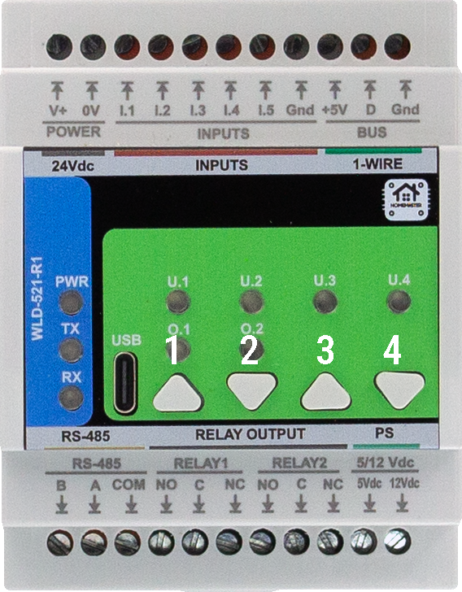
</p>

## 9.3 Arduino
- Select the appropriate board profile (Generic RP2350).  
- In the Tools select Flash size 2MB (Sketch: 1MB, FS: 1MB )
- Add 
  - #include <Arduino.h>
  - #include <ModbusSerial.h>
  - #include <SimpleWebSerial.h>
  - #include <Arduino_JSON.h>
  - #include <LittleFS.h>
  - #include <OneWire.h>
  - #include <utility>
  - #include "hardware/watchdog.h"


<a id="10-maintenance-troubleshooting-1"></a>
# 10. Maintenance & Troubleshooting


<a id="11-open-source-licensing-1"></a>
# 11. Open Source & Licensing

- **Hardware:** **CERN‑OHL‑W 2.0**  
- **Firmware & code samples:** **GPLv3** (unless otherwise noted)

<a id="12-downloads-1"></a>
# 12. Downloads

The following key project resources are included in this repository:

- **🧠 Firmware (Arduino/PlatformIO):** [`Firmware/default_wld_521_r1/`](Firmware/default_wld_521_r1/)  
  Main sketch implementing ATM90E32 metering, relays, button overrides, alarms, Modbus RTU, and WebSerial support.

- **🛠 Web Config Tool:** [`Firmware/ConfigToolPage.html`](Firmware/ConfigToolPage.html)  
  HTML‑based USB Web Serial configuration UI, used for meter options, calibration, relays, alarms, etc.

- **📷 Images & Visual Documentation:** [`Images/`](Images/)  
  Contains UI screenshots, module photos, diagrams, and layout references used in this documentation.

- **📐 Hardware Schematics:** [`Schematics/`](Schematics/)  
  Includes Field Board and MCU Board schematics in PDF format for hardware developers and integrators.

- **📖 Datasheet & Documentation (if available):** [`Manuals/`](Manuals/)  
  Contains PDF datasheets or technical overviews, if applicable.


<a id="13-support-1"></a>
# 13. Support

If you need help using or configuring the WLD-521-R1 module, the following resources are available:

- [🛠 Web Config Tool](https://www.home-master.eu/configtool-wld-521-r1) – Configure and calibrate via USB‑C in your browser.  
- [🌐 Official Support Page](https://www.home-master.eu/support) – Knowledge base and contact options.  

## 📡 Community & Updates
- [Hackster Projects](https://www.hackster.io/homemaster) – Integration guides, wiring, and code examples.  
- [YouTube Channel](https://www.youtube.com/channel/UCD_T5wsJrXib3Rd21JPU1dg) – Video tutorials and module demos.  
- [Reddit Community](https://www.reddit.com/r/HomeMaster) – Questions, help, and user contributions.  
- [Instagram](https://www.instagram.com/home_master.eu) – Visual updates and product insights.